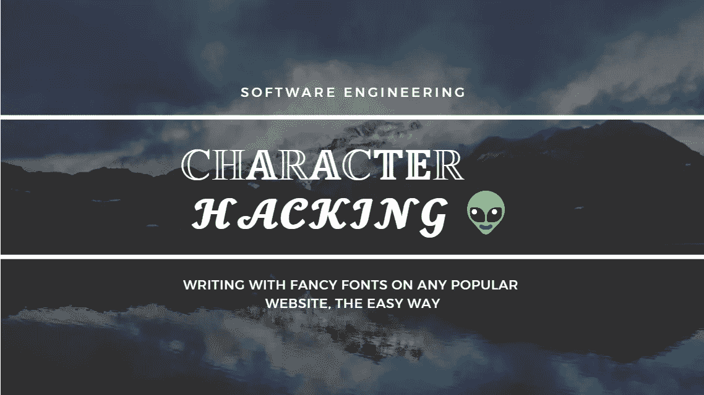
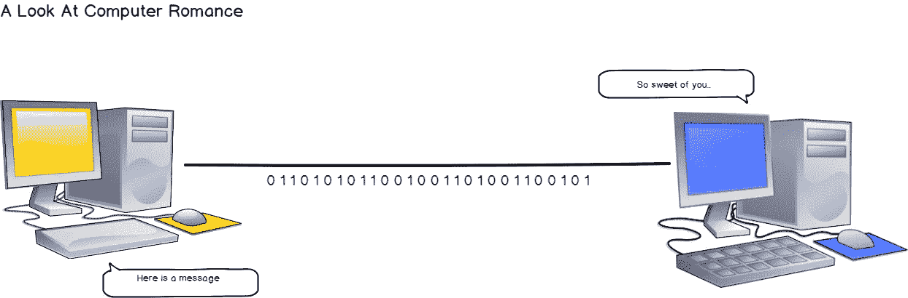
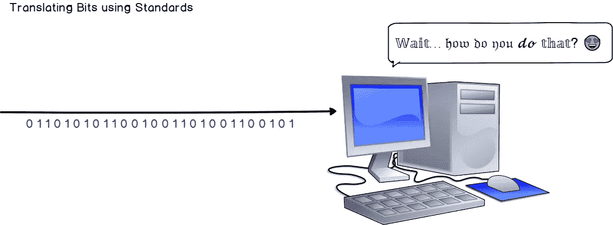
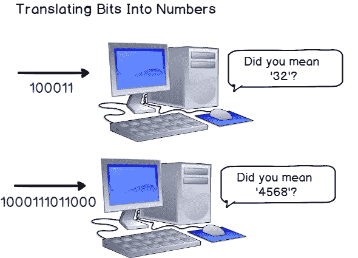
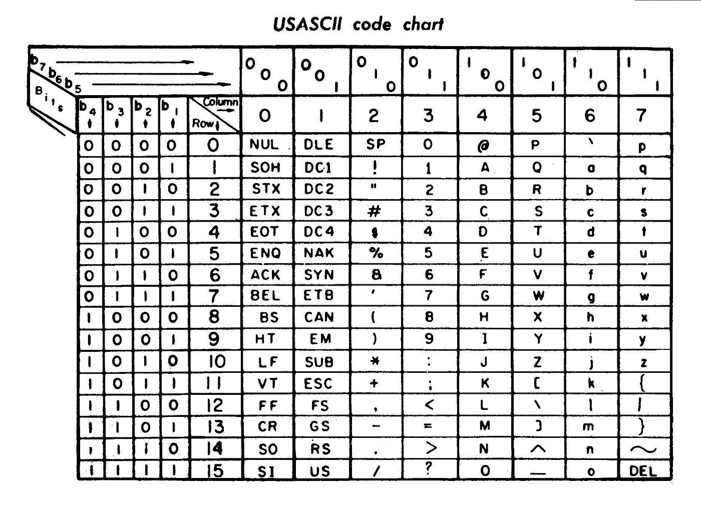
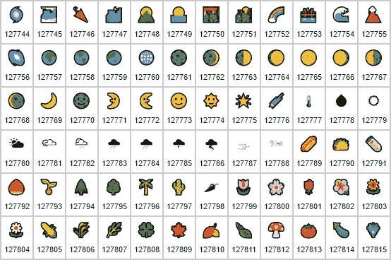
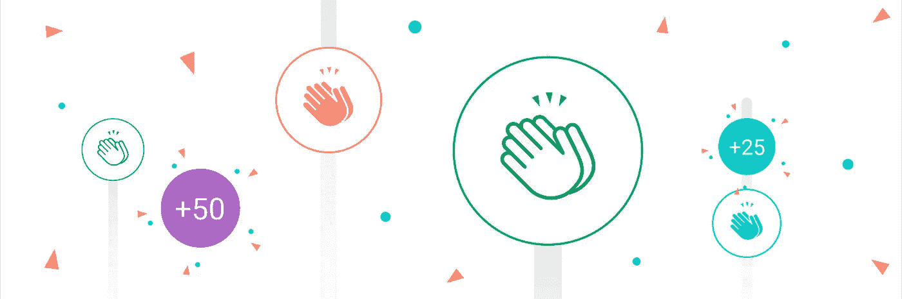

# 𝕎𝕒𝕚𝕥… 𝔥𝔬𝔴 𝔡𝔬 𝔶𝔬𝔲 𝓭𝓸 𝕥𝕙𝕒𝕥?😍—了解字符编码在计算机科学中的工作原理

> 原文：<https://levelup.gitconnected.com/-7c2f903fc577>

## 使用编码字符，为任何网站破解不同的字体。在学习编程概念的同时享受乐趣。

**提示:**我没有贿赂 Medium 网页设计团队添加我自己的花式字体！还没有…😈

H 你有没有梦想过在网上任何你想用的地方使用定制的花式字体？您已经可以在这篇中型文章中看到一个例子，但是如果您可以在任何地方都使用这个小技巧呢？**脸书、Youtube、Reddit、LinkedIn、Twitch 等。**

岂不是很酷？这里有几个可能的例子。

LinkedIn，Reddit，甚至 youtube 视频标题！

今天，我们正在讨论一个更轻松，但却非常有趣的计算机科学话题:**字符编码**。

# 我——快速浏览计算机语言

> 如果你曾经编写过“感觉像是一个黑客，但它能工作”的代码，请记住，CPU 实际上是我们骗来思考的一块石头

这是 daisy owl[的一个有趣而又难以置信的现实的陈述，再真实不过了。一个 CPU 和计算机本身只是一个被我们‘骗去思考’的物质。但是我们没有就此止步。我们还欺骗了它，让它能够理解人类语言。数字、字母、希腊字母甚至表情符号！](https://twitter.com/daisyowl)

但是我们该怎么做呢？

计算机理解**位:0 和 1。仅仅是一个电脉冲或者根本没有。他们不懂字母、数字或表情符号。人类有。**

为了表示文本、图像和视频，我们发明了一些标准，能够将计算机语言转换成人类语言，反之亦然。今天，我们将跳转到这些标准的一个**子集，应用于文本表示，它们是 **ASCII 和 Unicode** 标准。**

# 在字母之前，有数字

在能够翻译字母之前，我们必须能够将比特翻译成数字，将数字翻译成比特。为此，我们使用了一个非常强大的工具，即**二进制表示。**

**什么是二进制表示？**把一个数表示成比特！这意味着，只要有足够的位数，任何数字都可以用二进制表示法进行编码，因此可以被计算机理解。

电脑不聪明吗？

通常，**数字用 8 位**(实际上称为一个字节)，或者 16 位编码。两者之间的区别在于我们能够用一种或另一种系统编码的数字数量。用 8 比特，我们能够表示 **2⁸ (256)** 可能的数字。有了 16 位，你就有了 2 种⁶可能性。**那是 65536 种组合。**

> 那么现在我们知道我们可以将数字转换成比特，那么我们如何将字母转换成比特呢？

# III —满足 ASCII 和 Unicode

ASCII(美国信息交换标准码)是为解决这个问题而创建的规范。它建于 1960 年，将一个字母分配给一个数字，然后这个数字被转换成二进制表示。请看下表:

ASCII 表— 1960 年

从该表中读取，字母“A”在扩展 ASCII 中是 1000001 或 01000001(从高位开始直到低位)。将该值转换为十进制表示形式将得到数字 065。

还记得我们讨论过 7 位编码的可能性吗？**2⁷，所以 ASCII 能够编码 128 个字符。**

这是相当多的字符。绝对足以编码整个拉丁字母，再加上一些常用符号如括号和问号。但是对于我们人类能够书写的每一种图形表示来说，这就足够了吗？当然不是。我们有不同的字母、表情符号和无数的符号来表达我们的思想。我们需要更多的可能性。

为了解决这个问题，程序员建立了 Unicode。Unicode 是一个标准，它给世界上的每一个字符分配一个数字(**称为代码点**)，他们还在为之努力！

现在不要误会。Unicode 没有定义如何对字符进行编码— **它只是一个符号的图形表示和一个数字**之间的映射。Unicode 由字符编码定义，如 **UTF-8、UTF-16 和 UTF-32** ，用于将 Unicode 码位转换为字节表示。

表情符号也被分配了一个代码点！

# 四——玩得开心

现在你知道我的小把戏背后是什么了，是时候让你开心一下，并最终在 Reddit 上引起注意了！

我用来创建这个有趣的标题的工具是[有趣的文本生成器](https://lingojam.com/FancyTextGenerator)，简单地粘贴你想要 Unicode 转换的文本，并将其复制到你想要的任何平台: **Youtube 视频、Reddit 帖子、LinkedIn 或脸书股票等等。**

不要犹豫，与我分享你最酷的作品，如果你喜欢这篇文章，请鼓掌！如果您想要更多关于软件工程的文章， [**欢迎关注我们！**](https://medium.com/schkn)

永远鼓掌！

 [## 查找最佳编码教程和课程-学习编码| gitconnected

### 使用我们完整的编码资源列表学习任何编程语言或框架。我们分享、汇总和排名…

gitconnected.com](https://gitconnected.com/learn)