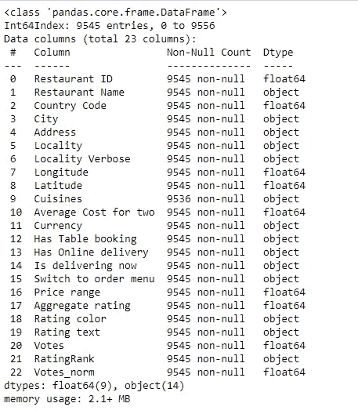
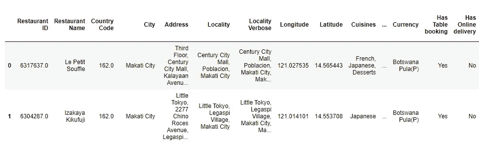
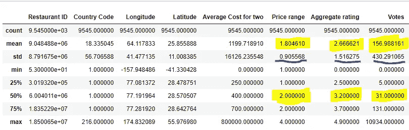
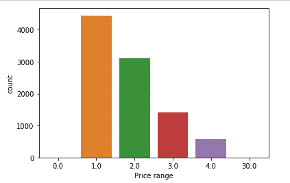
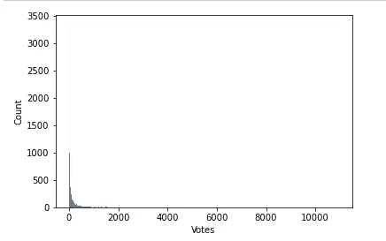
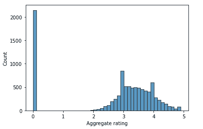
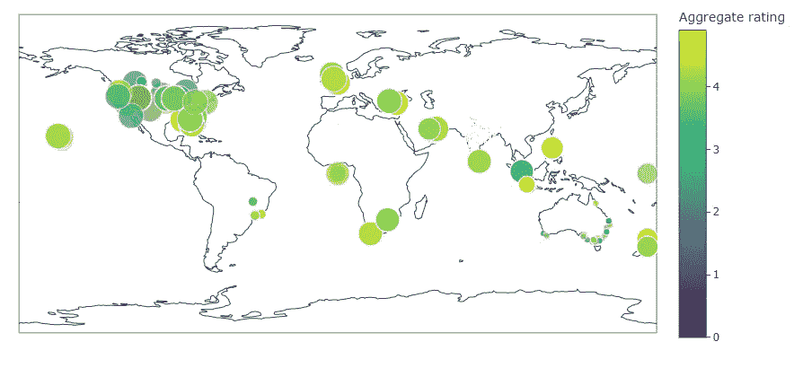

# 1 小时探索性数据分析，用于预测性建模地理数据

> 原文：<https://levelup.gitconnected.com/1-hour-exploratory-data-analysis-for-predictive-modeling-geographic-data-8ed261a16702>

## 使用 Plotly 进行 Choropleth 映射！

探索性数据分析是任何分析师角色的关键组成部分。在大多数数据分析师的角色中，都知道分析师需要时间来理解数据。这为几乎任何数据使用提供了最有效的清理和准备方法，尤其是预测模型。

但是，在某些情况下，业务领导的请求周转时间只有 1-2 个工作日。在这种情况下，数据分析师通常需要在几个小时内完成工作。像这样的时间限制意味着必须尽可能快速有效地探索数据。精通各种探索性数据分析方法，并在无数数据集上进行了实践，这对于提供最干净、最可靠的建议至关重要，同时也为如何在剩余时间内清理数据奠定了基础。


由 [Anthony Reungère](https://unsplash.com/@anthonyreungere?utm_source=medium&utm_medium=referral) 在 [Unsplash](https://unsplash.com?utm_source=medium&utm_medium=referral) 拍摄的照片

在我下面展示的场景中，我收到了领导的请求。他们想预测新餐馆的最佳位置。我将与数据科学家一起工作，他将构建预测模型，但我需要准备好数据，并提供数据科学家可能有助于模型构建的任何关键见解。我选择 Z [omato](https://github.com/Adesh2021/EDA-Zomato/blob/main/Zomato%20EDA) 数据集，因为它是一个简单明了的数据集，有了这些快速的请求，分析师在进入时应该对数据有一个业务理解。我从加载我的数据帧开始。

## 接下来的可视化和代码是在不到一个小时的时间里创建的。精通这些 EDA 方法可以让你更快地重现结果。

第一次使用我的包:

```
import pandas as pd
import numpy as np
import seaborn as sns
import plotly.express as px
import plotly.io as pio
```

分析师加载的每个数据集都应该从检查几行数据开始，了解所包含的数据列的基本信息，并查看汇总统计数据

因此，在我提交给数据科学家的文件中，

`df.info()`



数据帧信息

在这个实例中，我可以观察对象列或文本相关列的数量，以及浮动列或数字列的数量。我还可以观察到，数据帧是平衡的，具有非空条目，我们总共可以看到 9545 个数据条目。

```
df.head()
```



数据帧头

在 DataFrame 的头部，对我来说更明显的是，我的许多数据是地理驱动的，所以我想在我的进一步探索中考虑这一点。

```
df.describe()
```



数据帧摘要统计

在这里，我只评估我的数据帧中数字列的汇总统计数据。 ***如果这个项目能提供一个多小时的时间*** ***我想把我的一些分类变量转换成数字，并评估汇总统计数据。***

为了提高速度，我忽略了不需要规范化的数值变量。在这种情况下，餐馆 ID、国家代码、纬度、经度都不需要考虑。在当前索引数据的方式中，它们的平均值可能变化很大，不会成为预测模型的输入变量，预测模型将通过这些汇总统计提供任何信息。对于两人的平均成本，我已经观察到数据框标题中的货币列，因此我预计这些数字会随着汇率改变餐馆的原始成本水平而发生很大变化。然而，价格范围，综合评分和投票我希望有一组数据是正常的，均匀分布，避免太多的离群值。这创造了最好的预测模型。在上面，我可以看到价格范围的平均值和第 50 百分位，用黄色突出显示，彼此在 1 个标准差内。投票虽然也在一个标准偏差范围内，但相对于第 50 百分位和平均值而言，具有非常高的标准偏差。对于预测建模，投票和综合评分应作为一个输出因子或 y 变量进行研究。因此，通过可视化来理解这些因素的偏斜度是很重要的。

从 DataDrame 头中，我可以观察到价格范围是一个离散变量——这意味着有一个封闭的数字，或者该数据列只能包含四个潜在的类别。因此，我使用 seaborn 来创建价格范围的计数图。这将使我了解这个潜在的输出变量是否是均匀分布的。

```
p = sns.countplot(x='Price range', data=df)
```



在我的 countplot 中，我可以看到我的数据中 1 级价格范围的餐厅比 4 级多得多。在这种情况下，我会确保数据科学家知道并建议将这一数据框架分成 4 个子集，并根据各自的价格范围探索构建四个预测模型。

我的“投票”列是一个连续变量，这意味着我可能有无限多的可能值。对于连续变量，创建直方图来可视化方差是一个重要的步骤。

```
p=sns.histplot(x='Votes', data=df)
```



每个餐厅的投票直方图

在这里，我们可以看到一个显著的右尾偏斜，大多数餐馆的投票数少于 1000，但也有少数餐馆的投票数远远超过这个数。

## **EDA 最佳实践:始终通过可视化探索您最有影响力的数据。**

尽管我的汇总统计数据显示我的“总体评分”呈正态分布，但可视化预测模型的输出变量是有意义的。一家餐厅的评级与它的成功密切相关，因此从商业角度来看，这是一家成功餐厅的简单决定因素。

```
p=sns.histplot(x='Aggregate rating', data=df)
```



餐厅总体评分分布

如您所见，这个变量与值变量一样需要规范化。虽然在 2 和 5 之间的总评分显示正态分布，但是那些低评分/未评分的餐馆在总评分的分布中占很大权重。

作为最后一项措施，也是我花了一个小时探索这个数据集的总结，从查看数据帧的信息开始，我就明白了这些数据大部分都与地理位置有关。此外，这个项目的商业目标是确定开设餐馆的最佳位置。因此，我创建了一个视觉效果来呈现给我的数据科学家，它映射了评级所在的位置。

```
fig = px.scatter_geo(df, lat='Latitude', lon='Longitude', 
                    color='Aggregate rating', size="Votes"
                     ,template='simple_white')
fig.show()
```



显示餐厅评级分布的 Choropleth 地图

Choropleth 地图提供了跨所有业务线的可理解的可视化。由此我们可以观察到，在美国，根据餐馆的大小，有大量的选票。与此相反，总体而言，亚洲和非洲大多数餐厅的差异并没有给总体评级带来很大的变化。然而，尽管澳大利亚的票数很少，但它的评级水平确实存在很大差异。

现实生活中对数据探索的迫切要求少之又少。然而，加强探索性数据分析的技能不仅有助于完成紧急请求，还能提高你的常规分析能力。即使您从未被要求可视化地理数据，了解如何构建 choropleth 地图也可以提供可能被忽略但却很有影响力的见解。即使探索一个甚至被认为不适用的数据集，也常常成为发现结果的关键因素。
不仅作为一名分析师，而且作为一名探索者，将一名优秀的分析师与一名出色的分析师区分开来。🧐

**参考资料:** Github (2022) EDA-Zomato【来源数据】。

[EDA-zom ATO/zom ATO EDA at main adesh 2021/EDA-zom ATO(github.com)](https://github.com/Adesh2021/EDA-Zomato/blob/main/Zomato%20EDA)