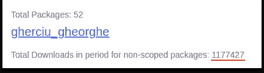

# 在 NPM 上有 100 万次下载。我在构建开源包中学到了什么。

> 原文：<https://levelup.gitconnected.com/1-million-downloads-on-npm-what-i-learned-building-open-source-packages-438c8a48c019>

我将从一段关于“我如何开始构建开源 NPM 包”的小历史开始这篇文章。这件事发生在大约 2 年前，当时我和前一份工作的同事就 git commit 消息格式应该使用哪种约定进行了争论。

在这些辩论之后，我决定创建一个 NPM 包并与他人分享，因为当时并不存在一个用于此目的的特殊包。所以我创建了这个包 [commitlint-jira](https://github.com/Gherciu/commitlint-jira) ,一个月后，我注意到它每周有大约 10k 的下载量，这意味着我不仅帮助我的团队解决了这个问题，也帮助了其他人。

一段时间以前，我决定看看我所有的 NPM 软件包总共有多少下载量。为了收集去年 NPM 的所有统计数据，我使用了一个名为 [npm-stats](https://npm-stats.vercel.app/) 的应用程序，它是开源的，但在互联网上存在许多其他选择。我使用了谷歌搜索的第一个相关网站，这就是结果。

我的 NPM 统计

看到我有超过 100 万美元，我决定写这篇文章，与他人分享我在构建这些包时学到的东西。

我从中学到的主要东西是:

> 如果你以后不维护你的开源包，就不要和别人分享。

我知道很多 NPM 软件包被创建者抛弃了，如果有人将这个软件包集成到他们的项目中，这将是一个大问题。

如果你真的想通过共享一个开源工具来帮助别人，确保这个工具可以在没有你的永久互动的情况下存在，比如(检查代码质量和向 NPM 发布新版本)。我在另一篇[特别博客文章](/3-tips-to-keep-your-javascript-project-fresh-d8b52709f6c3)中更详细地讨论了这个话题，在这篇文章中，我谈论了如何自动化这些过程并使你的包长期存活。

我学到的另一件重要的事情是:

> 记录你的代码，否则不要与他人分享。

你应该明白，没有人愿意使用一个没有很好文档记录的包。至少最好能记录下主要的“使用过程”。如果您正在构建一个小的 NPM 包，这里有一个好的提示，如果您没有时间编写完整的文档，可以使用 [JSDoc](https://jsdoc.app/) 来记录代码。

最后，我想说，如果你是一个 NPM 包的维护者，不要害怕在你的包中增加新的维护者，因为每个为你的开源项目做贡献的人也在他们的项目中使用它，他们对那个包的关心不亚于你。

感谢阅读。我希望这有所帮助。