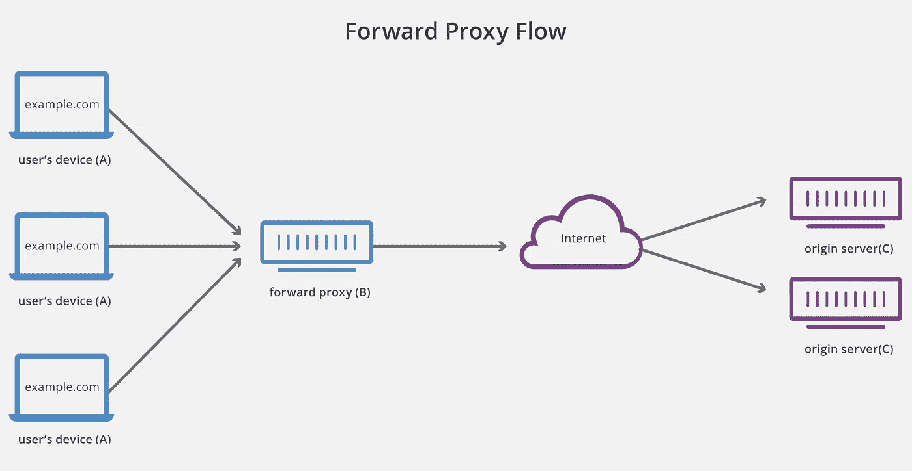
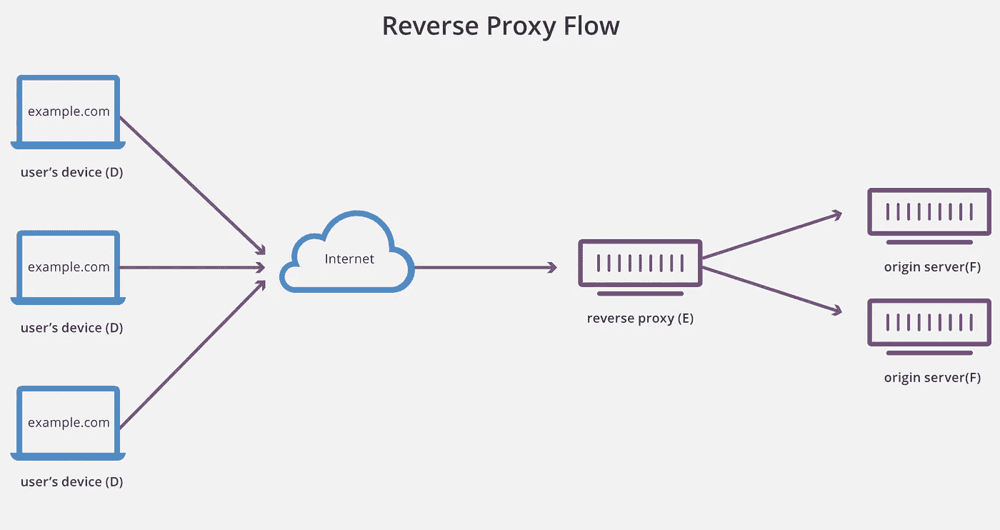

# 正向代理与反向代理:OMBD #17

> 原文：<https://levelup.gitconnected.com/1-minute-to-become-a-better-developer-17-75fd019f407c>

## 尽管有相似的名字，他们服务于不同的目的。这里有一个快速指南。

欢迎来到第 17 期,**O**ne**M**inute**B**etter**D**developer，在这里你可以通过阅读简短的知识，每次一分钟，成为一名更成功的软件开发人员。

## [⏮️](https://jportella93.medium.com/1-minute-to-become-a-better-developer-16-2fef07d6292b) [🔛](https://jportella93.medium.com/one-minute-to-become-a-better-developer-ombd-5b1a1d37468e)⏭️

我的好友洛尔·尼古拉斯的作品

我在 Cloudflare 上看到了这篇关于代理的文章，我想用一分钟的时间与你分享。

## 代理服务器，又名“转发代理”或只是“代理”

坐在客户机前面充当中间人的服务器。它拦截客户端请求，并代表它们将它们转发到互联网上的另一台服务器。

转发代理流，图片由 [Cloudflare](https://www.cloudflare.com/) 提供。

转发代理的一些使用案例:

*   **阻止访问某些内容**。工作场所网络可能配置为通过代理连接，这会阻止对社交媒体网站的请求。
*   **规避国家或机构规定**。与前面的例子相反:如果您的网络阻止了与某些网站的连接，您可以向该网络之外的代理发出请求，该代理将为您转发请求。
*   **隐藏客户身份**。通过代理连接到一个网站，您可以使您的 IP 地址更难跟踪，因为最终的服务器将收到代理的 IP 地址。

如果你想把它付诸实践，我写了一个关于这个主题的故事，涵盖了最后两个用例:

 [## 1 分钟成为更好的开发人员(#10)

### 了解如何在一分钟内改变你的公共 IP 地址。

jportella93.medium.com](https://jportella93.medium.com/1-minute-to-become-a-better-developer-10-bcb2396b6246) 

## 反向代理

是位于一个或多个 web 服务器前面的服务器，充当传入请求的看门人。

反向代理流，图像由 [Cloudflare](https://www.cloudflare.com/) 生成。

反向代理的一些使用案例:

*   **负载均衡**。反向代理可以将传入的请求分发到可用的服务器，以确保最有效的处理。
*   **全局服务器负载均衡**。如果我们在世界上的几个地方都有服务器，我们的反向代理可以将客户端的请求转发到最近的服务器，确保更快的响应时间。
*   **内容缓存**。通过在世界的几个地方分发代理，我们可以缓存内容以实现更快的响应。来自不同国家的第一个请求将被转发到实际的服务器，但是来自该国家的后续请求将被本地反向代理上的缓存内容快速响应。
*   **防范目标攻击**。通过使用反向代理，我们最终服务器的 IP 地址永远不会被泄露，这使得攻击者更难对其进行攻击，例如 DDoS 攻击。
*   **高效加密**。我们可以将这项任务委托给反向代理，而不是从我们的服务器处理计算量很大的加密和解密。

## 如果你喜欢这个故事，你可能也会喜欢:

 [## 1 分钟成为更好的开发人员(#16)

### 一分钟内学会使用静态代码分析工具避免头痛。

jportella93.medium.com](https://jportella93.medium.com/1-minute-to-become-a-better-developer-16-2fef07d6292b)  [## 1 分钟成为更好的开发人员(#18)

### 一分钟内学会如何避免连字符换行。

jportella93.medium.com](https://jportella93.medium.com/1-minute-to-become-a-better-developer-18-5edc55190b91) 

## [⏮️](https://jportella93.medium.com/1-minute-to-become-a-better-developer-16-2fef07d6292b) [🔛](https://jportella93.medium.com/one-minute-to-become-a-better-developer-ombd-5b1a1d37468e) [⏭️](https://jportella93.medium.com/1-minute-to-become-a-better-developer-18-5edc55190b91)