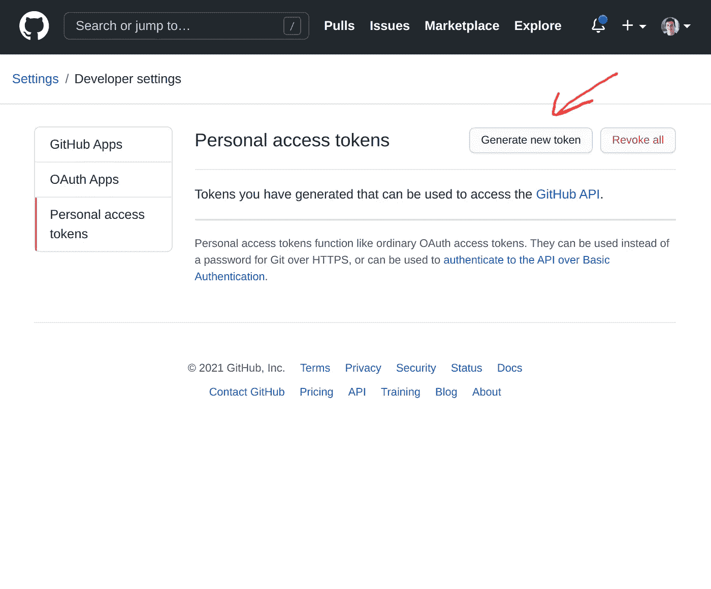
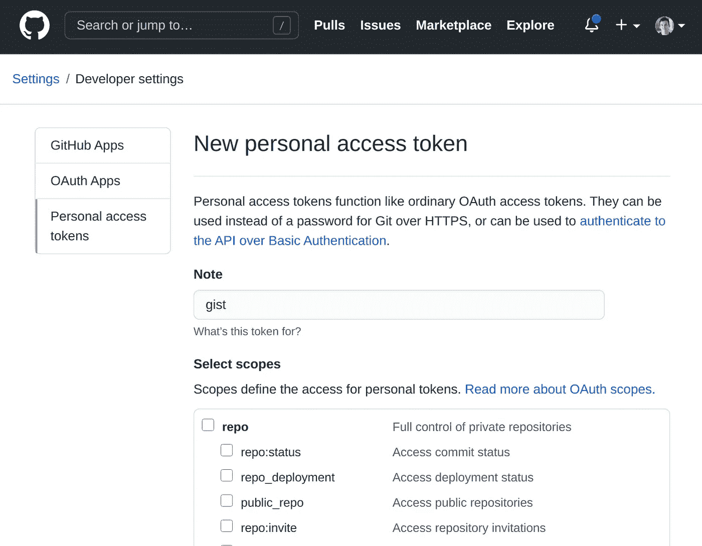
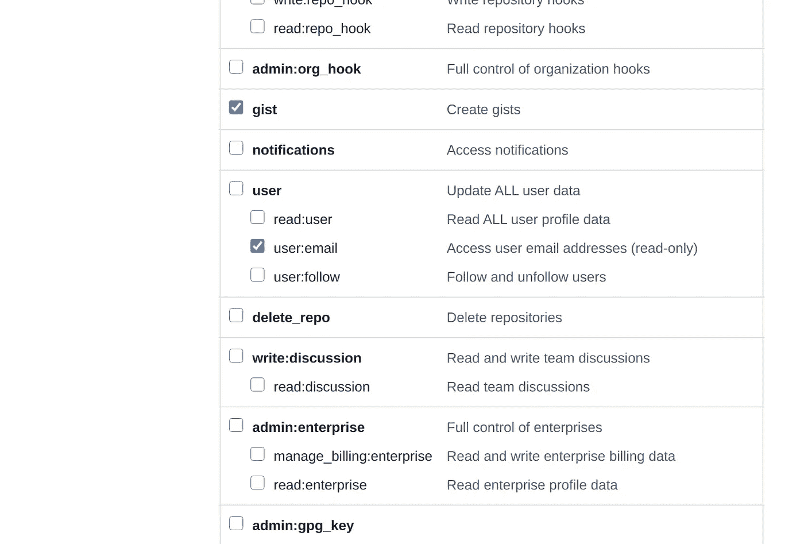
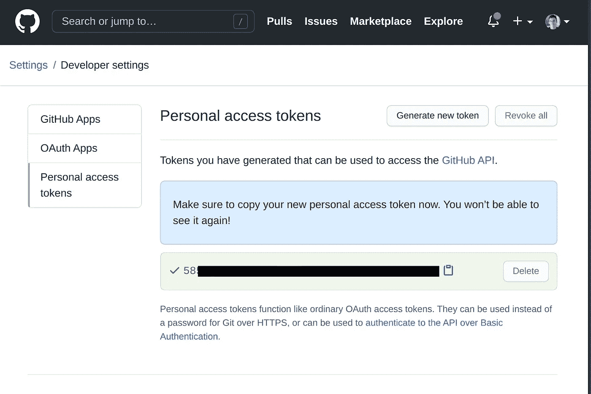

# 从命令行使用 gist-paste 将文本文件保存为 GitHub Gists

> 原文：<https://levelup.gitconnected.com/1-minute-to-become-a-better-developer-7-6c9c9fa67a9c>

## OMBD #7:节省保存和共享文档时间的快速技巧

欢迎来到第 7 期，通过阅读简短的知识，每次一分钟，你将成为一名更成功的软件开发人员。

## [**⏮️**](https://jportella93.medium.com/1-minute-to-become-a-better-developer-6-a732cf1e6670) [**🔛**](https://jportella93.medium.com/one-minute-to-become-a-better-developer-ombd-5b1a1d37468e) [**⏭️**](https://jportella93.medium.com/1-minute-to-become-a-better-developer-8-31692050f5b8)


我的好友[洛尔·尼古拉斯](https://www.instagram.com/loornicolas/)的插图

## 问题是

你经常保存 Github Gists，但是你在他们的 UI 上花了太多时间。

## 一个解决方案

让我们从 CLI 开始吧！

1.  按照系统的[说明安装](https://github.com/defunkt/gist#installation) [Gist](https://github.com/defunkt/gist) 。对我来说，Ubuntu 也是如此:

```
sudo apt install gist
```

2.转到 GitHub 中的[令牌部分，点击“生成新令牌”。在下一个屏幕中输入您的密码:](https://github.com/settings/tokens)



GitHub 中的 okens 部分。

3.为您的令牌设置一个名称，并确保检查`gist`和`user:email`权限:



为您的令牌设置一个名称，如`**gist.**`



检查**要点**和**用户:电子邮件**权限。

4.复制您生成的令牌:



生成的令牌。

5.将令牌保存在`~/.gist`中。`umask`确保该文件只能从您的用户帐户访问:

```
(umask 0077 && echo MY_SECRET_TOKEN > ~/.gist)
```

6.检查是否已正确保存:

```
cat ~/.gist
```

7.现在我们可以从命令行创建 gists 了！

> 请注意，在 Ubuntu/Debian 中，`gist`命令被重命名为`gist-paste`以避免冲突，如果您使用的是不同的系统，如 MacOS，只需在下一个代码片段中将`gist`替换为 `gist-paste`。

```
echo "hello gist" >> gist.txt
gist-paste gist.txt
# Returns URL of newly created gist [https://gist.github.com/eb36806673aca3c63686078d584e2a2e](https://gist.github.com/eb36806673aca3c63686078d584e2a2e)
```

## 如果您喜欢这篇文章，您可能也会喜欢:

[](https://jportella93.medium.com/1-minute-to-become-a-better-developer-6-a732cf1e6670) [## 1 分钟成为更好的开发人员(#6)

### 欢迎阅读本系列的第 6 期，通过阅读简短的知识，你将成为一名更成功的开发人员…

jportella93.medium.com](https://jportella93.medium.com/1-minute-to-become-a-better-developer-6-a732cf1e6670) [](https://jportella93.medium.com/1-minute-to-become-a-better-developer-8-31692050f5b8) [## 1 分钟成为更好的开发人员(#8)

### 从命令行找出我们的公共 IP 地址和国家。

jportella93.medium.com](https://jportella93.medium.com/1-minute-to-become-a-better-developer-8-31692050f5b8) 

## [⏮️](https://jportella93.medium.com/1-minute-to-become-a-better-developer-6-a732cf1e6670) [🔛](https://jportella93.medium.com/one-minute-to-become-a-better-developer-ombd-5b1a1d37468e) [⏭️](https://jportella93.medium.com/1-minute-to-become-a-better-developer-8-31692050f5b8)