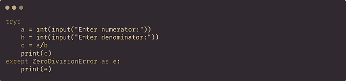
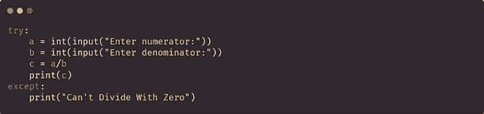
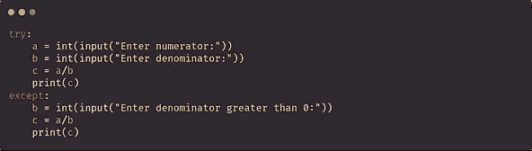
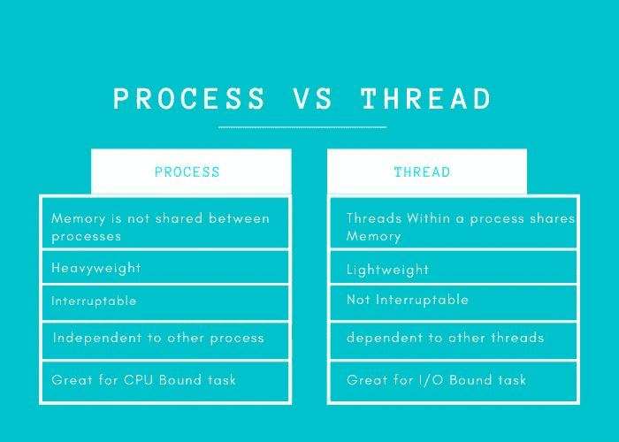

# 提升 Python 技能的 10 个高级 Python 概念

> 原文：<https://levelup.gitconnected.com/10-advance-python-concepts-to-level-up-your-python-skills-da3d6284ad53>

## 有助于增加 Python 知识的概念


作者使用[Canva.com](http://canva.com)创建图像

在这篇博客中，我们将看到一些帮助我们掌握 Python 的高级概念。

# 1.异常处理

异常是指在程序执行过程中出现并中断程序执行的情况。发生这种情况的原因有很多。假设你正在写一个除法的程序，在分母中，0 出现了，所以它将是一个 ZeroDivisionError。其他的例子可能是导入一个不存在的库或者访问一个不在列表索引中的元素。python 中大约有 30 个内置异常。

我们使用`try`和`except`块来处理 python 中的异常。为了一次处理多个异常，我们使用了多个`except`块。

`try`程序块包含需要执行的代码。`except`块包含当`try`执行失败时执行的代码。我们还有和`else`和`finally`块。`else`程序块仅在`try`程序块成功执行时执行。一个`finally`块总是执行，它独立于其他块。



处理异常——内置异常 vs 自定义消息 vs 代码(使用 [carbon.now.sh](http://carbon.now.sh) 创建的代码块图像)

要处理多个异常，可以使用嵌套的`except`块。

```
import sys
try:
   f = open('myfile.txt') 
   s = f.readline()
   i = int(s.strip())
**except OSError as err**:
   print("OS error: {0}".format(err))
**except ValueError**:
   print("Could not convert data to an integer.")
**except**:
   print("**Unexpected error:", sys.exc_info()[0]**)
   raise
finally:
   print("Operation Successfully Done!!")*(Example Taken From Official* [*Python Docs*](https://docs.python.org/3/tutorial/errors.html)*)*
```

# 2.收集

python 中的集合被称为用于存储数据的容器。例如列表、元组、集合、字典。Python 中开发了许多库来提供额外的数据结构。该集合是 Python 中的一个库，旨在改进内置容器的功能。收集模块中最常用的五种数据结构是:

## 1.计数器

它接受一个 iterable 并返回一个字典，其中键是一个元素，值是它在 iterable 中出现的次数。它返回的字典是排序的。

```
from collections import *Counter* data = [1,1,1,1,2,3,4,3,3,5,6,7,7]
count = Counter(data)
print(count)
---------------------------------------------------
Counter({1: 4, 3: 3, 7: 2, 2: 1, 4: 1, 5: 1, 6: 1})
```

它有三个额外的功能。
1。 **elements()** :返回计数器对象的项目。
2。 **most_common()** :返回一个元组列表，其中包含按排序顺序排列的最常见的元素。
3。**减去:**从计数器中减去映射对象。

## 2.命名元组

`nametuple`的引入是为了给元组的每个位置赋予更多的意义。它返回一个元组，其中包含元组中每个位置的名称。

```
from collections import namedtuple
Direction = namedtuple('Direction','N,S,E,W')
dt = Direction(4,74,0,0)
print(dt)
---------------------------------------------
Direction(N=4, S=74, E=0, W=0)
```

## 3.有序直接

一个`OrderedDict`是一种记住它们被插入的顺序的字典。在 Python 的新版本中，内置的字典也能记住它。

```
from collections import OrderedDict
dictt = OrderedDict()
dictt['a'] = 5
dictt['d'] = 2
dictt['c'] = 1
dictt['b'] = 3
print(dictt)
--------------------------------------------------------
OrderedDict([('a', 5), ('d', 2), ('c', 1), ('b', 3)])
```

## 4.默认字典

一个`defaultdict`将为字典中不存在的键返回一个默认值，而不是显示一个键错误。

```
from collections import defaultdict
dictt = defaultdict(int)
dictt['a'] = 2
print(dictt['a'])  ## return the value
print(dictt['b'])  ## returns the default value
-------------------------------
2
0
```

## 5.双端队列

它是一个双端队列，可以从两端添加和删除元素。

# 3.itertools

Python itertools 模块提供了各种处理迭代器的函数。
1。`**product(iterable,iterable)**`:两个可迭代对象的笛卡尔积
2。`**permutation(iterable)**`:没有重复元素的所有可能排序
3。`**combinations(iterable,n)**`:指定长度的所有可能组合，没有重复。这里 **n** 是组合元组的大小。
4。`**combinations_with_replacement(iterable,n)**`:指定长度重复的所有可能组合。
5。`**accumlate(iterable)**` : returns 累加 iterable 的元素之和。
6。`**groupby(iterable,key=FUNC)**`:从 iterable *返回一个带有连续键和组的迭代器。*

```
from itertools import combinations
a = [1,2,3]
print(list(combinations(a,2)))
-------------------------------------------
[(1, 2),(1, 3),(2, 3)]
```

# 4.希腊字母的第 11 个

它也被称为匿名函数。它没有主体，也不需要`def`关键字来定义。lambda 函数可以有任意数量的参数，但只能有一个表达式。表达式计算并返回。它没有返回语句。

**语法** : `**lambda arguments:expression**`

```
even_or_odd = *lambda a: a%2==0*
numbers = [1,2,3,4,5]
even = list(map(even_or_odd,numbers))
print(even)
---------------------------------
*[False, True, False, True, False]*
```

# 5.装修工

装饰器是 python 中的一个特性，它在不显式修改现有代码的情况下向现有代码添加一些新功能。有两种类型的装饰器——函数和类装饰器。decorators 函数在函数名前有一个`@`。

为了理解 decorators 的概念，我们首先需要理解一件事 python 中的函数是类对象。与其他对象不同，它们可以在函数内部定义，作为参数在其他函数中传递，甚至作为函数返回。

装饰示例

让我们来理解上面装饰者的例子——首先，我们有一个名为`add`的函数，它的工作是获取两个变量并返回它们的和。现在，经过一段时间的工作，我们意识到有必要将乘法和占卜功能添加到同一个函数中。现在我们有两个选择第一个是在同一个`add`函数中添加乘法和占卜代码，或者我们可以使用 decorators 来添加功能而不显式地改变函数。

为了使用装饰器，我们首先在`2`行定义了一个装饰器函数。该函数将一个`func`作为输入。在第二行中，我们有另一个函数，我们知道我们可以在函数中定义函数。它是一个具有`*args, **kwargs`函数参数的包装函数。有了这些，两者都被定义为参数，现在我们可以在函数中传递任意数量的参数。在包装函数的主体中，我们有乘法逻辑，然后实际的`add`函数被调用，只有加法逻辑，最后，我们有除法逻辑。当我们用一些参数`add(5,6)`调用`add`函数时，输出将是:

```
30
0.8333333333333334
11
```

因为它首先执行乘法逻辑并打印值，然后执行加法逻辑并保存值，然后执行除法逻辑并打印值，最后返回相加值并打印值。

# 6.发电机

生成器是一种返回可以迭代的对象的函数。它至少包含一个`yield`语句。`yield`是 python 中的一个关键字，用于从函数返回值，而不破坏其当前状态或对局部变量的引用。带有`yield`关键字的函数称为生成器。

生成器只在请求时生成一次项目。它们的内存效率很高，占用的内存空间也较少。

```
-------------- [Fibonacci Series Using Generators](https://stackoverflow.com/questions/102535/what-can-you-use-python-generator-functions-for#:~:text=Generators%20are%20good%20for%20calculating,results%20at%20the%20same%20time.) ------------
def fibon(limit):
  a,b = 0,1
  while a < limit:
      yield a
      a, b = b, a + bfor x in fibon(10):
   print (x)
```

# 7.线程和多重处理

线程和多重处理都用于同时运行多个脚本。进程是程序的实例，线程是进程中的实体。

线程是一种技术，其中多个线程同时运行以执行不同的任务，而多处理是一种技术，其中多个进程同时在不同的 CPU 上运行。



作者使用[Canva.com](http://Canva.com)创建图像

从[这里](https://timber.io/blog/multiprocessing-vs-multithreading-in-python-what-you-need-to-know/)阅读这篇博客获得详细的理解

# 8.邓德方法

Dunder 方法或 Magic 方法是那些在方法前后有两个下划线`__`的方法。这些方法是在某个动作上从类中直接调用的。当你试图用符号`*`将两个数相乘时，内部的`__mul__`方法就会被调用。

```
num =  5
num*6
>> 30num.__mul__(6)
>>30
```

这些方法主要用于重载预定义的运算符。例如+、-、*、/是必须在数字对象周围使用的数字运算符，但+也用作两个字符串之间的连接运算符。所以我们可以说,+运算符被重载来执行多个任务。

```
5+6
>>11"python"+"programming"
>> 'pythonprogramming'
```

[官方 Python 文档](https://docs.python.org/3/reference/datamodel.html#special-method-names)

# 9.记录

日志记录是在代码执行时捕获代码流的过程。日志记录有助于轻松调试代码。它通常是在文件中完成的，以便我们以后可以检索它。在 python 中，我们有一个库`logging`来帮助我们将日志写到一个文件中。日志记录有五个级别:

1.  调试:用于诊断问题，并提供详细信息。
2.  信息:确认成功。
3.  警告:当意外情况发生时。
4.  错误:由于比警告更严重的问题。
5.  Critical:严重错误，在该错误之后程序不能自己运行。

从[官方文件](https://docs.python.org/3/library/logging.html)中了解更多信息

[](https://medium.com/pythoneers/master-logging-in-python-73cd2ff4a7cb) [## Python 中的主日志记录

medium.com](https://medium.com/pythoneers/master-logging-in-python-73cd2ff4a7cb) 

# 10.上下文管理器

上下文管理器是 python 中一个很好的工具，有助于资源管理。它们允许您在需要时分配和释放资源。上下文管理器最常用和公认的例子是`with`语句。`with`主要用于打开和关闭文件。

```
file = open('data.txt','w')
try:
  file.write("Hello")
except:
   file.close()
```

在上下文管理器的帮助下，`with`你可以用写模式打开一个文件，如果一行出错，你也可以关闭它。使用`with`的主要优点是它确保我们的文件将在最后关闭。

```
with open ('data.txt','w') as f:
    f.write("Hello")
```

我们可以将[上下文管理器](https://book.pythontips.com/en/latest/context_managers.html)实现为一个类，在生成器和装饰器的帮助下发挥作用。

## 参考

[1] [官方 Python 文档](https://docs.python.org/3/tutorial/index.html)

# 作者✍的一些精选文章

```
[**A Quick Look At The Object Oriented Programming In Python**](https://medium.com/pythoneers/a-quick-look-at-object-oriented-programming-oop-in-python-975fc3cb9618)[**10 Advance Python Concepts To Level Up Your Python Skills**](/10-advance-python-concepts-to-level-up-your-python-skills-da3d6284ad53)[**10 Facts You didn't Know About Python**](https://medium.com/pythoneers/10-facts-you-didnt-know-about-python-b18d87529c23)[**10 Python Tricks For Speed Up Your Code**](/10-python-tricks-for-speed-up-your-code-8c189d8c99b6)[**10 Must Known Build In Functions In Python**](https://medium.com/pythoneers/10-must-known-built-in-functions-in-python-2f196b9c0359)[**15 Python Packages You Probably didn't know Existed**](https://medium.com/pythoneers/15-python-packages-you-probably-dont-know-exits-aef0525a965f)[**The 7 Stages For Preparing Data For Machine Learning**](https://pub.towardsai.net/the-7-stages-of-preparing-data-for-machine-learning-dfe454da960b)
```

# 分级编码

感谢您成为我们社区的一员！[订阅我们的 YouTube 频道](https://www.youtube.com/channel/UC3v9kBR_ab4UHXXdknz8Fbg?sub_confirmation=1)或者加入 [**Skilled.dev 编码面试课程**](https://skilled.dev/) 。

[](https://skilled.dev) [## 编写面试问题+获得开发工作

### 掌握编码面试的过程

技术开发](https://skilled.dev)