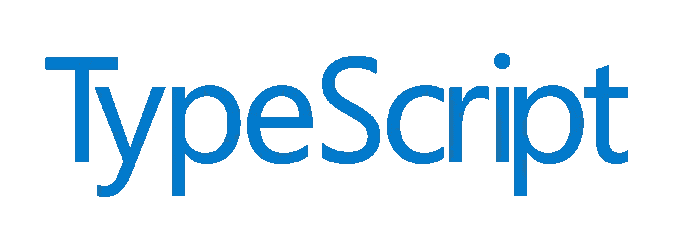

# 面试中的 10 个高级打字问题及答案

> 原文：<https://levelup.gitconnected.com/10-advanced-typescript-questions-for-an-interview-with-answers-6f0513b1688e>

## 检查你的候选人是否有能力回答这些更高级的打字问题



## 1 —“省略”类型有什么作用？

**答:**这是一个新类型，你可以定义一些属性从原来的类型中排除。

**示例:**

```
type Person = { name: string; age: number; location: string; };type QuantumPerson = Omit<Person, 'location'>; // Same as next line QuantumPerson = { name: string; age: number; };
```

## 2 —何时使用“declare”关键字？

**答:**当使用一个没有声明的 JavaScript 库时，在你的 TypeScript 项目中。

**例如:**

```
declare const libraryName;
```

## 3 —如何自动获取“申报”文件？

**答:**在`tsconfig.json`中的`true`上设置`declaration`编译器选项。

**举例:**

```
{
  "compilerOptions": {
    ...
    "declaration": true,
  }
}
```

## 4 —如何重载一个函数？

**回答:**在原函数上方再次使用相同的函数名，不带括号`{}`。更改参数数量、参数类型或/和返回类型。

**例如:**

```
function add(x: string, y: string): string;
function add(x: number, y: number): number {
  return x + y;
}
```

## 5 —如何轻松地使一个接口的所有属性都可选？

**答:**使用`Partial`映射类型。

**例如:**

```
interface Person {
  name: string;
  age: number;
}type PartialPerson = Partial<Person>; // Same as next linesinterface PartialPerson {
  name?: string;
  age?: number;
}
```

## 6 —装修工可以适用于哪里？

**回答:**类，属性，方法，方法参数。

**例如:**

```
@MyClassDecorator
export class Person { ...
  @MyPropertyDecorator myProperty: string;
}
```

## 7 —“记录”类型有什么作用？

**答:**它允许你创建一个类型化的`map`。

**例如:**

```
let Person = Record<string, number> = {};
Person.age = 25;
```

## 8-如何在定义类的模块之外访问类？

**回答**:在类前使用`export`关键字。

**例子:**

```
export class Person {}
```

## 9-何时使用“未知”关键字？

**答:**当你不想使用`any`关键字或者/并且事先不知道确切的类型，但想以后再分配时。

**示例:**

```
let person: unknown = 'John';if (typeof person === string) {
  let name: string = person;
} 
```

## 10—什么是 a’。“地图”文件，以及为什么/如何使用它？

**回答:**映射文件是一个源映射文件，当你想调试的时候可以使用。它可以通过在`tsconfig.json`中的`true`上设置`sourceMap`编译器选项来生成。

**举例:**

```
{
  "compilerOptions": {
    ...
    "sourceMap": true,
  }
}
```

## 感谢您的阅读！我的 [Github](https://github.com/jeroenouw/) 。如果你觉得这篇文章有用，可以考虑看看我的其他文章或者看看我的降价模板生成器:

[](https://medium.com/@jeroenouw/ecmascript-vs-typescript-private-fields-640ae37aa162) [## EcmaScript 与 TypeScript —私有字段

### TypeScript 的 private 关键字和 EcmaScript/JavaScript 的#字符有什么区别

medium.com](https://medium.com/@jeroenouw/ecmascript-vs-typescript-private-fields-640ae37aa162) [](/essential-tool-for-every-developer-18ce57deb37b) [## 每个开发人员的必备工具

### 节省大量编写手册文档的时间

levelup.gitconnected.com](/essential-tool-for-every-developer-18ce57deb37b)