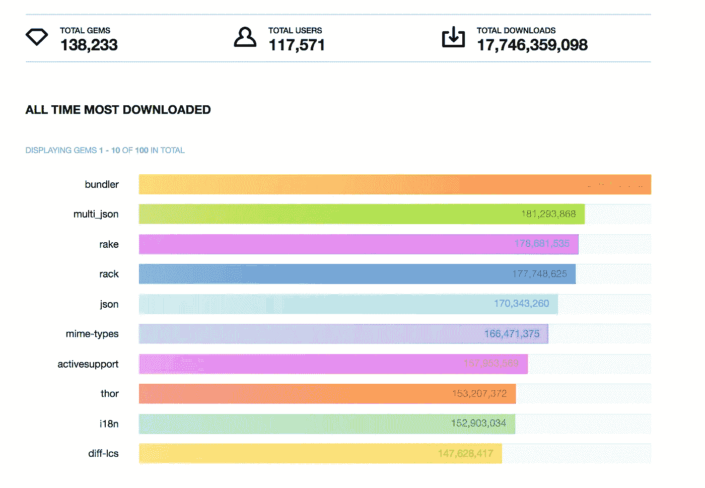

# 以下是 10 个有史以来下载量最大的红宝石

> 原文：<https://levelup.gitconnected.com/10-all-time-most-downloaded-ruby-gems-42b54e6cdf6f>

来源:rubygems.org

随着时间的推移，Ruby 确实成熟了！看到社区的进步是很有趣的——以下是下载量最高的 10 个 ruby gems！

令人震惊的是， [Rails 以 111，286，051 的下载量稳居第 22 位。](https://rubygems.org/stats?page=3)

事不宜迟，下面是我们的获奖者，接下来是他们的官方描述。

## **1。**[**bundler**](http://bundler.io)**—高达** 208，402，476 次下载！

*Bundler 通过跟踪和安装所需的 gem 和版本，为 Ruby 项目提供了一致的环境。*

当然啦！除了 bundler 还有谁！

## 2.[**multi _ JSON**](https://github.com/intridea/multi_json)**—**181294528

许多 Ruby 库解析 JSON，每个人都有自己喜欢的 JSON 编码器。您可以使用 MultiJSON，而不是选择单个 JSON 编码器并强迫您的库用户坚持使用它，它将简单地选择最快的可用 JSON 编码器。

## 3. [**耙子**](https://github.com/ruby/rake/)**—**178682224

Rake 是一个用 Ruby 实现的 Make 类程序。任务和依赖关系是用标准的 Ruby 语法指定的。

对于创建任务非常有用。

## 4.[齿条](https://github.com/rack/rack/stargazers)—177749320

Rack 为用 Ruby 开发 web 应用程序提供了一个最小的、模块化的、适应性强的接口。通过以尽可能简单的方式包装 HTTP 请求和响应，它将 web 服务器、web 框架和它们之间的软件(所谓的中间件)的 API 统一和提取到一个方法调用中。

## 5.[**JSON**](https://rubygems.org/gems/json)**—**170343931

*json 是 c 语言中作为 Ruby 扩展的 json 实现。*

## 6.[哑剧类型](https://rubygems.org/gems/mime-types)—166471989

*mime-types 库为关于 MIME 内容类型定义的信息提供了库和注册表。它可以用来确定为 MIME 类型定义的文件扩展名，或者使用文件扩展名来查找可能的 MIME 类型定义。*

## 7.[主动支持](https://rubygems.org/gems/activesupport)—157954210

*从 Rails 框架中提取的支持库和 Ruby 核心扩展的工具包。对多字节字符串、国际化、时区和测试的丰富支持。*

## 8.[雷神](https://github.com/erikhuda/thor)—153208006

Thor 是一个构建强大命令行界面的工具包。

## 9.i18n — 152，903，719

*i18n 为 Ruby 提供国际化支持。*

## 10.[差异 lcs](https://rubygems.org/gems/diff-lcs) — 147，630，418

*Diff::LCS 使用麦克洛伊-亨特最长公共子序列(LCS)算法计算两个可枚举序列之间的差。它包括创建一个简单的 HTML diff 输出格式的工具和一个类似 diff 的标准工具。*

如果你是一个 Ruby 开发者，你可能听说过大多数的包。如果是这样，干得好！看统计数据总是很有趣。

以下是我写的一些其他文章，你可能会喜欢:

*   [2017 年学习 Javascript 的最佳课程](https://medium.com/@wesharehoodies/best-courses-to-learn-javascript-in-2017-fc3a254638cc)
*   [最佳前端黑客备忘单——尽在一处。](https://medium.freecodecamp.org/modern-frontend-hacking-cheatsheets-df9c2566c72a?source=user_profile---------1----------------)

感谢阅读！❤