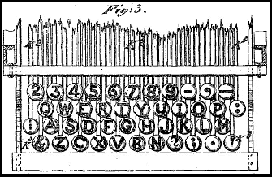
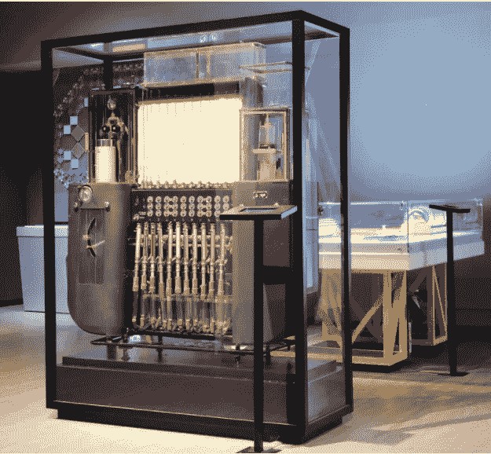
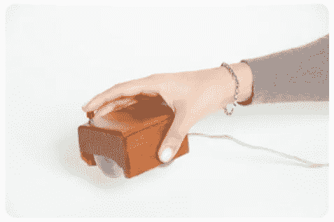
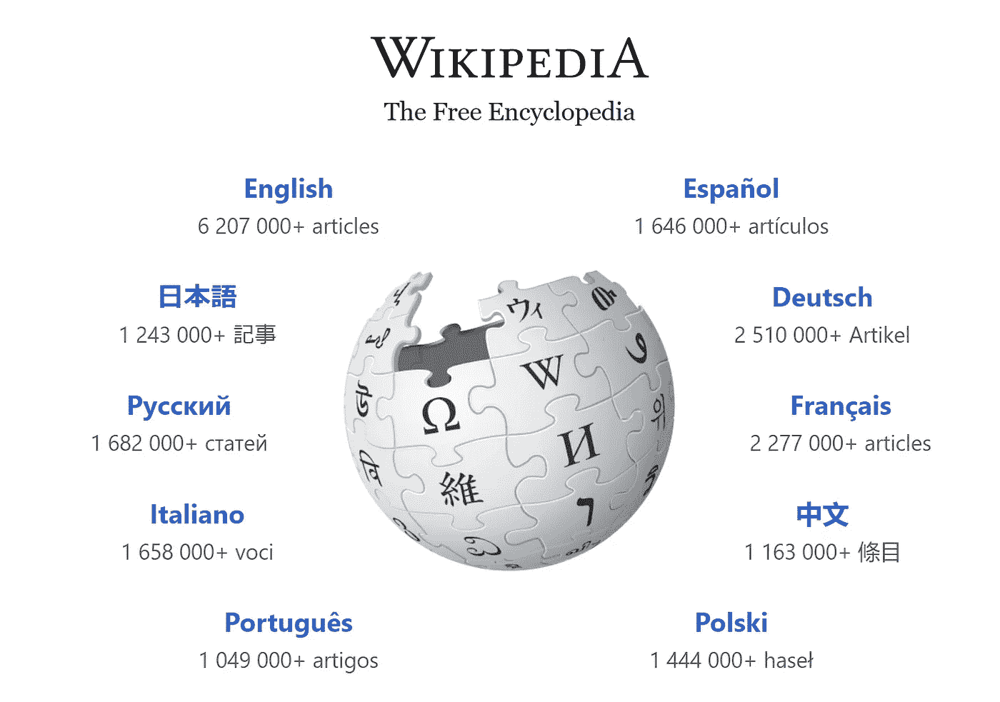
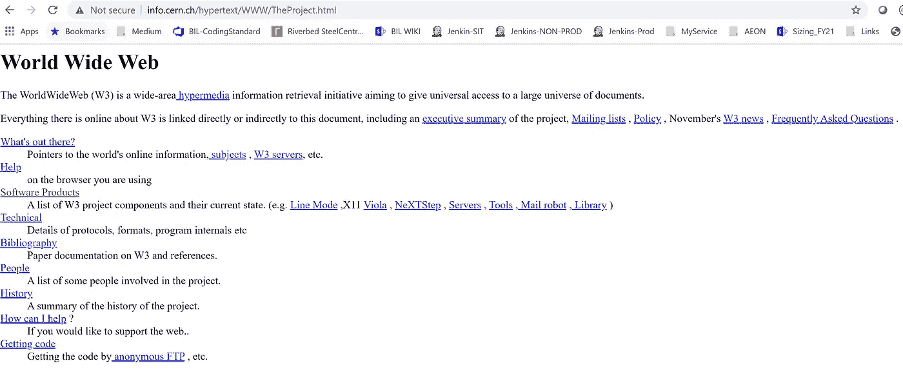
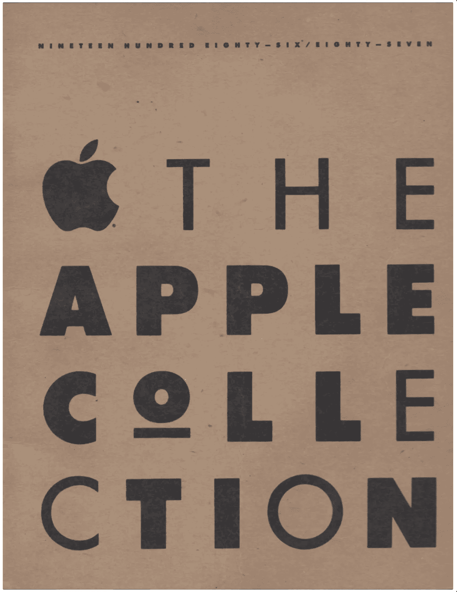
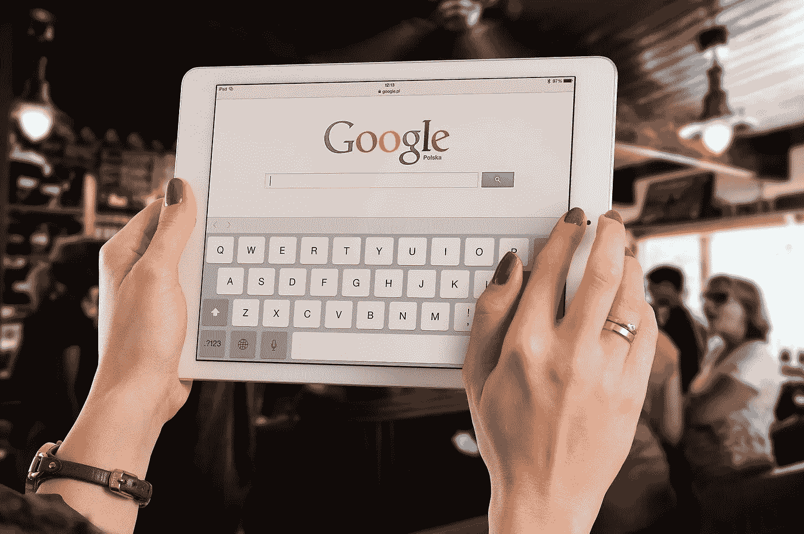
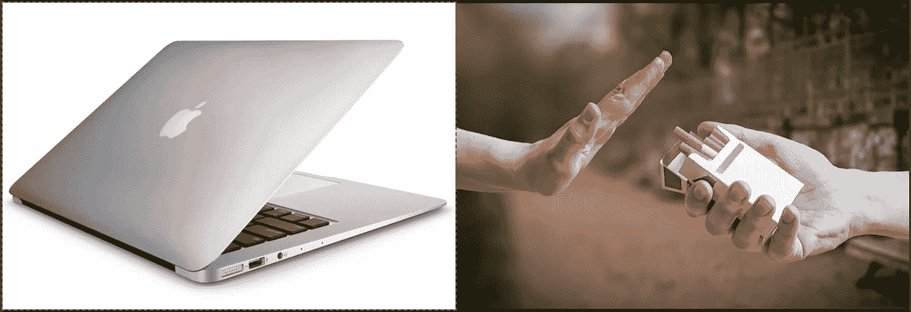
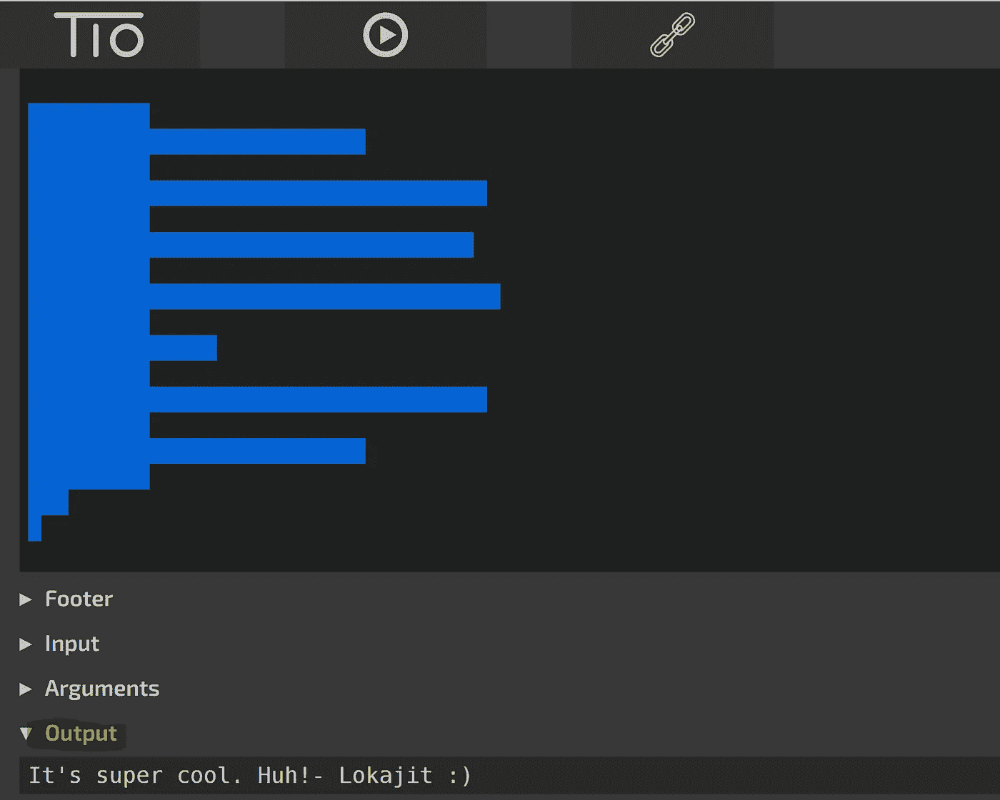

# 关于技术的 10 个鲜为人知的惊人事实

> 原文：<https://levelup.gitconnected.com/10-amazing-little-known-facts-about-technology-8dbbe27c20fd>

## #5.即使在今天，你也可以访问世界上第一个网页

图片由 [Rocapurpura](https://pixabay.com/users/rocapurpura-1628072/?utm_source=link-attribution&utm_medium=referral&utm_campaign=image&utm_content=3697030) 来自 [Pixabay](https://pixabay.com/?utm_source=link-attribution&utm_medium=referral&utm_campaign=image&utm_content=3697030)

上个世纪，随着科技的进步，人类创造了奇迹。科技让我们拥有了惊人的工具和资源，让我们的生活变得如此便利。技术领域的新发现如此频繁，以至于许多人很难跟上发明的步伐。

尽管这些技术奇迹今天看起来很迷人，但它们背后的故事甚至更有趣。这里有十个关于我们几乎每天都在使用的技术的惊人的鲜为人知的事实。

# 1.QWERTY 键盘的设计是为了降低打字速度

[克里斯托弗·莱瑟姆·肖尔斯 1878 年的 QWERTY 键盘布局](https://en.wikipedia.org/wiki/QWERTY)

人们夸耀他们在打字机或键盘上的书写速度。对于一些工作来说，更快更准确的打字技巧甚至是一种竞争优势。但是你知道 QWERTY 键盘目前的布局是为了降低打字速度而设计的解决方案的结果吗？

19 世纪 70 年代制造的早期打字机几乎没有什么技术问题。如果连续快速地按下按键，或者如果打字员同时按下相邻的按键，固定字符的金属臂就会发生碰撞和堵塞。

为了避免这个问题并获得更好的打字体验， [Christopher Latham Sholes](https://en.wikipedia.org/wiki/Christopher_Latham_Sholes) 对键盘布局做了许多设计上的改动。QWERTY 键盘目前的布局最终由 E. Remington 和 Sons[设计完成，解决了卡壳型条的问题。](https://en.wikipedia.org/wiki/E._Remington_and_Sons)

# 2.水积分器——一台在水上运行的计算机

[*弗拉基米尔·卢基扬诺夫的水积分器*](https://www.amusingplanet.com/2019/12/vladimir-lukyanovs-water-computer.html) *在*莫斯科理工博物馆

Vladimir Sergeevich Lukyanov 于 1936 年建造了世界上第一台计算机，用于解决偏导数中的微分方程。令人惊奇的事实是这台机器是由水驱动的。

与 Lukyanov 合作的建筑公司无法找到冬季零下温度下混凝土裂缝的解决方案。为了更好地理解热过程，Lukyanov 研究了混凝土砌体中的温度条件。最后，他建造了水积分器机器，可以绘制图表并帮助可视化热过程。

制造工厂、研究机构和教育机构在 20 世纪 70 年代就开始使用水计算机。一旦数字计算机变得更加强大和方便使用，这些液压积分器的使用就减少了。

# 3.第一个计算机鼠标被称为“显示系统的 X-Y 位置指示器”

[第一个电脑鼠标原型](https://www.sri.com/hoi/computer-mouse-and-interactive-computing/)

世界上第一个电脑鼠标是在 20 世纪 60 年代由斯坦福研究所发明的。该设备被称为“显示器的 X-Y 位置指示器”。

道格拉斯·恩格尔巴特和比尔·英格利西被认为是鼠标的发明者。施乐 APAC 公司发明鼠标的故事是一个神话。恩格尔巴特在 1968 年使用施乐 Alto 电脑首次演示了鼠标。他称这个演示为“所有演示之母”。

“鼠标”这个名字是为这个仪器创造的，因为从它伸出来的电缆让恩格尔巴特想起了啮齿动物的尾巴。

# 4.维基百科由数千个机器人维护

[来自维基百科的截图](https://www.wikipedia.org/)

今天的大多数互联网用户都知道维基百科是什么。这是一个巨大的网上众包信息集合。众所周知，在线百科全书是由志愿者创建和编辑的。

但是你知道吗，目前有成千上万的机器人(*自动化程序*)维护着维基百科的页面。今天，有 2468 个机器人任务被批准执行超过 5200 万英文维基百科页面的维护工作。

维基百科机器人执行新页面创建、拼写纠正、样式纠正等操作。当由于恶意破坏而进行编辑时，机器人还可以将页面恢复到原始版本。

任何有编程知识的人都可以很容易地为维基百科创建机器人。但是，这些程序需要得到 [Bot 审批小组](https://en.wikipedia.org/wiki/Wikipedia:Bot_Approvals_Group)的批准，才能维护维基百科页面。

# 5.即使在今天，你也可以访问世界上第一个网页

[截图来自世界第一网页](http://info.cern.ch/hypertext/WWW/TheProject.html)

在欧洲粒子物理研究所工作的英国科学家蒂姆·伯纳斯·李于 1989 年发明了万维网。又过了两年，世界上第一个网站才出现。第一个网页于 1991 年上线，由欧洲粒子物理研究所的 NeXT 系统托管。

令人惊讶的事实是，第一个网站仍然可供您访问。它是万维网上所有可用信息的历史档案。[点击这里](http://info.cern.ch/hypertext/WWW/TheProject.html)查看。

# 6.苹果曾经涉足服装行业

imgur.com[图片来源](https://imgur.com/a/qEB92#3)

今天，苹果公司已经在他们所做的每一件事上都有了自己的名声。拿苹果操作系统、苹果笔记本、苹果音乐播放器或者苹果手机来说吧。该公司一直想创造一个孤立的回声系统，并成功地保持了这种方式。

但是，你知道苹果在 1986 年也有服装线吗？这个收藏被称为“苹果收藏”。苹果公司曾经涉足服装行业，这在今天是不可想象的。史蒂夫·乔布斯离开公司一年后，公司推出了目录。

# 7.谷歌在 1999 年被出售

图片来自 [Pixabay](https://pixabay.com/?utm_source=link-attribution&utm_medium=referral&utm_campaign=image&utm_content=621033)

拉里·佩奇在 1999 年想把谷歌卖给 Excite。这笔交易被卡在 75 万美元和 Excite 的 1%左右。但是后来交易失败了。今天，谷歌的市值超过 7000 亿美元。围绕 Excite 当时为什么不收购谷歌，有两个版本的故事。

据当时的 Excite 首席执行官乔治·贝尔(George Bell)称，他拒绝了这笔交易，因为拉里·佩奇坚持要求 Excite 用谷歌的搜索技术取代其所有的搜索技术。

然而，根据史蒂文·利维在他的书《复杂中的 T10》中给出的细节，乔治·贝尔对谷歌搜索算法的出色表现不太满意。贝尔认为，谷歌的相关搜索结果可能会把用户带到其他网站，从而更难把用户留在他们自己的 Excite 网页上。

> 他解释说，如果 Excite 拥有一个搜索引擎，可以立即给人们提供他们所寻找的信息，用户会立即离开网站。由于他的广告收入来自网站上的用户——“粘性”是当时网站上最受欢迎的指标——使用 BackRub 的技术会适得其反。—史蒂文·利维

# 8.Amazon.com 不是该网站的原名

布莱恩·安杰洛在 [Unsplash](https://unsplash.com?utm_source=medium&utm_medium=referral) 上的照片

在最终选择亚马逊之前，杰夫·贝索斯尝试了好几个不同的名字。他注册的第一个名字是 Cadabra Inc .在收到一些关于这个名字过于晦涩的反馈后，这位企业家决定将这个名字改为不同的名字。

贝佐斯用许多其他名字注册了他的网站，直到现在的版本——Amazon.com——得到了全世界的认可。一些早期的域名有 aard.com、awake.com、browse.com、bookmall.com 和 relentless.com。在所有这些名字中，他还有一个名字叫 relentless.com*。然而，relentless.com 网站今天重新定位到了 Amazon.com。*

# *9.吸烟会使你的苹果产品保修失效*

**

*使用 kapwing.com 创建*

*你知道吗，如果你在苹果产品附近吸烟，你的苹果产品会失去保修。苹果公司有保护其技术人员免受任何有毒工作环境影响的政策。沉积在系统上的烟草焦油被认为是有害的。因此，如果苹果公司认为你的产品接触了烟草烟雾，即使他们在保修期内，他们也可以拒绝为你的产品提供服务。*

*产品文档中没有写保修无效条款。但是有很多例子表明，该公司拒绝对暴露在烟雾中的产品提供保修。人们详细描述了他们的苹果产品因发现烟草焦油沉积在零件上而无法申请保修的经历。*

*如果你想保持安全，并对你的苹果产品有有效的保修，不要让人们在任何产品附近吸烟。*

# *10.你可以只用空格来编写程序*

**

*在 tio.run 中执行代码后的屏幕截图*

*你知道你可以只用空格编码吗？使之成为可能的编程语言叫做“*空白*”。用这种语言编写程序只需要使用空格、制表符和换行符。解释器忽略任何非空白字符。*

*[从我的 gist 文件](https://gist.github.com/Lokajit/32f1adc3bc65dae58da266ab4127d1db)中复制完整的代码，执行后自己检查。这就像从#3 到#70 复制行一样简单，[转到这个站点](https://tio.run/#whitespace)，把它粘贴到‘代码’块中，然后在键盘上按 Ctrl+Enter (Windows)或 Cmd +Enter (Mac)找到输出。*

*超级酷，对吧！你可以用这个来写程序，没有人能读懂或者理解，除非他们知道在一个看似空白的记事本上写着什么。*

*从作者的主旨来看*

*如果您还不是 Medium， [**的付费会员，您可以通过访问此链接**](https://lokajit-tikayatray.medium.com/membership) 进行注册。你可以无限制地阅读媒体上的所有报道。我会收你一部分会员费作为介绍费。*

***感谢您阅读本文。您可能还想阅读:***

* [## 缺乏经验的程序员的 7 大标志

### 了解这些迹象，这样你就不会在你的软件开发生涯中犯同样的错误

levelup.gitconnected.com](/top-7-signs-of-an-inexperienced-programmer-5fc3f04658f3)  [## 世界上最难的 5 种编程语言

### 你以前听说过多少？

levelup.gitconnected.com](/5-most-difficult-programming-languages-in-the-world-549c3cf91b23)  [## 10 个终极编程笑话

### 让你笑到肚子疼的笑话

levelup.gitconnected.com](/10-ultimate-programming-jokes-a5fbc5880a57) 

**参考文献:**

QWERTY 键盘:[https://en.wikipedia.org/wiki/QWERTY](https://en.wikipedia.org/wiki/QWERTY)

水积分器:[https://www . amusingplanet . com/2019/12/Vladimir-lukyanovs-water-computer . html](https://www.amusingplanet.com/2019/12/vladimir-lukyanovs-water-computer.html)

电脑鼠标的历史:[https://www.dougengelbart.org/content/view/162/000/](https://www.dougengelbart.org/content/view/162/000/)

维基百科机器人:[https://en.wikipedia.org/wiki/Wikipedia:Bots](https://en.wikipedia.org/wiki/Wikipedia:Bots)

出售谷歌:[http://www . internethistorypodcast . com/2014/11/the-real-real-real-real-reason-excite-turned-down-buying-Google-for-75 万-in-1999/](http://www.internethistorypodcast.com/2014/11/the-real-reason-excite-turned-down-buying-google-for-750000-in-1999/)

white space:[https://en . Wikipedia . org/wiki/white space _(programming _ language)](https://en.wikipedia.org/wiki/Whitespace_(programming_language))

# 分级编码

感谢您成为我们社区的一员！ [**订阅我们的 YouTube 频道**](https://www.youtube.com/channel/UC3v9kBR_ab4UHXXdknz8Fbg?sub_confirmation=1) 或者加入 [**Skilled.dev 编码面试课程**](https://skilled.dev/) 。

 [## 编写面试问题+获得开发工作

### 掌握编码面试的过程

技术开发](https://skilled.dev)*