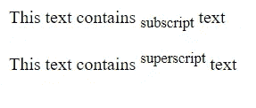
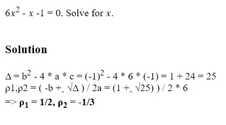
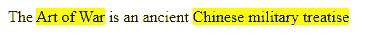
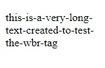
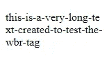
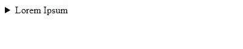
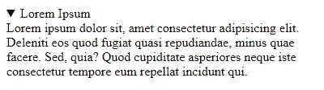
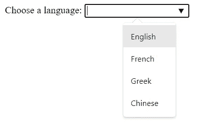
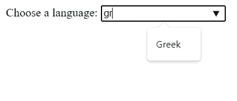
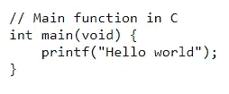

# 10+你从未使用过的 HTML 的惊人标签和属性

> 原文：<https://levelup.gitconnected.com/10-amazing-tags-and-attributes-of-html-you-never-use-afc82ff587cf>

探索 HTML 中一些最不为人知的标签和属性。


由[格雷格·拉科齐](https://unsplash.com/@grakozy)在 [Unsplash](https://unsplash.com/photos/vw3Ahg4x1tY) 上

作为一名前端或全栈开发人员，您肯定会使用大量的 HTML，并且可能会觉得没有什么需要学习的了。但是它的发展方式(尤其是随着 HTML5 的出现)有时会让你大吃一惊。

在本文中，我们将看到 10 个你可能还没有使用或了解的 HTML 标签和属性，它们将有助于改善你的网页的语义和可维护性。如果你搜索，你可以找到更多。相信我，HTML 比你想象的要广泛得多！

# 1.`<sup>`和`<sub>`标签

我们使用`<sup>`标签来定义应该显示为上标的文本。上标文本通常比正常行高半个字符，字体较小。

另一方面，下标文本出现在正常行下半个字符*处，并且它也有较小的字体。我们使用`<sub>`标签来显示它。*

```
<p>This text contains <sub>subscript</sub> text</p>
<p>This text contains <sup>superscript</sup> text</p>
```



这里有一个更实际的数学例子😄：

```
6&#x1D465;<sup>2</sup> - &#x1D465; -1 = 0\. Solve for &#x1D465;. <br />
<br>
<h3>Solution</h3>
Δ = b<sup>2</sup> - 4 * a * c = (-1)<sup>2</sup> - 4 * 6 * (-1) = 1 + 24 = 25
<br>
ρ1,ρ2 = ( -b +<sub>-</sub> &radic;Δ ) / 2a = (1 +<sub>-</sub> &radic;25) ) / 2 * 6 
<br>
=> <strong>ρ<sub>1</sub> = 1/2, ρ<sub>2</sub> = -1/3</strong>
```



显示解决方案

# 2.有序列表的属性

使用`<ol>`元素的有序列表经常被使用，但是你知道如何用普通的 HTML 让它们更灵活吗？一些鲜为人知的功能允许您自定义出现在此类列表中的编号行为，这些功能包括:

*   `reversed`属性，以相反的顺序对项目进行编号(从高到低，而不是默认的从低到高)
*   `start`属性，定义从**(已弃用)**开始的数字
*   `type`属性，定义是使用数字、字母还是罗马数字**(已弃用)**
*   `value`属性，用于指定特定列表项上的自定义编号

例如，`reversed`属性用于反转每个列表项旁边的数字，**不反转列表的内容。**

```
<ol reversed>
  <li>List item...</li>
  <li>List item...</li>
  <li>List item...</li>
</ol>
...
```

*钢笔* [*逆向有序列表用 HTML【分叉】*](https://codepen.io/smashingmag/pen/jOYPKxW) *按* [*路易拉扎*](https://codepen.io/impressivewebs)

请注意，列表保持不变，但数字发生了变化。如果您需要一种简单的方法来反转列表的内容，请记住这一点。还可以使用 type 属性将数字改为罗马数字等。

# 3.“下载”属性

`download`属性指定当用户点击超链接时，目标(在`href`属性中指定的文件)将被下载。

属性`download`的可选值将是文件下载后的新名称。对于允许的值没有限制，浏览器会自动检测正确的文件扩展名并将其添加到文件(。img，。pdf，。txt，。html 等。).

如果省略该值，则使用原始文件名。示例:下面的代码用于下载名为 mytext 的. txt 文件

```
...
  <style> 
  .button {
    display: inline-block;
    text-align: center;
    text-decoration: none;
    cursor: pointer;
    padding: 15px;
    background-color: #2c3e50;
    border-radius: 5px;
    color: white;
  }
  </style>
</head>

<body>
  <a class="button" href="mytext.txt" download>Download Now!</a>
</body>
...
```

# 4.惰性装载

你有一个有很多图片的网站，但是页面加载速度很慢，因为图片加载时间太长了？

图像元素(甚至是 **< iframe >** s)现在可以包含一个`loading`属性，该属性为浏览器提供了延迟加载特性，开发人员已经用 JavaScript 解决方案实现了该特性多年

只需添加:

```
loading="lazy" 
```

所有的图像

那么图像将在稍后加载，而不是在页面开始时加载。更准确地说，图像的加载将被推迟，直到图像将要进入视口。这将使你的网站在大多数情况下速度更快。

# 5.打电话或发邮件📞

需要一个链接来打**电话**或者**邮件**？你可以通过使用一个`a`标签来实现

```
<a href="tel:+919876543210">Call</a>
<a href="mailto:user@emaul.com">Mail</a>
```

# 6.`<mark>`标签

我们可以使用`<mark>`标签来标记/突出显示文本的一部分。

```
The <mark>Art of War</mark> is an ancient <mark>Chinese military treatise</mark>
```

默认情况下，`<mark>`会对包含的文本应用亮黄色背景:



当您使用`Find on Page`工具时，这个标签对于突出显示文档中的文本搜索结果非常有用，就像许多浏览器所做的那样。

# 7.`<wbr>`标签

`<wbr>`(断词机会)标签是一个非常模糊的标签。老实说，我怀疑你们中的许多人是否接触过这个标签，因为它很少被使用。本质上，标签允许你在文本中指定一个你认为换行符有用的位置，但是只有在需要的时候。

缩小浏览器窗口后，下面的文本将在某一点(由浏览器选择)换行和断开，这可能不适合我们。

```
<p>this-is-a-very-long-text-created-to-test-the-wbr-tag</p>
```



有了`<wbr>`标签，我们可以在单词中指定我们想要断开的确切位置。

```
<p>this-is-a-very-long-te<wbr />xt-created-to-test-the-wbr-tag</p>
```



# 8.`<details>`标签

使用`<details>`标签，我们可以在一个公开小部件中指定网页上的附加细节，用户可以在需要时查看或隐藏这些细节。

```
<details>
  <summary>Lorem Ipsum</summary>
  Lorem ipsum dolor sit, amet consectetur adipisicing elit. Deleniti eos
  quod fugiat quasi repudiandae, minus quae facere. Sed, quia? Quod
  cupiditate asperiores neque iste consectetur tempore eum repellat incidunt
  qui.
</details>
```



公开小部件已关闭(默认状态)。



“披露”小部件已打开。

# 9.内容可编辑属性

`[contenteditable](https://developer.mozilla.org/en-US/docs/Web/HTML/Global_attributes/contenteditable)` [全局属性](https://developer.mozilla.org/en-US/docs/Web/HTML/Global_attributes)是我最喜欢的属性之一。它是一个枚举属性，指示用户是否可以编辑元素。如果是这样，浏览器会修改它的小部件以允许编辑，因此如果您将它设置为 **true(或空字符串)，**您就可以编辑任何您喜欢的 html 元素中的文本。这在设计阶段可能很有用。

简单的 CodePen，允许你编辑 HTML 元素的文本(MDN 上的原始代码)

# 10.`<datalist>`标签

我们使用`<datalist>`元素为`<input>`元素指定一个预定义选项列表。它包含一组`<option>`元素，代表推荐或允许的选项，用户可以从中选择。

```
...
<form>
  <label for="lang">Choose a language:</label>
  <input list="langs" name="lang" id="lang" />  
  <datalist id="langs">
    <option value="English" />
    <option value="French" />
    <option value="Greek" />
    <option value="Chinese" />
  </datalist>
</form>
...
```

为了将一个`<input>`元素与一个`<datalist>`元素链接起来，我们在`<datalist>`上设置了一个`id`属性，并将`<input>`的`list`属性设置为相同的 id。



输入的可用选项列表显示在下拉列表中。



也可以**搜索**！可用选项根据用户输入而变化。这不是很酷吗😃？

# 额外收获 1:`<pre>`标签

`<pre>`元素允许我们显示源代码中出现的预格式化文本。这意味着多个空白字符不会合并成一个(改变浏览器处理空白的默认方式)。当您需要显示代码片段时，这个标签是理想的，因为它有助于保持缩进。例如，看看下面的代码:

```
...
<pre>
<code>
// Main function in C
int main(void) {
    printf("Hello world");
}
</code>
</pre>
...
```

在浏览器上，它可能看起来像这样:



# 附加功能 2:表单字段的`form`属性

在大多数情况下，您将把表单输入和控件嵌套在一个`<form>`元素中。但是如果您的应用程序或布局需要稍微不同的东西，您可以选择将表单输入放在您想要的任何地方，并将其与任何`<form>`元素相关联——即使不是元素的父元素。当您设计或布局需要无父表单字段时，这是一个非常有用的特性。

```
<form id="myForm" action="/form.php">
  <input id="name">
  <button type="submit">
</form>
```

```
<input type="password" form="myForm">
```

正如您在上面看到的，表单外的密码`<input>`的`form`属性被设置为`myForm`，它被设置为与表单的`id`相同的值。通过使用该属性和表单 id，可以将表单控件(包括`submit`按钮)与文档中的任何表单相关联。

# 结论

在本文中，我们探索了一些很少使用并且经常被遗忘的 HTML 标签和属性。如果你在网上搜索，你会发现更多让你吃惊的标签。