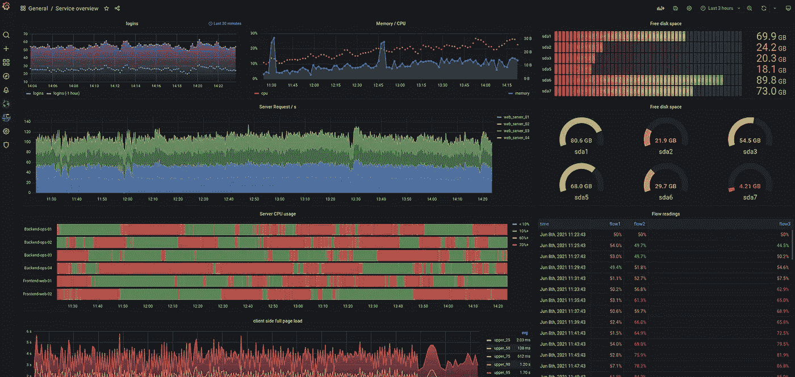
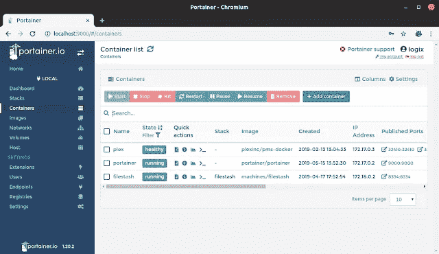
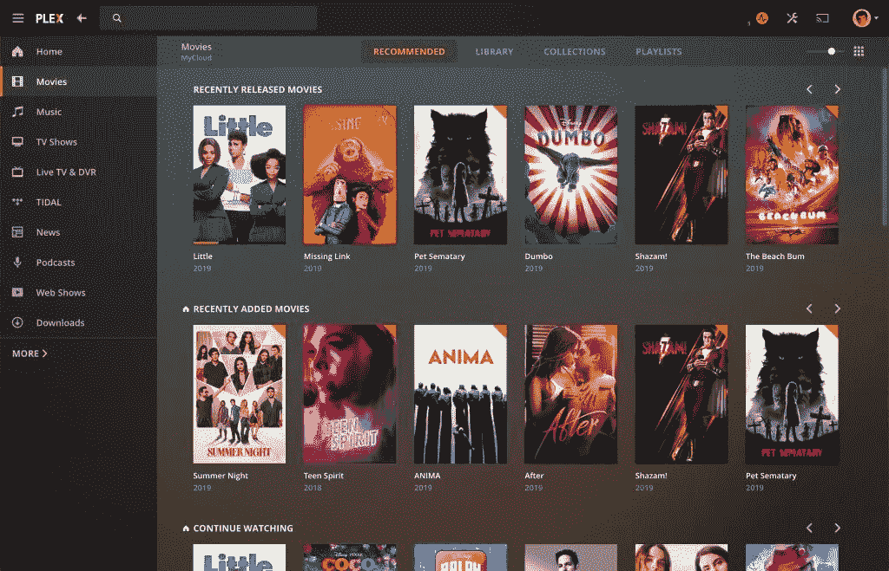
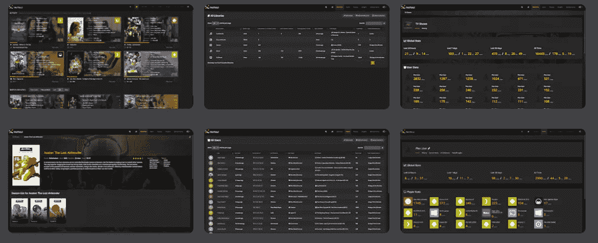
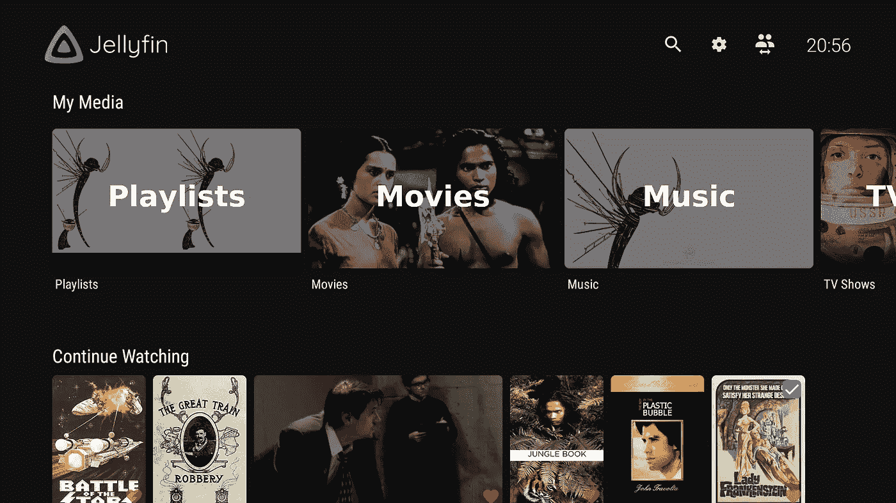
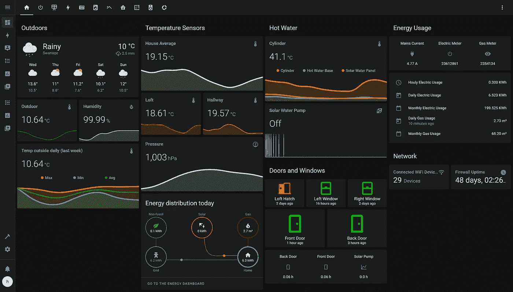
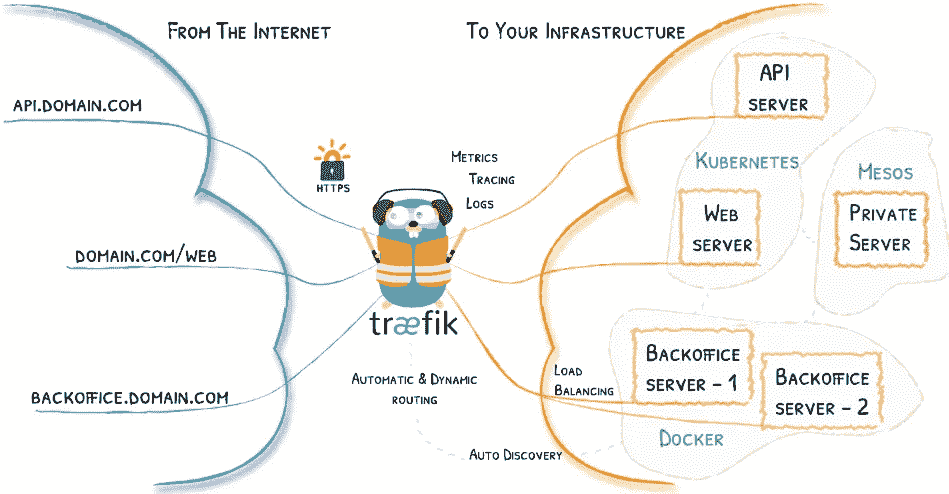
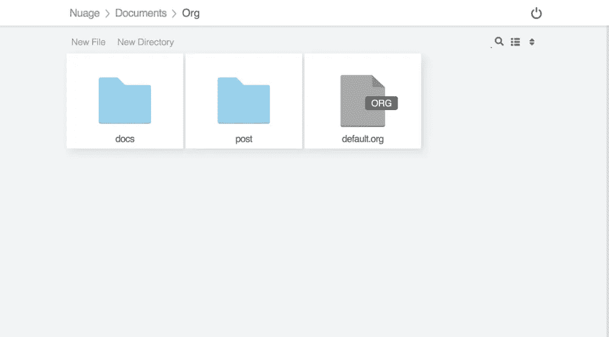
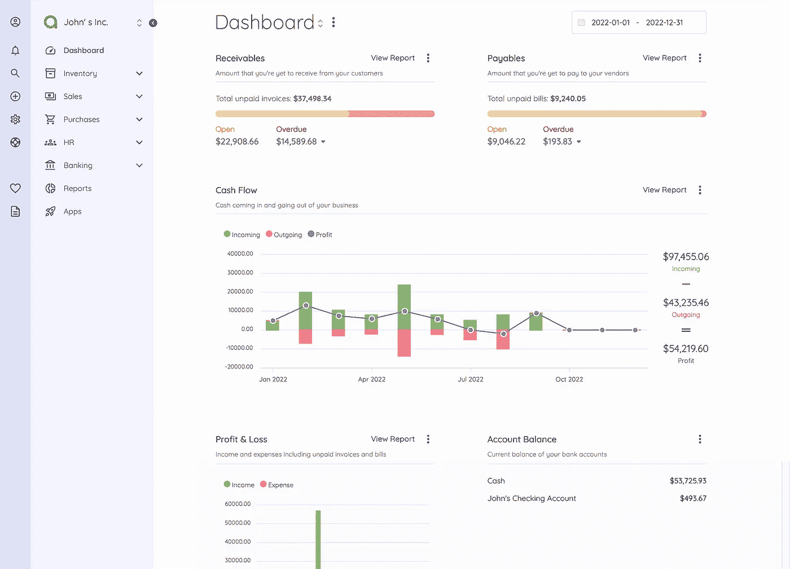
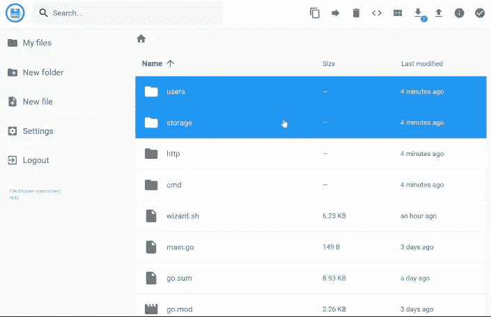

# 2022 年为你的家庭实验室打造 10 款应用

> 原文：<https://levelup.gitconnected.com/10-apps-for-your-homelab-in-2022-867957bc9b2f>


如果你正在运行一个 homelab，你可能已经在为你自己的个人云或者协助运行你的 homelab 堆栈运行许多应用程序了。如果你像我一样，你的实验室永远不会完成，你总是在寻找其他东西来安装和试验。本文将介绍一些您可以在实验室中试用的应用程序，以提高其可维护性，更好地管理它，或者添加全新的功能，以充分利用您的家庭实验室。

# 1.格拉夫纳+普罗米修斯+洛基堆栈

在您的 Homelab 中运行的所有应用程序都会为服务正在做的事情生成日志或指标。为了收集、存储和可视化这些指标，您需要为每个相关组件提供一系列应用程序。在这个堆栈中，Grafana 协助您的日志和指标的可视化和警报，Prometheus 聚合您的日志和指标，而 Loki 用于从您的主机或容器接收日志文件。



现在，监视堆栈的每个部分都在它的应用程序中，它对于您正在运行的任何系统都是非常可配置的，允许您使用不同的日志消息格式或协议。查看该指南，了解有关设置堆栈组件以及将日志和指标放入 Grafana 的信息，并在日志记录、监控和可观察性的世界中开辟一系列新的事物。

[](https://grafana.com/docs/grafana/next/setup-grafana/installation/) [## 安装 Grafana

### Grafana 的安装指南

grafana.com](https://grafana.com/docs/grafana/next/setup-grafana/installation/) 

# 2.便携式集装箱

如果您在自己的实验室中运行容器，Portainer 是一个很棒的应用程序，运行它可以为您的容器提供更多的管理功能。通过 Portainer，您可以更有效地访问可用的图像，并使用许多工具运行容器，以监控和调试您的应用程序工作负载，这一切都是通过一个易于使用的 web 仪表板实现的，如下所示。



该应用程序是作为单个容器运行时构建的，因此可以很容易地集成到任何环境中。Portainer 可以连接到许多在本地或云提供商上运行的容器运行时引擎，包括 Docker、Docker Swarm、Kubernetes 和容器运行时。

查看 Portainer 入门指南，在您的家庭实验室中测试该应用程序。

[](https://docs.portainer.io/start/intro) [## 介绍

### 编辑描述

doc . portainer . io](https://docs.portainer.io/start/intro) 

# 3.丛

你可能像我们中的许多人一样有一个家庭实验室，并运行一些媒体自动化应用程序来收集或查看文件。如果你没有听说过 Plex，它是查看媒体文件的领先免费应用程序之一，包括个人视频、音乐、电影和电视。



您可以免费创建一个 Plex 帐户，并使用该应用程序的基本功能。但是有些功能，比如下载媒体到你的移动设备上离线观看，是通过订阅 [Plex pass](https://www.plex.tv/plex-pass/) 付费的。Plex 通常拥有 Plex pass 的终身订阅，因此请留意您的电子邮件，您可能会得到一笔不错的交易。

请注意，Plex 是一个外部服务，您将依赖它来使用应用程序。这种集成的一个后果是，如果丛由于任何原因关闭，您可能无法完全使用丛的功能。Plex 登录服务器时不时会出现故障，但是您获得的整体功能和改进是值得的。

您可以在下一页找到安装和运行 Plex 的说明。

[](https://support.plex.tv/articles/200264746-quick-start-step-by-step-guides/) [## 丛媒体服务器的快速入门和逐步指南|丛支持

### 这种快速入门是设置和开始使用您自己的 Plex 媒体服务器的最快方式。如果你需要更多…

support.plex.tv](https://support.plex.tv/articles/200264746-quick-start-step-by-step-guides/) 

# 4.陶图利

假设您正在您的 Homelab 上运行 Plex(或者由于这篇文章，它将很快启动)。在这种情况下，Tautulli 是您的媒体自动化堆栈的一个出色补充，可以进一步了解您的媒体服务器上正在发生的事情，并扩展到 Plex 的可用指标。



这些指标提供历史和实时数据，让您深入了解用户在服务器上做什么，以及如何优化服务器和媒体以更好地满足消费需求。Tautulli 提供的分析可以帮助确定您是否可能在错误的时间运行后台任务来满足用户的需求，或者您的资源是否不足以支持服务器导出的媒体和编解码器类型。

您可以在下一页找到设置 Tautulli 的说明。

[](https://github.com/Tautulli/Tautulli/wiki/Installation) [## 安装陶图利/陶图利维基

### 下载并运行最新的 Windows。GitHub 发布页面上的 exe 安装程序。注意:在。exe 安装程序需要…

github.com](https://github.com/Tautulli/Tautulli/wiki/Installation) 

# 5.果冻

Plex 的另一个替代方案是在[开源](https://github.com/jellyfin/jellyfin)应用空间中添加一个新的内容。Jellyfin 提供了一个完全开源的解决方案和一个类似于 Plex 的功能集，不需要外部服务。



与 Plex 的其他竞争对手相比，这是最完美的替代产品。专注于将其构建为开源应该是该项目的未来优势。我们已经从 Plex 和 Emby 中看到，在应用程序中引入业务元素会导致用户失去功能。

你可以在这里找到安装 Jellyfin 的说明。

 [## 主页|文档- Jellyfin 项目

### Jellyfin 是一个免费的软件媒体系统，让你控制管理和流媒体。这是一个…

jellyfin.org](https://jellyfin.org/docs/) 

# 6.家庭助理

如果你想实现任何家庭自动化或让你的家变得智能，Home Assistant 是该用例的最佳开源应用。这个完整的解决方案提供了一个用户界面，用于访问所有家庭自动化信息和自动化调度/运行功能。



该平台几乎为您的智能设备或外部服务提供了标准集成，允许您将 homelab 上运行的 Home Assistant 与其他设备有效集成。

Home Assistant 有许多不同的部署选项，包括手动安装、Docker 容器或新的 [HassOS](https://github.com/home-assistant/operating-system) 映像，这是推荐的安装解决方案。这个 VM ISO 提供了运行 Home Assistant 所需的一切，并包括一种改进的方式，可以更安全地运行 VM 中 docker 容器的所有 Home Assistant 集成。

您可以在下一页查看以下关于安装和运行 Home Assistant 的文档。

[](https://www.home-assistant.io/getting-started/) [## 入门指南

### 家庭助手入门

www.home-assistant.io](https://www.home-assistant.io/getting-started/) 

# 7.特拉菲克

假设您在自己的 Homelab 中运行许多 Docker 容器或虚拟机，并希望在一个域下或使用代理或 SSL 等标准功能发布这些 web 服务。现在，您可以使用 Nginx 这样的工具来完成这项工作，但是每次添加新的服务或主机时，您都需要更新这些文件，这可能很难管理，并且会导致错误。

这就是特拉菲克的用武之地。它提供了一种为 Docker 容器或静态站点创建代理配置的动态方式。



配置的动态特性是 Traefik 的优势，它允许您为服务设置公共入口点，并应用标准头和中间件，如身份验证转发。Traefik docker 提供程序使您能够监控主机上运行的 docker 服务。当在 docker 服务上创建一个新的容器时，如果它使用任何 Traefik 前缀标签，那么它将被用来配置入口点和 docker 服务和应用程序之间的连接。以下命令显示了使用标签而不是静态配置来配置 container Traefik 服务的示例。

```
version: "3"
services:
  my-container:
    # ...
    labels:
      - traefik.http.routers.www-router.rule=Host(`example-a.com`)
      - traefik.http.routers.www-router.service=www-service
      - traefik.http.services.www-service.loadbalancer.server.port=8000
      - traefik.http.routers.admin-router.rule=Host(`example-b.com`)
      - traefik.http.routers.admin-router.service=admin-service
      - traefik.http.services.admin-service.loadbalancer.server.port=9000
```

通过这种模式，您的代理配置被附加到您的应用程序容器，随着时间的推移，管理它们变得更加容易。查看 Traefik 文档，了解安装和操作代理的说明。

[](https://doc.traefik.io/traefik/getting-started/quick-start/) [## Traefik 快速入门- Traefik

### 一个使用 Docker 的简单用例创建一个 docker-compose.yml 文件，您将在其中定义一个反向代理服务，该服务使用…

doc.traefik.io](https://doc.traefik.io/traefik/getting-started/quick-start/) 

# 8.Filestash

运行服务器时，您需要访问主机上的文件，仅通过 CLI 导航、上传和下载这些文件可能不太方便。然而，有时用一个简单的用户界面来访问这些文件会更好。Filestash 是管理员工具包中的一个轻量级选项。



该应用程序支持许多存储后端，使其适合任何您想要的设置。支持的后端包括本地，S3，Git，谷歌驱动，Backblaze 等。

Filestash 有一个自托管和 SASS 提供的应用程序。你可以在这里查阅入门文档。

 [## 入门指南

### 要使用 Filestash，您可以:通过 AWS Marketplace 从云中运行应用程序自托管应用程序…

www.filestash.app](https://www.filestash.app/docs/) 

# 9.阿昆亭

假设你在市场上寻找一个高度完善和特色的个人或商业会计应用程序，那么会计可能是一个完美的选择。该应用程序可以让您更好地了解您的财务数据，并掌握一些发票或账单。



这个应用程序对于管理多个公司账簿的任何人来说都是完美的，允许您轻松地将财务状况划分到他们的视图中。它还允许您轻松地共享收集的任何财务数据报告，以便您可以与相关方共享。会计软件可以自托管的选项不多。因此，这是一个高度完善的应用程序，您通常必须付费才能获得相同级别的功能，因此对于任何用例都值得研究。

您可以在第页的[中找到会计入门文档。](https://akaunting.com/docs/installation)

 [## 简介-文档-会计

### 简介欢迎阅读免费会计软件 a 会计的文档。本指南可作为资源用于…

akaunting.com](https://akaunting.com/docs) 

# 10.文件浏览器

在远程机器上访问文件的另一个好的替代方法是 FileBrowser，比如 Filestash。这个应用程序提供了更多的功能来管理您的文件，通过浏览器进行简单的文件编辑和查看。



FileBrowser 和 Filestash 之间的一个区别是，这个应用程序只关注向应用程序的用户公开本地文件系统。凭借其添加其他用户及其权限的额外管理功能，它是一个完美的管理实用程序，您可以在您的 Homelab 或家庭服务器主机上运行。

您可以在此处找到开始使用 FileBrowser 的文档。

[](https://github.com/filebrowser/filebrowser) [## GitHub -文件浏览器/文件浏览器:📂网络文件浏览器

### filebrowser 提供了一个指定目录下的文件管理界面，可以用来上传、删除文件

github.com](https://github.com/filebrowser/filebrowser) 

# 包扎

您可以安装到家庭实验室或家庭服务器上的应用程序库每年都在增长，并且一直都有新的、更完善的功能可用。最好的部分是，因为它们是开源的，所以你可以获得很多免费的特性。

希望你已经找到了可以在你的实验室使用的好东西。查看这篇文章，了解更多关于运行我的家庭实验室的教训和错误。

[](/lessons-from-my-homelab-e4a9790e66cb) [## 来自我家庭实验室的教训

### 我运行 homelab 已经有一段时间了，在它的生命周期中经历了几次不同的迭代。这是…

levelup.gitconnected.com](/lessons-from-my-homelab-e4a9790e66cb) 

# 进一步连接

*   如果你正在考虑获得一个中等订阅，你可以通过使用我的[推荐链接](https://aaron-kt-berry.medium.com/membership)来帮助我。
*   查看我在[媒体](https://medium.com/@aaron-kt-berry)上的其他文章，如果你想了解最新消息，请通过[电子邮件](https://aaron-kt-berry.medium.com/subscribe)订阅。
*   如果你想聊天，在推特上联系我，或者在 T2 的 LinkedIn 上联系我，如果你想雇佣我，我在 T4 的 Codementor 上。