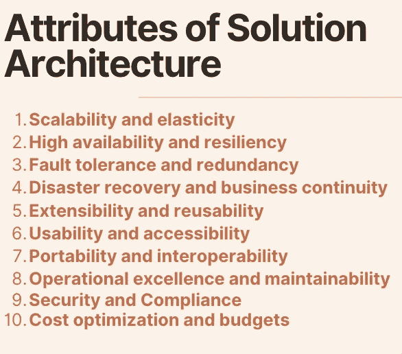
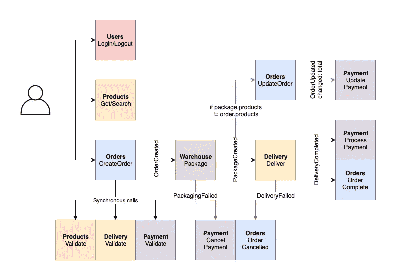
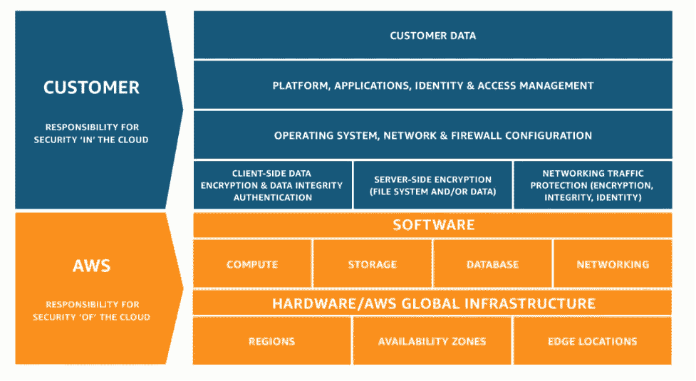
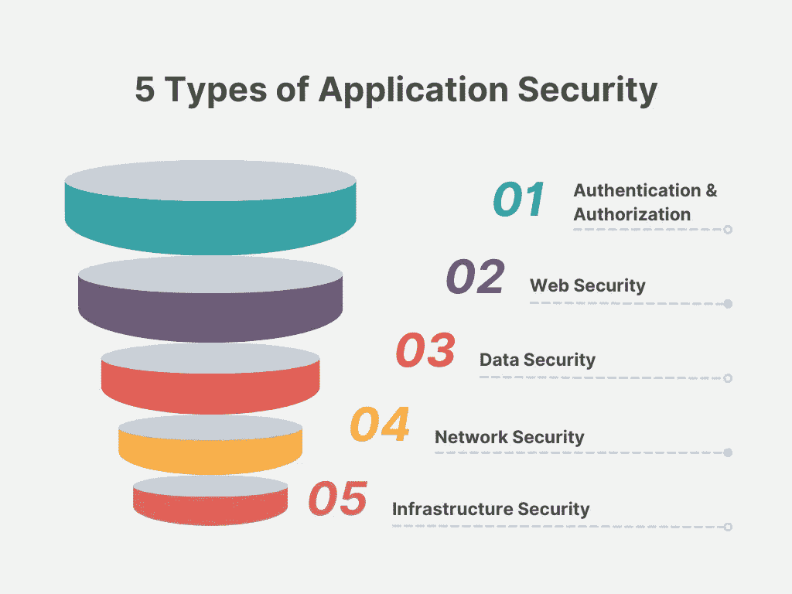

# 解决方案架构的 10 个属性

> 原文：<https://levelup.gitconnected.com/10-attributes-of-solution-architecture-8d67075a5bc5>

需要花费大量的时间和耐心来提出构建工作负载的核心概念，以满足确切的业务需求，可以扩展，并且不会过度设计。

作为一个为许多客户构建过类似解决方案的人，我一直想知道是否有一份神圣的文件给出简单的两行定义、一个具体的例子，以及所需的基本原则的清晰区分/解释。这份文件是我找不到的结果。

> 我相信这对于那些希望进入解决方案架构、准备认证考试、调整他们现有的架构或者在向他们的团队解释基本原则时节省时间的人是有用的。

这些定义是从以下四个来源汇编的:

1.  [AWS 良好架构框架的 6 大支柱](https://aws.amazon.com/blogs/apn/the-6-pillars-of-the-aws-well-architected-framework/)
2.  [解决方案架构师手册](https://www.amazon.in/Solutions-Architects-Handbook-Kick-start-architecture-ebook/dp/B0855XQZ44)
3.  [AWS 概念](https://wa.aws.amazon.com/wellarchitected/2020-07-02T19-33-23/wat.concepts.wa-concepts.en.html)
4.  [无服务器应用镜头](https://docs.aws.amazon.com/wellarchitected/latest/serverless-applications-lens/wellarchitected-serverless-applications-lens.pdf)

您也可以将它们视为非功能性需求(**nfr**)，它们是设计的重要部分，与应用程序的最终业务目标无关，但对保持应用程序运行至关重要。

# 解决方案架构的属性

1.  **可扩展性和弹性**
2.  **高可用性和弹性**
3.  **容错和冗余**
4.  **灾难恢复和业务连续性**
5.  **扩展性和可重用性**
6.  **可用性和可访问性**
7.  **可移植性和互操作性**
8.  **卓越运营和可维护性**
9.  **安全性和合规性**
10.  **成本优化和预算**

服务协议的属性

# 可扩展性和弹性

**可扩展性**意味着让您的系统能够处理负载。它可以用于多个层，如应用服务器、web 应用和数据库，以处理不断增长的工作负载。

有两种主要的缩放类型:

**水平扩展**是指**增加更多**实例的能力，这些实例类似于需求增加时已经存在的实例。

**举例:**如果两台服务器每台每秒都能处理 1000 个请求，

如果需求= 2000 请求/秒，则保持系统不变。

如果 demand = 4000 req/sec，那么您将再添加 2 个类似的实例进行扩展。

**垂直伸缩**是当需求增加时，增加**同**实例大小的能力。也就是说，2vCPU 和 8GB RAM 实例将增加到 4vCPU 和 16GB RAM 来处理需求。

**弹性**是系统根据需求进行伸缩的能力。

**示例:**自动扩展组(ASG)、云服务代替服务器等

> **区别** : **可扩展性**是处理负载的物理概念，而**弹性**是系统的软件组件，它决定这些计算实例的大小如何增长和收缩

# 高可用性和弹性

**高可用性**是指系统在一定时间内不停机的情况下为最终用户服务的能力。

**示例:**99.9%的 SLA[正常运行时间](https://uptime.is/)和可用性导致以下停机时间和不可用时间:
**每日** : 1m 26s
**每周:** 10m 4s
**每月:** 43m 49s
**每季:** 2h 11m 29s
**每年:**8h 45m 55

**弹性**意味着您的应用程序应该能够在没有人工干预的情况下自我恢复。即通过使用自愈原理并持续监控工具。

> **区别** : **高可用性**是你做出的承诺，而**弹性**是你如何确保它被遵守。

# 容错和冗余

**容错** e 是指在发生中断时，在不影响系统性能的情况下处理工作负载的能力。
**举例:**假设你需要四台服务器来管理用户流量。这是通过将两台服务器放置在两个物理上独立的数据中心来实现的。如果一个数据中心发生故障，用户流量可以由另一个数据中心提供。但是，现在您只有两台服务器，只有以前容量的 50%可用，用户可能会担心速度问题。

> 在上面的例子中，您的应用程序具有 100%的高可用性，但是只有 50%的容错能力。

**冗余**是在不同的 AZ 或地区保持相同的工作负载完全运行，以防发生意外，以确保业务关键系统完好无损。

**例**:空闲状态的第二区域或 AZ。

由于更高的冗余度，完全容错的架构是昂贵的。您的用户群是否能够忍受应用程序恢复期间的性能下降，取决于您的应用程序对业务价值的重要程度。例如，销售期间的电子商务网站需要 100 HA 和 100%容错

> **区别:**作为 s a，您应该决定是否需要 100%的**容错**，这将不可避免地带来成本影响，因为**冗余**工作负载为了安全而空闲运行

# 灾难恢复和业务连续性

灾难恢复做好准备，以防可怕的事情发生。飓风、海啸等。
**业务连续性**是指如果出现问题，您需要多长时间才能恢复在线。特别是 RTO 和 RPO。

> RTO =恢复需要多长时间。即 20 分钟，2 小时
> 
> RPO =备份到哪一点。即今天上午 11:30。

**示例**:如果事件发生在今天下午 4 点，假设我的 RTO= 1 小时，RPO 为 15 分钟，解决方案架构师将对业务做出如下响应:

“我会在下午 5 点之前让系统恢复在线，一旦恢复，您就可以在下午 3 点 45 分之前访问数据”

> D **区分:** **灾难恢复** (DR)表示您采取的预防措施，**业务连续性**表示应用灾难恢复步骤来继续业务

# 可扩展性和可重用性

**可扩展性**意味着一个解决方案的设计需要足够灵活，允许你添加新的特性或者改变已经存在的特性。这可以通过遵循松散耦合的架构 RESTful 或基于队列的架构、工作流编排、触发器等来实现

示例:分解它，以便以后可以扩展

**可重用性**意味着在每一个关头都要养成干燥(不要重复自己)的心态。

**示例:**开发 Lambda 层、Cloudformation 模板、文档、底层架构图等

> **区别** : **可扩展性**是指能够添加更多(相关)功能而不中断的工作负载，而**可重用性**是指添加可重用组件以创建更快、更好、集中和有组织的协作环境的能力。

# 可用性和可访问性

可用性是指用户第一次使用你的应用时，能多快找到如何导航的方法**。**

**例如:**延迟、缓存、SSR 等

可访问性是关于包容性，让每个人都可以使用你的应用程序。

**例子:**地区语言支持，尽量使用 darkmode，等等。

> **区别:可用性**(在此上下文中)是指强调用户对应用程序使用的无缝流程，而不是技术可行性。**记住，在软件领域，我们卖的是好处，而不是功能。可访问性**意味着确保它是为所有类型的目标受众制作的。

# 可移植性和互操作性

**可移植性**允许你的应用程序在不同的环境下工作，而不需要任何改变，或者只需要很小的改变

**互操作性**是指一个应用程序通过标准格式或协议与其他应用程序协同工作的能力。即不同的应用程序可以使用相同的数据交换方法。

**示例:**单个电子商务 API 就足以满足下订单、减少库存并将其发送到物流部门以获得运输细节的目的

> **区别**:使用容器是**可移植性**最简单的例子(至少新时代的开发者，看在上帝的份上，请避免使用虚拟机)。您可以通过将基础设施构建为代码(IaC)脚本来实现无服务器的可移植性，但这是一篇更深入的文章的主题。互操作性是跨多种工具使用单一数据交换机制的能力。

# 卓越运营和可维护性

**卓越运营**是工作负载部署、更新和运营的好坏。优化和自动化操作，以便您可以更快地发布功能，避免人为错误，并保留标记以通知细节。

使用日志记录、监控和警报来捕获所有事件，以实现卓越运营。

示例:使用 CI/CD 管道将使整个发布过程自动化。

**可维护性**指的是用新的库和安全补丁保持应用程序最新的过程，以便后续版本不会有任何寿命终止(EOL)或安全问题。

# 安全性和合规性

**安全性**是云服务提供商和客户的共同责任。

对于安全性，AWS 提供了一个奇妙的布局，叫做分担责任。

AWS(云)分担责任

> E 在“客户”标签中提到的一切都是客户的责任。

应用程序安全性的类型

**合规**需要赢得客户的信任并遵守法规和当地法律。

**例子** : GDPR、HIPPA、PCI 等

# 成本优化和预算

**成本优化**是一项持续的工作，应该是一个持续的过程。像任何其他约束一样，成本节约伴随着权衡，就像 it 应该重视确定其他组件(如交付速度和性能)是否更重要一样。

**例**:根据监控数据，移除空闲的按需服务器或缓存集群。

**预算**是特定时间段(通常为一个月)的费用估算。与所有其他指标一样，成本必须自动化，并且必须设置预算使用警报。建议使用基于阈值的触发器来发送通知。

**示例:**如果您的每月 EC2 按需预算为 800 美元，请确保收到 50%、70%和 90%的预算使用通知，以监控消费趋势。

**额外提示:**尝试配置两个**成本预算&使用预算**。

> **区别:** **成本优化**是一项持续的努力，应该是一项持续的活动，但是**预算**是可配置的使用限制和警报设置，用于跟踪成本

未来的开发包括创建一个点数表，指示无服务器工作负载在这些属性中的排名。请关注我，以便接收这些更新。