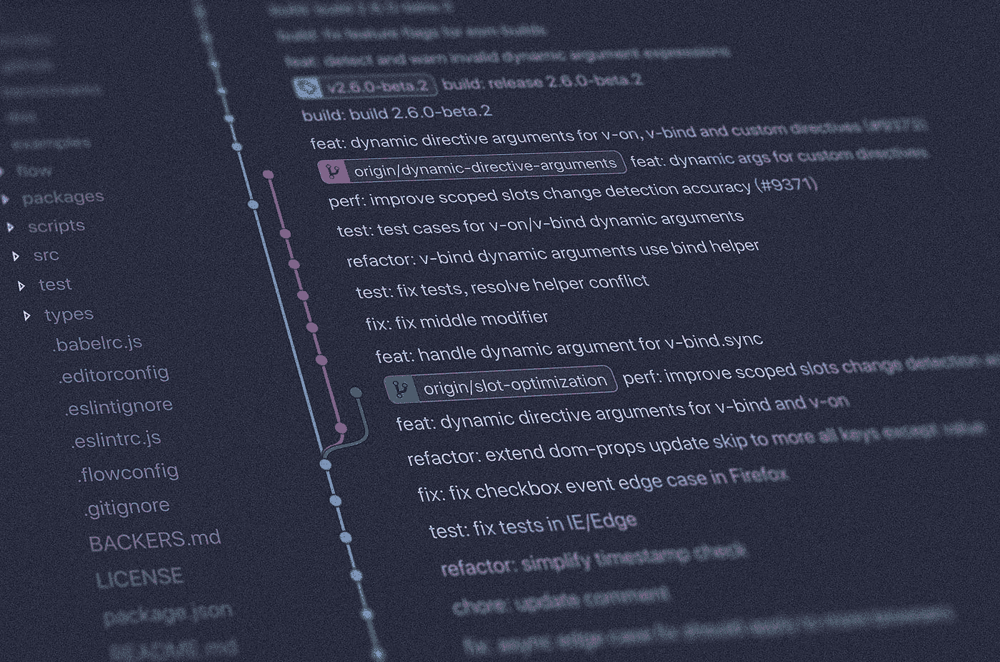

# 每个开发者都必须知道的 10 个令人敬畏的 Github Repos

> 原文：<https://levelup.gitconnected.com/10-awesome-github-repos-every-developer-must-know-c0b0839a17d3>

## 从资源到面试准备，这里有很多很棒的东西

照片由[扬西·敏](https://unsplash.com/@yancymin?utm_source=medium&utm_medium=referral)在 [Unsplash](https://unsplash.com?utm_source=medium&utm_medium=referral) 上拍摄

> 如果你想了解更多关于技术的知识，请订阅我全新的 YouTube 频道，在那里我会用一种简洁明了的方式解释复杂的话题，帮助你提高技能！→【https://www.youtube.com/@litwire 

我收集了 10 个你可以在 GitHub 上找到的伟大的知识库，它们绝对会给你带来即时的知识提升。

# 1.可怕的

毫无疑问，Awesome 是最受欢迎的回购，它策划了从软件开发到硬件到商业的所有主题。目前，Github 上有超过 223，000 颗星星，人们可以花几天(几夜)来浏览它。如果我想学习新的东西，这是我的一站式商店。

令人敬畏的 Github 仓库

[链接到回购](https://github.com/sindresorhus/awesome)

# 2.(高级)JavaScript 问题列表

这个知识库(49，000 颗星)是由 Lydia Hallie 创建的(顺便说一句，她是一个很棒的人，请在 insta gram[上查看她！)非常棒，如果你想测试你的 JavaScript 知识和/或准备工作面试的话。Lydia 不断增加新的问题，所以这个回购稳步增长！](https://www.instagram.com/theavocoder)

JavaScript 问题报告

[链接到回购](https://github.com/lydiahallie/javascript-questions)

# 3.JavaScript 算法和数据结构

JavaScript Algorithms (153，000 星)包含了大量基于 JavaScript 的流行和不太流行的算法和数据结构的例子。结构真的很好，因为这些例子被标记为初学者或高级。因此，无论你对密码学、排序、图形、甚至机器学习(以及更多)感兴趣，都会有适合你的东西。

JavaScript 算法和数据结构报告

[链接至回购](https://github.com/trekhleb/javascript-algorithms)

# 4.干净代码 JavaScript

知道如何编写干净的代码对几乎每个开发人员来说都是一项有用的技能，并且是许多项目和公司的必备技能。这个库(73，700 颗星)采用了 Robert C. Martin 的干净代码的概念，并将其用于 JavaScript，这样您就可以在未来的工作中使用它们。

干净代码迷因

[链接至回购](https://github.com/ryanmcdermott/clean-code-javascript)

# 5.免费开发

这个优秀的存储库(60，800 颗星)是为了帮助开发人员找到软件(SaaS、PaaS、IaaS)和具有自由层的类似产品而创建的。免费使用优秀的软件？听起来棒极了！有电子邮件、CI/CD、监控、DNS、托管等服务。

开发回购免费

[链接至回购](https://github.com/ripienaar/free-for-dev)

# 6.技术面试手册

如果你想为科技行业的面试做好准备(你应该这样做！)，这个存储库正是适合你的地方。它目前在 Github 上有 80，000 颗星，可以帮助您:

*   如何准备编码面试
*   面试备忘单
*   算法提示/最佳实践问题
*   面试形式
*   …以及更多

在去参加下一次面试之前，检查一下。

技术面试手册存储库

[回购链接](https://github.com/yangshun/tech-interview-handbook)

# 7.高效工程师—注释

一个“有效的工程师”是把事情做好的人。但是你怎样才能成为其中一员呢？这个 Github 库(7400 星)有建议给你！主题包括:

*   如何优化你的学习
*   如何区分轻重缓急
*   衡量你的进步

有效的工程师笔记库

[链接到回购](https://gist.github.com/rondy/af1dee1d28c02e9a225ae55da2674a6f)

# 8.免费学习资源列表

这个知识库在 Github 上有多达 253，000 颗星星，绝对是那里最受欢迎的策展之一。它提供大量免费的编程书籍、视频、播客，甚至各种在线课程。如果你正在寻找学习资料，不用再找了！

免费学习资源库列表

[链接到回购](https://github.com/EbookFoundation/free-programming-books)

# 9.淘气琴弦的大名单

你可以在测试你的代码和程序上投入尽可能多的资金，但是当真正的用户开始参与进来的时候——相信我，他们会做一些你从未想过的事情，尤其是当涉及到用户输入的时候。这个存储库(44，000 颗星)有一个庞大的字符串列表，这些字符串在用户输入时是有问题的。所以不管你是想给你的 QA 朋友留下深刻印象，还是想用它来测试你的软件，这都是非常有用的！

淘气字符串存储库的大列表

[链接至回购](https://github.com/minimaxir/big-list-of-naughty-strings)

# 10.绝佳的首次公关机会

如果你想开始使用开源软件，我想推荐给你的最后一个库是很棒的。为 OSS 做贡献是一个很好的方式来参与社区，给你的投资组合增加一些东西，尝试新事物，成为一个更好的开发者，甚至找到一份新工作。但是入门是相当难的，这是我从个人经历中了解到的。这个库列出了开源项目，这些项目是众所周知的，或者目前有初学者可以解决的问题。它帮助我开始使用 OSS，应该也能帮助你！

令人惊叹的第一个公关机会库

[链接至回购](https://github.com/MunGell/awesome-for-beginners)

我希望你和我一样觉得这些库很棒，我真的希望它们中的一些能在你作为 web 开发人员的旅程中帮助你。