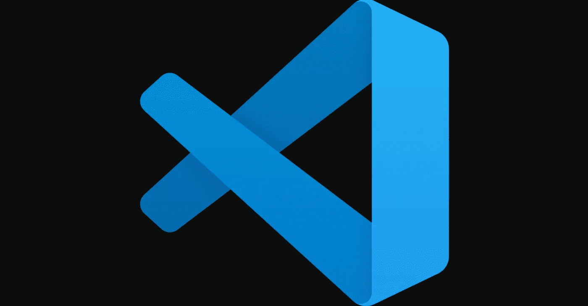

# 使用 React 进行开发的 10 个最佳代码扩展

> 原文：<https://levelup.gitconnected.com/10-best-vs-code-extensions-for-development-with-react-bb1bc9851818>

## 使用 JavaScript 和 TypeScript 改善您的开发人员体验

欢迎来到 VS 代码扩展列表，它可以提高您的工作效率，让您的开发人员在使用 React 进行日常开发时体验更好。同样值得一提的是，这些扩展中的许多并不仅限于 JavaScript、TypeScript 或 React。

# 1.Tabnine AI 自动完成

> Tabnine 是一个 AI 代码助手，让你成为更好的开发者。Tabnine 将通过所有最流行的编码语言和 ide 中的实时代码完成来提高您的开发速度。

 [## Tabnine 人工智能自动完成 Javascript，Python，Typescript，PHP，Go，Java，Ruby 和更多-可视化…

### 什么是 Tabnine Tabnine 是一个 AI 代码助手，让你成为更好的开发者。泰宁会增加你的…

marketplace.visualstudio.com](https://marketplace.visualstudio.com/items?itemName=TabNine.tabnine-vscode) 

# 2.ES7+React/Redux/React-原生片段

> ES7+中的 JavaScript 和 React/Redux 片段，带有针对 VS 代码的 Babel 插件特性。

 [## ES7+React/Redux/React-本机代码片段— Visual Studio Marketplace

### Visual Studio 代码的扩展—使用 ES7+语法在 JS/TS 中扩展 React、React-Native 和 Redux

marketplace.visualstudio.com](https://marketplace.visualstudio.com/items?itemName=dsznajder.es7-react-js-snippets) 

# 3.JavaScript (ES6)代码片段

> 该扩展包含 Vs 代码编辑器的 ES6 语法中 JavaScript 的代码片段(支持 JavaScript 和 TypeScript)。

 [## JavaScript (ES6)代码片段— Visual Studio 市场

### Visual Studio 代码扩展 ES6 语法的 JavaScript 代码片段

marketplace.visualstudio.com](https://marketplace.visualstudio.com/items?itemName=xabikos.JavaScriptSnippets#review-details) 

# 4.GitLens — Git 增压

> GitLens 在 VS 代码中充入 Git，并释放每个知识库中尚未开发的知识。它可以帮助您通过 Git 责备注释和 CodeLens 快速查看代码作者，无缝导航和探索 Git 存储库，通过丰富的可视化和强大的比较命令获得有价值的见解，等等。

 [## GitLens - Git 增压版- Visual Studio 市场

### Visual Studio 代码的扩展——在 VS 代码中为 Git 增压——通过 Git 使代码作者身份一目了然

marketplace.visualstudio.com](https://marketplace.visualstudio.com/items?itemName=eamodio.gitlens) 

# 5.更漂亮—代码格式化程序

> 漂亮是一个固执己见的代码格式化程序。它通过解析您的代码并根据自己的规则(考虑到最大行长度，必要时换行)重新打印代码来强制执行一致的风格。

 [## 更漂亮—代码格式化程序— Visual Studio 市场

### Visual Studio 代码的扩展—使用更漂亮的代码格式化程序

marketplace.visualstudio.com](https://marketplace.visualstudio.com/items?itemName=esbenp.prettier-vscode) 

# 6.路径智能感知

> 自动完成文件名的 Visual Studio 代码插件。

 [## 路径智能感知— Visual Studio 市场

### Visual Studio 代码扩展—自动完成文件名的 Visual Studio 代码插件

marketplace.visualstudio.com](https://marketplace.visualstudio.com/items?itemName=christian-kohler.path-intellisense) 

# 7.自动关闭标签

> 自动添加 HTML/XML 结束标记，与 Visual Studio IDE 或 Sublime Text 一样。

 [## 自动关闭标记- Visual Studio 市场

### Visual Studio 代码的扩展-自动添加 HTML/XML 结束标记，与 Visual Studio IDE 或 Sublime 文本相同

marketplace.visualstudio.com](https://marketplace.visualstudio.com/items?itemName=formulahendry.auto-close-tag) 

# 8.自动导入

> 自动查找、分析并提供所有可用导入的代码操作和代码完成。使用打字稿和 TSX。

 [## 自动导入- Visual Studio 市场

### 自动查找、分析并提供所有可用导入的代码操作和代码完成。与…一起工作

marketplace.visualstudio.com](https://marketplace.visualstudio.com/items?itemName=steoates.autoimport) 

# 9.自动重命名标签

> 自动重命名成对的 HTML/XML 标记，与 Visual Studio IDE 一样。

 [## 自动重命名标记- Visual Studio 市场

### Visual Studio 代码扩展-自动重命名成对的 HTML/XML 标记

marketplace.visualstudio.com](https://marketplace.visualstudio.com/items?itemName=formulahendry.auto-rename-tag) 

# 10.Lorem ipsum

> 一个很小的 VS 代码扩展，由几个命令组成，生成 lorem ipsum 文本并将其插入到文本文件中。

 [## Lorem ipsum - Visual Studio 市场

### 一个很小的 VS 代码扩展，由几个命令组成，生成 lorem ipsum 文本并将其插入到文本文件中。要使用…

marketplace.visualstudio.com](https://marketplace.visualstudio.com/items?itemName=Tyriar.lorem-ipsum) 

如果你在列表中没有找到你喜欢的 VS 代码扩展，请在评论中与我们分享。

如果您喜欢这篇文章，请关注我，了解更多关于 React、JavaScript、TypeScript 等开发的技巧！

## 成为会员

*如果你喜欢阅读这样的故事，并且想支持我成为一名作家，* [*考虑注册成为一名媒介会员*](https://jakub-kozak.medium.com/membership) *。一个月 5 美元，你可以无限制地阅读媒体上的故事。如果你* [*用我的链接*](https://jakub-kozak.medium.com/membership) *注册，我会赚一小笔佣金*🙌

 [## 通过我的推荐链接加入 Medium 雅各布·科萨克

### 阅读雅各布·科萨克(以及媒体上成千上万的其他作家)的每一个故事。您的会员费直接支持…

jakub-kozak.medium.com](https://jakub-kozak.medium.com/membership) 

## 工作机会——来加入我吧

我在 Tjekvik 的团队正在寻找更多的开发者！你有使用 React 和 Ruby on Rails 的经验吗？那就不要犹豫，马上申请吧:[https://www.tjekvik.com/careers](https://www.tjekvik.com/careers)。你可以在欧洲的任何地方工作！🌍

 [## React 挂钩—何时使用 useLayoutEffect 而不是 useEffect

### useEffect 和 useLayoutEffect 的区别——用一个真实的例子来解释。

javascript.plainenglish.io](https://javascript.plainenglish.io/react-hooks-when-to-use-uselayouteffect-instead-of-useeffect-3271a96d881a)  [## 用 React Hooks 和 Socket.io 构建一个实时聊天应用

### 有源代码和现场演示

medium.com](https://medium.com/swlh/build-a-real-time-chat-app-with-react-hooks-and-socket-io-4859c9afecb0)  [## 如何使用 React、TypeScript 和 Webpack 构建 Chrome 扩展

### 从创建样板文件到发布 Chrome 网络商店的完整扩展

medium.com](https://medium.com/swlh/how-to-build-a-chrome-extension-with-react-typescript-and-webpack-92e806ce2e16)