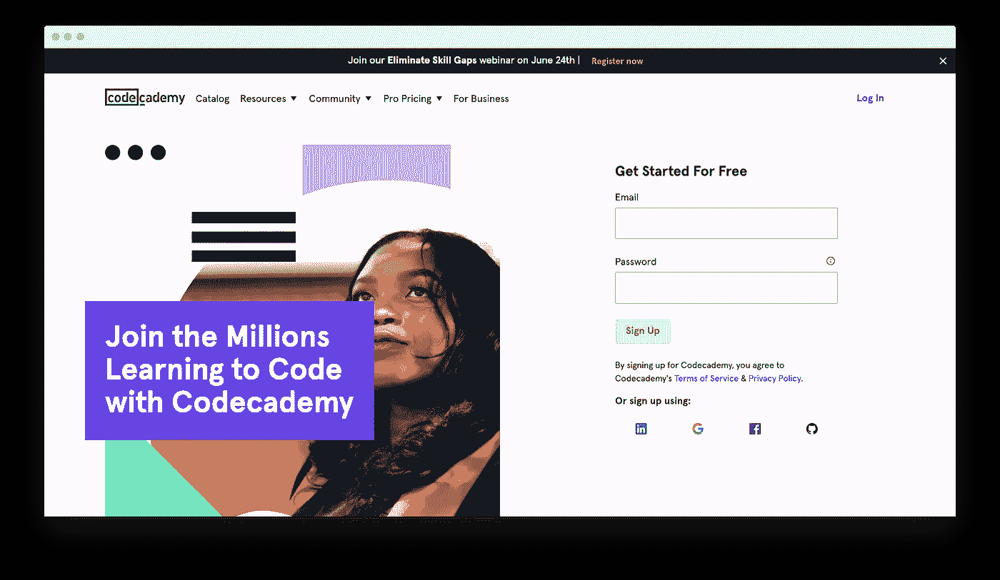

# 在线学习计算机编程的 10 个最佳网站

> 原文：<https://levelup.gitconnected.com/10-best-websites-to-learn-computer-programming-online-a1bfa8151f4c>

世界上开发人员的数量正在增长，并将继续增长:现在大约有[2400 万](https://www.statista.com/statistics/627312/worldwide-developer-population/)，预计到 2024 年将有 2870 万开发人员。这使得加入程序员大家庭的决定是明智和恰当的。

但是你打算从哪种编程语言开始呢？你可以在一个大型社区中学习 Java、Python、C++或其他语言——非常适合初学者。例如，Java 已经得到了广泛的应用和全球的欢迎，大约有[760 万](https://slashdata-website-cms.s3.amazonaws.com/sample_reports/EiWEyM5bfZe1Kug_.pdf)软件开发者。除此之外，Java 是最流行的[主流编程语言](https://insights.stackoverflow.com/survey/2020)。

一旦你选择了一门语言，最重要的一步就是选择一个学习平台。有声望的、可靠的和值得信赖的人。下面是你可以学习编程的 11 个最好的网站。这个列表是根据相对容易的学习，教学方法和可靠性编制的。

# [CodeGym](https://codegym.cc/)

教授的语言: Java

初学者的绝佳选择。CodeGym 的关键优势在于它成功地将理论和实践结合起来。它也是名单上唯一一个专门学习一种语言——Java——的平台，这使得它更专注于在一个领域取得高成就。

*   CodeGym 提供基于实践的学习，有超过 500 个学习小时和超过 1200 个不同复杂程度的任务。
*   它提供了一种游戏化的学习方法。学生在解决问题上取得进步，并因此获得奖励。作为一个有趣的额外津贴，奖励是在暗物质中计算的。
*   你会得到一个虚拟导师，他会检查你的代码，并为你的学习过程提供一些建议。
*   CodeGym 不仅仅是学习；它还提供了对全球超过 50 万 Java 学生的 Java 社区的访问。这个选项是免费的，全面学习每月花费 49 美元。

# [开放课件](https://ocw.mit.edu/)

教授的语言: C++，Java，MATLAB，Python

开放式课程是麻省理工学院(MIT)的一个在线学习平台。开放式课程已经有 20 多年的历史了，麻省理工学院的大部分课程都可以在这里找到。麻省理工学院开放式课程提供超过 2500 门课程的大学程度的编程材料。有些是免费的，但好书应该付费。

*   该平台有一个巨大的不同课程库，你可以在搜索中使用关键字找到所需的课程。
*   它提供许多学术水平的课程:例如，“电子前沿的伦理学”
*   还有很多比较简单的课程，像《Java:初级》。
*   你也可以享受音频和视频讲座和播客。它们是免费的，但是你可以捐赠。

# [斯坦福](https://online.stanford.edu/free-courses)

**所教语言:** R，Python，C，C++，MATLAB，Java，JavaScript

斯坦福大学因其在扩展教育方面的举措而闻名。几年前，早在新冠肺炎和全球封锁之前，该大学就推出了在线平台。斯坦福免费在线课程和麻省理工学院有相似之处。他们的课程涵盖几种编程语言。

*   内容主要是免费的，尽管有些证书是付费的。
*   该平台为软件工程师提供关于最新技术、复杂主题和上层问题的高质量课程。
*   你可以在这里找到关于人工智能和机器学习的讲座。

在注册该平台上的课程之前，请检查可用性和必要的背景。有些课程需要基础知识，不太适合新手。

你会发现有免费和付费的课程。后者的价格取决于题材和入门水平。

# [EDX](https://www.edx.org/)

教授的语言: Python，C，C++，Java，JavaScript

EDX 大学提供广泛学科的在线大学课程，包括计算机和数据科学、工程和设计。该平台不专注于某一特定主题；它的收藏几乎涵盖了所有的学术领域和主题，其中有一套很好的软件开发课程。

*   关于 EDX 的课程既提供理论又提供实践。
*   教授确保所提供信息的相关性。

EDX 有免费和付费的在线课程。例如，“Java 编程入门”课程的价格是 149 美元，并且可以无限制地访问课程材料。

# [复数视线](https://www.pluralsight.com/)

**教授语言:** JavaScript、C#、Python、C++、Ruby、Java

Pluralsight 是一个面向开发者的学习平台。Pluralsight 为软件开发人员提供课程、技能评估和实践实验室。

*   这些信息由行业专家提供，对于初学者来说是一个不错的选择。
*   该平台为每门课程提供了理论和实践的良好结合，并为不同水平提供了广泛的课程。

您可以免费开始培训，或者分别为标准版和高级版支付 19.99 美元和 29.99 美元。在这里你还可以获得可分享的证书来证明你的技能。

# [代码学院](https://www.codecademy.com/)

**所教语言:** Python、JavaScript、Java、SQL、Ruby、C++、PHP、Go、Swift、Kotlin

Codecademy 也是一个学习平台，专注于软件开发人员的课程。但是，内容不仅限于课程。

*   该平台包含大量关于软件工程不同主题的文章。
*   如果你使用一个排序选项，选择你想练习的领域，它会建议一组博客、文章和学习课程。

价格是每月 19.9 美元，如果你支付年费，价格还会更低。

# [Coursera](https://www.coursera.org/)

教授的语言: Python，Java，Scala，PHP，C，C++，C#，Kotlin

Coursera 是一个全球可用的学习平台，可能是在线学生中最知名的。

*   Coursera 提供由大学教授开设的各种课程。
*   它将自己定位为一个学习平台，任何人都可以在这里接受学术教育。
*   你可以在课程作者列表中找到牛津、斯坦福等大学的大名。

该平台提供灵活的价格政策。他们收取的价格取决于你的要求。如果你只想听讲座，大部分课程都是免费的。然而，如果你想要一些个人关注，例如，检查你的作业，你应该付费。可共享证书也是有代价的。

# [领英学习](https://www.linkedin.com/learning/me)

**所教语言:** Python，C，C++，C#，SQL，Rust，Java

LinkedIn Learning，也称为 Lynda，拥有你可能想要的任何职业道路的课程，并拥有来自现实生活导师的资源。在著名职业网络 LinkedIn 收购 Lynda 之前，Lynda 作为一个成功的在线学习平台已经存在了 20 年。

*   学生在 LinkedIn learning 上获得的所有证书都可以在个人资料中找到。
*   对于正在寻找新工作的人来说，这似乎是一个不错的选择。
*   LinkedIn functional 的 Premial access 和在线课程是申请人的完美组合。

现在在线学习是 LinkedIn 高级套餐的一部分。你可以以每月 30 美元的价格购买访问权限，或者以更低的价格购买年费。

# [Udemy](https://www.udemy.com/)

**教授语言:** Python，C++，C#，Java，JavaScript

Udemy 是另一个很棒的教育平台，它收集了不同的课程。它是最大的编码资源中心之一。

*   从来不缺少课程，因为任何专家都可以开发个人学习课程，提交给 Udemy 并通过该平台销售。
*   有一个风险是你可以买到一个差的课程，这个课程不小心通过了审核。然而，针对初学者的课程，比如“*开始 C++编程——从初学者到超越*”，通常都很好，因为它们不需要入门级的专业知识。
*   他们提供清晰易懂的课程和讲座。

任何人都可以在 Udemy 上上传课程，因此需要研究和阅读评论。

该平台上的一些课程作为特殊选项免费提供，但通常价格为每门课程 9.99 美元起。

# [Packt](https://www.packtpub.com/)

**所教语言:** Python，C#，C++，Java，JavaScript

Packt 是一个面向专业开发人员的在线图书馆。

*   如果你查看目录，你会发现数以千计的视频、书籍和电子书，主题各异，包括编程。
*   该平台不提供在线练习，所以练习是站在用户一边的。所以，PackT 是那些喜欢通过书本和讲座进行老式学习的人的最佳选择。
*   他们每天 24 小时免费打开一本随机的书。

PackT 提供免费试用，订阅每月 9.99 美元起。

# 结论

世界已经数字化了，每个人都在跟着数字化前进。在线学习不仅是可能的，而且对许多人来说更可取，计算机编程是你足不出户就能轻松精通的领域！许多在线课堂被带到我们面前，使在线学习变得可靠和省时。有了广泛的在线学习资料选择，你可以找到提供你所需要的课程，并取得最佳效果。

# 分级编码

感谢您成为我们社区的一员！[订阅我们的 YouTube 频道](https://www.youtube.com/channel/UC3v9kBR_ab4UHXXdknz8Fbg?sub_confirmation=1)或者加入 [**Skilled.dev 编码面试课程**](https://skilled.dev/) 。

 [## 编码面试课程+登陆你的开发工作

### 掌握编码面试的过程

技术开发](https://skilled.dev)