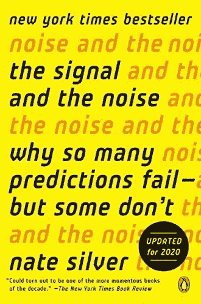
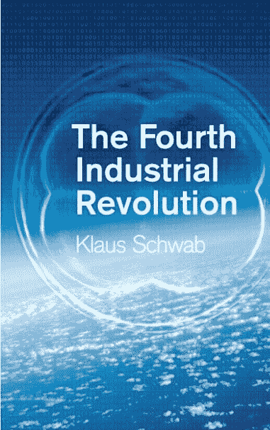

# 作为机器学习研究人员，10 本书将拓宽你的视野

> 原文：<https://levelup.gitconnected.com/10-books-that-will-broaden-your-horizons-as-a-machine-learning-researcher-b5689247376d>

作为一名机器学习研究人员，不断扩展您对该领域的知识和理解，以及我们所处的更广阔的世界，这很重要。做到这一点的一个方法是阅读挑战你的假设并帮助你从新的角度看待事物的书籍。在本文中，我们描述了 10 本书，它们可以帮助您扩展您的世界观，并更深入地了解世界和数据科学行业。

## 1.丹尼尔·卡内曼的《思考，快与慢》

这本书由一位诺贝尔经济学奖得主撰写，探索了我们大脑处理信息和做出决策的方式。它凸显了我们思维的局限性和偏见，并教会我们如何做出更理性的选择。通过一系列引人入胜的例子和实验，卡尼曼展示了我们的思维是如何有缺陷的，以及我们如何才能改善我们的决策。他讨论了框架、启发和认知偏差等概念，并就如何克服这些心理陷阱提供了见解。这本书是任何对大脑如何工作以及如何做出更好的决定感兴趣的人的必读之作。

## 2.内特·西尔弗的《信号与噪音》

在本书中，Silver 讨论了概率和预测在各种领域中的作用，包括金融、政治和体育。他向我们展示了如何批判性地思考我们遇到的数据，并基于这些数据做出更好的预测。Silver 认为，我们经常太快地得出结论，并根据不充分或有偏见的数据做出预测，他提供了避免这些陷阱的策略。他还讨论了随机性和不确定性在预测中的作用，以及如何在决策中考虑这些因素。

## 3.大卫·斯皮格尔哈特的《统计学的艺术》

这本书提供了一个统计概念和方法的广泛介绍，并帮助读者理解如何统计可以用来通知决策。它涵盖了抽样、概率和统计模型等主题，并说明了这些概念如何应用于现实世界的情况。Spiegelhalter 以清晰易懂的风格写作，使这本书适合初学者和更有经验的读者。他还讨论了统计分析的伦理含义和理解统计方法的局限性的重要性。

## 4.《大数据:一场将改变我们生活、工作和思维方式的革命》，作者:维克托·迈尔·舍恩伯格和肯尼斯·库基尔

这本书探讨了大数据对社会的影响，以及它带来的机遇和挑战。它讨论了数据如何改变行业，以及如何使用数据来解决问题和做出更好的决策。作者研究了收集、分析和使用数据的方式，并考虑了这些变化对隐私、安全和民主的影响。他们还讨论了大数据的局限性以及考虑其使用环境的重要性。

## 5.托马斯·库恩的《科学革命的结构》

在这部经典著作中，库恩讨论了科学进步的本质和范式转变在塑造我们对世界的理解中的作用。他认为，当现有理论无法解释新的观察结果时，科学革命就会发生，从而导致新的框架和思维方式的发展。库恩讨论了科学发现的过程以及社会和文化因素对科学发现的影响。这本书发人深省地审视了科学发现的过程，以及我们对世界的理解随着时间的推移而变化的方式。这是任何对知识的本质及其发展方式感兴趣的人的必读之作。库恩的思想对哲学、社会学和科学史领域产生了深远的影响，这本书继续受到广泛的讨论和辩论。

## 6.克劳斯·施瓦布的“第四次工业革命”

在本书中，施瓦布讨论了新技术改变社会和全球经济的方式。他探讨了这些变化对行业、政府和个人的潜在影响，并就如何驾驭这一快速发展的格局提出了见解。Schwab 讨论了人工智能、物联网和机器人等技术，并考虑了它们将如何塑造工作、教育和社会的未来。他还讨论了这些技术的伦理和社会影响，以及我们如何确保它们用于造福人类。

## 7.克莱顿·M·克里斯坦森的《创新者的困境》

在本书中，克里斯滕森讨论了公司如何通过采用颠覆性技术和商业模式来保持领先地位。他提供了一个框架来理解公司如何和为什么失败，以及如何避免常见的陷阱。克里斯滕森认为，公司往往无法适应新技术和新市场，因为它们过于专注于现有的客户和商业模式。他提供了识别和拥抱颠覆性技术的策略，以及应对颠覆性挑战的策略。这本书是任何对创新和在快速变化的世界中保持竞争力的挑战感兴趣的人的必读之作。

## 8.纳西姆·尼古拉斯·塔勒布的《黑天鹅》

这本书探讨了罕见和不可预测的事件在塑造历史和我们对世界的理解中的作用。它促使我们思考我们知识的局限性和我们行为的后果。塔勒布认为，我们经常被意想不到的事件弄得措手不及，我们理解世界的模型和框架往往过于狭隘，无法解释这些事件。他提供了关于如何预测和准备这些“黑天鹅”的见解，以及如何更批判性地思考我们信念背后的假设。这本书发人深省地审视了不确定性和不可预测性在我们生活中的作用。

## 9.马尔科姆·格拉德威尔的《引爆点》

在这本书里，格拉德威尔研究了社会流行病的现象以及它们是如何传播的。他讨论了小变化如何产生大影响，以及看似微不足道的事件如何导致社会的重大转变。Gladwell 认为，有一些特定的因素可以导致一个想法、产品或行为“倾斜”并广泛传播，他通过一系列案例研究确定了这些因素。他提供了关于如何创造和维持社会流行病的见解，以及如何思考思想和行为传播的方式。这本书引人入胜地审视了塑造社会变革的力量。

## 10.詹姆斯·苏洛维耶茨基的《群体的智慧》

这本书探索了集体智慧的力量，以及团体做出比个人更好的决定的方法。它提供了关于如何挖掘群众智慧和如何避免常见陷阱的见解。Surowiecki 讨论了一系列群体在决策方面胜过专家的例子，他指出了促成群体智慧的因素。他还讨论了集体智慧的局限性以及集体智慧最有可能发挥作用的情况。这本书是任何对群体动力的力量和利用集体智慧的方法感兴趣的人的必读之作。

这 10 本书提供了关于数据、统计、技术和我们所处的更广阔世界的各种观点。通过阅读它们，你可以对这个领域及其带来的挑战和机遇有更深的理解，并形成更细致入微、更见多识广的世界观。

# 分级编码

感谢您成为我们社区的一员！在你离开之前:

*   👏为故事鼓掌，跟着作者走👉
*   📰查看[级编码出版物](https://levelup.gitconnected.com/?utm_source=pub&utm_medium=post)中的更多内容
*   💰免费编码面试课程[查看课程](https://skilled.dev/?utm_source=luc&utm_medium=article)
*   🔔关注我们:[Twitter](https://twitter.com/gitconnected)|[LinkedIn](https://www.linkedin.com/company/gitconnected)|[时事通讯](https://newsletter.levelup.dev)

🚀👉 [**加入升级达人集体，找到一份惊艳的工作**](https://jobs.levelup.dev/talent/welcome?referral=true)