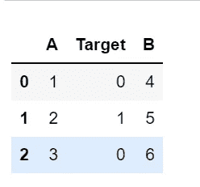
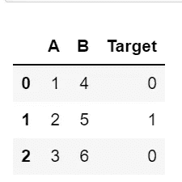
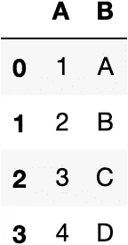
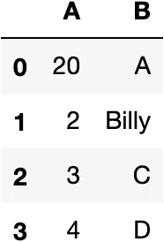
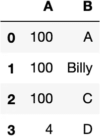
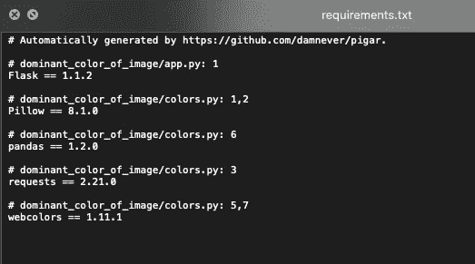
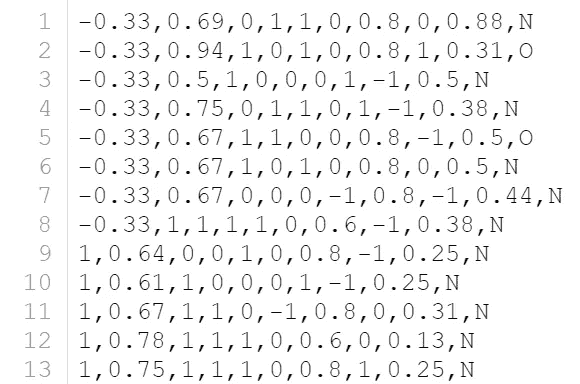
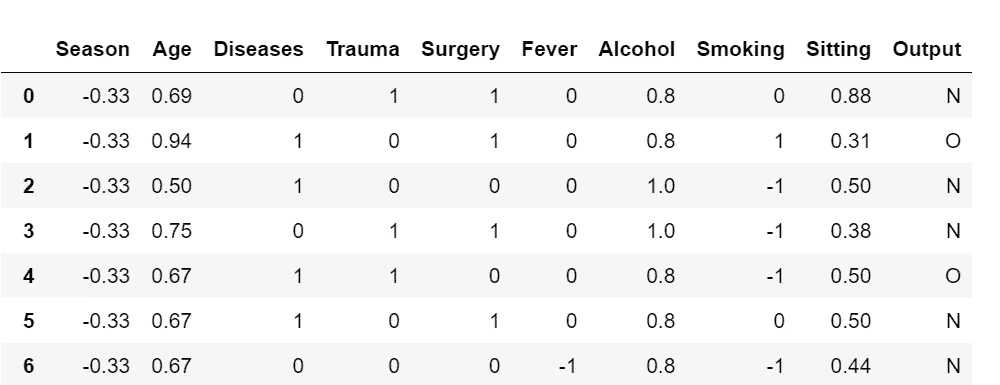
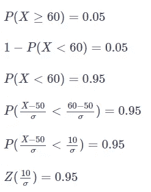
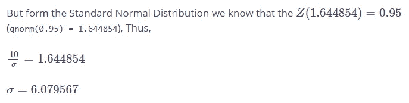

# 数据科学家的 10 个编码技巧

> 原文：<https://levelup.gitconnected.com/10-coding-tips-for-data-scientists-d44eead56407>

## Python 和 R 中 10 个有用的代码片段技巧

[](https://jorgepit-14189.medium.com/membership) [## 用我的推荐链接加入媒体-乔治皮皮斯

### 阅读乔治·皮皮斯(以及媒体上成千上万的其他作家)的每一个故事。您的会员费直接支持…

jorgepit-14189.medium.com](https://jorgepit-14189.medium.com/membership) 

我们已经开始为数据科学家撰写一系列关于技巧和诀窍的文章(主要在 **Python** 和 **R** )。如果你错过了:

*   [第一卷](https://predictivehacks.com/10-tips-and-tricks-for-data-scientists-vol-1/)
*   [第二卷](https://predictivehacks.com/10-tips-and-tricks-for-data-scientists-vol-2/)
*   [第三卷](https://predictivehacks.com/10-tips-and-tricks-for-data-scientists-vol-3/)
*   [第四卷](https://predictivehacks.com/10-tips-and-tricks-for-data-scientists-vol-4/)
*   [第五卷](https://predictivehacks.com/10-tips-and-tricks-for-data-scientists-vol-5/)
*   [第六卷](https://predictivehacks.com/10-tips-and-tricks-for-data-scientists-vol-6/)
*   [第七卷](https://predictivehacks.com/10-tips-and-tricks-for-data-scientists-vol-7/)
*   [第 8 卷](https://predictivehacks.com/tips-and-tricks-for-data-scientists-vol-8/)
*   [第九卷](https://predictivehacks.com/10-tips-and-tricks-for-data-scientists-vol-9/)

# 计算机编程语言

## 1.如何获取字典中最大值的关键字

```
d**=**{"a":3,"b":5,"c":2}(max(d, key**=**d.get))
```

我们得到:

```
b
```

## 2.如何按值对字典进行排序

假设我们有下面的字典，我们想按值对它进行排序(假设值是数字数据类型)。

```
d**=**{"a":3,"b":5,"c":2}# sort it by valuedict(sorted(d.items(), key**=lambda** item: item[1]))
```

我们得到:

```
{'c': 2, 'a': 3, 'b': 5}
```

如果我们想按降序排序:

```
dict(sorted(d.items(), key**=lambda** item: item[1], reverse**=**True))
```

我们得到:

```
{'b': 5, 'a': 3, 'c': 2}
```

## 3.如何用熊猫打乱你的数据

通过对`fraction=1`进行采样，我们可以很容易地改变我们的 pandas 数据帧，实质上我们获得了所有行的采样，而没有替换。代码:

```
**import** pandas as pd# assume that the df is your Data Frame
df.sample(frac**=**1).reset_index(drop**=**True)
```

## 4.如何移动一列成为熊猫中的最后一列

有时，我们希望“目标”列是数据框中的最后一列。让我们看看如何在熊猫身上实现。假设我们有以下数据框:

```
**import** pandas as pddf **=** pd.DataFrame({'A':[1,2,3],
                   'Target':[0,1,0],
                   'B':[4,5,6]})df
```



现在，我们可以按如下方式重新索引这些列:

```
df **=** df.reindex(columns **=** [col **for** col **in** df.columns **if** col !**=** 'Target'] **+** ['Target'])df
```



## 5.如何在 Python 中循环移位列表

我们可以对 numpy 数组使用`roll`方法。它还支持两个方向和 n 步。例如:

```
**import** numpyx**=**numpy.arange(1,6)
numpy.roll(x,1)
```

我们得到:

```
array([5, 1, 2, 3, 4])
```

或者，如果我们想后退两步:

```
x**=**numpy.arange(1,6)numpy.roll(x,**-**2)
```

我们得到:

```
array([3, 4, 5, 1, 2])
```

## 6.基于熊猫数据框架中的索引替换值

您可以通过指定列和索引来轻松替换 pandas 数据框中的值。

```
**import** pandas as pd
**import** dataframe_image as dfidf **=** pd.DataFrame({'A': [1,2,3,4],
                   'B':['A','B','C','D']})
```



有了上面的数据框，我们将替换它的一些值。我们用的是熊猫的 **loc** 功能。第一个变量是我们要替换的值的索引，第二个变量是它的列。

```
df.loc[0,"A"]**=**20df.loc[1,"B"]**=**"Billy"
```



**loc** 方法还允许您设置一系列要替换的索引，如下所示。

```
df.loc[0:2,"A"]**=**100
```



## 7.如何在没有环境的情况下为您的 Python 项目生成 Requirements.txt

当我在进行一个新的 python 项目时，我只想在一个新的文件夹中打开 jupyter 笔记本并开始工作。项目完成后，有时我们必须创建一个 requirements.txt 文件，其中包含我们在项目中使用的所有库，以便我们可以共享它或在服务器上部署它。

这很烦人，因为我们必须创建一个环境，然后重新安装我们使用过的库，这样我们才能为这个项目生成需求文件。

幸运的是，有一个名为 [PIGAR](https://pypi.org/project/pigar/) 的包可以自动为你的项目生成需求文件，而不需要任何新的环境。

装置

```
pip install pigar
```

让我们用它来做一个项目。您可以克隆[主色](https://github.com/BillyBonaros/dominant_color_of_image) repo 并删除它的需求文件。然后，打开您的终端，打开项目文件夹，运行以下命令:

```
pigar
```

就这么简单。您应该会看到生成了一个新的 requirements.txt 文件，其中包含了用于项目的库。



## 8.如何生成随机名称

当我们生成随机数据时，有时需要生成随机名称，如全名、名和姓。我们可以通过 [names](https://pypi.org/project/names/) 库来实现这一点。还可以指定名字的性别。让我们看一些例子:

例如:

```
pip install names**import** namesnames.get_full_name()'Clarissa Turner'names.get_full_name(gender**=**'male')'Christopher Keller'names.get_first_name()'Donald'names.get_first_name(gender**=**'female')'Diane'names.get_last_name()'Beauchamp'
```

## 9.如何用熊猫指定列名

有时我们得到没有标题的文件名。让我们看看如何通过指定没有任何标题和定义列名来用 pandas 读取 csv 文件。我们将使用从 IC Irvine 获得的[生育率](https://archive.ics.uci.edu/ml/datasets/Fertility)数据集。

txt 文件如下所示:



如你所见，这里没有标题。我们用熊猫来读吧:

```
**import** pandas as pdheaders **=** ['Season', 'Age', 'Diseases', 'Trauma', 'Surgery', 'Fever', 'Alcohol', 'Smoking', 'Sitting', 'Output']fertility **=** pd.read_csv('data/fertility_diagnosis.txt', delimiter**=**',', header**=**None, names**=**headers)fertility
```



# 稀有

## 10.如何估计正态分布的标准差

在数据科学家职位的面试过程中，您可能会遇到这类问题。所以问题可以是这样的:

**问题**:假设一个过程服从正态分布，均值****50**，我们观察到**超过值 60 的概率** **为 5%** 。分布的标准差是多少？**

****解决方案****

********

**因此**标准偏差为 6.079567** 。我们可以通过在 R 中运行模拟来估计正态(50，6.079567)超过值 60 的概率，从而确认这一点:**

```
set.seed(5)sims<-rnorm(10000000, 50, 6.079567 )sum(sims>=60)/length(sims)
```

**我们得到:**

```
[1] 0.0500667
```

**正如所料，我们的进程超过值 60 的估计概率是 **5%。****

**最初发布于[预测黑客](https://predictivehacks.com/10-tips-and-tricks-for-data-scientists-vol-10/)**