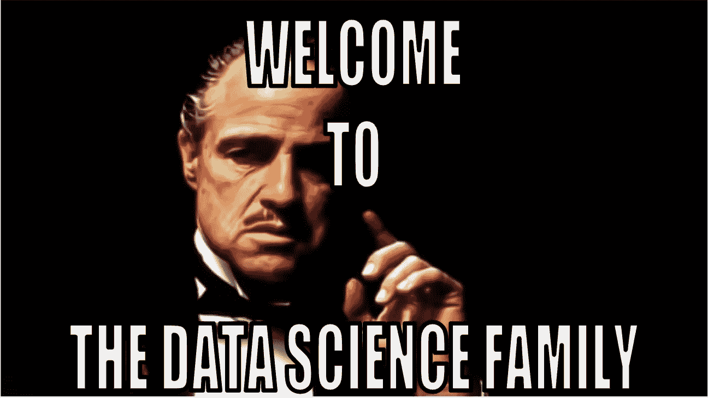
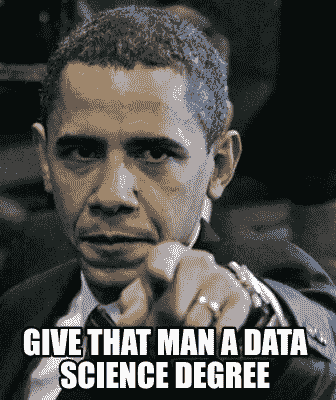

# 10 个很酷的数据科学项目创意

> 原文：<https://levelup.gitconnected.com/10-cool-data-science-project-ideas-for-2020-3779aeca8811>

## 是时候提升你的知识、技能和自信了

作为一名有抱负的数据科学家，从事数据科学个人项目是你职业生涯中非常重要的一部分。项目将提升您的数据科学知识、技能和信心。在简历中展示你的项目将有助于你获得一份数据科学的工作。下面我分享了 2020 年十大数据科学项目创意。

# **假新闻检测**

假新闻就是虚假信息。在这个数据科学项目中，我们可以使用 Python 建立一个模型，可以对一条新闻进行真假分类。要实现这个项目，您应该非常清楚假新闻、TfidfVectorizer、PassiveAggressiveClassifier 和 Python 库 pandas、numpy 和 sklearn 等术语。

*语言:Python*

*数据集/包:news.csv*

*源代码:* [*假新闻检测&其他项目源代码*](https://data-flair.training/blogs/advanced-python-project-detecting-fake-news/) *。*

# **聊天机器人**

聊天机器人是有抱负的数据科学家中最著名的项目之一，在商业中发挥着重要作用。聊天机器人是用来用更少的人力为客户提供更好的服务的。它使用深度学习技术与客户进行交互，你可以很容易地用 Python 实现这个项目。有两种类型的聊天机器人:第一种是特定领域的，可以解决特定问题；第二种是开放领域的聊天机器人，可以问任何类型的问题，因此需要大量的数据来训练。

*语言:Python*

*数据集:意向 JSON 文件*

*源代码:* [*聊天机器人与 Python*](https://dzone.com/articles/python-chatbot-project-build-your-first-python-pro)

# **信用卡欺诈检测**

信用卡诈骗激增。这个项目的目标是建立一个分类器。该分类器将检测卡交易是否真实。在这个项目中，使用了各种机器学习算法来区分非欺诈交易和欺诈交易。此外，通过这个项目的工作，你将获得如何为分类制作机器学习算法的知识。

*语言:R 或 Python*

*数据集:这里使用信用卡交易的数据作为数据集。*

*源代码:* [*用机器学习检测信用卡诈骗*](https://data-flair.training/blogs/data-science-machine-learning-project-credit-card-fraud-detection/)

# **驾驶员睡意检测**

我们已经看到了许多由于司机困倦而发生的事故。一个神志不清的司机对他自己和他人都是非常危险的。这就是为什么引入了这个 Python 项目。该项目将检测出昏昏沉沉的司机，并通过发出哔哔声来提醒他们。这个 Python 项目是基于深度学习模型的。该模型将评估驾驶员的眼睛是闭着还是睁着。此外，对于这个项目的工作，一个摄像头是必需的。

*语言:Python*

*软件包:OpenCV，Tensorflow，Pygane，Keras*

*源代码:* [*带 OpenCV 的驾驶员睡意检测系统& Keras*](https://data-flair.training/blogs/python-project-driver-drowsiness-detection-system/)

# **语音情感识别**

SER 是语音情感识别的首字母缩写，是一个非常引人注目的 Python 项目。这个项目试图从语音中感知人类的情感。在该项目中，您将学习如何构建 MLP 分类器。这个分类器将能够从人的声音中看出情绪。此外，为了观察人类情感，不同的声音文件被用作数据集。除此之外，通过参与这个项目，你将积累用于分析音乐和音频的 Librosa 包中的知识。

*语言:Python*

*数据集:RAVDESS*

*软件包:Librosa，Soundfile，NumPy，Sklearn，Pyaudio*

*源代码:* [*语音情感识别用 librosa*](https://data-flair.training/blogs/python-mini-project-speech-emotion-recognition/)

# **乳腺癌分类**

如果你想精通机器学习和深度学习，那么就去做这个 Python 项目吧。你会在深度神经网络、卷积神经网络、递归神经网络、深度信念网络等方面变得有经验。除此之外，您还将熟悉 Keras 库。在该项目中，将制作一个分类器。该分类器将 80%用图像数据集训练，其余用于验证。

语言:Python

*数据集:IDC(浸润性导管癌)*

*包:NumPy，OpenCV，Pillow，Tensorflow，Keras，Imutils，Scikit，Matplotlib*

*源代码:* [*乳腺癌分类与深度学习*](https://data-flair.training/blogs/project-in-python-breast-cancer-classification/)

# **电影推荐系统**

电影推荐系统是一个 R 项目，它将使你在机器学习中增长技能。基本上，它是一个推荐系统，根据用户的浏览历史和偏好向用户提供不同的建议。推荐系统有两种类型——协同过滤推荐和基于内容的推荐系统。这个项目是一个协同过滤推荐系统。这种类型的推荐系统将基于可能观看具有相同偏好的电影的其他人的浏览历史来推荐电影。

*语言:R*

*数据集:电影镜头*

*软件包:推荐器 lab，ggplot2，data.table，整形 2*

*源代码:* [*电影推荐系统项目在 R*](https://data-flair.training/blogs/data-science-r-movie-recommendation/)

# **情感分析项目**

几乎每个数据驱动的组织都在使用情感分析模型来确定其客户对公司产品的态度。如果你全神贯注于机器学习，并想提升你的技能，那么这个项目将非常适合你。这个 R 项目就是基于分类的。

情感分析是对一段文本中表达的观点进行计算识别和分类的过程，尤其是为了确定消费者对特定产品或主题的态度是积极、消极还是中立。

语言:R

*数据集:janeaustenR*

*包装:Tidytext*

*源代码:* [*情感分析项目*](https://data-flair.training/blogs/data-science-r-sentiment-analysis-project/)

# **客户细分**

客户细分是一项基础工程，也是无监督学习最重要的练习之一。公司使用聚类过程来发现具有相似行为的人群。他们这样做是为了瞄准潜在的用户群。通过参与这个项目，你将成为 K 均值聚类的伙伴。K-means 聚类是聚类无标记数据集的最佳方法。在客户细分的帮助下，公司更好地了解他们的客户和他们的需求。在这方面，与人口统计、经济状况、地理和行为模式相关的数据非常重要。

语言:R

*源代码:* [*利用机器学习进行客户细分*](https://data-flair.training/blogs/r-data-science-project-customer-segmentation/)

# **性别和年龄检测**

为了提升您在计算机视觉方面的技能，您可以锁定性别和年龄检测 python 项目。该项目将建立一个模型，通过人脸的单一图像识别一个人的年龄和性别。然而，由于化妆、面部表情、光线等诸多因素，年龄和性别无法准确检测。这就是为什么这种检测是作为分类而不是回归问题来处理的。

*语言:Python*

*数据集:Adience*

*软件包:OpenCV*

*源代码:* [*性别和年龄检测用 OpenCV*](https://data-flair.training/blogs/python-project-gender-age-detection/)

# 结论

我们讨论的项目是 2020 年你可以做的一些最好的数据科学项目。如果你对 Python 和 R 有很好的了解，那么做一个数据科学项目并不是一件难事。“你不必一开始就变得伟大，但你必须开始变得伟大”

 [## 掌握编码问题| Skilled.dev

### 一个完整的平台，在这里我会教你找到下一份工作所需的一切，以及…

技术开发](https://skilled.dev)