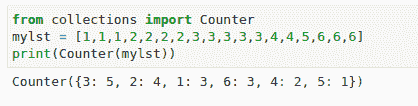
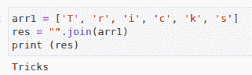
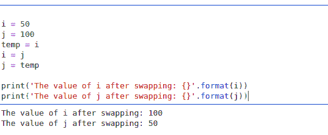
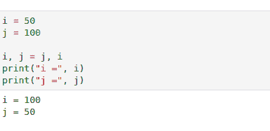
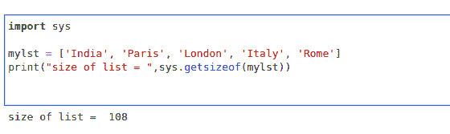
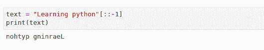
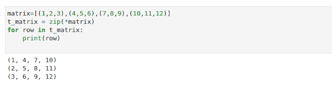
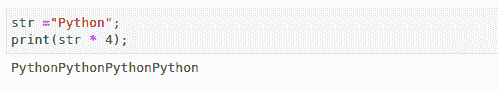
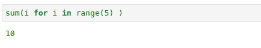
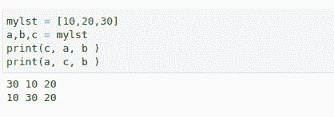

# 程序员的 10 个很酷的 Python 编码技巧

> 原文：<https://levelup.gitconnected.com/10-cool-python-coding-tricks-for-programmers-1ae08f66d36c>

## 在函数中使用生成器，使用计数器，去掉冗余项等等

布雷特·乔丹在 [Unsplash](https://unsplash.com?utm_source=medium&utm_medium=referral) 上的照片

Python 的简单性和易学性使得它在最近几年相当受欢迎。它可以用于很多事情，包括 web 开发、自动化、脚本和数据科学。

本文是为那些可以使用这些 python 技巧来简化编码体验的程序员准备的。

# **1。使用计数器计数物体**

Python 集合模块包含这个 Counter()方法。这个函数允许我们计算一个可迭代列表中每个不同项的出现频率。这个函数将 iterable 中每个不同项的频率存储为一个键值对。Counter 函数需要一个可以迭代的列表作为输入，作为输出，它返回每个项目的频率。

> 密码

> **输出**

# **2。从列表中删除多余的项目**

在大多数情况下，我们希望从列表中删除或定位重复的项目。让我们来看看从列表中删除重复的项目。理想的策略是把一个列表变成一个集合。集合是一种无序的数据结构，只支持唯一值，禁止复制。

> 密码

> **输出**

# **3。连接字符串**

字符串连接现在比以前更简单。Python 的 join()方法可以用来连接字符串。为了让 join()方法将 iterable 的元素连接成一个字符串，我们必须为它提供一个 iterable。此外，可以指定分隔符来连接或串联字符串。

> **代码**

> **输出**

# 4.**交换号码:**

当谈到数据结构和算法时，交换是一个关键的想法。交换两个元素有不同的方法。我们将看到最困难和最容易的方法。

**正常方法:**在这种情况下，我们需要建立一个临时变量来临时存储数据，将另一个变量留空，这样我们就可以切换值。

> **代码**

> 输出

**通过诡计做同样的例子——**

> 密码

> 输出

# **5。计算对象使用的内存**

当使用任何数据结构来保存值或记录时，比如一个列表、字典或任何对象，Python 会计算对象使用了多少内存。

检查你的数据结构使用了多少内存是一个聪明的想法。使用 sys 模块中定义的函数 *sys.getsizeof，*获取内置对象使用的内存量。

以字节为单位的对象大小由 *sys.getsizeof(object[，default])返回。*

> **代号**

> **输出**

# **6。反转一根弦**

我向你保证，反转一根弦不会比这更容易。我们将采用字符串切片和负索引的简单思想。知道 Python 可以有负索引，我们就简单的切片，不指定起始或结束值；相反，我们只指定-1 的范围，这意味着它将从最后一个索引开始，并从那里反转。

> **代码**

> **输出**

# **7。转置矩阵**

当矩阵被转置时，列变成行。Python 程序员可以通过创建一个循环结构来遍历矩阵的元素并交换它们的位置来实现这一点，或者他们可以使用下面的代码，该代码使用 zip 函数和*运算符来解压缩一个列表并将其转换为原始矩阵的转置版本。

> **代码**

> **输出**

# 8。多次打印一个字符串

设计循环是任何编程语言中重复打印字符串的典型方法。然而，Python 中的 print 函数有一个简单的技巧，包含一个字符串和一个数字。

> **代码**

> **输出**

# 9。在函数中使用发生器

对于更短、更清晰的代码，我们可以直接在函数中使用生成器。在下面的例子中，我们通过传递一个生成器作为 sum 函数的唯一参数来确定总和。

> **代码**

> **输出**

# **10。以任意顺序打印列表元素**

如果需要以不同的顺序打印列表中的值，可以将列表分配给多个变量，并以编程方式决定打印顺序。

> 密码

> **输出**

# 结论

在这篇文章中，我们介绍了许多可以让你成为伟大程序员的 Python 技巧和诀窍。使用这些技巧，你将能够在更短的时间内完成复杂的程序。这些技术也可以在竞争性编程中使用，以创建更快、更节省内存的 python 代码。

> *在你走之前……*

如果你喜欢这篇文章，并希望**关注**更多关于 **Python &数据科学**的**精彩文章**——请点击这里[https://pranjalai.medium.com/membership](https://pranjalai.medium.com/membership)考虑成为一名中级会员。

请考虑使用 [**我的推荐链接**](https://pranjalai.medium.com/membership) 报名。通过这种方式，会员费的一部分归我，这激励我写更多关于 Python 和数据科学的令人兴奋的东西。

# 分级编码

感谢您成为我们社区的一员！在你离开之前:

*   👏为故事鼓掌，跟着作者走👉
*   📰查看更多内容请参见[升级编码刊物](https://levelup.gitconnected.com/?utm_source=pub&utm_medium=post)
*   🔔关注我们:[Twitter](https://twitter.com/gitconnected)|[LinkedIn](https://www.linkedin.com/company/gitconnected)|[时事通讯](https://newsletter.levelup.dev)

🚀👉 [**加入升级人才集体，找到一份神奇的工作**](https://jobs.levelup.dev/talent/welcome?referral=true)