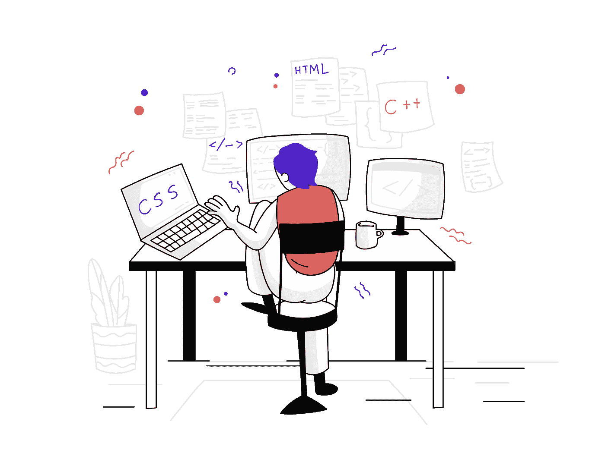
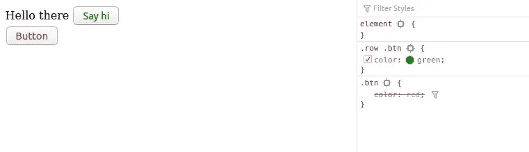
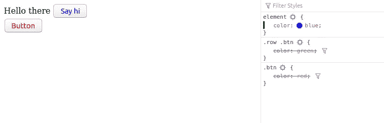
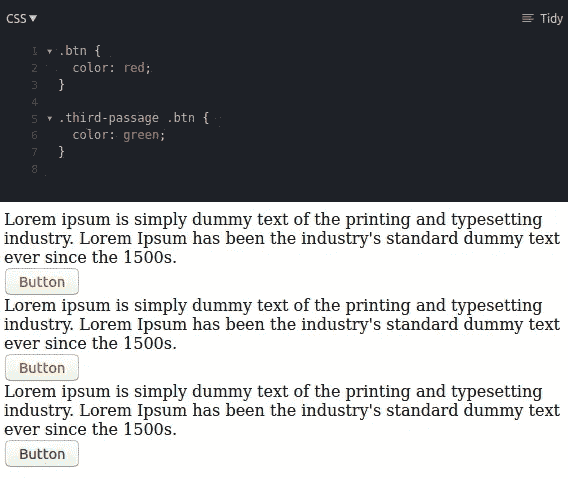
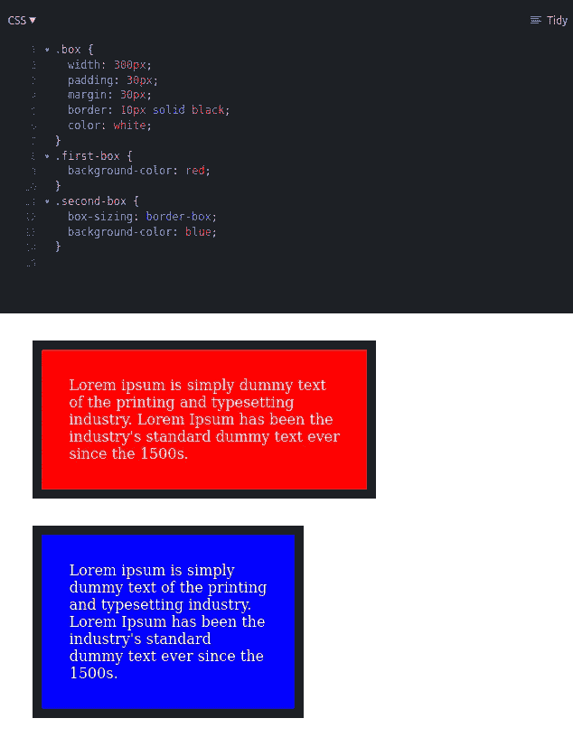
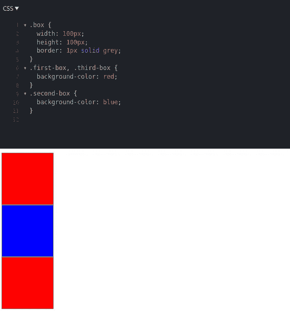
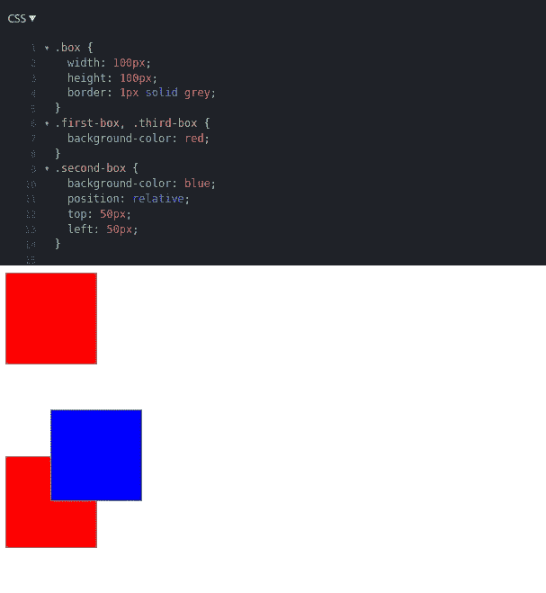
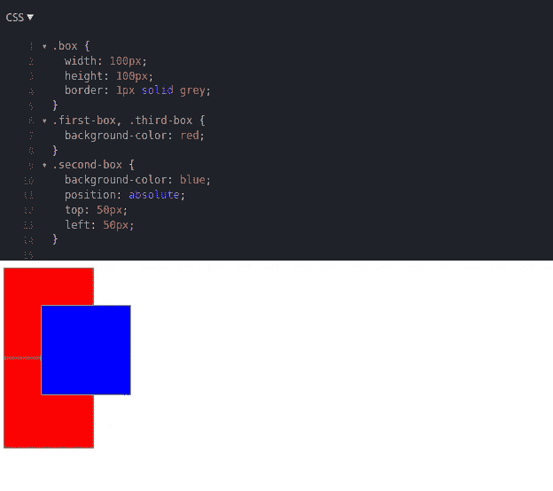
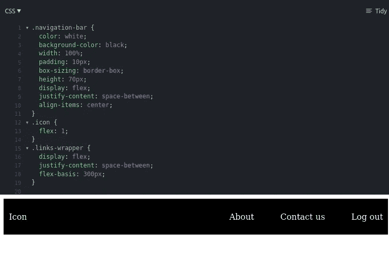

# 我希望自己在初学者时就知道的 10 件 CSS 事情

> 原文：<https://levelup.gitconnected.com/10-css-things-i-wish-i-knew-when-i-was-a-beginner-68ba4b5b3da8>

## 技术

在前端开发的最初几天，在 JavaScript(及其框架)提供的所有复杂问题和解决方案之间，许多程序员倾向于低估 CSS 在网站中的作用。

原因很简单——基本的 CSS 很容易掌握，你遇到的大部分障碍——你都可以在栈溢出中找到解决方案。然而，如果最初的方法有缺陷，CSS 问题会变得乏味，还会导致表现不佳的网站破坏用户体验。



来自 [pixeltrue](https://www.pixeltrue.com/free-illustrations) 的插图

基于我从错误中学到的东西，这里有一些我希望在开始开发网站时就知道的事情。这个列表是根据学习曲线和适应性来排序的——简单的东西会排在最前面。

# 1.浏览器开发工具

这听起来可能很简单，但是当涉及到样式时，我们倾向于使用开发工具。

## 调试得更好

CSS 样式在一个复杂的网站中会被多次忽略，特别是在不同的地方重复使用类名的时候。在搜索代码试图找出为什么按钮的颜色不是红色之前，先检查一下。它会节省你很多调试的时间。



检查过时的样式

## 动态创新

Dev Tools 还允许您动态更新样式。想知道它穿蓝色会是什么样子吗？嗯，没必要再怀疑了。



来自开发工具的替代样式

**注意** —要打开开发工具，只需右键单击页面上的任意位置，并选择 **Inspect Element** 并浏览其杰出的实用程序列表。

# 2.包装器和可重用类

这种做法，如果遵循，将有助于你在未来几年收获其好处。应用程序开发从开始到结束都需要时间，没有设计会停留在开始时的状态。

然而，为了保持一致性，无论如何，核心组件在不同的页面上看起来都是一样的。

## 重用类

确定在整个应用程序中重复使用的组件(例如，按钮、模态、页眉、页脚等)。)并先为他们写文体。在任何你需要的地方重用这些类，这样即使设计改变了，你也需要在你的代码中调整最少的行数。这样，您可以确保您的代码经得起时间的考验。

## 缠绕以覆盖

可能会有这样的情况，你需要在你的一个核心组件中改变一些东西，仅仅是为了一个特定的页面。在这种情况下，请使用包装类。



包装器和可重用类

# 3.属性—框大小

`box-sizing`决定如何计算元素的`height`和`width`。其中比较有用的是`border-box`，考虑`content`、`padding`、`border-width`计算一个元素的`width`。一个例子可能有助于澄清困惑。



框大小的一个例子:边框

默认情况下，`box-sizing`值设置为`content-box`——在上述`first-box`的情况下，确保上下文宽度设置为`300px`。但是对于`second-box`，`border-box`保证了`content-width + padding + border = 300px`。当我们不想让`padding`干扰元素的定义`width`时，这是非常有用的。

# 4.移动优先的方法

起初这可能看起来有点琐碎，但在大计划中证明是有用的，并且如果变成实践，很容易适应。现在，移动兼容性在每个网页设计师的清单上越来越重要，开发者有两个选择——首先是**桌面**和**移动优先**。

让我先解释一下区别——

```
// desktop first
.btn {
   padding: 10px;
}
@media only screen and (max-width: 768px) {
   padding: 5px;
}// mobile first
.btn {
   padding: 5px;
}
@media only screen and (min-width: 768px) {
   padding: 10px;
}
```

这两种方法的输出完全相同。

然而，在*桌面优先*方法中，对于一个**移动**设备，它将首先加载公共 CSS，然后在查看媒体查询后覆盖那些样式。但是对于台式机来说，它根本不需要考虑媒体查询，节省了一些性能时间。但是，与台式机相比，这一次对手机更有帮助，因为台式机通常配置更好。
这就是为什么，建议从一开始就遵循*移动优先*的方法，尽管在编码时以桌面优先是可以理解的诱惑。

# 5.！重要不重要

标签在开始时可能看起来非常有用。作为一名新的开发人员，每当我面临任何挑战时，我都会使用它，一切都神奇地工作了。标签本质上是告诉浏览器不要让这一行代码被覆盖。

然而，在大多数情况下，你会希望它在不久的将来被超越，超越一个`!important`的唯一方法是使用另一个。很快，你的样式表就会被`!important`填充，这将阻止你重用你的样式。不要使用通配符，试着找出为什么该样式没有被应用。

当**真的** **重要的时候**使用`!important`标签。

# 6.定位—绝对和相对

`absolute`和`relative`定位的概念很模糊，即使对于有经验的开发者来说也是如此。然而，如果你知道如何使用它，它是一个非常有用的工具。
`absolute`相对于父元素的位置定位元素。
`relative`相对于元素自身的当前位置定位元素。

举个例子可能有助于澄清事实。

默认情况下，位置设置为`static` —



位置:静态

当我们设置为`relative`时，不影响整体布局。当它从`top`和`left`移动`50px`时，在它曾经占据的空间留下了一个白色的缺口



位置:相对

当我们设置为`absolute`时，影响整体布局。它曾经占据的空间现在已经没有了。我发现这在创建弹出窗口和工具提示时非常有用



位置:绝对

# 7.过渡和转变

过渡让用户体验更好。它们美丽而优雅，但只有在正确的情况下。

让我们以一个进度条为例。随着数据的输入，它应该从 0 到 100。这可以通过操作属性`width`来实现，但是这将导致布局偏移，并可能导致糟糕的用户体验。然而，使用`transform`和`scaleX`，可以实现类似的东西，这将最小化性能成本。

如需了解更多详情，您可以查看本课程，该课程解释了[浏览器渲染优化](https://classroom.udacity.com/courses/ud860)的注意事项。

# 8.Flex-box 和 CSS 网格

这是两个非常有用的工具，在显示包装在一个公共父对象下的一系列子对象时非常流行。

由于两者涵盖了非常相似的用例(如居中元素、导航栏、照片库)，这取决于开发人员更喜欢哪一个。为了更加清晰，我将尝试演示使用`flex-box`(我更喜欢这个)来构建一个非常简单的导航栏是多么容易

## 导航栏

顶部导航栏通常在左侧有一个品牌图标，在右侧有一系列链接。



带 flex 的导航栏

有很多课程可以帮助你理解 **flex-box** 和 **CSS grid** 。然而，我发现韦斯·博斯的以下课程真的很有帮助，希望你也能如此——

**Flex-box** 课程—[https://Flex box . io](https://flexbox.io/)
**CSS Grid**课程— [https://cssgrid.io](https://cssgrid.io/)

# 9.从你喜欢的项目中逐步淘汰引导程序

## 这将会引起争议

像 Bootstrap 这样的 CSS 库在你是初学者的时候超级有用。Bootstrap 真的很容易使用，输出(通常)符合我们的期望。给一个按钮添加一个类，它就变成一个华丽的蓝色按钮，在`hover`、`active`等处有颜色过渡。太棒了。

但是，对我来说，交易的破坏者是—

1.  定制真的很难。超越默认风格是一种痛苦。
2.  它附带了很多东西，在一个典型的宠物项目中，我连一半都没用过。

我宁愿建议你为你的项目编写自己的风格，而不是依赖于一个框架。这会帮助你学习和探索更多。

# 10.厚颜无耻

CSS 很乏味，很快就会变得很无聊。一旦你了解了 CSS 的基础知识，就不要再等着加入 SASS 了。

## 萨斯让 CSS 变得有趣

你可以用 SASS 做很多事情，这将使你的生活变得简单——比如变量、嵌套语法、混合等等。开始在你的项目中使用 SASS，它将帮助你更快地设计风格。

查看这个[备忘单](https://medium.com/@ankitachakraborty/the-useful-sass-features-in-a-nutshell-sass-cheatsheet-c5767340d43b)，了解 SASS 提供的所有特性。

所以，就这样了。这些都是我能想到的，我希望我是新手的时候就知道。谢谢你一直以来对我的包容。希望这篇文章对你有用。

当你在这里的时候，你也可以看看我的其他几篇文章

*   [10 种现代 JavaScript 语法帮助你更快编码](/10-modern-javascript-syntax-to-help-you-code-faster-82cc0a5a3960)
*   [Flexbox 终极指南](/how-to-flex-a-beginners-guide-904c3edc2fdc)

干杯！

# 参考

【https://www . mightyminnow . com/2013/11/what-is-mobile-first-CSS-and-why-it-rock
https://uxengineer.com/css-specificity-avoid-important-css
[https://medium . com/@ leanne Zhang/difference-between-CSS-position-absolute-vs-relative-35f 064384 C6](https://medium.com/@leannezhang/difference-between-css-position-absolute-versus-relative-35f064384c6)

# 分级编码

感谢您成为我们社区的一员！[订阅我们的 YouTube 频道](https://www.youtube.com/channel/UC3v9kBR_ab4UHXXdknz8Fbg?sub_confirmation=1)或者加入 [**Skilled.dev 编码面试课程**](https://skilled.dev/) 。

[](https://skilled.dev) [## 编写面试问题+获得开发工作

### 掌握编码面试的过程

技术开发](https://skilled.dev)