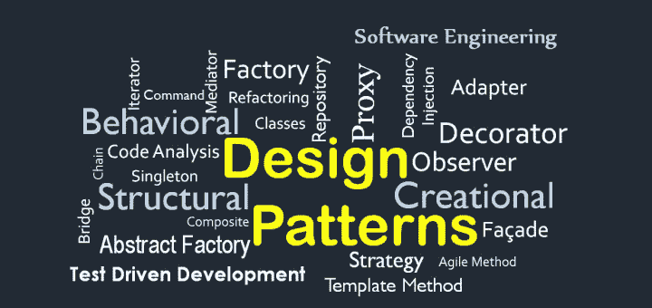

# 5 分钟 10 个设计模式

> 原文：<https://levelup.gitconnected.com/10-design-patterns-in-5-minutes-a8643b1e1b1>



# 1.一个

Singleton 是一种创造性的设计模式，它确保同类中只有一个对象存在，并为任何其他代码提供对它的单点访问。

```
 class Singleton {
  private static instance: Singleton;
  private constructor() {}
  static getInstance() {
    if (!Singleton.instance) {
      Singleton.instance = new Singleton();
    }
    return Singleton.instance;
  }
}
let e = new Singleton(); // Error: constructor of 'Singleton' is private.
let v = Singleton.getInstance();
```

# 2.原型

**Prototype** 是一种创造性的设计模式，它允许克隆对象，甚至是复杂的对象，而无需耦合到它们特定的类。

```
// prototype object monster with attack method
const monster = {
  attack() {
    return "attack!!!";
  },
};

const ghost = Object.create(monster, { name: { value: "ghost" } });

console.log(ghost); // { name: 'ghost' }
console.log(ghost.attack()); // attack!!!
```

# 3.建设者

**Builder** 是一个创造性的设计模式，它允许一步一步地构建复杂的对象。

```
 class Burger {
  bun: string;
  meat: string;
  cheese: string;

  constructor() {}
  addBun(bun) {
    this.bun = bun;
    return this;
  }
  addMeat(meat) {
    this.meat = meat;
    return this;
  }
  addCheese(cheese) {
    this.cheese = cheese;
    return this;
  }
}

const tomBurger = new Burger();
tomBurger.addBun("sesame").addMeat("beef").addCheese("cheddar");
```

# 4.**立面**

**Facade** 是一种结构设计**模式**，它为复杂的类、库或框架系统提供了一个简化的(但有限的)接口。

```
class ElectricalSystem {
  turnOn() {
    console.log("ElectricalSystem turn on");
  }
  turnOff() {
    console.log("ElectricalSystem turn off");
  }
}

class WaterSystem {
  turnOn() {
    console.log("WaterSystem turn on");
  }
  turnOff() {
    console.log("WaterSystem turn off");
  }
}

class FacadeHome {
  electricalSystem: ElectricalSystem;
  waterSystem: WaterSystem;

  constructor() {
    this.electricalSystem = new ElectricalSystem();
    this.waterSystem = new WaterSystem();
  }

  turnOn() {
    this.electricalSystem.turnOn();
    this.waterSystem.turnOn();
  }

  turnOff() {
    this.electricalSystem.turnOff();
    this.waterSystem.turnOff();
  }
}

const facadeHome = new FacadeHome();
facadeHome.turnOn();
facadeHome.turnOff();
```

# 5.**代理**

**代理**是一种结构设计**模式**，它提供一个对象，作为客户端使用的真实服务对象的替代品。

```
class User {
  constructor(public name: string, public age: number) {}
}

class UserProxy {
  private user: User;

  constructor(user: User) {
    this.user = user;
  }

  get name() {
    return this.user.name;
  }

  get age() {
    return this.user.age;
  }
}

const user = new User("Tom", 18);
const userProxy = new UserProxy(user);
console.log(userProxy.name); // Tom
console.log(userProxy.age); // 18
```

# 6.**迭代器**

**迭代器**是一种行为设计**模式**，它允许在不暴露内部细节的情况下顺序遍历复杂的数据结构。

```
function* range(start: number, end: number, step: number = 1) {
  while (start < end) {
 yield start;
 start += step;
  }
}

for (const i of range(0, 10, 2)) {
  console.log(i); 
}
// output: 0, 2, 4, 6, 8

class IteratorClass {
  private index: number = 0;
  constructor(private items: any[]) {}

  next() {
    return this.items[this.index++];
  }

  hasNext() {
    return this.index < this.items.length;
  }
}

const iteratorObject = new IteratorClass([1, 2, 3, 4, 5]);
while (iteratorObject.hasNext()) {
  console.log(iteratorObject.next());
}
// output: 1, 2, 3, 4, 5
```

# 7.观察者

观察者是一种行为设计模式，允许一些对象通知其他对象它们状态的变化。

```
class Subject {
  private observers: Observer[] = [];

  constructor() {}

  subscribe(observer: Observer) {
    this.observers.push(observer);
  }

  unsubscribe(observer: Observer) {
    const index = this.observers.indexOf(observer);
    this.observers.splice(index, 1);
  }

  notify() {
    this.observers.forEach((observer) => observer.update());
  }
}

class Observer {
  constructor(private name: string) {}

  update() {
    console.log(`${this.name} has been notified`);
  }
}

const subject = new Subject();
const observer1 = new Observer("observer1");

subject.subscribe(observer1);
subject.notify(); // observer1 has been notified
subject.unsubscribe(observer1);
```

# 8.**调解员**

中介器是一种行为设计模式，它通过一个特殊的中介器对象使程序组件间接通信，从而减少程序组件之间的耦合。

```
class Mediator {
  private users: User[] = [];

  constructor() {}

  addUser(user: User) {
    this.users.push(user);
  }

  sendMessage(user: User, message: string) {
    this.users.forEach((u) => {
      if (u !== user) {
        u.receiveMessage(message);
      }
    });
  }
}

class User {
  constructor(private name: string, private mediator: Mediator) {
    this.mediator.addUser(this);
  }

  sendMessage(message: string) {
    this.mediator.sendMessage(this, message);
  }

  receiveMessage(message: string) {
    console.log(`${this.name} received message: ${message}`);
  }
}

const mediator = new Mediator();
const user1 = new User("user1", mediator);
const user2 = new User("user2", mediator);
const user3 = new User("user3", mediator);

user1.sendMessage("hello");
// user2 received message: hello
// user3 received message: hello
user2.sendMessage("hi");
// user1 received message: hi
// user3 received message: hi
user3.sendMessage("how are you?");
// user1 received message: how are you?
// user2 received message: how are you?
```

# 9.**状态**

**状态**是一种行为设计模式，当对象的内部状态改变时，它允许对象改变其行为。

```
class Person {
  private state: State;

  constructor() {}

  think() {
    this.state.think();
  }

  setState(state: State) {
    this.state = state;
  }
}

interface State {
  think(): void;
}

class FastState implements State {
  think() {
    console.log("think fast");
  }
}

class SlowState implements State {
  think() {
    console.log("think slow");
  }
}

const person = new Person();
person.setState(new FastState());
person.think(); // think fast
person.setState(new SlowState());
person.think(); // think slow
```

# 10.工厂

**工厂方法**是一种创造性的设计模式，它解决了在不指定具体类的情况下创建产品对象的问题。

```
 class BurgerFactory {
  static createBurger(type: string) {
    switch (type) {
      case "cheese":
        return new CheeseBurger();
      case "veggie":
        return new VeggieBurger();
      default:
        throw new Error("No such burger");
    }
  }
}

class CheeseBurger {
  constructor() {
    console.log("Cheese burger");
  }
}

class VeggieBurger {
  constructor() {
    console.log("Veggie burger");
  }
}

const cheeseBurger = BurgerFactory.createBurger("cheese");
const veggieBurger = BurgerFactory.createBurger("veggie");
```

# 结论

希望你学到了一些设计模式，肯定还有更多，所以看好这个空间！

**行动呼吁**

如果你觉得这个指南有帮助，请鼓掌并跟我来。通过[链接](https://medium.com/@caopengau/membership)加入 medium，在 medium 上访问我和所有其他优秀作家的所有优质文章。

# 分级编码

感谢您成为我们社区的一员！在你离开之前:

*   👏为故事鼓掌，跟着作者走👉
*   📰查看[升级编码出版物](https://levelup.gitconnected.com/?utm_source=pub&utm_medium=post)中的更多内容
*   🔔关注我们:[Twitter](https://twitter.com/gitconnected)|[LinkedIn](https://www.linkedin.com/company/gitconnected)|[时事通讯](https://newsletter.levelup.dev)

🚀👉 [**加入升级达人集体，找到一份惊艳的工作**](https://jobs.levelup.dev/talent/welcome?referral=true)