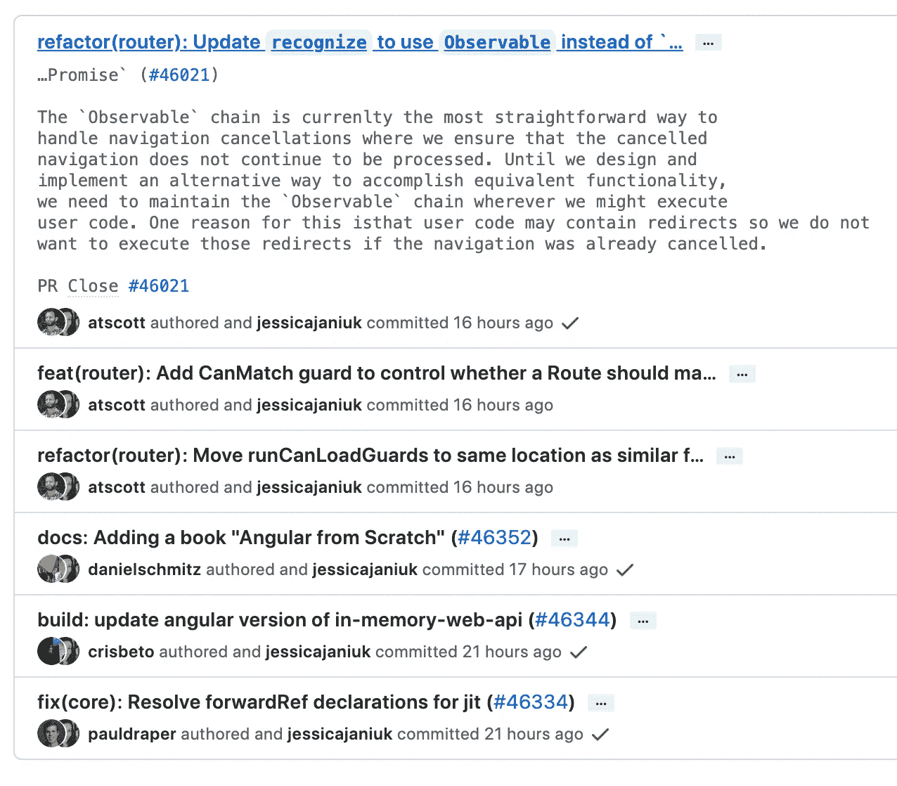

# 成为不可替代的程序员的 10 条简单规则

> 原文：<https://levelup.gitconnected.com/10-effortless-rules-to-be-an-irreplaceable-coder-be616af6bdce>


照片由[本·斯威特](https://unsplash.com/@benjaminsweet?utm_source=medium&utm_medium=referral)在 [Unsplash](https://unsplash.com?utm_source=medium&utm_medium=referral) 拍摄

我们都想成为不可替代的。这里有一些给编码员的规则。

# 1.总是重新发明轮子

遇到一些常见的软件问题，要尽量自己解决。最好是重新发明一个框架或库来解决这类问题，这样你就可以表明你是一个非常有天赋的程序员。

## 不良做法

试图从 GitHub、NPM 等社区中寻找成熟的解决方案。虽然这些众所周知的开源框架和库拥有良好的生态系统、丰富的用例以及一些最佳实践，但这并不酷。

# 2.随意命名变量

我们都渴望自由，在给变量命名时也应该如此。

我们应该这样命名这个变量:

```
*var a1 = "bytefish"**var b2 = 28**var c2 = true*
```

这样的命名约定不需要我们去思考。它简单、快速且易于使用。

## 不良做法

尝试为每个变量找到一个有意义的名称。

```
*var name = "bytefish"**var age = 28**var isMale = true*
```

# 3#永远不要使用任何版本控制工具

什么，还在用版本控制工具？伟大的程序员总是一次完成所有项目，不需要任何版本控制。

## 不良做法

尽量用一些 Git 之类的版本控制工具。

更糟糕的是，一些程序员甚至在提交提交消息时使用类似 Angular Commit Format Reference 的规范。这样做只会浪费你的时间，反而会让别人更容易理解你的代码，不利于你的不可替代性。



# 4 # Neveer 编写任何配置文件

永远不要写任何配置文件。我们可以编写所有的配置，如数据库地址、帐户、令牌等。，进入代码。这使得其他人无法快速找到关于您项目的重要信息。当你的队友试图改变这些数据时，他们只能来找你帮忙。

## 不良做法

将可配置信息放在单独的文件中，并区分开发和生产环境。


警告:不要在 JavaScript 项目中使用`[dotenv](https://www.npmjs.com/package/dotenv)`。

# 5#编写深度嵌套的语句

深度嵌套的代码通常难以理解。写更多更深层次的嵌套语句来证明自己的能力。

```
if (a) {
   …
  if (b) {
      …
    if (c) {
        …
        …
        …
    }
  }
}
```

## 不良做法

```
if (a) {
   return …
}
if (b) {
   return …
}
if (c) {
   return …
}
```

# 6#不要写评论

> 英雄所见略同

你的同事有义务理解你的代码。如果他们不能，那是他们的责任。

## 不良做法

以下是需要避免的事情。

*   注释不应与代码重复。
*   好的评论不能为不清楚的代码开脱。
*   如果写不出明确的注释，可能是代码有问题。
*   评论应该消除混乱，而不是引起混乱。
*   在注释中解释不通顺的代码。
*   提供复制代码的原始源代码的链接。
*   在最有用的地方加入外部参考的链接。
*   修复 bug 时添加注释。
*   使用注释来标记不完整的实现。

# 7#不要封装函数

千万不要考虑封装功能，每次遇到类似需求都要重新写业务逻辑。这样做可以让我们的代码更啰嗦，也可以向老板证明我们在努力写代码。

## 不良做法

这是一份完整的指南:

[](https://betterprogramming.pub/writing-high-order-functions-for-general-process-like-a-senior-javascript-developer-4d025baa3dc6) [## 像高级 JavaScript 开发人员一样为通用流程编写高阶函数

### 函数式编程的力量

better 编程. pub](https://betterprogramming.pub/writing-high-order-functions-for-general-process-like-a-senior-javascript-developer-4d025baa3dc6) 

# 8#使用制表符和空格来缩进

制表符对空格，2 个空格对 4 个空格。缩进的问题是编码人员社区中长期争论的话题。

要从这两个角度出发，您应该在项目的不同文件中分别使用这些规则。

## 不良做法

尝试在整个项目中使用统一的代码约定。甚至像 ESLint 和 Airbnb JavaScript 风格指南这样的工具

[](https://github.com/airbnb/javascript) [## GitHub-Airbnb/JavaScript:JavaScript 风格指南

### JavaScript 风格指南。通过在 GitHub 上创建帐户，为 airbnb/javascript 开发做出贡献。

github.com](https://github.com/airbnb/javascript) 

很繁琐，写代码也不自由，这是不好的做法。

# 9#在视图层中写入逻辑

虽然 MVC 是一种经典的软件开发思想，但是对于伟大的程序员来说，我们要善于打破常规，尽量把我们程序的执行逻辑写在视图层。

## 不良做法

从模板中提取业务逻辑。

然后在模板中渲染它:

# 10#永远不要考虑使用纯函数

> 纯函数**是一个返回值仅由其输入值决定的函数，没有可观察到的副作用**。

```
let oldNumber = 5;

function addNumber(newValue) {
  return oldNumber += newValue;
}addNumber(3)
```

当定义一个函数时，总是让函数依赖于上下文中的其他变量。这样会让别人很难理解你的功能并正确使用。

## 不良做法

写一个纯函数:

```
let num = 5;function add(oldNumber, newValue){
  return oldNumber + newValue
}num = add(num, 3);
```

# 结论

当然，如果你真的按照我提到的 10 条规则编写代码，你的代码将是不可读和不可维护的。

您可能会有两种结果:

*   写个屎山，那就没人(包括你自己)能重构优化你的代码了，你老板也不敢炒你了。
*   你现在马上被老板解雇了。