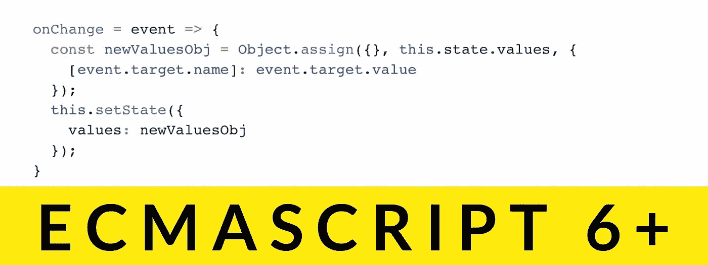

# 10 ES6+语法，用于编写优雅的 JavaScript 代码

> 原文：<https://levelup.gitconnected.com/10-es6-syntax-for-writing-elegant-javascript-code-84cd60b1e59a>



当 ECMAScript 发布新版本时，并不是所有的 JavaScript 开发人员都兴奋不已。期望不断地学习新的语法可能很烦人，但是为了更流畅的开发体验，这绝对是值得的。我很惊讶我周围有这么多开发者还没有尝试过 ES6，所以我在这里说服这些开发者采用新的语法。

ES6 (ES2015)的完整列表上有大量的文章和教程。在本文中，我将只重点介绍我经常使用的语法，并介绍 ES8 (ES2017)和 ES9 (ES2018)的一些有用的语法更新。

## 1)箭头功能(ES6)

箭头功能`()=>{}`节省了我们输入`function() {}`的时间，它让我们的文件看起来更整洁。

```
const numberOfMealsInThisWeek = [3, 2, 2, 0, 2, 1, 3];
const checkNumberEqualsThree = num **=>** num === 3;
const numberOfDaysWith3Meals = numberList **=>** numberList.filter(checkNumberEqualsThree).length;numberOfDaysWith3Meals(numberOfMealsInThisWeek);
// output: 2
```

然而，有一件事需要注意——当它是一个回调函数时，它不会 100%表现为`function() {}`。来自调用者的`this`按词法传递给箭头函数，而您必须在`function() {}`中绑定`this`。最常见的用例是 React 类组件中的事件处理函数:

```
// ES5: In your React class component *constructor()*
this.onChangeHandler = this.onChangeHandler.bind(this);// ES6: In your React class component *constructor()*
// you don't have to do anything special// ES5: In your React class component
// If you don't do .bind(this) in the constructor, it would not work
onChangeHandler(event) {
  this.setState({
    email: event.target.value
  })
}/* ES6: In your React class component
 * This will work perfectly without .bind(this) in the constructor
 * Beware that not only are we using ES6 arrow function here,
 * we are also using the stage-3 public class fields syntax
 * (READ: assigning something to a class field in a Class)
 * [https://github.com/tc39/proposal-class-fields](https://github.com/tc39/proposal-class-fields)
 */**onChangeHandler =** event **=>** {
  this.setState({
    email: event.target.value
  })
}// In your React class component *render()* with either ES6 or ES5
<input name="email" onChange={this.onChangeHandler} />
```

## 2)默认参数值(ES6)

如果您想调用带参数和不带参数的函数，这是非常方便的。

```
const hangryMode = (**food** **= 'sushi'**) => {
  console.log('I am so hangry!!! I want ' + food + '!!!');
}hangryMode();
// output: I am so hangry!!! I want sushi!!!hangryMode('fish and chips');
// output: I am so hangry!!! I want fish and chips!!!
```

## 3)模板文字:字符串插值(ES6)

这比字符串连接更具可读性。

```
const hangryMode = (food = 'sushi') => {
  console.log(**`**I am so hangry!!! I want **${food}**!!!**`**);
}hangryMode();
// output: I am so hangry!!! I want sushi!!!
```

您可以在文本中使用换行符，使其成为多行字符串，而无需键入`\n`！

```
const hangryMode = (food = 'sushi') => {
  const text = **`**I am so hangry!!!
I want **${food}**!!!**`;** console.log(text);
}hangryMode();
/* output: 
 * I am so hangry!!!
 * I want sushi!!!
 */
```

# 目标

## 4)销毁你的对象(ES6)

析构可以节省很多声明变量的代码。同样，您也可以对数组做同样的事情。

```
const travels = {
  Apr: 'London',
  May: 'Paris',
  June: 'Hong Kong'
}// destructuring them means assigning each value to variables with the name of its key within the scope you declare the below lineconst { Apr, May, June } = travels;
/* this creates 3 variables as in
 * const Apr = 'London'
 * const May = 'Paris'
 * const June = 'Hong Kong'
 */const travellingTo = (**{ Apr, May, June }**) => {
  console.log('Apr: ', Apr);
  console.log('May: ', May);
  console.log('June: ', June);
}travellingTo(travels);/* On your console, you should see
 * Apr: London
 * May: Paris
 * June: Hong Kong
 */
```

记住，当你在 arrow 函数中析构一个对象时，一定要传递它。您可能希望给参数一个默认值**以避免错误:**

```
const travellingTo = ({ Apr, May, June } **= {}**) => {
  console.log('Apr: ', Apr);
  console.log('May: ', May);
  console.log('June: ', June);
}
```

## 5)使用对象展开运算符(ES9)

在 ES6 中，您只能对数组或字符串使用 spread 运算符，但在 ES9 中，您可以对对象使用它。这对于析构一个对象的一部分，而将其余部分作为一个对象传递给函数，而没有被析构的键值对，是非常方便的。

```
const travels = {
  Apr: 'London',
  May: 'Paris',
  June: 'Hong Kong'
}const travellingTo = ({ Apr, **...otherMonths** }) => {
  console.log('Apr: ', Apr);
  console.log('otherMonths: ', otherMonths);
}travellingTo(travels);/* On your console, you should see
 * Apr: London
 * otherMonths: {
 *   May: 'Paris',
 *   June: 'Hong Kong'
 * }
 */
```

## 6) Object.values() (ES8)

如果您尝试过用一个对象的所有值创建一个数组，那么您就会知道这个内置方法有多好。

```
const travels = {
  Apr: 'London',
  May: 'Paris',
  June: 'Hong Kong'
}
const valuesOfTravels = Object.values(travels);console.log(valuesOfTravels);
// on your console, you should see:
// [‘London’, ‘Paris’, ‘Hong Kong’]
```

## 7) Object.entries() (ES8)

这是一个很好的数据处理方法。它创建一个包含所有键/值对的数组，这些键/值对被拆分成一个数组元组。

```
const travels = {
  Apr: 'London',
  May: 'Paris',
  June: 'Hong Kong'
}
const entriesOfTravels = Object.entries(travels);console.log(entriesOfTravels);
/* on your console, you should see:
 * [
 *   ['Apr', 'London'],
 *   ['May', 'Paris'],
 *   ['June', 'Hong Kong']
 * ]
 */
```

## 8)对象属性速记(ES6)

这是给我这种懒人的。记住它是区分大小写的。如果你有一个变量，它将在对象中用变量名创建一个`key`,这个键的`value`将是变量的值。

```
const apple = 10;
const orange = 2;
const lemon = 8;
const fruits = {
  **apple,
  orange,
  lemon**
}// it is same as declaring in this way:
const fruits: {
  apple: apple,
  orange: orange,
  lemon: lemon
}
// or
const fruits: {
  'apple': apple,
  'orange': orange,
  'lemon': lemon
}
```

## 9)对象属性分配(ES6)

这是一个简单的好方法，可以在不改变原始对象的情况下创建合并的对象。您设置了一个基本对象，并按顺序将其他对象合并到其中，如果键/值重叠，它们将被替换。

```
const squirrelBaby = {
  fluffy: true,
  size: 'small'
}
const squirrelBabyGirl = {
  gender: 'female',
  age: '0.1'
}
const thisLittleSquirrel = **Object.assign({}, squirrelBaby, squirrelBabyGirl);**/* thisLittleSquirrel = {
 *   fluffy: true,
 *   size: 'small',
 *   gender: 'female',
 *   age: '0.1'
 * }
 */
```

# 数组

## 10)带数组的 Rest 参数(ES6)

当您需要向函数中传递灵活数量的参数时，Rest 参数和数组就变得非常有用。rest 参数将参数放入一个数组中。

```
const sumOfAge = (...ageList) => {
  let sum = 0;
  ageList.forEach(age => sum += age);
  return sum;
}
sumOfAge(30, 21, 27, 19, 24);
// output: 121
```

# 异步ˌ非同步(asynchronous)

## 另外两个值得一提的语法更新

除了上面的语法，ES6 中还引入了原生的 **Promise** ，这也非常方便。值得单独写一篇长文。既然已经有很多很棒的文章了，我就不在这里赘述了。如果你有兴趣了解更多，我强烈推荐你阅读这个页面:

[](https://developer.mozilla.org/en-US/docs/Web/JavaScript/Reference/Global_Objects/Promise) [## 承诺

### Promise 对象表示异步操作的最终完成(或失败),及其结果…

developer.mozilla.org](https://developer.mozilla.org/en-US/docs/Web/JavaScript/Reference/Global_Objects/Promise) [](/understand-javascript-promises-by-building-a-promise-from-scratch-84c0fd855720) [## JavaScript 承诺——通过构建一个简单的承诺示例来理解 JavaScript 承诺

### 一步一步的教程，确保你完全理解 JavaScript 的承诺是如何工作的，从…

levelup.gitconnected.com](/understand-javascript-promises-by-building-a-promise-from-scratch-84c0fd855720) 

**迭代器和生成器**也在 ES6 中引入。然而，我并不觉得它们对日常工作太有用。它们大多用在库中处理异步调用，比如 [Redux-Saga](https://redux-saga.js.org/) 。如果你正在使用这些库，看看迭代器和生成器会很有帮助，否则你可能不需要学习它们。

[](https://developer.mozilla.org/en-US/docs/Web/JavaScript/Guide/Iterators_and_Generators) [## 迭代器和生成器

### 处理集合中的每一项是非常常见的操作。JavaScript 提供了多种方式…

developer.mozilla.org](https://developer.mozilla.org/en-US/docs/Web/JavaScript/Guide/Iterators_and_Generators) 

我希望这篇文章足够清晰，让你明白新语法是关于什么的。试着在你的代码中实现一些，看看你是否喜欢它们。

有关 ES6 功能的完整列表，请访问[https://github.com/lukehoban/es6features#readme](https://github.com/lukehoban/es6features#readme)
该报告包含所有功能的完整代码示例:)

喜欢这篇文章就关注我吧！
我一有时间就写前端 web 开发和编程。

[](https://gitconnected.com/learn/javascript) [## 学习 JavaScript -最佳 JavaScript 教程(2019) | gitconnected

### 50 大 JavaScript 教程-免费学习 JavaScript。课程由开发人员提交并投票，从而实现…

gitconnected.com](https://gitconnected.com/learn/javascript)