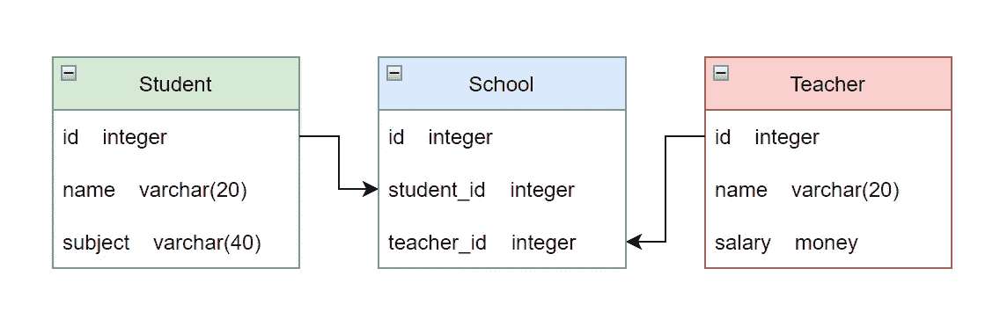

# 每个开发人员都必须知道的 10 个基本 SQL 概念

> 原文：<https://levelup.gitconnected.com/10-essential-sql-concepts-that-every-developer-must-know-c005fdad0761>

根据 [StackShare.io](https://stackshare.io/postgresql) 的数据，5912 家公司在其技术栈中使用 PostgreSQL，包括**优步、网飞、Spotify、**和 **Instagram** 。

如果您是一名软件开发人员，这些是您应该知道的一些基本 SQL 概念。

照片由 [Sunder Muthukumaran](https://unsplash.com/@sunder_2k25?utm_source=medium&utm_medium=referral) 在 [Unsplash](https://unsplash.com?utm_source=medium&utm_medium=referral) 上拍摄

# 1.酸性顺应性

这些数据库事务确保以下属性:

*   原子数
*   一致性
*   隔离
*   持久性

SQL 数据库是 ACID 兼容的。

点击此处了解更多关于酸性合规性的信息:

 [## 每个开发人员必须知道的 100 个基本系统设计概念(第 4 部分:31–40)

### 设计高效、容错和可扩展系统的首选清单

levelup.gitconnected.com](/100-essential-systems-design-concepts-that-every-developer-must-know-part-4-31-40-733d19958c37) 

# 2.数据库模式

它是数据库中数据结构的蓝图。

在 SQL 数据库中，它描述了数据在表中的结构以及它们之间的关系。

以表格形式组织的数据以及它们之间的关系(图片由作者提供)

[DB Designer](https://www.dbdesigner.net/)&[DB Diagram](https://dbdiagram.io/home)是两种流行的数据库模式设计工具。

# 3.主关键字

数据库表中的一列或多列唯一标识表中的每一行。

比如学校里某个学生的点名号。

指定为主键的列中的数据总是:

*   独一无二的
*   不能是`NULL`

在 PostgreSQL 中，创建新表时，主键可以定义如下:

如果您想为一个已经构建好的`students`表指定一个主键，其操作如下:

# 4.复合主键

当数据库表中的多个列作为主键时，就会创建一个复合主键。

这是因为没有一个列可以独立唯一地标识行中的数据。

例如，在包含歌曲数据的表中，可能有两首由不同艺术家创作的同名歌曲。

在这种情况下，`song_name`和`artist_name`都可以作为表的复合主键。

# 5.外键

外键引用另一个表中的列，并帮助定义两个表之间的关系。

`artist_id`是`songs`表中的外键。

这引用了`artists`表的主键`id`。

照片由 [Alp Duran](https://unsplash.com/es/@alpduran?utm_source=medium&utm_medium=referral) 在 [Unsplash](https://unsplash.com?utm_source=medium&utm_medium=referral) 上拍摄

# 6.信息图式

信息模式是由 [RDBMS](/100-essential-systems-design-concepts-that-every-developer-must-know-part-4-31-40-733d19958c37) 自动创建的一组视图，包含当前数据库中定义的对象的信息。

信息模式提供关于数据库中主键和外键的信息。可以通过以下方式访问它:

参照上面定义的`artists`表，它将显示:

*   `constraint_name`为`artists_pkey`
*   `table_name`为`artists`
*   `column_name`作`id`

在此阅读有关 PostgreSQL 信息模式的更多信息:

 [## 第三十七章。信息图式

### 信息模式由一组视图组成，这些视图包含有关在当前…

www.postgresql.org](https://www.postgresql.org/docs/current/information-schema.html)  [## 37.32.关键字 _ 列 _ 用途

### 视图 key_column_usage 标识当前数据库中受某个唯一的、主要的…

www.postgresql.org](https://www.postgresql.org/docs/current/infoschema-key-column-usage.html) 

# 7.数据库关系

数据库中的一个表可以以不同的方式连接到其他表。

*   **一对一关系**:一个表格的一行连接到另一个表格的一行。例如，用户和他的驾驶执照号码。
*   **一对多关系**:一个表格中的一行连接到另一个表格中的多行。例如，一个用户和他对脸书的评论。
*   **多对多关系**:一个表中的多行连接到另一个表中的多行。比如用户和他们租的 DVD

照片由[法比奥·布拉克特](https://unsplash.com/@bracht?utm_source=medium&utm_medium=referral)在 [Unsplash](https://unsplash.com?utm_source=medium&utm_medium=referral) 上拍摄

# 8.限制

这些规则规定了数据库的行和列中允许的值。

不同类型的约束可以是:

*   数据类型约束
*   `NOT NULL`约束
*   `UNIQUE`约束
*   主键约束
*   外键约束
*   `CHECK`约束条件

在此阅读有关约束的更多信息:

 [## 5.4.限制

### 数据类型是限制可以存储在表中的数据种类的一种方式。然而，对于许多应用来说…

www.postgresql.org](https://www.postgresql.org/docs/10/ddl-constraints.html) 

# 9.数据库索引

它是一种数据库结构，有助于在数据库上执行更快的搜索和过滤。

使用数据库索引的缺点是它会降低数据库的写入速度。

在 PostgreSQL 中，可以按如下方式创建列的数据库索引:

数据库索引可以通过以下方式可视化:

可以使用以下方法删除该索引:

# 10.数据库规范化

它是按照[范式](https://en.wikipedia.org/wiki/Database_normalization#Normal_forms)构建数据库的过程。

这减少了数据库冗余，消除了数据库异常(包括更新、插入和删除)，并确保了数据库的完整性。

如果一个关系数据库关系满足第三范式(3NF)，也就是说，如果所有的数据库列都[功能依赖于](https://en.wikipedia.org/wiki/Functional_dependency)唯一的[主键](https://en.wikipedia.org/wiki/Primary_key)，那么它通常被描述为“规范化的”。

由[活动创作者](https://unsplash.com/@campaign_creators?utm_source=medium&utm_medium=referral)在 [Unsplash](https://unsplash.com?utm_source=medium&utm_medium=referral) 上拍摄的照片

*感谢阅读本文！*

*如果你是 Python 或编程的新手，可以看看我的新书，书名为“* [**”《没有公牛**t 学习 Python 指南**](https://bamaniaashish.gumroad.com/l/python-book)**”***下面:*

 [## 学习 Python 的无牛指南

### 你是一个正在考虑学习编程却不知道从哪里开始的人吗？我有适合你的解决方案…

bamaniaashish.gumroad.com](https://bamaniaashish.gumroad.com/l/python-book)  [## 通过我的推荐链接加入 Medium——Ashish Bama nia 博士

### 阅读 Ashish Bamania 博士(以及 Medium 上成千上万的其他作家)的每一个故事。您的会员费直接…

bamania-ashish.medium.com](https://bamania-ashish.medium.com/membership)