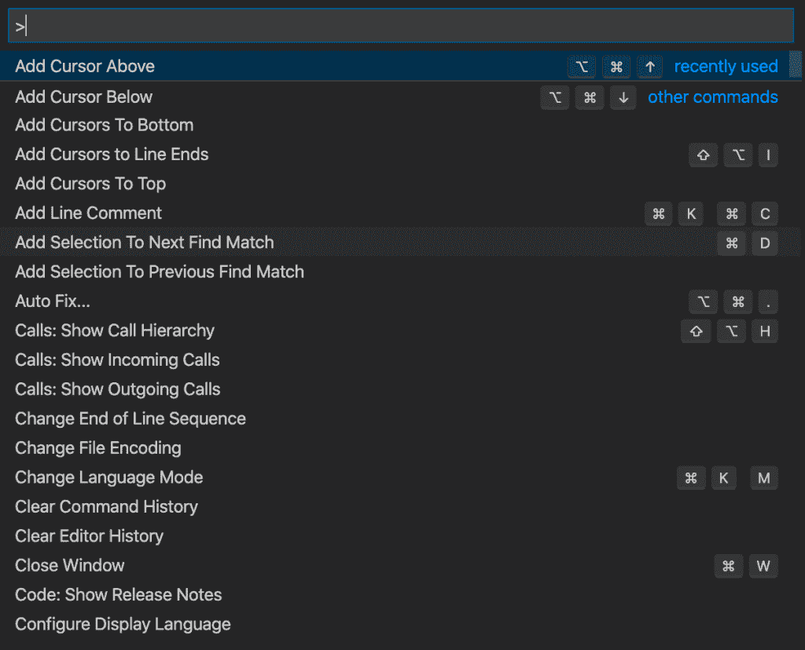
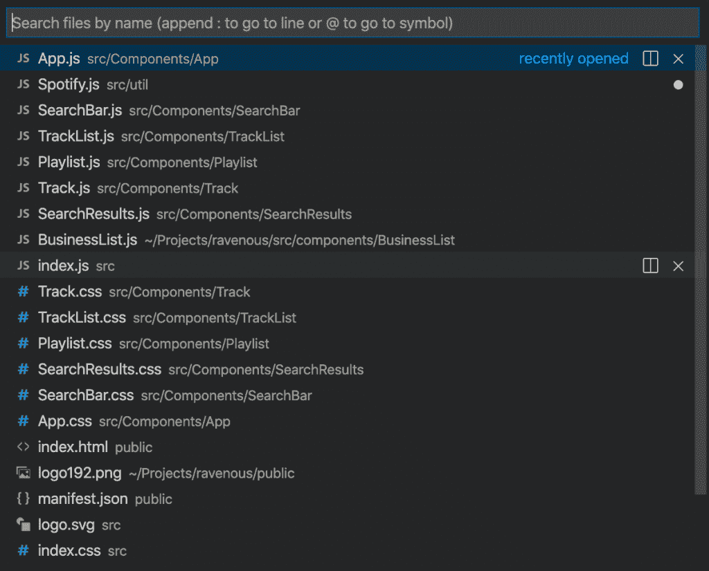
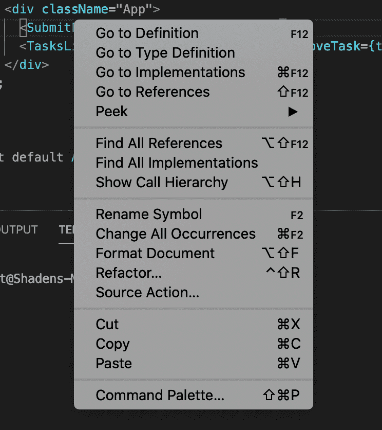
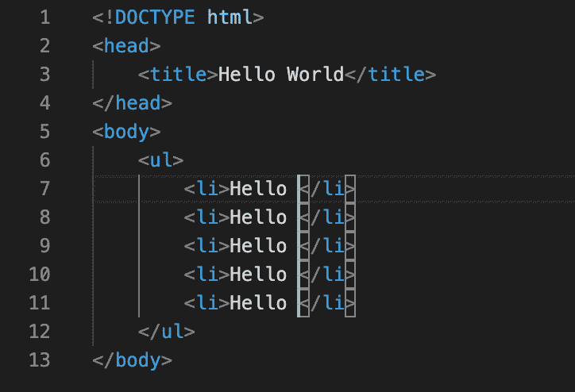
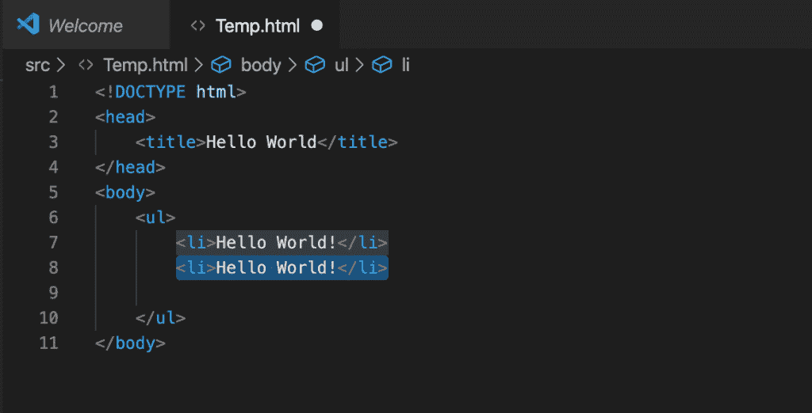
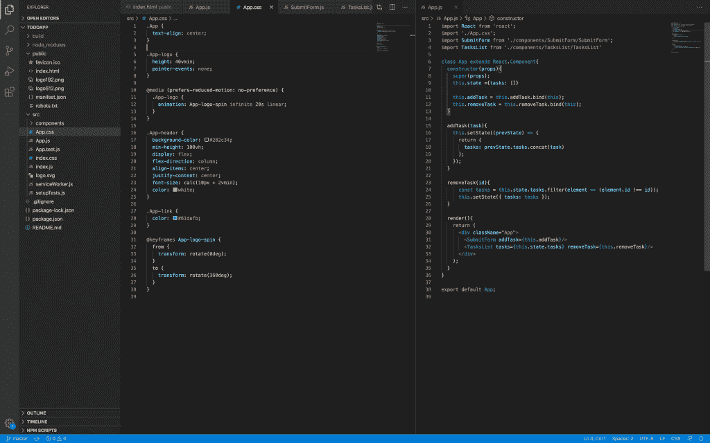
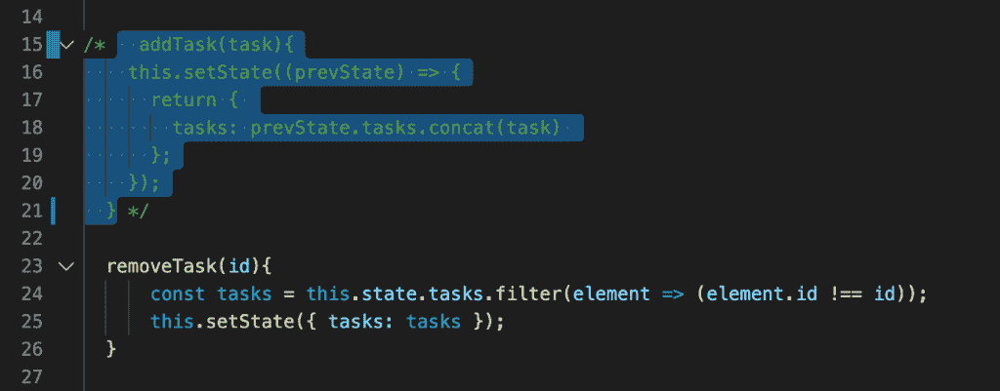
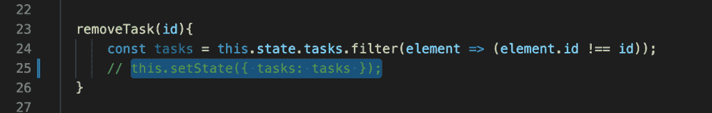
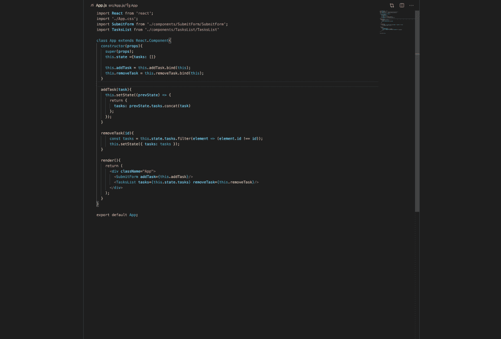
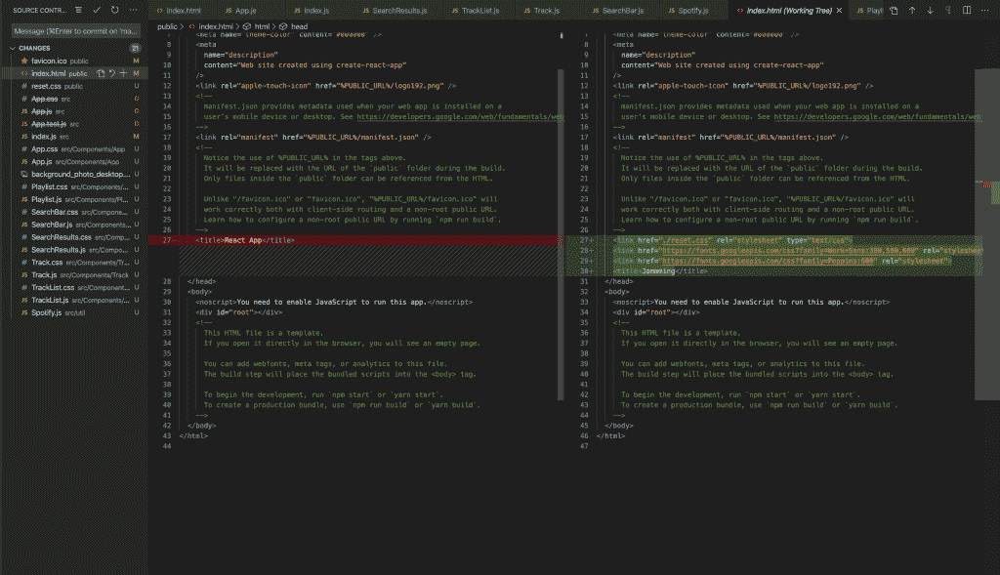

# 每个开发人员在 Visual Studio 代码中应该掌握的 10 个基本提示和技巧

> 原文：<https://levelup.gitconnected.com/10-essential-tips-and-tricks-every-developer-should-master-in-visual-studio-code-42801b3b71fe>

## 通过掌握这些基本技巧，将你的生产力提升到一个新的水平


在 [Unsplash](https://unsplash.com/@shadenbsharat/likes?utm_source=unsplash&utm_medium=referral&utm_content=creditCopyText) 上拍摄的 [ThisisEngineering RAEng](https://unsplash.com/@thisisengineering?utm_source=unsplash&utm_medium=referral&utm_content=creditCopyText)

Visual Studio 代码是开发人员使用的最流行的文本编辑器之一。它由微软开发，是 Visual Studio 家族中第一个支持 OS、Linux 和 Windows 的跨平台开发工具。

Visual Studio 代码对于商业和私人使用都是免费的。如果你想知道的话！是的，它是开源的，可以在 Github 中找到。

在这篇文章中，我们将讨论每个开发人员应该掌握的最基本的技巧，以提高工作流程，并将生产力提升到一个新的水平。

## 1.命令选项板

命令调板允许您根据当前上下文访问所有可用的命令，只需键入一个关键字，而不是被迫浏览菜单。

Mac: cmd+shift+p 或 f1
Windows/Linux:ctrl+shift+p 或 f1



命令面板显示了每个命令的正确键绑定(如果存在)。如果您忘记了什么是键绑定，可以使用命令面板来帮助您。

## 2.快速开启

此功能允许您快速打开文件。

MAC:cmd+p
Windows/Linux:ctrl+p



使用上下箭头键选择您想要打开的文件，然后只需按下右箭头键。这将在后台打开当前选定的文件，您可以继续打开更多文件。

## 3.命令行

Visual Studio 代码有一个强大的集成命令行终端。如果您的项目已经加载，终端将在当前工作项目中启动。否则，它将从您的个人文件夹开始。

```
# open code with current directory
code .# open the current directory in the most recently used code window
code -r .# create a new window
code -n# change the language
code --locale=es# open diff editor
code --diff <file1> <file2># open file at specific line and column <file:line[:character]>
code --goto package.json:10:5# see help options
code --help# disable all extensions
code --disable-extensions
```

## 4.转到定义

在编程时，你可能会面对许多你不认识的变量或方法。Visual Studio 代码提供了一种转到定义的简单方法，只需从所需变量或方法的右击菜单中选择“转到定义”选项。

对于 Mac 用户，点按“命令”,然后点按变量名。这将把你直接带到定义。如果您只是想瞥一眼定义，请按下命令按钮并将鼠标悬停在变量或方法的名称上。



## 5.同时编辑多行

要编辑文档不同部分的多行文本，可以使用多光标编辑。此功能允许您将多个光标放在不同的位置，以便添加、修改或删除文本。

要做到这一点，您可以按住 Windows 上的 Alt 键或 Mac 上的 Option 键，然后单击文本文档中的任意位置。每次单击都会创建一个新光标。



## 6.向上/向下复制行

在编码时，为了改变小细节，复制整行并向上或向下粘贴是非常常见的。因为我们经常这样做，所以有一个快捷方式是非常有用的。

MAC:opt+shift+向上/opt+shift+向下
Windows/Linux:shift+alt+向上/shift+alt+向下



## 7.并排编辑

您可以纵向或横向并排打开任意数量的编辑器。此功能允许您一次显示多个文件，并通过如下所述的基于选项卡的界面在文件之间切换。



当你使用更大的屏幕时，这个功能变得更有用。另一方面，在像笔记本电脑这样的小屏幕上，这变得很困难。这正是 Visual Studio 代码再次闪耀的地方。

动态面板功能允许窄边在激活时自动变宽(将光标放在文档内)。如果你喜欢使用笔记本电脑屏幕进行编程，你一定会喜欢这个智能功能。

## 8.注释代码块

无论是因为你试图追踪一个 bug 还是尝试新的代码变更，注释一个代码块都是经常要做的事情，拥有一个快捷方式是非常有用和节省时间的。

MAC:Shift+Opt+A
Windows:Shift+Alt+A



要添加行注释，请使用以下快捷键:

MAC:cmd+K+C/cmd+K+U
Windows:Ctrl+K+C/Ctrl+K+U



如果选择代码块的所有行并使用上述行注释的键序列，也可以使用行注释来注释块。这将通过向每一行添加一行注释来注释/取消注释代码的选定部分。

## 9.禅宗模式

禅模式是一个不受干扰的观点。它允许您通过移除窗口中所有额外的工具箱和工具栏来专注于代码区域。

MAC:cmd+k z
Windows/Linux:Ctrl+k z



## 10.Git 集成

Visual Studio 代码带有 Git 集成，允许您查看更改、提交、拉取和推送代码到远程 Git 存储库。

以前，使用此功能需要下载单独的工具。因此，将它集成到 Visual Studio 代码中确实改善了开发工作流程，节省了大量时间。

单击活动栏中的“源代码管理”按钮，并选择文件以查看差异。


单击您希望查看其更改的文件:



检查一下[这个备忘单](https://education.github.com/git-cheat-sheet-education.pdf)中所有你需要知道的 Git 命令。

# 结论

到目前为止，您可能已经理解了这样一个主题，即没有什么是 VS 代码做不到的。此外，您可能已经意识到为什么 Visual Studio 代码被认为是开发人员中最受欢迎的代码编辑器之一。

我希望您喜欢阅读这篇文章，并学习一些新的技巧，以便使用 Visual Studio 代码集成到您未来的项目中。我希望从您那里听到更多您喜欢的提示和技巧，请随时留下您最喜欢的 Visual Studio 代码提示的评论。

编码快乐！

# 额外资源

*   [VS 能做到吗？](https://www.vscodecandothat.com/)由[伯克·霍兰德](https://twitter.com/burkeholland)和[莎拉·德拉斯纳](https://twitter.com/sarah_edo)为您带来。
*   [VS Github 中的代码提示和技巧](https://github.com/microsoft/vscode-tips-and-tricks#editing-hacks)。

*原载于 2020 年 7 月 21 日 http://shadencodes.com**的* [*。*](https://shadencodes.com/2020/07/21/10-essential-tips-and-tricks-every-developer-should-master-in-visual-studio-code/)