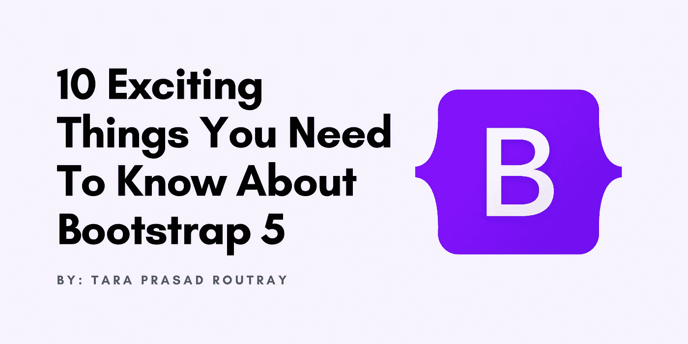

# 关于 Bootstrap 5，您需要知道的 10 件令人兴奋的事情

> 原文：<https://levelup.gitconnected.com/10-exciting-things-you-need-to-know-about-bootstrap-5-900ad922bf02>

## 了解 Bootstrap 5 提供的激动人心的功能和改进。



Bootstrap 5 现已推出！目前的主要版本已于 2021 年 5 月发布。它附带了许多新的特性和改进，包括新的组件、新的类、旧组件的新样式、增强的浏览器支持、取消了一些组件等等。

我将展示 Bootstrap 5 为现代 web 开发提供的令人兴奋的新特性和改进。初学者和有经验的开发人员可以从这篇文章中受益。

# Bootstrap 5 提供的新功能和改进

1.  放弃了对 jQuery 和过时浏览器的支持
2.  新的 SVG 图标库
3.  新占位符组件
4.  新 Offcanvas 组件
5.  新堆栈助手
6.  新水平折叠
7.  新浮动标签
8.  更新文件输入、检查和无线电
9.  更新的折叠组件
10.  RTL 支持

# 1.放弃了对 jQuery 和过时浏览器的支持

jQuery 库为适合 web 开发的 web 脚本提供了一个通用的抽象层。它本质上是可扩展的，因此允许您快速访问 DOM 元素，而无需编写大量普通的 JavaScript。Bootstrap 使用 jQuery 已经很久了，但它已经成为一个臃肿的库。现代 web 浏览器支持 jQuery 中的大多数特性，因此 Bootstrap 团队决定放弃对 jQuery 的支持。这导致节省了 85 KB 的小型 JavaScript，这是值得注意的，因为谷歌已经开始使用页面速度作为移动和桌面网络应用程序的排名因素。

此外，Bootstrap 5 已经不再支持以下 web 浏览器的过时版本。

*   Microsoft Edge 传统
*   微软 Internet Explorer 10 和 11
*   Mozilla Firefox < 60
*   苹果 Safari < 10
*   苹果 iOS Safari < 10
*   谷歌 Chrome < 60
*   原生 Android 浏览器< 6

# 2.新的 SVG 图标库

Bootstrap 5 推出了一个新的 SVG 图标库。它是由 Bootstrap 框架的联合创始人 Mark Otto 创建的。最近的版本 1.7.0 最近于 2021 年 11 月发布，该版本向库中添加了 120 个图标，使其总共有 1500 个图标！这是自最初发布以来最大的更新之一。

要通过 npm 安装或更新，请在项目中执行以下命令:

```
npm install bootstrap-icons
```

要通过 composer 安装或更新，请在项目中执行以下命令:

```
composer require twbs/bootstrap-icons
```

访问以下网页，探索整个图标库。

[](https://icons.getbootstrap.com/) [## 引导图标

### 引导图标发布到 npm，但如果需要，也可以手动下载。包括图标…

https://icons.getbootstrap.com](https://icons.getbootstrap.com/) 

# 3.新占位符组件

Bootstrap 5 推出了一个新的占位符组件。当您的 web 应用程序正在等待来自服务器的一些实际内容时，它允许您显示一个临时加载块。这将有助于最终用户识别某些东西仍在后台加载，这将增强您的 web 应用程序的整体体验。这个占位符仅由 HTML 和 CSS 构建，这意味着您不需要任何 JavaScript 来启动它们。


访问以下网页，探索占位符组件。

[](https://getbootstrap.com/docs/5.1/components/placeholders/) [## 占位符

### 占位符可以用来增强应用程序的体验。它们仅使用 HTML 和 CSS 构建，这意味着…

https://getbootstrap.com](https://getbootstrap.com/docs/5.1/components/placeholders/) 

# 4.新 Offcanvas 组件

Bootstrap 5 推出了一个新的 Offcanvas 组件。它允许你创建一个覆盖的侧边栏。web 应用程序使用侧栏在小屏幕设备上显示菜单。您可以使用类`offcanvas-start`将它定位在任何一侧，使用类`offcanvas-top`定位在左侧，使用类`offcanvas-end`定位在右侧，使用类`offcanvas-bottom` 定位在底部。


访问以下网页，探索 Offcanvas 组件。

[](https://getbootstrap.com/docs/5.1/components/navbar/#offcanvas) [## 画布外

### Bootstrap 功能强大、响应迅速的导航标题 navbar 的文档和示例。包括对…的支持

https://getbootstrap.com](https://getbootstrap.com/docs/5.1/components/navbar/#offcanvas) 

# 5.新堆栈助手

Bootstrap 5 推出了一个新的堆栈助手。这是一个速记助手，建立在 flex-box 工具之上，使组件设计更快更容易。有两种堆栈:

*   垂直堆栈
*   水平堆栈

## 5.1.垂直堆栈

你可以使用`vstack`类来垂直放置项目。垂直堆栈中的项目将覆盖父元素的整个宽度。


## 5.2.水平堆栈

您可以使用`hstack`类来水平放置项目。水平堆栈内的项目将仅覆盖容纳每个项目的内部内容所需的空间。


访问以下网页，探索堆栈助手。

[](https://getbootstrap.com/docs/5.1/helpers/stacks/) [## 大量

### 堆栈提供了一种快捷方式来应用多个 flex-box 属性，以便在 Bootstrap 中快速轻松地创建布局…

https://getbootstrap.com](https://getbootstrap.com/docs/5.1/helpers/stacks/) 

# 6.新水平折叠

Bootstrap 5 为折叠组件推出了一个新的水平折叠特性。您可以使用`collapse-horizontal`类在元素中执行水平转换。您还可以为直接子元素设置自定义宽度，以确保它扩展到某个宽度。


访问以下网页，探索折叠组件的水平折叠功能。

[](https://getbootstrap.com/docs/5.1/components/collapse/#horizontal) [## 水平塌陷

### 用几个类和我们的 JavaScript 插件切换项目内容的可见性。

https://getbootstrap.com](https://getbootstrap.com/docs/5.1/components/collapse/#horizontal) 

# 7.新浮动标签

Bootstrap 5 向表单组件发布了一个新的浮动标签元素。它允许您创建一个标签类似于占位符的输入字段，但是当输入获得焦点时，标签将滑动到值上方的输入字段的顶部。它也适用于`<select></select>`和`<textarea></textarea>`元素。


访问以下网页，了解表单组件的浮动标签功能。

[](https://getbootstrap.com/docs/5.1/forms/floating-labels/) [## 浮动标签

### 将一对元素包装在“form-floating”类中，以使用 Bootstrap 的文本表单字段启用浮动标签。一个…

https://getbootstrap.com](https://getbootstrap.com/docs/5.1/forms/floating-labels/) 

# 8.更新文件输入、检查和无线电

Bootstrap 5 抛弃了定制的`form-file`类，在`form-control`类上增加了新的样式。因此，您不再需要使用 JavaScript 来使文件输入样式起作用。


访问以下网页，了解表单组件的更新文件输入。

[](https://getbootstrap.com/docs/5.0/forms/form-control/#file-input) [## 文件输入

### 使用类来设置高度。表单-控制-lg 和。形态-控制-sm。将输入中禁用的布尔属性添加到…

https://getbootstrap.com](https://getbootstrap.com/docs/5.0/forms/form-control/#file-input) 

# 9.更新的折叠组件

Bootstrap 5 抛弃了卡片手风琴组件，引入了一个全新的手风琴组件。但是，新的 accordion 仍然使用了 Collapse JavaScript 插件。新的 accordion 包括一个 v 形图标(引导 SVG 图标),指示当前状态和点击能力。Bootstrap 团队还增加了对齐平折叠的支持，以消除外部边界，从而更容易放置在父元素中。


请访问以下网页，了解更新后的 Accordion 组件。

[](https://getbootstrap.com/docs/5.0/components/accordion/) [## 手风琴

### 此可折叠面板的占位符内容，旨在演示。手风琴同花顺课。这是第一次…

https://getbootstrap.com](https://getbootstrap.com/docs/5.0/components/accordion/) 

# 10.RTL 支持

Bootstrap 5 使用 [RTLCSS](https://rtlcss.com/) 增加了 RTL(从右到左)支持。由于 Bootstrap 是世界上最受欢迎的前端开源工具包，这是使 RTL 支持开箱即用的重要一步。出于这个原因，Bootstrap 5 已经放弃了不同的方向命名(例如，左和右的用法),而倾向于开始和结束。这使得 Bootstrap framework 很容易与从左到右(LTR)和从右到左(RTL)的 web 应用程序一起工作。


访问以下网页，探索 RTL 的布局。

[](https://getbootstrap.com/docs/5.1/getting-started/rtl/) [## RTL

### 我们建议先通读入门介绍页面，熟悉 Bootstrap。曾经…

https://getbootstrap.com](https://getbootstrap.com/docs/5.1/getting-started/rtl/) 

太棒了。您已经完成了学习 Bootstrap 5 提供的新功能和改进。现在，您可以开始在当前或即将到来的项目中实现上述特性。

> 如果你喜欢读这篇文章，并且学到了一些新的东西，那么请鼓掌，与你的朋友分享，并关注我以获得我即将发布的文章的更新。你可以在 [LinkedIn](https://www.linkedin.com/in/tara-prasad-routray-b83027145/) 上和我联系。