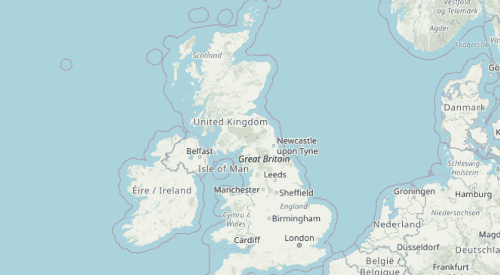
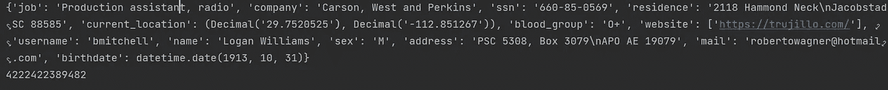
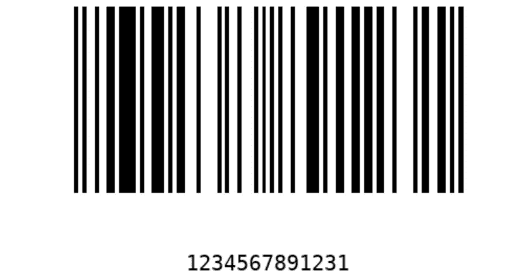

# 10 个神奇的 Python 包

> 原文：<https://levelup.gitconnected.com/10-fantastic-python-packages-af2a16a1183a>

## 所有用代码解释的包


Emile Perron 在 [Unsplash](https://unsplash.com?utm_source=medium&utm_medium=referral) 上的照片

# 1.薄层

树叶库用于说明地理数据(地图)。在构建一些需要地图来显示或搜索位置的应用程序时，可以加入这个库。这个叶库及其用途的完整文档在这个[链接](https://python-visualization.github.io/folium/)中。

**安装:**

```
pip install folium
```

在这个项目中，我们试图用叶子绘制一张地图。注意，我们将纬度和经度作为属性传递给 map 函数。交互式地图保存在 Python 文件的源文件中。

## 输出:



# 2.验证码

CAPTCHA 代表完全自动化的公共图灵测试，用于区分计算机和人类。验证码的主要目的是验证和进入网站只给人或阻止机器人。

**安装:**

```
pip install captcha
```

在这个程序中，我们尝试使用库和 python 程序创建一个验证码。查看生成中等单词 captcha 的代码和输出。

**输出:**


# 3.漂亮的桌子

prettytable 库用于表示关系表中的数据。使用 prettytable，可以对表格数据执行其他操作，如添加或删除行、对齐列以及清除表中的所有数据。

**安装:**

```
python -m pip install -U prettytable
```

在这个程序中，我们将在关系表中表示数据。输出将打印在终端上，如下所示。

**输出:**


# 4.骗子

Faker 是一个可以生成假随机数据的神奇包。每次使用 faker 库生成器，都会产生不同的随机数据。有许多令人兴奋的方法，如假文本，假信用卡号码。这个 faker 库及其用途的完整文档在这个[链接](https://faker.readthedocs.io/en/master/)中。

**安装:**

```
pip install faker
```

这个程序生成一个人的假数据，这将包括所有人的详细资料，如工作，姓名，电子邮件等。检查输出以查看 faker 库创建的完整概要文件。可以产生不同的数据，如程序中显示的信用卡号码。

,

**输出:**



# 5.压缩文件

zip 文件是一个内置的库，它将文件或数据转换为压缩形式的数据。使用这个库可以执行许多操作，比如提取 zip 文件、写入 zip 文件、获取 zip 文件的属性。压缩的 zip 文件输出将存储在 Python 文件的源文件中。

# 6.文本-Blob

文本 Blob 是一个流行的 Python 库，用于处理 NPL(自然语言处理)。该库可以执行的一些任务包括词性标注、情感分析、翻译等。

**安装:**

```
pip install -U text blob
```

在这个程序中，我们尝试使用文本 blob 库用 Python 编写一个拼写检查器。

**输出:**


# 7.Pyperclip

回形针库能够用 Python 程序复制剪贴板。这个库用于复制和粘贴函数，这些函数可以向您的计算机剪贴板发送文本，也可以从剪贴板接收文本。

**安装:**

```
pip3 install pyperclip
```

在这个程序中，我们使用回形针库函数将文本传递到复制和粘贴 word 介质。

**输出:**


# 8.条形码

Python 中可访问且功能强大的库，用于创建条形码。我们正在使用这个库，一个条形码。png 格式。在程序中，我们使用了欧洲商品编号(EAN) 13 号条码图像。您可以尝试使用条形码库中的不同方法。

**安装:**

```
pip install python-barcode
```

在这个程序中，我们创建了一个条形码，它由 13 个数字组成。

**输出:**



# 9.Num2Words

使用 num2words 库，我们可以将任何给定的数值转换成单词。在构建发票应用程序时，如果您需要将输入的数字转换成文字，这个库会很有帮助

**安装:**

```
pip install num2words
```

在这个程序中，我们接受输入并将数字转换成单词。

**输出:**


# 10.PyautoGUI

Pyautogui 是最好的 Python 库之一，可以自动处理一些操作。你可以用这个库尝试的一些功能有鼠标自动交互，关键字自动交互，消息框，截图。

**安装:**

```
pip install pyautogui
```

在这个程序中，使用 pyautogui，我们截取了 Python 程序的一个屏幕截图。

这里有一个订阅链接，可以用 Medium 阅读数千篇文章。请考虑订阅，支持众多作家。

[](https://swathiarun63.medium.com/membership) [## 通过我的推荐链接加入媒体

### 作为一个媒体会员，你的会员费的一部分会给你阅读的作家，你可以完全接触到每一个故事…

swathiarun63.medium.com](https://swathiarun63.medium.com/membership)