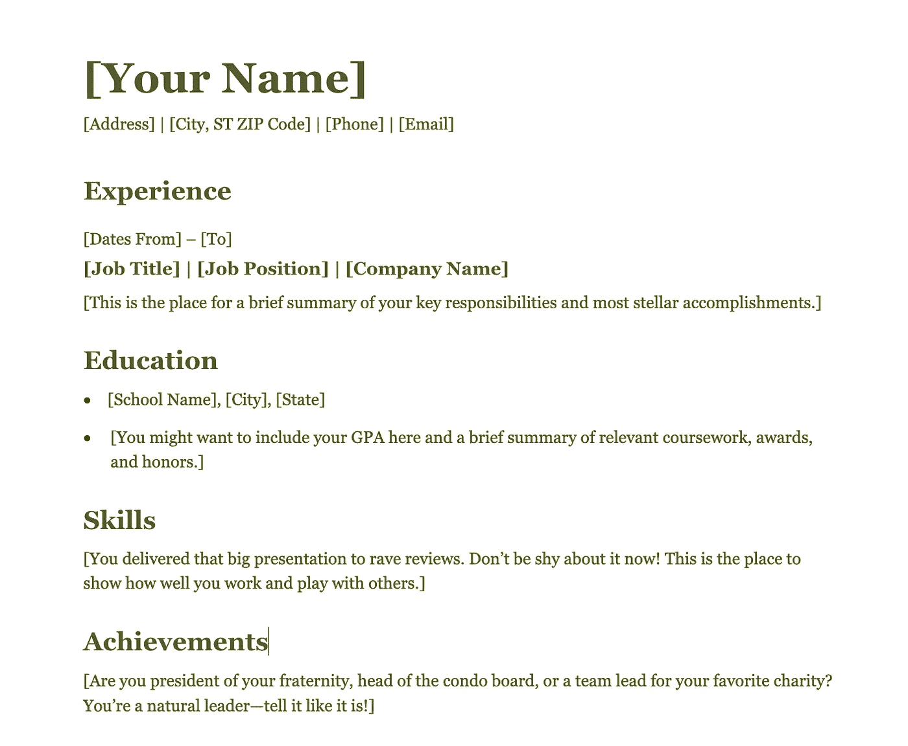
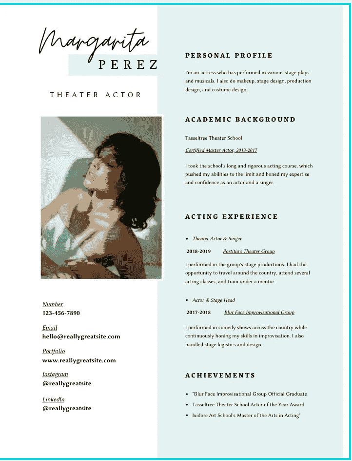
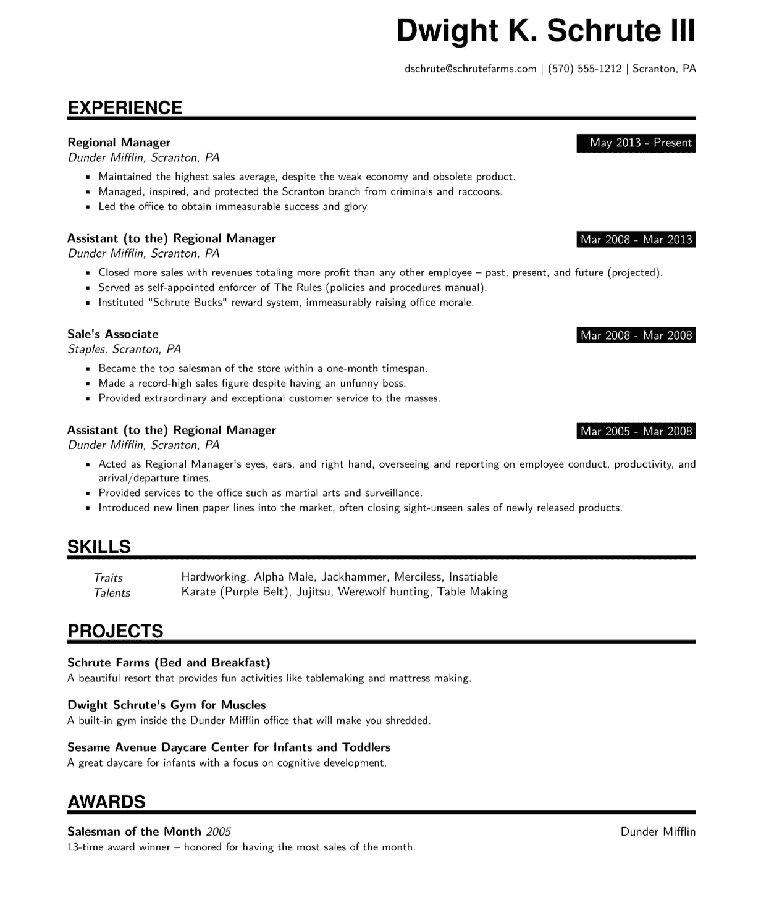
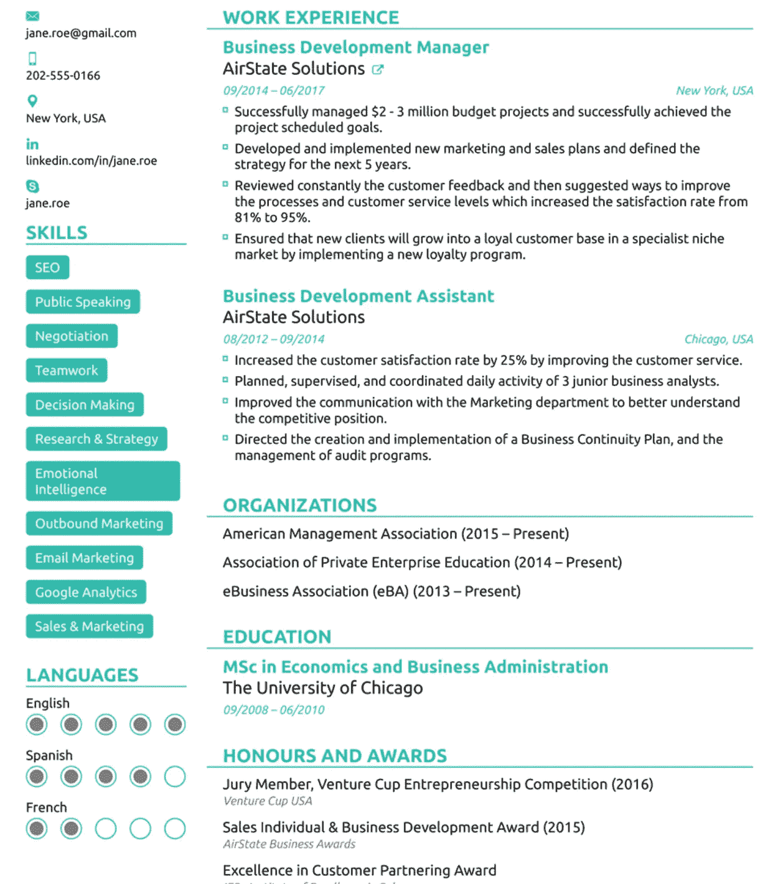
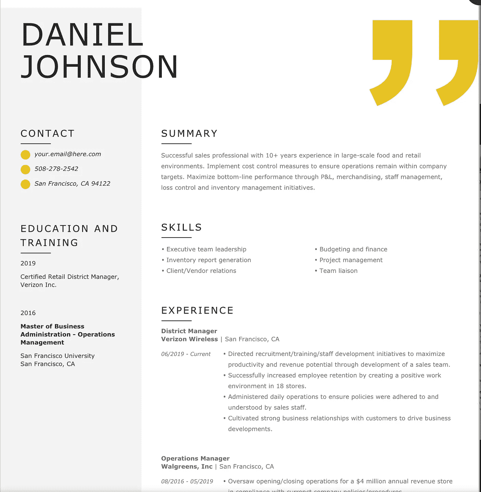
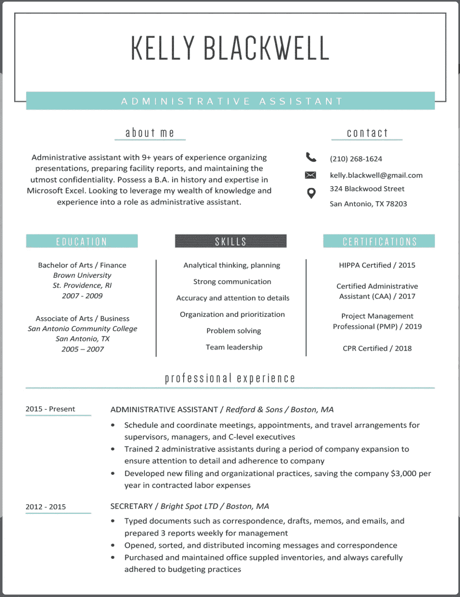
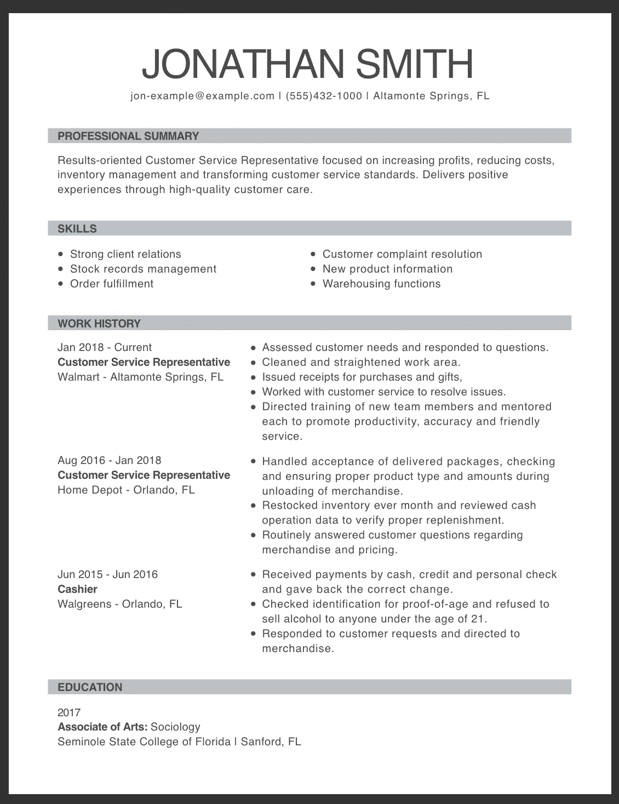
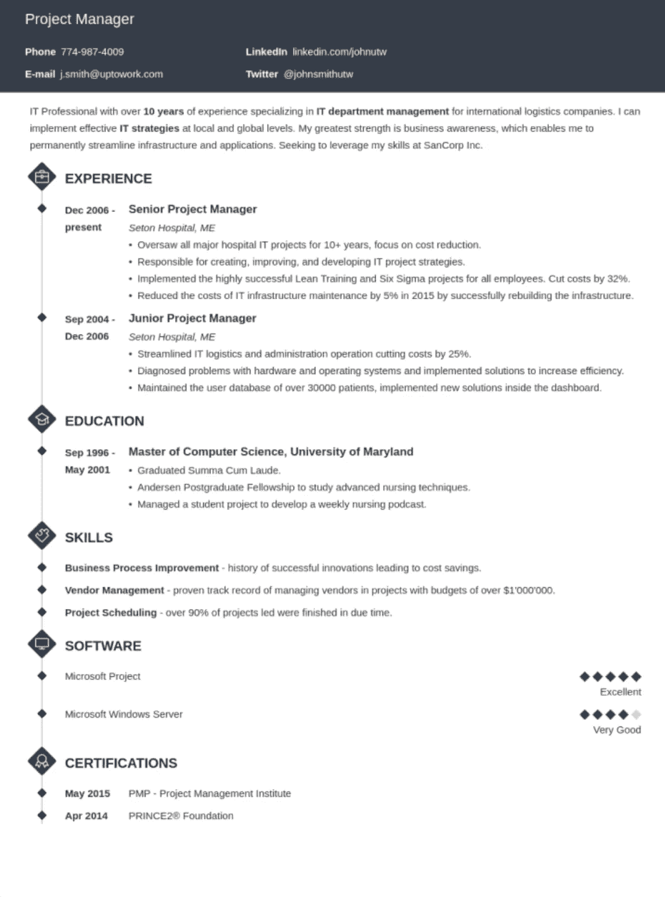
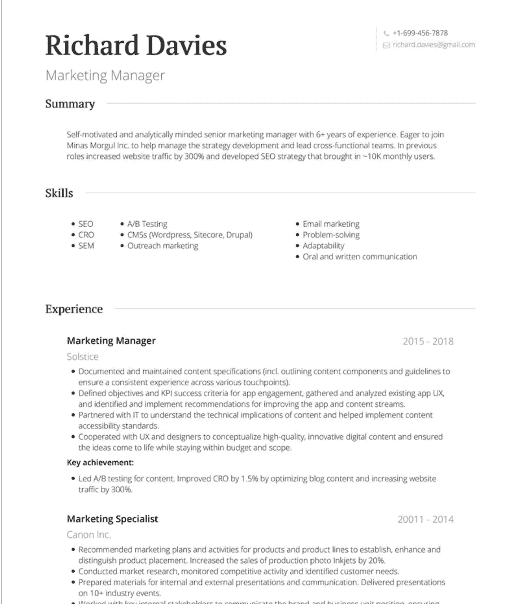
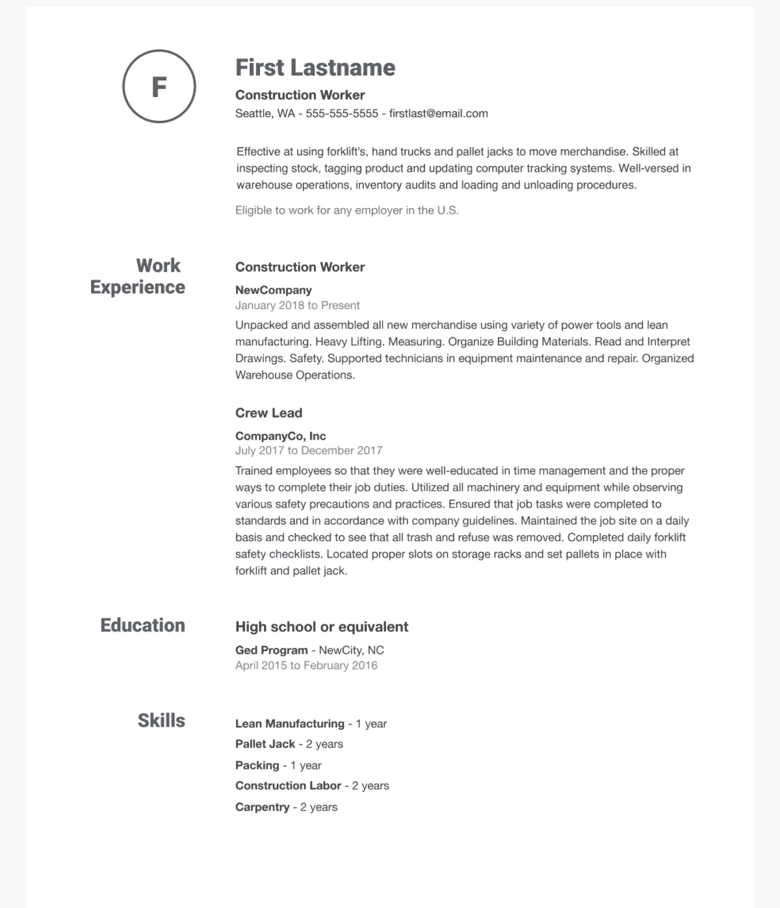

# 10 个免费在线简历生成器

> 原文：<https://levelup.gitconnected.com/10-free-online-resume-builders-26e0ad71c79a>

说到制作简历，我相信少即是多。内容比模板更重要。所以每当我面临拒绝的时候，我宁愿把时间和精力花在建立新项目、研究或者找兼职来打磨自己的技能上，而不是过多关注简历审美。这里有一些简历制作工具，你可以用它们来快速制作你的简历。

TL；博士:

*   MS Word
*   [**坎瓦**](https://www.canva.com/design/play?category=tACZCki4tbY&type=TACQ-qm91ig)
*   [resume . io](https://resumake.io/generator/templates)
*   [**Novoresume**](https://novoresume.com/resume-templates)
*   [**简历-现**](https://www.resume-now.com/build-resume/choose-template)
*   [**简历天才**](https://resumegenius.com/)
*   [**MyPerfectResume**](https://www.myperfectresume.com/)
*   [**Zety**](https://zety.com/) **(仅限免费资源)**
*   [visual cv](https://www.visualcv.com/)
*   [**Indeed.com**](https://www.indeed.com/profile/resume-templates)

由[凡泰媒体](https://unsplash.com/@vantaymedia?utm_source=medium&utm_medium=referral)在 [Unsplash](https://unsplash.com?utm_source=medium&utm_medium=referral) 上拍摄的照片

1.  **微软 Word:** 微软帮我登陆微软是不是很搞笑？MS Word 有非常标准和简单的简历模板，我用 Word 创建了我的简历，所以我绝对推荐它。

src — Microsoft Word

2.**:如果你想要稍微花哨一点的模板，试试这个。**

**PS:如果你从事技术工作，我不建议你在简历上放照片。**

****

**src:Canva.com**

**3.[**resume . io**](https://resumake.io/generator/templates):非常标准的模板。**

****

**src:resume . io**

**[**4。Novoresume**](https://novoresume.com/resume-templates) **:** 他们有 8 个不同的免费模板，你可以在这里查看[。](https://novoresume.com/resume-templates)**

****

**src:novoresume.com**

**5. [**简历——现在**](https://www.resume-now.com/build-resume/choose-template) **:** 他们有成吨的模板可以选择。**

****

**src:Resume-now.com**

**[**6。简历天才:**](https://resumegenius.com/) 他们有很多经典模板。**

****

**src:ResumeGenuis.com**

**[**7。他们有很好的评论。**](https://www.myperfectresume.com/)**

****

**Myperfectresume.com**

**[**8。Zety:**](https://zety.com/) 他们大概有 20 个模板。他们标榜自己是“免费”的，但让你下载简历却要收几美元。他们的资源是好的，因此我把他们放在这个列表中。**

****

**src:Zety.com**

**9.他们允许每个客户免费投一份简历**

****

**src:VisualCV.com**

**10.[**Indeed.com**](https://www.indeed.com/profile/resume-templates)**:**这些模板大多是 ATS 友好的**

****

**你可能已经注意到所有这些网站和模板都非常相似。所以挑一个坚持就好，不需要过多考虑简历构建。据我所知，这里提到的所有网站都是免费的，但是，如果他们中的任何一个在最后偷偷花了一些钱，请告诉我。我不建议为简历建设付费，因为网上有大量免费资源。**

**希望这有所帮助！**

****编辑:我已经开始提供一对一的职业指导，你可以去 anjaliviramgama.com 阅读评论并安排时间****

**安贾利·维拉加马**

**[**LinkedIn**](http://www.linkedin.com/in/anjali-viramgama-085285166)**|**[**insta gram**](https://www.instagram.com/anjali.gama/)**

# **分级编码**

**感谢您成为我们社区的一员！为开发者试用我们免费的自动化简历生成器和投资组合 API。**

** [## 软件工程师简历生成器| gitconnected

### 免费打造不到 5 分钟的高质量软件工程简历。同步您的个人资料，我们会处理…

gitconnected.com](https://gitconnected.com/resume-builder)**