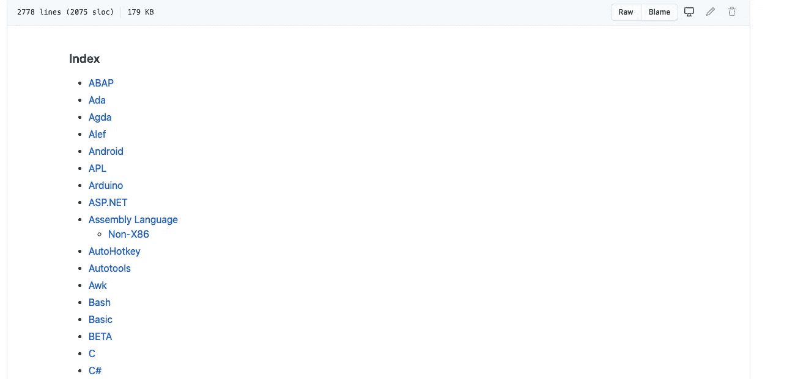
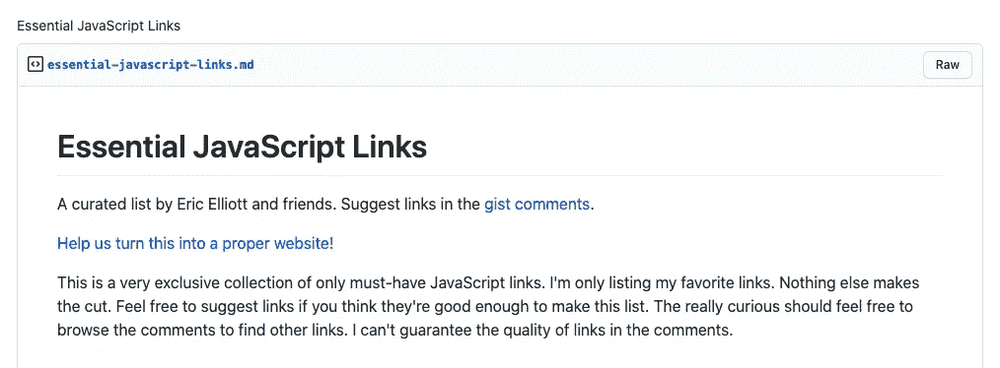
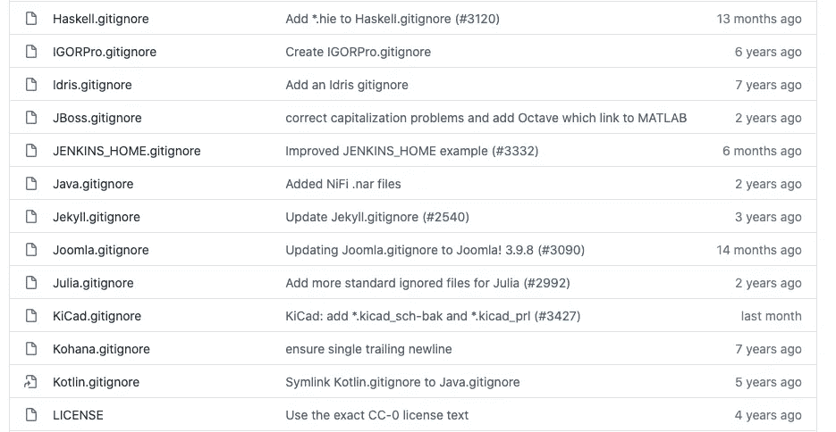
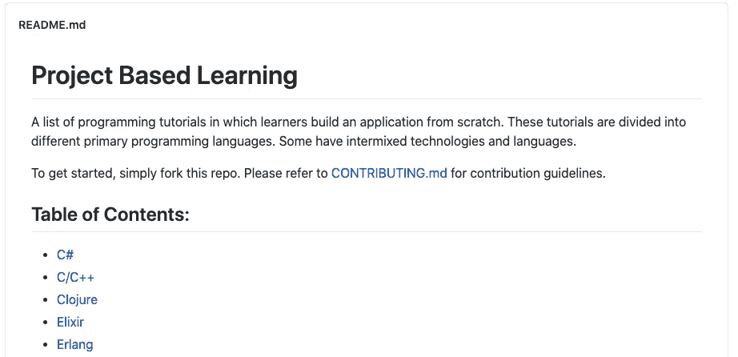
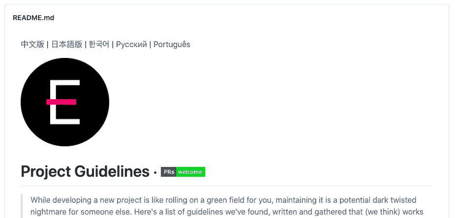
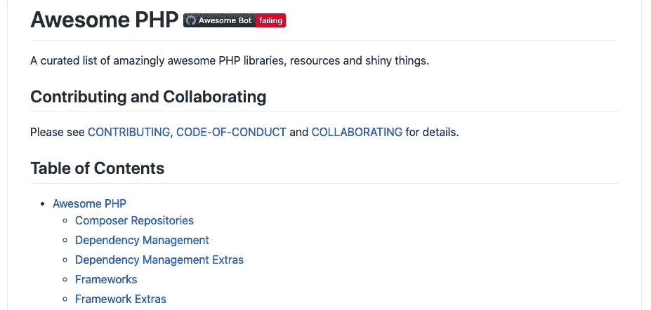
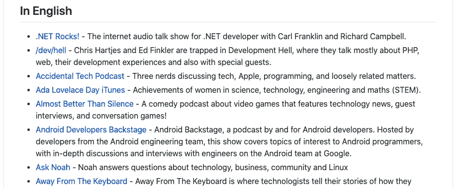
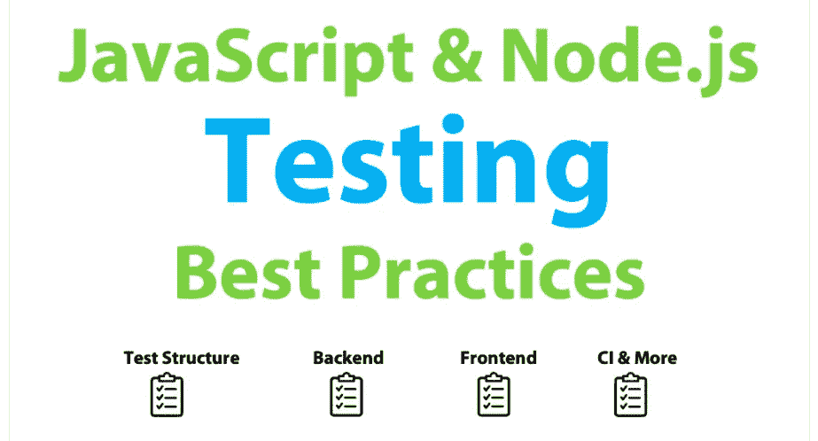

# 10 个可以用来自我提升的 GitHub Repos

> 原文：<https://levelup.gitconnected.com/10-github-repos-that-can-be-used-for-self-improvement-7a926bd62ba5>

## 从书籍到最佳实践和播客，都在这个列表中

我的猜测是，没有一个开发人员不知道 GitHub 是什么，或者至少没有看过许多可用的库之一。你会在 GitHub 上找到各种各样的项目，这使它成为任何开发人员成为自己更好版本的完美地方。

由于 GitHub 有超过 1 亿个存储库，你要在大海捞针。这就是为什么在本文中，我们将仔细阅读 10 个 GitHub 库，它们对自我改进很有帮助。通过这种方式，您可以省去寻找合适的存储库的麻烦，并且可以在阅读完本文后开始改进自己。

# 1.可怕的

这个库正如其名:太棒了！这可能是每个开发人员的首选存储库。概念很简单。awesome 存储库包含一系列与软件开发和编程相关的所有不同领域的链接。

从编程语言到书籍和大数据，令人敬畏的知识库已经覆盖了你！如果你还没有这样做，你一定要看看这个库中提到的所有有用的资源——你可以在这里找到。

# 2.免费编程书籍

免费的编程书籍不需要更多的解释。这是一个非常受欢迎的 GitHub 库，拥有超过 100，000 颗星和超过 950 个贡献者。这个图书列表最初是一个堆栈溢出线程的克隆。它被转移到 GitHub 是为了更好地维护。

这个资源库用 30 多种不同的语言编写，你可以在这里找到免费的编程书籍资源库。如果阅读是你学习新事物的首选方式，我向你强烈推荐这个资源库。

# 3.基本 JavaScript 链接

根据这个库的作者所说，基本 JavaScript 链接库是一个非常独特的集合，只包含必备的 JavaScript 链接。一个链接是否被认为是必要的完全取决于这个库的作者的意见。然而，这是一个很好的 JavaScript 资源列表，您可以在尝试提高您的 JavaScript 知识时使用。

从学习简单的 JavaScript 要点到处理所有你需要知道的关于 ES6 的书籍，这个列表涵盖了各种各样的主题。

你可以在这里查看资源库[。](https://gist.github.com/ericelliott/d576f72441fc1b27dace/0cee592f8f8b7eae39c4b3851ae92b00463b67b9)

# 4.Gitignore

Gitignore 存储库包含一个*列表。例如，gitignore* 你可以在开始一个新项目时使用的模板。现在你已经知道了这个库，没有必要再为建立你自己的*而挣扎了。gitignore* 文件。你可以用一辆*。gitignore 这个库中的*文件。

这个仓库有*。gitignore* 许多不同编程语言、框架和工具的模板。如果您是一名 Rails 开发人员，这个库可以满足您的需求。你在拉弗尔工作？不用担心，还有一个*。gitignore* 文件也用于 Laraval。宁愿要一个*。gitignore* 文件用于 Visual Studio？那也是可能的。

如果你想看一看所有的*。gitignore* 可用的文件看一下[这里](https://github.com/github/gitignore)。这个库有超过 10 万颗星星，被很多开发者用来让他们的生活变得更简单。

# 5.基于项目的学习

如果你喜欢通过做一个很酷的兼职项目来学习新东西，那么基于[项目的学习资源库](https://github.com/tuvtran/project-based-learning)绝对适合你。拥有超过 35，000 颗星的这个库对于那些想要学习如何从头开始构建应用程序的人来说是一个很好的资源。这个库中的教程分为不同的主要编程语言。

因此，如果你想学习一门新的编程语言，同时实际上构建一些有趣的东西，我强烈建议你看看基于项目的学习资源库。

# 6.项目指南

项目指南存储库包含一个指南列表，它非常适合大多数 JavaScript 项目。如果您不是 JavaScript 开发人员，不要担心。您可以在这个库中找到大量的指南，这些指南对于任何其他软件项目都是有用的，不管是哪种编程语言。

你可以在这里找到项目指南库，里面有超过 20K 颗星。

# 7.真棒 PHP

根据描述，Awesome PHP 存储库包含一个令人惊讶的令人敬畏的 PHP 库、资源和闪亮的东西的精选列表。它包含一堆库、框架、代码分析工具等等。对于每个 PHP 开发人员来说，这些都是非常有用的资源。

你可以点击查看令人敬畏的 PHP 库[。顺便说一句，如果你是一个 Python 开发者，那么还有一个](https://github.com/ziadoz/awesome-php)[很棒的 Python 库](https://github.com/vinta/awesome-python)。

# 8.超棒的极客播客

尽管这个存储库没有被积极地维护，但它仍然有一个很棒的播客列表供您收听。有 15 种语言的播客，几乎不可能找不到你喜欢的播客。这个库绝对不是这个列表中最受欢迎的库，有接近 1.5K 的明星，但这个列表中的播客数量是惊人的。

如果你喜欢听播客，你一定要看看[牛逼的极客播客库](https://github.com/guipdutra/awesome-geek-podcasts)。

# 9.前端清单

这个库是为所有的 web 开发者准备的。根据它自己的描述，前端清单是一份详尽的清单，列出了在你的网站或 HTML 页面投入生产之前需要具备和测试的所有元素。

这个清单上的检查是基于多年的经验，并从其他开源清单中添加了一些内容。清单上的每一点都有以下三个类别之一:推荐、强烈推荐和不能省略。

这个列表上的检查从安全检查到 SEO 和性能检查不等。你可以在这里找到前端清单库[。](https://github.com/thedaviddias/Front-End-Checklist)

# 10.JavaScript 测试最佳实践

JavaScript 测试最佳实践库真的可以让你的测试技能更上一层楼。它非常全面地涵盖了测试代码的各个方面，并且提供了超过 45 种测试 JavaScript 代码的最佳实践。最棒的是，一些最佳实践附带了一个代码示例，以进一步阐明事情。

如果你是一名 JavaScript 开发人员，仍然可以学习一两件关于测试你的 JavaScript 代码的事情，我强烈推荐你查看一下 [JavaScript 测试最佳实践库](https://github.com/goldbergyoni/javascript-testing-best-practices)。