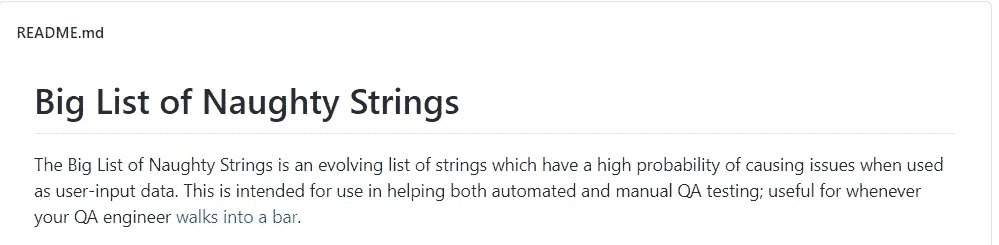
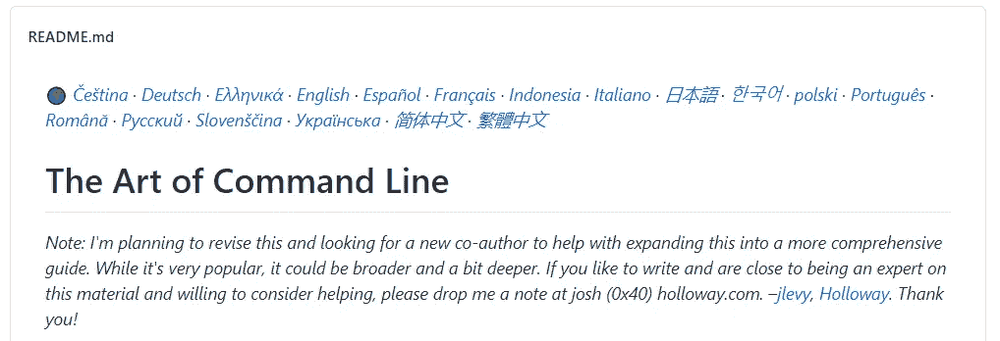
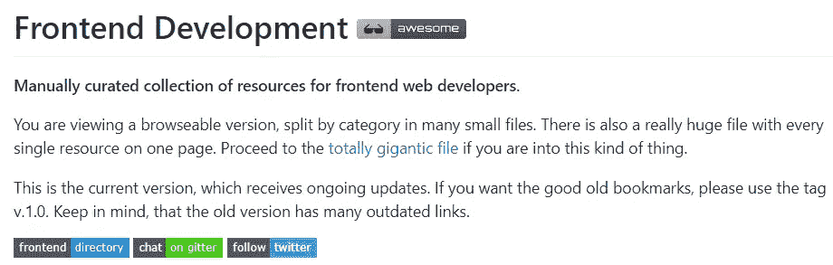
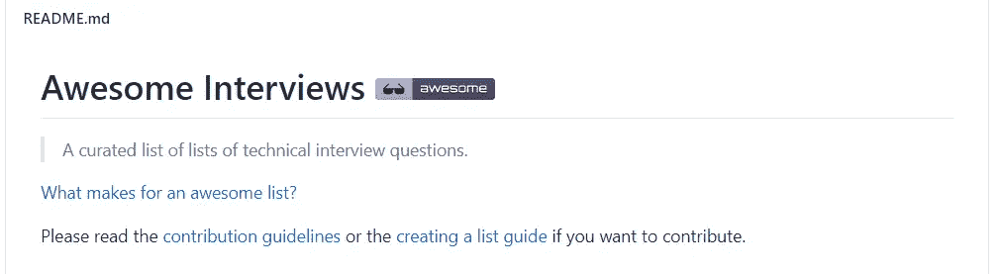
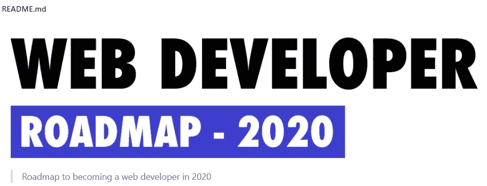
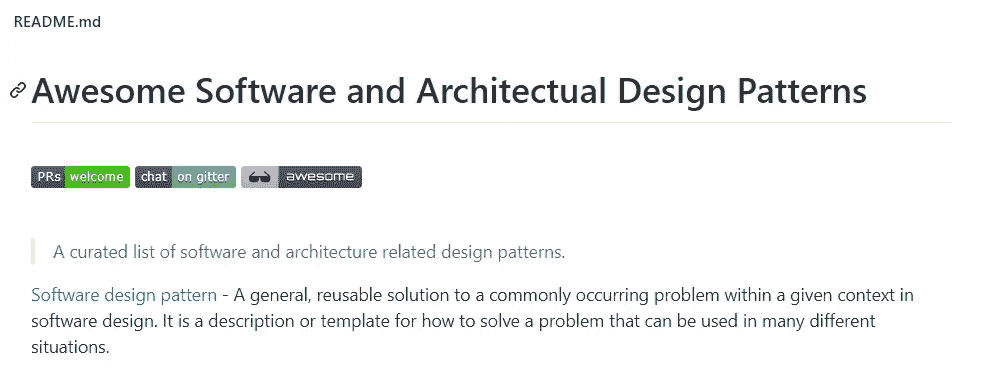

# 10 个 GitHub Repos 可以帮助你成长为一名网络开发者

> 原文：<https://levelup.gitconnected.com/10-github-repos-that-can-help-you-grow-as-a-web-developer-56a640d9771a>

马库斯·温克勒在 [Unsplash](https://unsplash.com?utm_source=medium&utm_medium=referral) 上的照片

## 从数百万个 GitHub 仓库中挑选出来的一小部分

GitHub 是你作为一名开发人员努力提升自己时应该寻找的地方。你需要的所有信息都在某个存储库中。

然而，困难的部分是找到正确的存储库。人们很容易在所有可用的 GitHub 资源库中感到迷失。为了帮助你，我列出了十个 GitHub 库，可以帮助你成长为一名开发者。

# 1.淘气字符串的大列表

恶意字符串的大列表是一个不断发展的字符串列表，当用作用户输入数据时，这些字符串很可能会引起问题。当您测试用户输入时，这个列表非常有用。

这个列表中的字符串既可以用于手动测试，也可以用于自动测试。这个存储库有助于找到期望的输入，这对用户来说从来都不是一个积极的体验。

如果你对测试感兴趣，或者想了解更多关于用户输入验证的知识，我强烈推荐你去看看[的淘气字符串大列表](https://github.com/minimaxir/big-list-of-naughty-strings)库。

# 2.命令行的艺术

作为一名开发人员，你总是试图变得更有效率。对于每个开发人员来说，时间都是宝贵的，这就是为什么每个开发人员都努力尽可能高效地做事。

熟悉命令行并了解其使用方法是实现这一目标的一种方法。命令行存储库的艺术包含许多提示和技巧，这些提示和技巧在某些情况下很有帮助，或者比其他方法节省大量时间。这个存储库对初学者和更有经验的命令行用户很有帮助。

它主要关注 Linux 命令行，但是这个库也包含 MacOS 和 Windows 的部分。你可以在这里找到命令行库的艺术。

# 3.前端开发书签

这个存储库包含为前端 web 开发人员管理的资源集合。从架构到 UI 组件，都在这个库中。这个库涵盖了广泛的前端技术。为了建立一个现代前端，你需要知道的所有事情都在那里。

如果您缺乏前端开发的某个方面的知识，我强烈建议您查看这个资源库。可以在这里找到前端开发书签库[。](https://github.com/dypsilon/frontend-dev-bookmarks)

# 4.可怕的面试问题

awesome 面试问题库是一个非常受欢迎的库。GitHub 上有近 37K 颗星星，这是这个列表中最受欢迎的存储库之一。这个库包含了几乎每种编程语言和框架的大量面试问题。

在你看了这个知识库之后，你不可能参加一个没有准备好的面试。你可以在这里查看。

# 5.开发者路线图

web 开发人员路线图存储库包含一个面向前端、后端和开发运营开发人员的路径。这些路线图的目的是让你对前景有所了解，并在你对下一步该学什么感到困惑时为你提供指导。

这个存储库包含三个图表，向您显示每条路径需要什么以及需要哪些技能。这个存储库描述的路径是前端、后端和开发操作。

你可以在这里[检查你是否已经掌握了这份工作所需的所有技能。不要因为有很多东西要学而感到不知所措。你不需要马上学会所有的东西。一次学一件事。](https://github.com/kamranahmedse/developer-roadmap)

# 6.30 秒的代码

GitHub 上超过 65K 颗星的列表中最受欢迎的存储库是 30 秒代码存储库。这个存储库包含满足您所有开发需求的简短 JavaScript 代码片段。

这些片段从计算摄氏温度到华氏温度，再到计算两个日期之间的工作日。所有这些片段都包含用 JavaScript 编码时会遇到的问题的解决方案。

你一定要看看这个库，因为它为经常出现的编程问题提供了一些很好的解决方案。你可以在这里找到 30 秒代码库。

# 7.超赞的备忘单

每个开发人员都至少用过一次:备忘单。备忘单非常有用。尤其是，当你正在学习新的东西，比如编程语言或框架的时候。幸运的是，您不必创建自己的备忘单，因为令人敬畏的备忘单库已经涵盖了您。

这个存储库有几乎所有东西的备忘单——从前端到后端，从数据库到工具。如果你正在寻找一份备忘单，你绝对应该看看这个[库](https://github.com/LeCoupa/awesome-cheatsheets)。

# 8.CSS 保护

CSS protips 库包含一系列帮助您提高 CSS 技能的技巧。我们都知道有时设计一个网页有多难。这份清单上的建议有助于解决你以前可能遇到过的问题。

这个库中分享的技巧可以帮助你在造型技巧方面有一个更好的基础。您从这个资源库中学到的 CSS 技巧和诀窍可以马上使用。最重要的是，内容被翻译成十多种语言。

如果你对这个库中共享的 CSS 技巧感兴趣，看看这里的。

# 9.33 个 JS 概念

33 JS 概念包含了每个 JavaScript 开发人员都应该知道的 33 个概念。这个库涵盖了创建一个坚实的 JavaScript 基础所需的一切。对没有经验和有经验的开发人员都有用。

创建这个库的目的是帮助开发人员掌握所有的 JavaScript 概念。它包含帮助您更好地理解这些概念的视频和文章。知识库被翻译成二十种不同的语言。

你可以在这里看一下 33 JS 概念库[。](https://github.com/leonardomso/33-js-concepts)

# 10.令人敬畏的设计模式

awesome 设计模式存储库包含软件和架构设计模式的精选列表。如果您正在学习设计模式或者想要更新知识，这是一个很好的资源。

这个知识库不仅涵盖了一般的架构，还包含了这些设计模式在代码中的样子。这些例子包括了十多种编程语言和框架。当您必须自己实现其中一个设计模式时，查看这些示例非常方便。

你可以在这里找到令人敬畏的设计模式库。