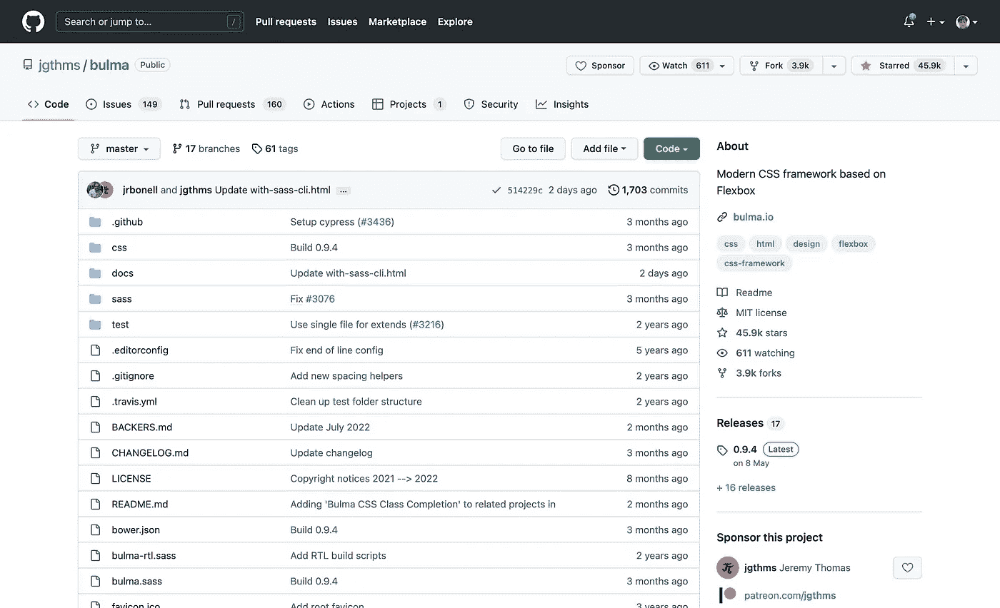
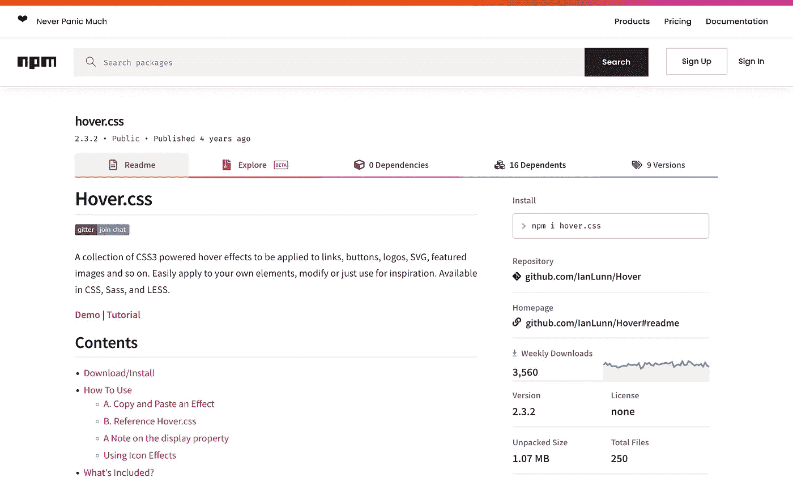

# 成为 CSS 大师的 10 个 GitHub 库

> 原文：<https://levelup.gitconnected.com/10-github-repositories-to-become-a-css-master-ff0811fbf3d9>

[**如何成为 CSS 高手**](https://medium.com/@martinageradams/10-github-repositories-to-become-a-css-master-ff0811fbf3d9)

M 任何后端和前端的合作伙伴都认为 CSS 很难学，成为 CSS 大师更具挑战性。

我们建议你向 Github 最好的开源 CSS 项目学习。

我在 Github 上选择了 10 个资源库，这样我们就可以一起学习，成为 CSS 大师。我是全职自由职业者，这些 CSS 库帮助我更快地赚钱。

要成为 CSS 高手，使用它们是不够的；我们还需要研究和学习代码。

[***我是一名全职自由职业者。雇用我继续工作***](https://www.upwork.com/freelancers/~01bf20ea68fc1c3a9a) ***。***

[***20 GitHub 知识库成为 React 大师***](/20-github-repositories-to-become-a-react-master-️-b91fb3bdd6c8)

[***70+ React 项目免费掌握 React***](https://medium.com/@martinageradams/build-70-react-projects-to-master-react-for-free-c612ce031982)

[**如何成为 CSS 高手**](https://github.com/search?l=CSS&o=desc&q=css&s=stars&type=Repositories)

**目录**

*   **Animate.css *⭐ Github 星空:75.4k+*t37】**
*   **normalize . CSS*⭐github stars:48.4k+***
*   **布尔玛*⭐github stars:45.9k+*t45】**
*   **hover . CSS*⭐github stars:26.2k+***
*   **50 天 50 个项目*⭐github stars:20.2k+***
*   **spin kit⭐github stars:18.9k+**
*   **不需要 JavaScript⭐github stars:17.4k+**
*   **30 秒的 CSS ⭐ Github stars: 15.6k +**
*   **棘轮⭐ Github stars: 14.5k +**
*   **由 Flexbox ⭐ Github stars 解决:13k +**

# **Animate.css**

*⭐ Github 星辰:75.4k +*

> 🍿CSS 动画的跨浏览器库。像一件容易的事情一样容易使用。

在我们的项目中很容易使用它的动画效果。我们可以学习如何使用 CSS 动画。

## 开源代码库

 [## Animate.css

### Animate.css 有一个可用的存储库。在 GitHub 上关注他们的代码。

github.com](https://github.com/animate-css)  [## GitHub - animate-css/animate.css:🍿CSS 动画的跨浏览器库。像…一样易于使用

### 如果你需要旧的文档- v3.x.x 及以下版本-你可以在这里找到。使用 npm 安装:npm install animate.css - save…

github.com](https://github.com/animate-css/animate.css) 

[**Animate.css Github 资源库—如何成为 css 高手**](https://github.com/animate-css/animate.css)

## 大小

 [## ❘·邦德恐惧症

### 求 javascript 包 animate.css 的大小 Bundlephobia 帮你找到 npm 包的性能影响。

bundlephobia.com](https://bundlephobia.com/package/animate.css@4.1.1) 

[**Animate.css Size —如何成为 css 高手**](https://bundlephobia.com/package/animate.css@4.1.1)

## NPM

 [## animate.css

### 如果你需要旧的文档- v3.x.x 及以下版本-你可以在这里找到。使用 npm 安装:npm install animate.css - save…

www.npmjs.com](https://www.npmjs.com/package/animate.css) 

[**animate . css NPM——如何成为 CSS 高手**](https://www.npmjs.com/package/animate.css)

# **normalize.css**

> CSS 重置的现代替代方案

**当我们设计自己的网站 CSS 样式时，为了避免浏览器默认样式的影响，我们通常会重置 CSS。**

*⭐ Github stars: 48.4k +*

## 开源代码库

 [## necolas -概述

### 此时您不能执行该操作。您已使用另一个标签页或窗口登录。您已在另一个选项卡中注销，或者…

github.com](https://github.com/necolas)  [## CSS:CSS 重置的现代替代方案

### CSS 的现代替代重置 NPM npm 安装保存 normalize.css CDN 见…

github.com](https://github.com/necolas/normalize.css) 

[**Normalize.css Github 资源库—如何成为 css 高手**](https://github.com/necolas/normalize.css)

## 大小

 [## 使❘恐惧症正常化

### 求 javascript 包的大小规格化。Bundlephobia 帮助您发现 npm 包的性能影响。

bundlephobia.com](https://bundlephobia.com/package/normalize@0.3.1) 

[**Normalize.css Size—如何成为 css 高手**](https://bundlephobia.com/package/normalize@0.3.1)

## NPM

 [## 使标准化

### 最初由京·长岛模块化的 normalize.css 的手写笔移植。下面是一个如何利用的示例…

www.npmjs.com](https://www.npmjs.com/package/normalize) 

[**Normalize.css NPM—如何成为 css 高手**](https://www.npmjs.com/package/normalize)

# 布尔玛

> 基于 Flexbox 的现代 CSS 框架

你可以看看布尔玛的代码来了解 CSS FlexBox。

*⭐ Github 明星:45.9k +*

## 开源代码库

 [## jgthms -概述

### 此时您不能执行该操作。您已使用另一个标签页或窗口登录。您已在另一个选项卡中注销，或者…

github.com](https://github.com/jgthms)  [## GitHub - jgthms/bulma:基于 Flexbox 的现代 CSS 框架

### 基于 Flexbox 的现代 CSS 框架。通过在 GitHub 上创建一个帐户来为 jgthms/bulma 开发做贡献。

github.com](https://github.com/jgthms/bulma) 

[**布尔玛 Github 资源库—如何成为 CSS 高手**](https://github.com/jgthms/bulma)

## 大小

 [## 布尔玛·❘恐惧症

### 求 javascript 包 bulma 的大小。Bundlephobia 帮助您发现 npm 包的性能影响。

bundlephobia.com](https://bundlephobia.com/package/bulma@0.9.4) 

[**布尔玛大小——如何成为 CSS 高手**](https://bundlephobia.com/package/bulma@0.9.4)

## NPM

 [## 布尔玛

### 基于 Flexbox 的现代 CSS 框架。最新版本:0.9.4，最后发布时间:3 个月前。开始在你的…

www.npmjs.com](https://www.npmjs.com/package/bulma) 

[**布尔玛 NPM——如何成为 CSS 大师**](https://www.npmjs.com/package/bulma)

# Hover.css

> 一个 CSS3 驱动的悬停效果集合，可应用于链接、按钮、徽标、SVG、特色图片等。轻松应用到您自己的元素，修改或只是用于灵感。有 CSS、Sass 等版本。

*⭐ Github stars: 26.2k +*

# 开源代码库

 [## IanLunn -概述

### 此时您不能执行该操作。您已使用另一个标签页或窗口登录。您已在另一个选项卡中注销，或者…

github.com](https://github.com/IanLunn)  [## GitHub - IanLunn/Hover:一组 CSS3 驱动的悬停效果，可应用于链接、按钮…

### 一个 CSS3 驱动的悬停效果的集合，应用于链接，按钮，标志，SVG，特色图片等等…

github.com](https://github.com/IanLunn/Hover) 

[**Hover.css Github —如何成为 css 高手**](https://github.com/IanLunn/Hover)

# 大小

 [## hover.css ❘恐惧症

### 查找 javascript 包 hover.css 的大小 Bundlephobia 帮你找到 npm 包的性能影响。

bundlephobia.com](https://bundlephobia.com/package/hover.css@2.3.2) 

[**Hover.css Size —如何成为 css 高手**](https://bundlephobia.com/package/hover.css@2.3.2)

# NPM

 [## hover.css

### 一个 CSS3 驱动的悬停效果的集合，应用于链接，按钮，标志，SVG，特色图片等等…

www.npmjs.com](https://www.npmjs.com/package/hover.css) 

[**hover . css NPM——如何成为 CSS 高手**](https://www.npmjs.com/package/hover.css)

# 50 天 50 个项目

> 50 多个使用 HTML、CSS 和 JS 的迷你网站项目

*⭐ Github stars: 20.2k +*

**Github**

 [## bradtraversy -概述

### 此时您不能执行该操作。您已使用另一个标签页或窗口登录。您已在另一个选项卡中注销，或者…

github.com](https://github.com/bradtraversy)  [## GitHub-bradtraversy/50 projects 50 天:50 多个使用 HTML、CSS 和 JS 的迷你 web 项目

### 这是课程中所有专题的主要资料库。关于拉取请求的说明:所有这些项目都是…

github.com](https://github.com/bradtraversy/50projects50days) 

[**50 天 50 个项目——如何成为 CSS 高手**](https://github.com/bradtraversy/50projects50days)

# 旋转套件

> 用 CSS 制作动画的加载指示器集合

**我们将自己把动画添加到页面加载中，所以一定要看看它的代码。**

*⭐ Github stars: 18.9k +*

## 开源代码库

 [## tobiasahlin -概述

### 此时您不能执行该操作。您已使用另一个标签页或窗口登录。您已在另一个选项卡中注销，或者…

github.com](https://github.com/tobiasahlin)  [## GitHub - tobiasahlin/SpinKit:用 CSS 制作的加载指示器集合

### 用 CSS 制作的简单加载旋转器动画。参见演示。SpinKit 仅使用(变换和不透明度)CSS 动画来…

github.com](https://github.com/tobiasahlin/SpinKit)  [## GitHub-KyleAMathews/react-spin kit:用 CSS 为 React 制作的加载指示器集合

### 一个用 CSS 为 React 制作的装载指示器动画的集合，目前我已经移植了来自…

github.com](https://github.com/KyleAMathews/react-spinkit) 

[**SpinKit Github —如何成为 CSS 高手**](https://github.com/tobiasahlin/SpinKit)

## 大小

 [## ❘·邦德恐惧症

### 求 javascript 包 react-spinkit 的大小。Bundlephobia 帮助您发现 npm 包的性能影响。

bundlephobia.com](https://bundlephobia.com/package/react-spinkit@3.0.0) 

[**SpinKit Size —如何成为 CSS 高手**](https://bundlephobia.com/package/react-spinkit@3.0.0)

## NPM

 [## 反应-spinkit

### 用 CSS 为 React 制作动画的加载指示器集合。最新版本:3.0.0，最后发布时间:5 年前…

www.npmjs.com](https://www.npmjs.com/package/react-spinkit) 

[**SpinKit —如何成为 CSS 高手**](https://www.npmjs.com/package/react-spinkit)

# **你不需要 JavaScript**

> CSS 很强大，没有 JS 也可以做很多事情。

在这里，我们可以发现很多有趣的事情。你不必使用 JavaScript 来做许多只用 CSS 就能完成的事情。

*⭐ Github 星辰:17.4k +*

开源代码库

 [## 你不需要

### 人们选择受欢迎的项目，通常不是因为它适用于他们的问题。CSS 是强大的，你可以做很多…

github.com](https://github.com/you-dont-need)  [## GitHub-You-Dont-Need/You-Dont-Need-JavaScript:CSS 很强大，你可以做很多事情…

### English | 简体中文 Please note these demos should be considered as CSS "Proofs of Concepts". They may have serious issues…

github.com](https://github.com/you-dont-need/You-Dont-Need-JavaScript) 

[**不需要 JavaScript——如何成为 CSS 高手**](https://github.com/you-dont-need/You-Dont-Need-JavaScript)

# 30 秒的 CSS

> 满足您所有开发需求的简短 CSS 代码片段

**在这里，我们可以学到很多很酷的 CSS 小技巧。**

*⭐ Github 明星:15.6k +*

# **Github**

 [## 30 秒的代码

### 30 秒代码是一个所有技能水平的开发人员都可以访问的高质量知识库，建立在…

github.com](https://github.com/30-seconds)  [## GitHub-30-seconds/30-seconds-of-css:满足您所有开发需求的简短 CSS 代码片段

### 满足您所有开发需求的简短 CSS 代码片段请访问我们的网站，查看我们的代码片段集。使用搜索…

github.com](https://github.com/30-seconds/30-seconds-of-css) 

[**30 秒的 CSS——如何成为 CSS 高手**](https://github.com/30-seconds/30-seconds-of-css)

# 棘齿

*⭐ Github 明星:14.5k +*

## 开源代码库

 [## 引导程序

### 世界上最流行的前端框架的源代码和更多内容。-自举

github.com](https://github.com/twbs/)  [## GitHub - twbs/ratchet:用简单的 HTML、CSS 和 JavaScript 组件构建移动应用。

### 使用简单的 HTML、CSS 和 JS 组件构建移动应用程序。用 git clone 克隆 repo

github.com](https://github.com/twbs/ratchet) 

[**棘轮——如何成为 CSS 高手**](https://github.com/twbs/ratchet)

# 由 Flexbox 解决

> 这是一个展示问题的橱窗，曾经单靠 CSS 很难或不可能解决，现在用 Flexbox 变得轻而易举。

**在这里我们可以学到很多关于如何使用 CSS FlexBox 的知识。**

*⭐ Github stars: 13k +*

**Github**

 [## GitHub-Philip walton/solved-by-flexbox:展示了曾经难以或不可能解决的问题…

### 这是一个展示问题的橱窗，曾经单靠 CSS 很难或不可能解决，现在用 Flexbox 变得轻而易举。- GitHub…

github.com](https://github.com/philipwalton/solved-by-flexbox) 

[**solved-by-flexbox -如何成为 CSS 高手**](http://solved-by-flexbox)

 [## 20 个 GitHub 库成为 React 大师⚛️

### 如何成为 React 高手？请将这 20 个 GitHub 库加入书签。

levelup.gitconnected.com](/20-github-repositories-to-become-a-react-master-️-b91fb3bdd6c8)  [## 构建 70 多个 React 项目，免费掌握 React

### 70 多个 React 项目

掌握免费反应 70+反应 Projectsmedium.com](https://medium.com/@martinageradams/build-70-react-projects-to-master-react-for-free-c612ce031982) 

# 给我巨大的力量

[**T22【我是一名全职自由职业者。雇用我进行升级工作**](https://www.upwork.com/freelancers/~01bf20ea68fc1c3a9a) ***。***

 [## 通过我的推荐链接加入媒体-马丁·亚当斯

### 阅读马丁的每一个故事(以及媒体上成千上万的其他作家)。你的会员费直接支持马丁…

medium.com](https://medium.com/@martinageradams/membership) 

为了获得完整的故事，你也可以考虑只花 5 美元注册成为一名媒体会员。T34

如果你用我的链接注册，我会收到一小笔佣金(没有额外费用)。

写作一直是我的激情所在，它给了我帮助和激励他人的快乐。如果您有任何问题，请随时联系我们！

*欢迎在*[*Twitter*](https://twitter.com/martinageradams)*[*LinkedIn*](https://www.linkedin.com/in/martinageradams/)*，以及*[*GitHub*](https://github.com/martinageradams)*上连接我！**

*感谢您成为我们社区的一员！在你离开之前:*

*   *👏为故事鼓掌，跟着作者走👉*
*   *📰查看[升级编码出版物](https://levelup.gitconnected.com/?utm_source=pub&utm_medium=post)中的更多内容*
*   *🔔关注我们:[Twitter](https://twitter.com/gitconnected)|[LinkedIn](https://www.linkedin.com/company/gitconnected)|[时事通讯](https://newsletter.levelup.dev/)*

*🚀👉 [**加入升级人才集体，找到一份惊艳的工作**](https://jobs.levelup.dev/talent/welcome?referral=true)*