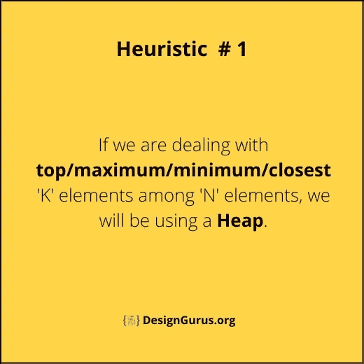
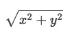
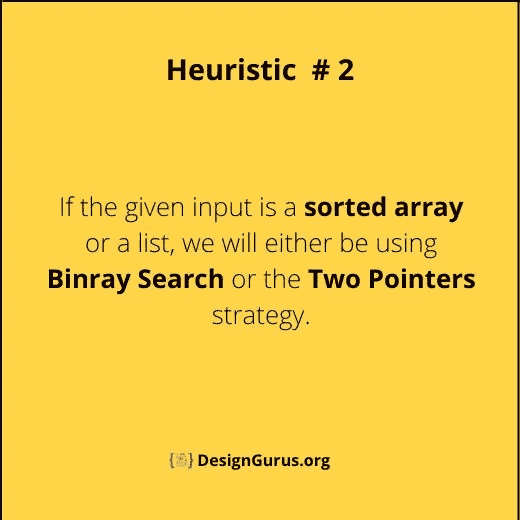
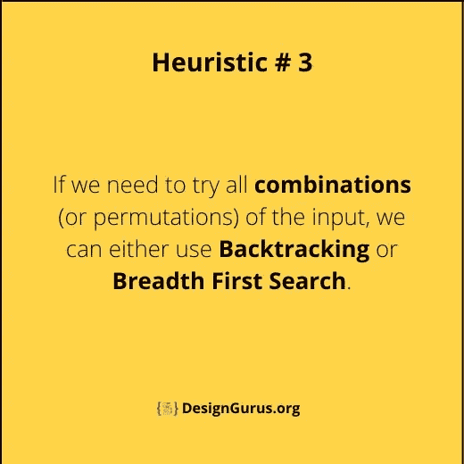
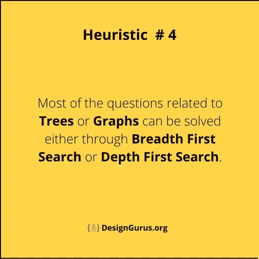
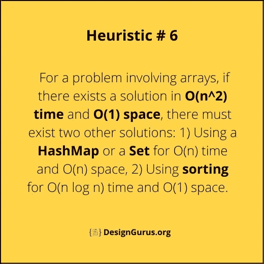
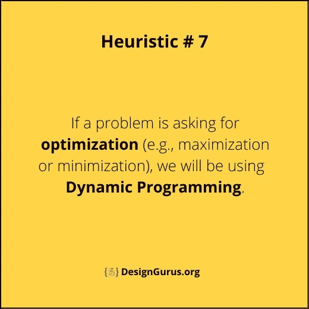
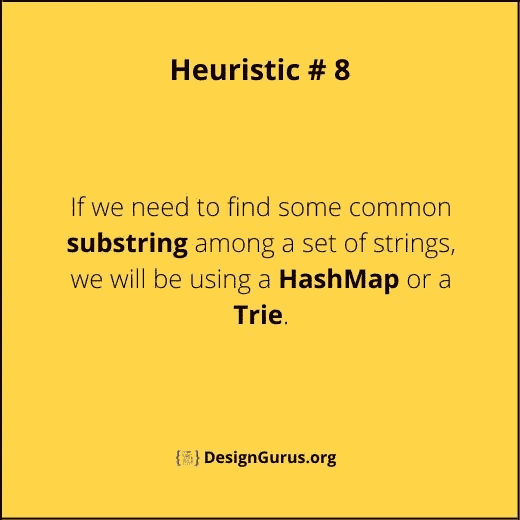
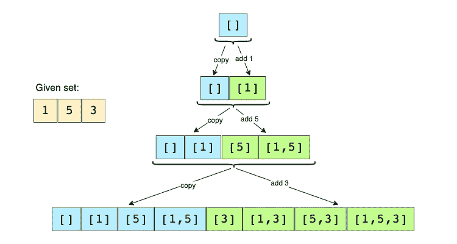
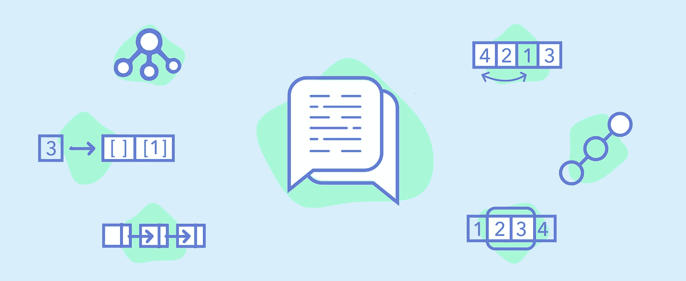

# 面试中解决编码问题的 10 个黄金启发法

> 原文：<https://levelup.gitconnected.com/10-golden-heuristics-for-solving-a-coding-question-in-an-interview-c39c3b75aaf>

如何聪明地准备编码面试？


格伦·卡斯滕斯-彼得斯在 [Unsplash](https://unsplash.com/?utm_source=unsplash&utm_medium=referral&utm_content=creditCopyText) 拍摄的照片

近年来，准备编码面试的过程变得更具挑战性。随着大量高难度编码问题的出现，以及竞争日益激烈的面试过程，仅仅温习关键数据结构和完成一些练习题已经不够了。

> ***在本帖中，我想分享一下我用来准备编码面试的策略。***

我已经做了 15 年左右的软件工程师，在这期间我换了 5 次工作。我经历了大约 30 个面试循环，包括 120 多个面试，也有机会坐在桌子的另一边，参加了 200 多个编码面试和 100 个系统设计面试。

尽管我认为自己是一个相当聪明的工程师，但我发现在白板上解决编码问题很有挑战性，尤其是在我接受评估的面试环境中。为了克服这一点，我花了大量的时间来准备和练习。我遵循系统的方法，每天花两个小时回答 12-15 个问题。这让我在一个月内解决了 350 多个问题。使用这种方法，我成功地面试了 FAANG 公司(脸书、苹果、亚马逊、网飞、谷歌)。

> 我是如何在全职工作的情况下每天练习 12 个以上的编码问题的？

我不只是解决编码问题，而是练习将新问题映射到我已经解决的问题上。我会阅读一个问题，并花几分钟时间试图找到一个我已经熟悉的类似问题。如果我能找到匹配，我将关注新问题的独特约束，以及它们与原始问题有何不同。如果这个问题对我来说是全新的，我会试着去解决它，也会做一些研究，看看其他人是如何解决它的。随着时间的推移，我已经建立了一个问题模式的集合，帮助我快速地将新问题映射到我已经熟悉的问题上。以下是这些模式的一些示例:

1.  如果给定的输入是有序的(数组、列表或矩阵)，我们将使用一种变型的**二分搜索法**或一种**双指针**策略。
2.  如果我们要处理 n 个元素中的前/最大/最小/最近的 k 个元素，我们将使用一个`**Heap**`。
3.  如果我们需要尝试输入的所有组合(或排列)，我们可以使用递归**回溯**或迭代**广度优先搜索**。

遵循这种基于模式的方法帮我节省了很多准备时间。一旦你熟悉了一个模式，你就能够用它解决许多问题。此外，这个策略让我有信心解决未知的问题，因为我一直在练习将未知的问题映射到已知的问题。

在剩下的文章中，我将分享我收集到的所有模式，并给出一些示例问题。关于这些以及相关问题解决方案的详细讨论，请看 [**探索编码面试**](https://www.designgurus.org/course/grokking-the-coding-interview) 。



# 样题: [K 个离原点最近的点](https://www.designgurus.org/path-player?courseid=grokking-the-coding-interview&unit=grokking-the-coding-interview_1628744290707_95Unit)

**问题陈述:**给定一个`2D`平面上的一组点，找出 K 个离原点最近的点。

```
Example: Input: points = [[1,2],[1,3]], K = 1, Output: [[1,2]]
```

## 解决办法

点`P(x,y)`到原点的[欧几里德距离](https://en.wikipedia.org/wiki/Euclidean_distance)可以通过以下公式计算:



我们可以使用一个最大堆来寻找最接近原点的 K 个点。我们可以从堆里推 K 个点开始。在迭代其余的点时，如果一个点(比如 P)比 max-heap 的顶点更靠近原点，我们将从堆中移除该顶点，并添加 P 以始终保持堆中最近的点。

## 密码

这是我们的算法的样子:



# 启发式 3 的示例问题:[子集](https://www.designgurus.org/path-player?courseid=grokking-the-coding-interview&unit=grokking-the-coding-interview_1628744042826_67Unit)

**问题陈述:**给定一个具有不同元素的集合，找出它的所有不同子集。

```
Example: Input: [1, 5, 3]
Output: [], [1], [5], [3], [1,5], [1,3], [5,3], [1,5,3]
```

## 解决办法

我们可以使用广度优先搜索(BFS)方法来生成给定集合的所有子集。我们可以从一个空集开始，逐一遍历所有数字，并将它们添加到现有的集合中，以创建新的子集。

让我们以前面提到的例子来完成我们算法的每一步:

给定集合:[1，5，3]

1.  从空集开始:[[]]
2.  将第一个数字(1)加到所有已有的子集上，创建新的子集:[[]，**[1]]**；
3.  将第二个数(5)加到所有已有的子集上:[[]，[1]，**，【1，5】**；
4.  将第三个数(3)加到所有已有的子集上:[[]，[1]，[5]，[1，5]，**[3]，[1，3]，[5，3]，[1，5，3]，**。

以下是上述步骤的直观表示:



## 密码

这是我们的算法的样子:



[**摸索编码面试**](https://www.designgurus.org/course/grokking-the-coding-interview)

# 结论

遵循这些模式帮助我节省了准备编码面试的时间。请查看 [**搜索编码访谈**](https://www.designgurus.org/course/grokking-the-coding-interview) 以找到更多这样的模式及其示例问题。

看看 [**寻找系统设计面试**](https://www.designgurus.org/course/grokking-the-system-design-interview) 和 [**寻找高级系统设计面试**](https://www.designgurus.org/course/grokking-the-advanced-system-design-interview) 中一些系统设计问题及其答案的好例子。

[](/system-design-interview-survival-guide-2023-preparation-strategies-and-practical-tips-ba9314e6b9e3) [## 系统设计面试生存指南(2023):准备策略和实用技巧

### 2023 年系统设计面试剧本。

levelup.gitconnected.com](/system-design-interview-survival-guide-2023-preparation-strategies-and-practical-tips-ba9314e6b9e3) 

# 感谢阅读

*   👏请为这个故事鼓掌，然后跟我来👉
*   📰查看更多关于[编码和系统设计访谈的内容](https://arslan-ahmad.medium.com/)
*   🔔关注我:[LinkedIn](https://www.linkedin.com/in/arslanahmad/)|[Twitter](https://twitter.com/arslan_ah)|[时事通讯](https://designgurus.org/interview-noodle-page)