# 程序员的 10 个无聊编程笑话

> 原文：<https://levelup.gitconnected.com/10-hilarious-programming-jokes-for-the-programmers-f4daa750c686>

## 幽默

## #1.JDK-20 的特点:低代码来到 Java


使用 Canva 创建

作为一名程序员，你知道我们有独特的幽默感。它通常是令人讨厌的，书呆子气的，有时甚至是彻头彻尾的怪异。但这就是我们喜欢它的原因。

如果你是编程新手，或者只是想找点乐子，那就看看这十个令人捧腹的编程笑话吧。你可能不能理解所有的内容，但是没关系——我们程序员有点书呆子气。😁

哦，别忘了看看描绘生产真实路径的插图。我相信你会认同开发商的情绪。

> ***注意:*** 如果您正在喝热饮，请安全放下后再继续阅读。

# 0.你准备好成为一名高级开发者了吗？

那要看你的视野了。

当小问题蒙蔽了团队中大多数其他开发人员时，你能看到代码中更大的问题吗？

如果是的话，恭喜你！您已经准备好升级您的角色。

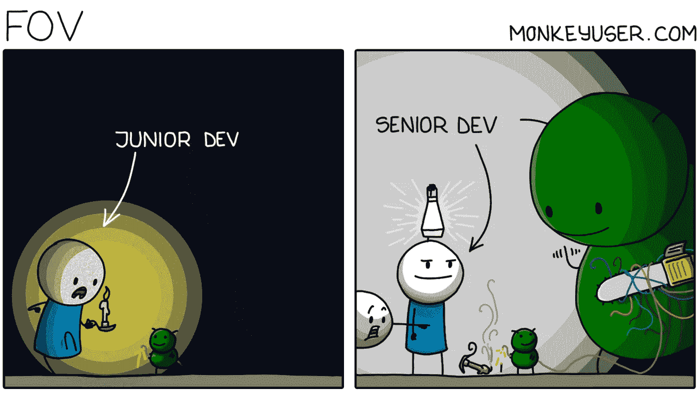

信用:[猴子用户](https://www.monkeyuser.com/2022/fov/)

# 1.JDK-20 的特点:低代码来到 Java

这些预测你怎么看！你对 JDK 20 的设计师有什么建议吗！

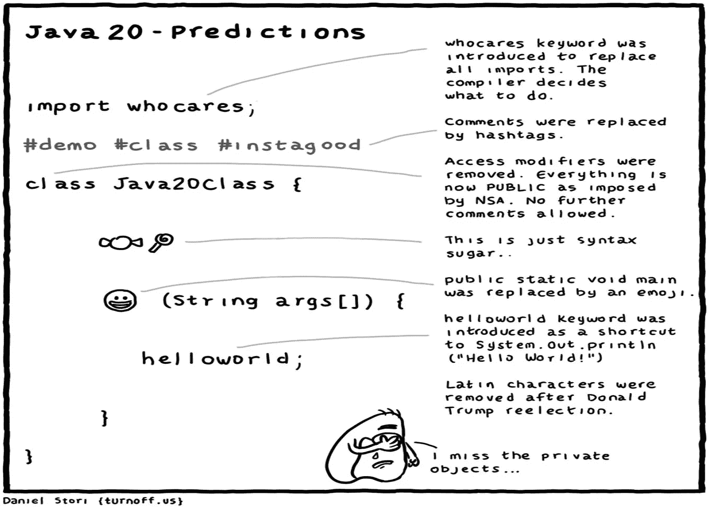

信用:[关断](https://turnoff.us/geek/java20-predictions/)

# 2.知道如何陈述你的事实

数字很重要，但更重要的是人们如何解读它们。

始终确保你呈现的是故事积极的一面。开发人员在他们的生活中已经有足够多的负面因素需要处理。

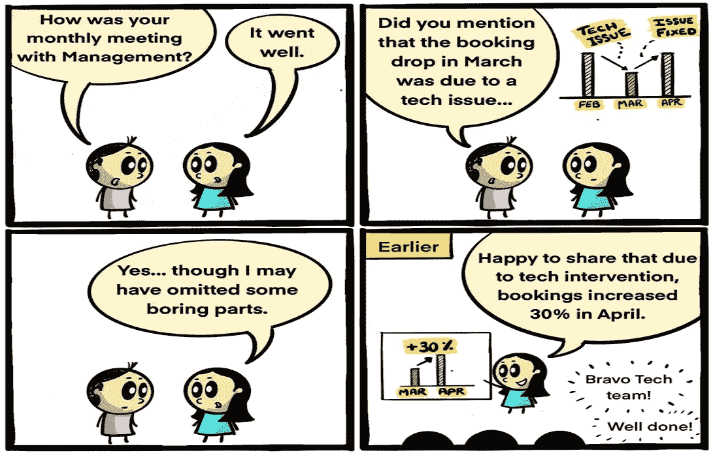

信用:[工作时间](https://workchronicles.com/comics/page/20/)

# 3.诚实计数

我认识的大多数开发人员经常这样做。😃你不要！

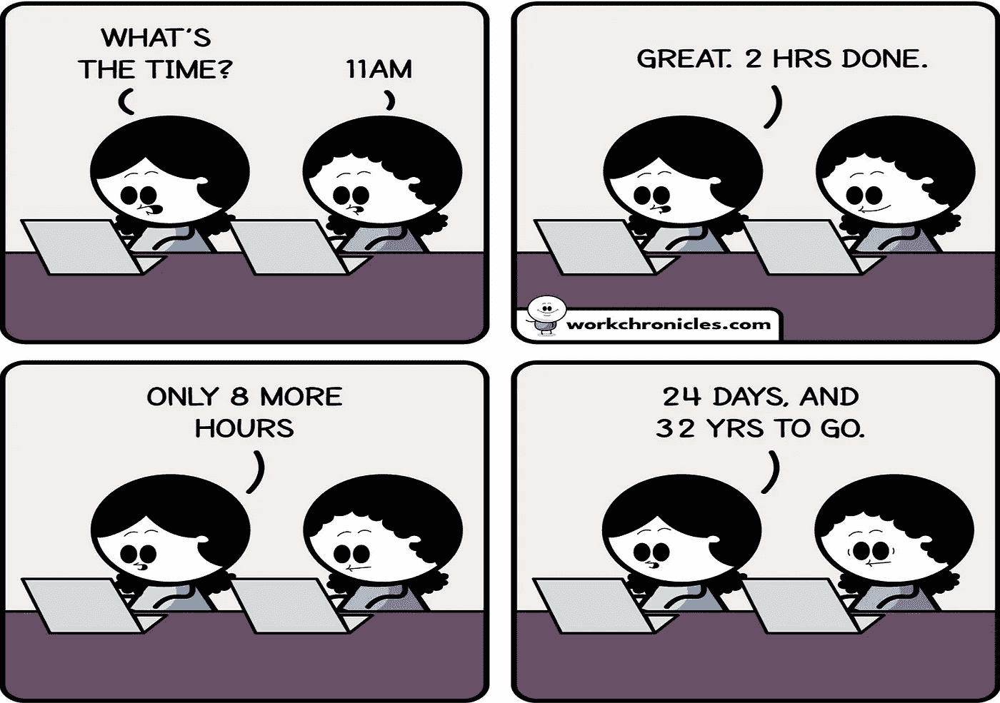

信用:[工作时间](https://workchronicles.com/comics/)

# 4.如果你不知道它的作用，就不要碰它

有多少次程序员想象他们修复了一个缺陷，却移除了一个补洞的补丁？

除非我们每次都能得到一毛钱...😉

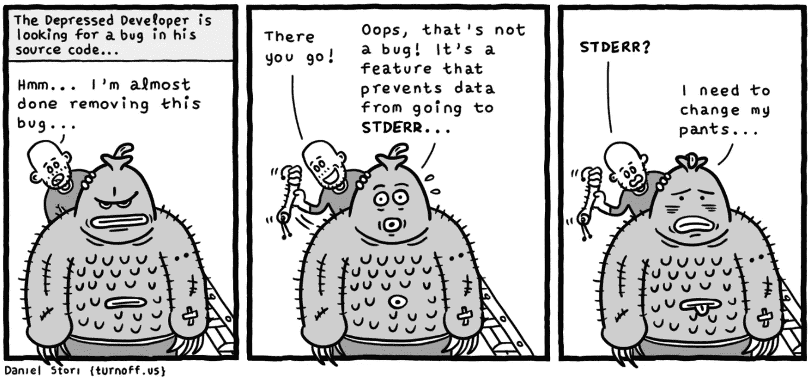

信用:[关闭](https://turnoff.us/geek/the-depressed-developer-5/)

# 5.长时间工作谬论

有一种普遍的误解，认为在系统上花很长时间的开发人员比那些花很少时间的开发人员要好。

一些程序员更进一步，通过在午夜发送电子邮件来证明他们在熬夜工作，以此来证明他们是勤奋的。

努力工作——也许吧。富有成效——尽管不确定。

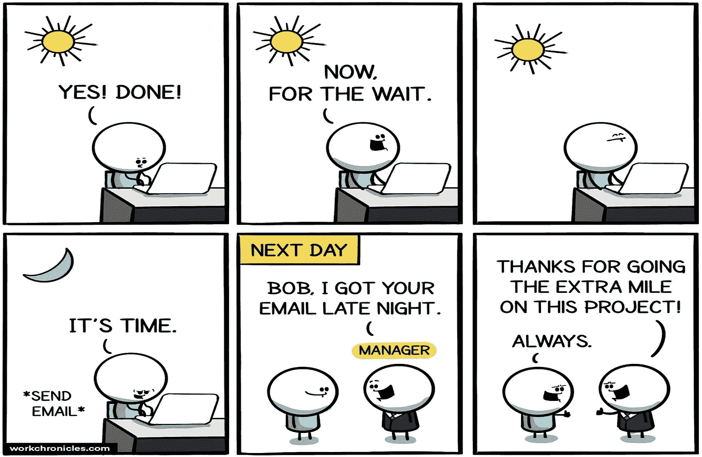

信用:[工作时间](https://workchronicles.com/comics/page/14/)

# 6.谁创造了这些缺陷？

如果你是一名程序员，你应该知道我们有多讨厌从待办事项中挑出一个缺陷。我们大多数人只对新的需求感到兴奋。

但是，我经常想，是谁首先创造了这些缺陷！

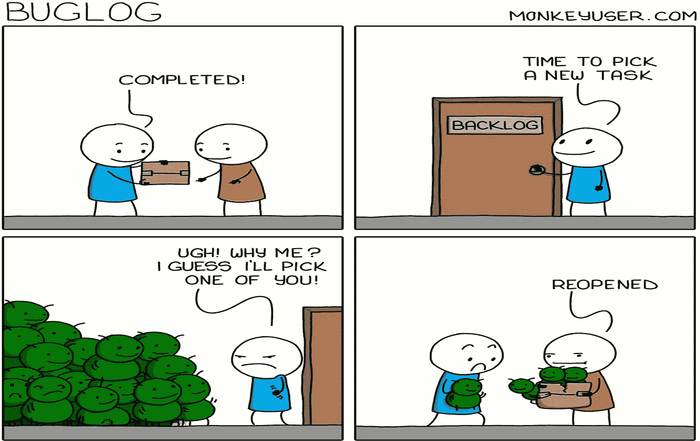

信用:[猴子用户](https://www.monkeyuser.com/2022/buglog/)

# 7.老板永远是正确的

如果你在软件行业做过至少几个月的开发人员，你一定遇到过这种情况。

明智的建议——永远不要反驳老板。提出你的建议，但要听从老板的话。

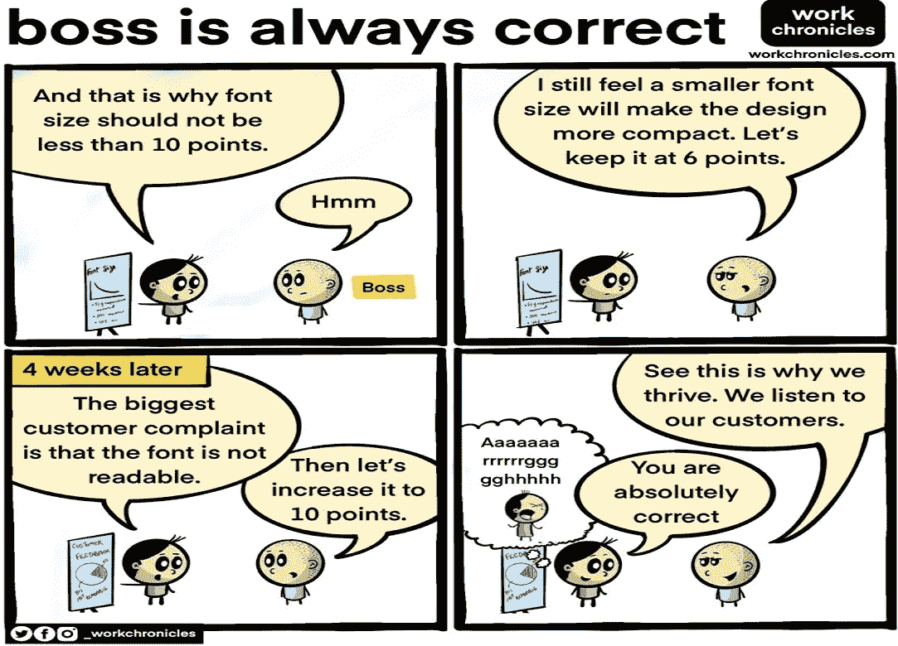

信用:[工作时间](https://workchronicles.com/comics/page/20/)

# 8.真正的生产之路

告诉我你没有经历过程序员的道路。

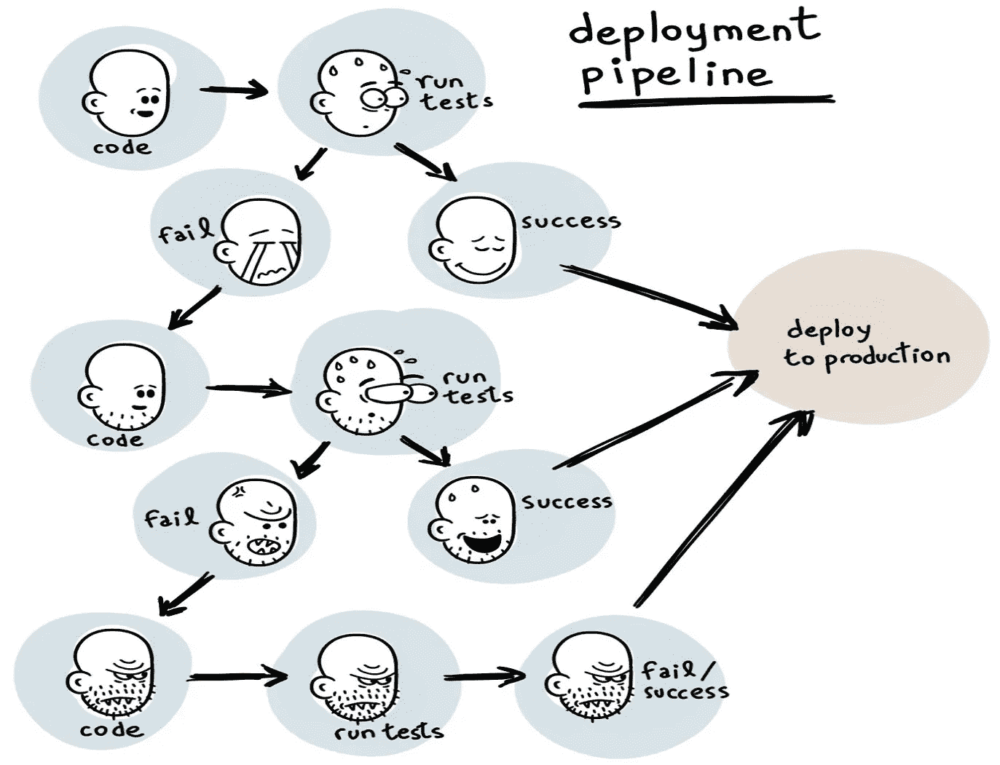

信用:[道岔](https://turnoff.us/geek/deployment-pipeline/)

# 9.周末愉快的秘诀

从周五下午开始停止查看你的工作邮件。

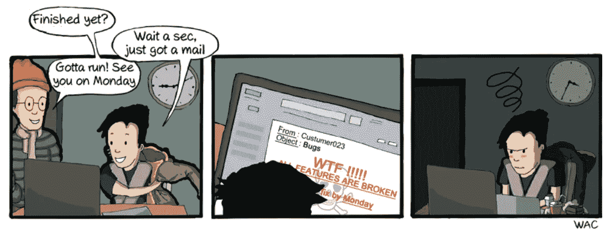

信用: [CommitStrip](https://www.commitstrip.com/en/2012/03/09/friday-night/)

# 奖金:我知道我们都喜欢一点点奖金

如果你在家工作(现在我们中十个有九个是这样)，你知道下面的插图离家很近。

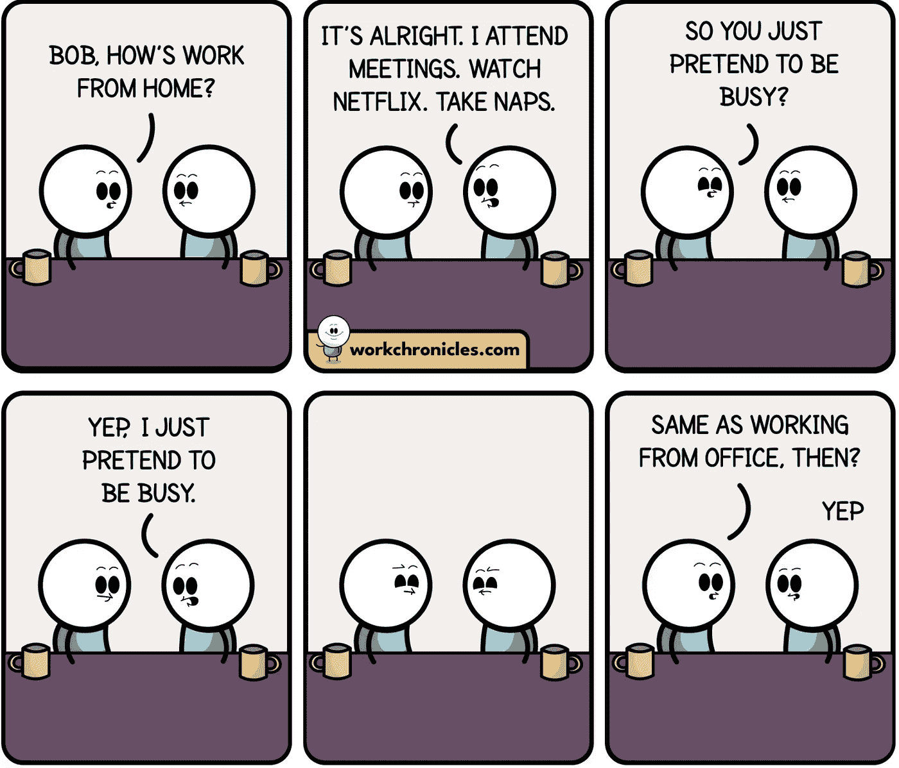

信用:[工作时间](https://workchronicles.com/comics/)

```
Thanks for laughing while reading. If you like reading my articles, [**you can become a Medium member by visiting this link**](https://lokajit-tikayatray.medium.com/membership) to support my writing.
```

**您可能也想阅读:**

[](/9-must-have-skills-to-call-yourself-a-senior-developer-aa0932a629cd) [## 自称高级开发人员的 9 项必备技能

### 看看你是否已经掌握了这些技能。如果没有，学习这些技能，成为一名真正的高级开发人员。

levelup.gitconnected.com](/9-must-have-skills-to-call-yourself-a-senior-developer-aa0932a629cd) [](/this-is-why-most-programmers-fail-to-become-senior-developer-143bc8c1342d) [## 这就是为什么大多数程序员没能成为高级开发人员

### 5 个习惯可以证明你还没有为下一个角色做好准备

levelup.gitconnected.com](/this-is-why-most-programmers-fail-to-become-senior-developer-143bc8c1342d) [](/5-signs-of-a-highly-mature-software-developer-a23285e5cf1b) [## 高度成熟的软件开发人员的 5 个标志

### 这些特征很容易识别，但很难实践

levelup.gitconnected.com](/5-signs-of-a-highly-mature-software-developer-a23285e5cf1b)