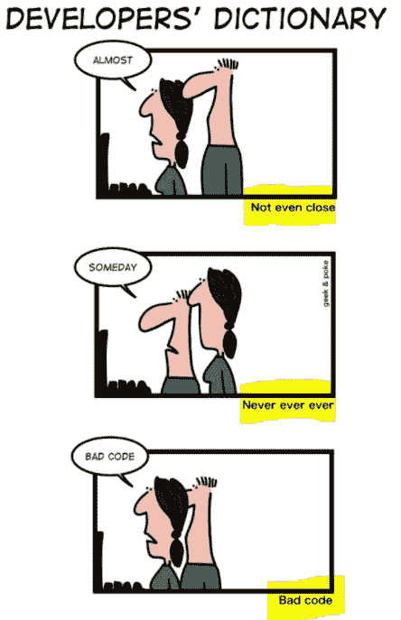
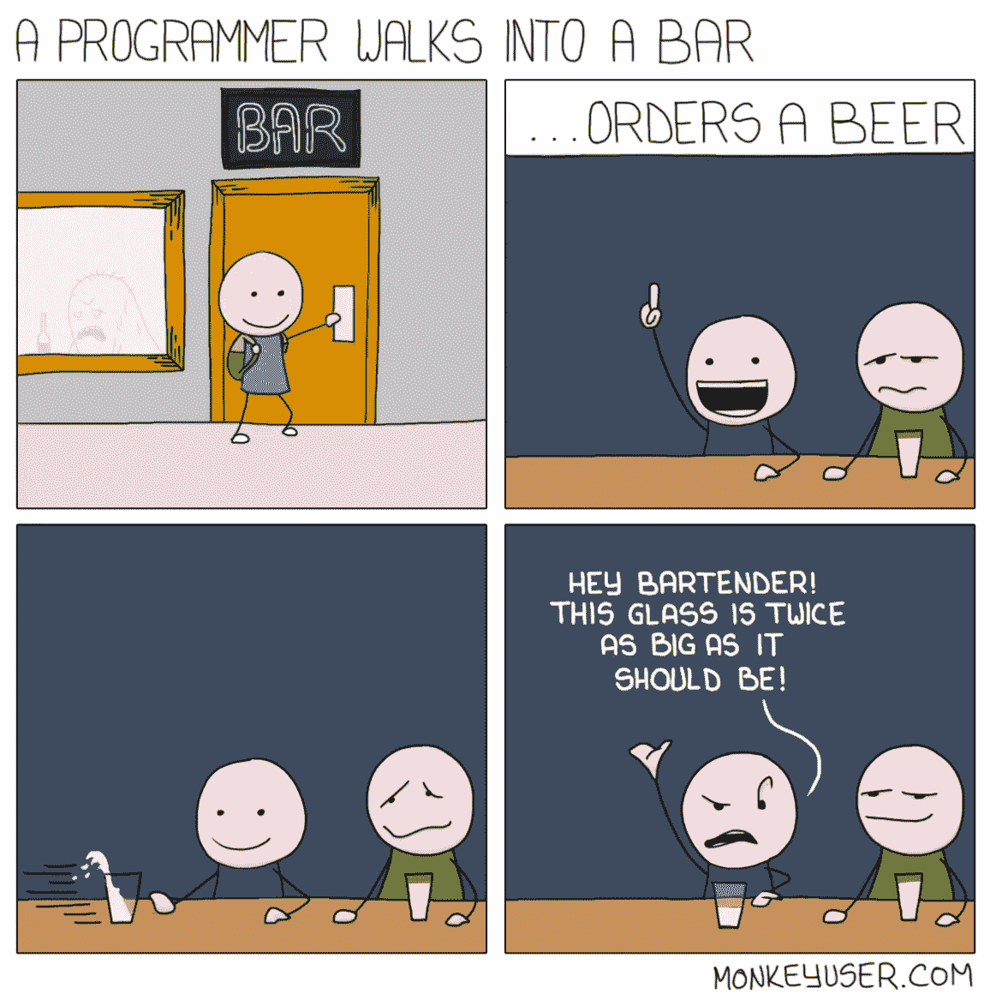
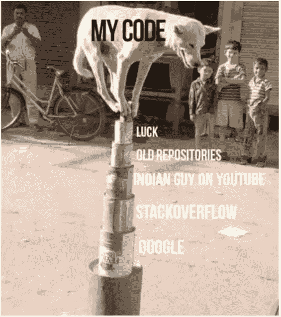
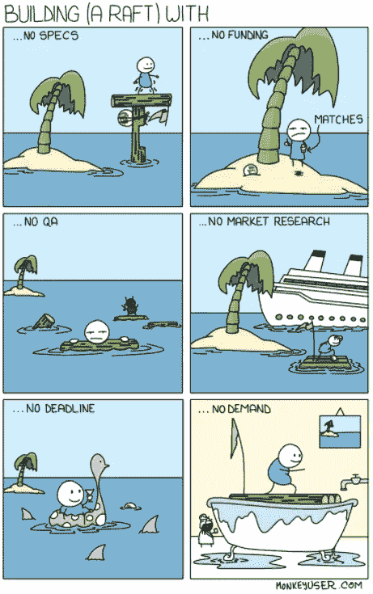
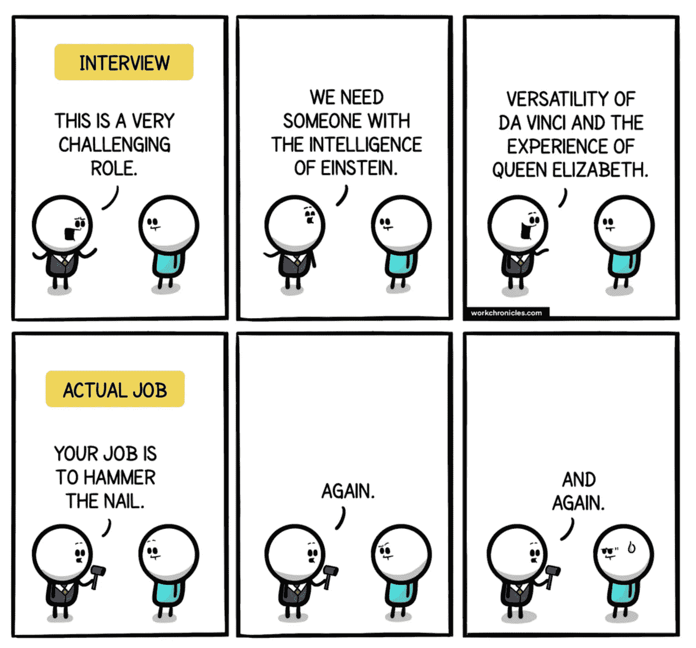
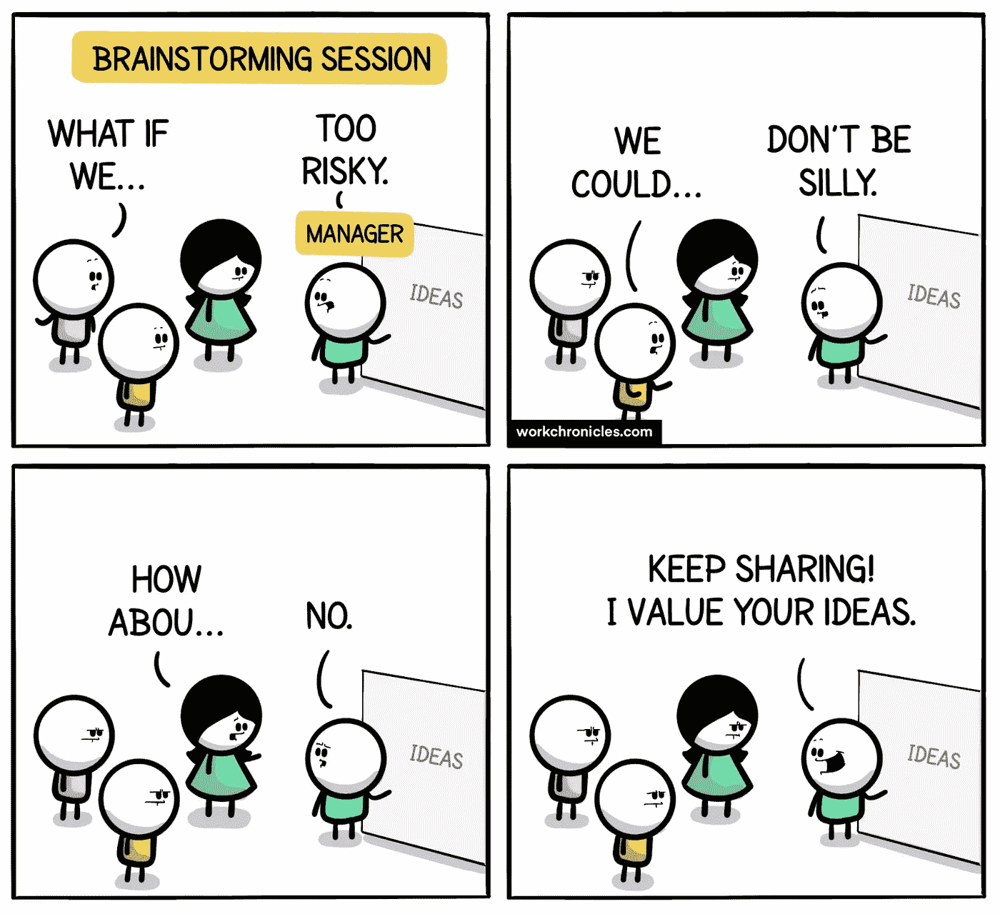
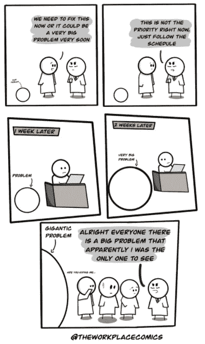
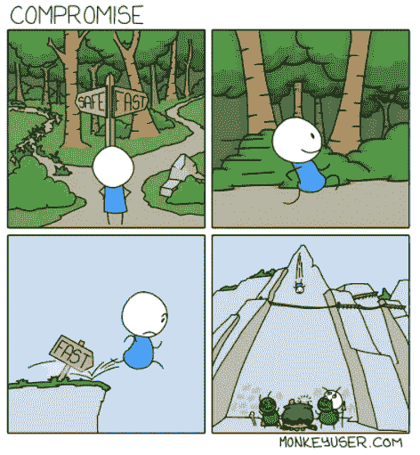
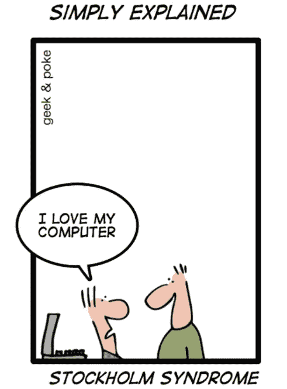

# 10 个搞笑的编程笑话，只为你

> 原文：<https://levelup.gitconnected.com/10-hilarious-programming-jokes-just-for-you-eadd1d5a8a8f>

## 幽默

## 软件工程师生活中的笑话来逗你开心

图片来自 [Pixabay](https://pixabay.com/?utm_source=link-attribution&utm_medium=referral&utm_campaign=image&utm_content=1531128) 的 [seojob](https://pixabay.com/users/seojob-2952681/?utm_source=link-attribution&utm_medium=referral&utm_campaign=image&utm_content=1531128)

程序员永不放弃的态度使他们创造出令人难以置信的软件。让我们来看看这些勇敢的软件开发人员的生活——他们不仅认真对待自己的工作，还知道如何以自己独特的方式享受生活。

> **注意:**如果你正在喝热饮，请在继续阅读前安全放下。

# 0.所有的开发人员都说同一种语言

信用:[极客戳](https://geek-and-poke.com/geekandpoke/2017/2/5/developers-dictionary)

# 1.程序员的视角总是比世界上的其他人都独特

信用:[monkeyuser.com](https://www.monkeyuser.com/2017/programmer-walks-into-bar/)

# 2.任何成功代码的主要组成部分😆

贷方: [u/MTPROJECTS](https://www.reddit.com/user/MTPROJECTS/)

# 3.总有一个库比我的代码做得更好

作者使用 kapwing.com 创建的图像

# 4.如果你把它留给开发者，这就是软件的开发方式

信用:[monkeyuser.com](https://www.monkeyuser.com/2018/building-a-raft/)

# 5.程序员必须经历的技术面试的现实

信用:[workchronicles.com](https://workchronicles.com/oh-the-hype/)

# 6.只要我们在采访的主题上

credit:[u/the workplace comics](https://www.reddit.com/r/ProgrammerHumor/comments/lsdqjl/but_we_only_want_to_hire_one_developer/)

# 7.Uggh！那些头脑风暴会议

信用:[workchronicles.com](https://workchronicles.com/we-value-your-ideas-they-said/)

# 8.除非经理说有问题，否则这不是问题

鸣谢: [u/TheWorkPlaceComics](https://www.reddit.com/r/comics/comments/lgzw5x/oc_just_follow_the_schedule/)

# 9.安全什么时候变得有趣了！

信用:[monkeyuser.com](https://www.monkeyuser.com/2018/compromise/)

# 奖金:我知道我们都喜欢一点点奖金

现在你知道为什么每个开发人员都喜欢他们的计算机了😅

信用: [geek-and-poke](https://geekandpoke.typepad.com/.a/6a00d8341d3df553ef0133f54ae12f970b-pi)

**感谢你阅读时的欢笑。** [**我很想得到你对我未来文章的建议**](https://app.joinpalette.com/t/amas/f0RZEWbYwzRmdFxE2vnL) **。如果你想转到更有趣的话题，你可能会喜欢读:**

 [## 10 个终极编程笑话

### 程序员生活中的笑话来逗你开心

levelup.gitconnected.com](/10-ultimate-programming-jokes-96660ff1f92c)  [## 互惠如何帮助我在我的软件生涯中获胜

### 你也可以利用互惠行动的良性力量来建立信任，并在你的…

levelup.gitconnected.com](/how-reciprocity-helps-me-win-in-my-software-career-9f9467224f1c)