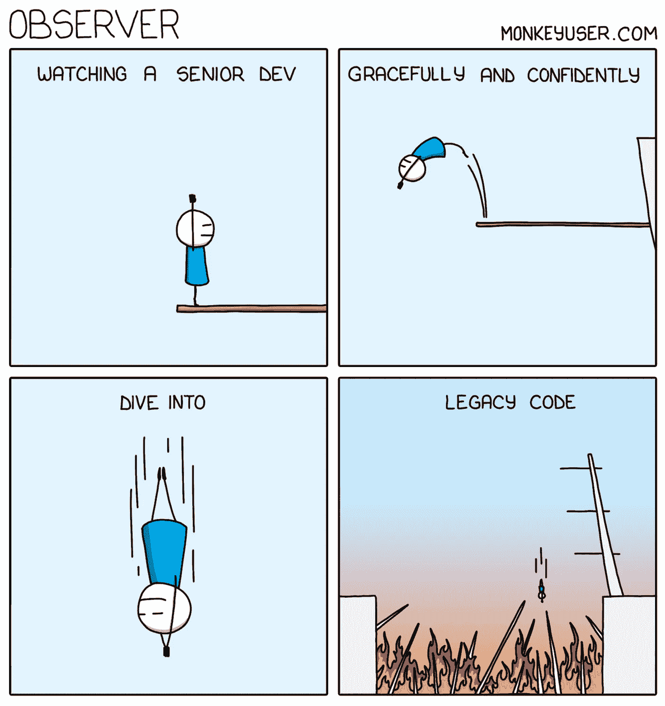
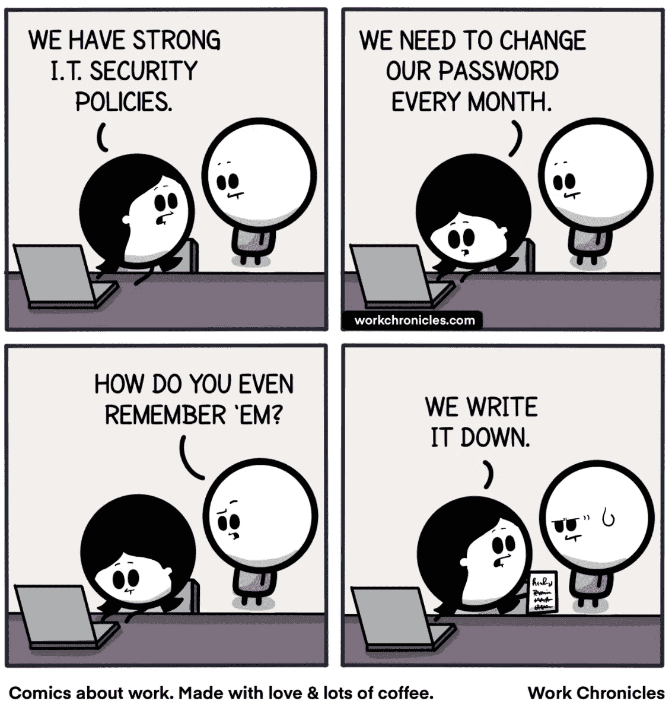
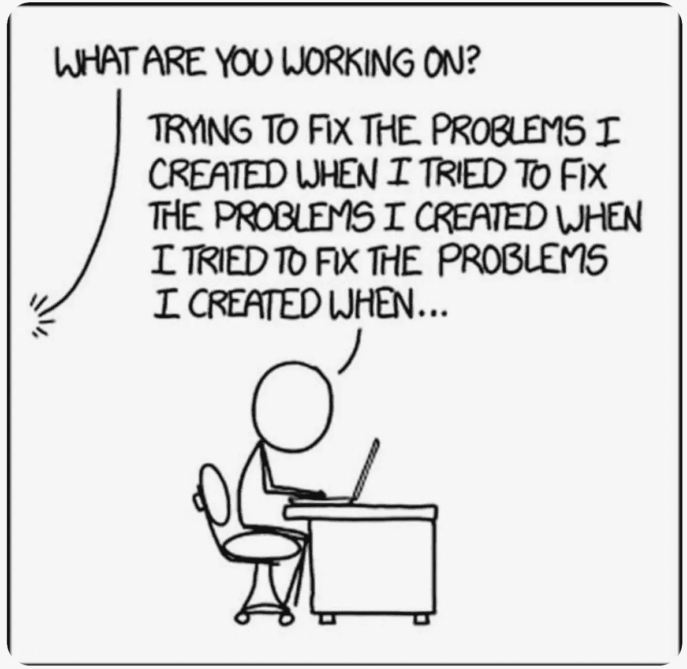
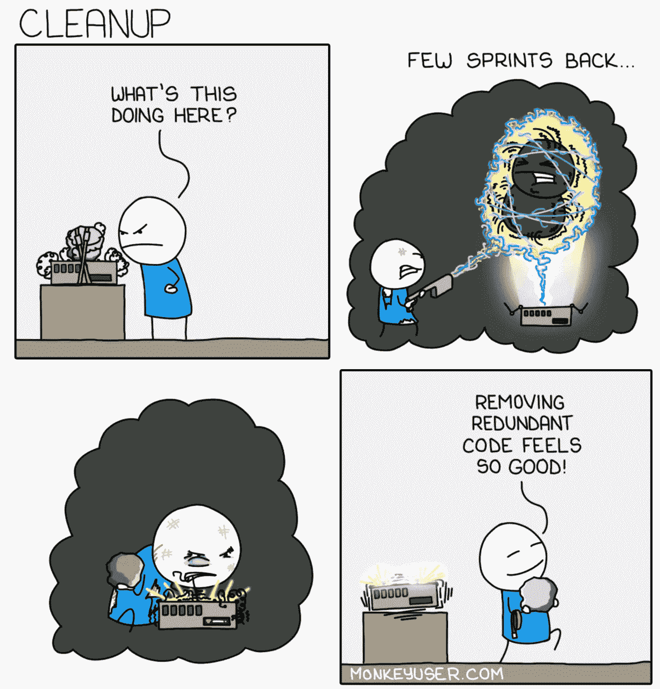
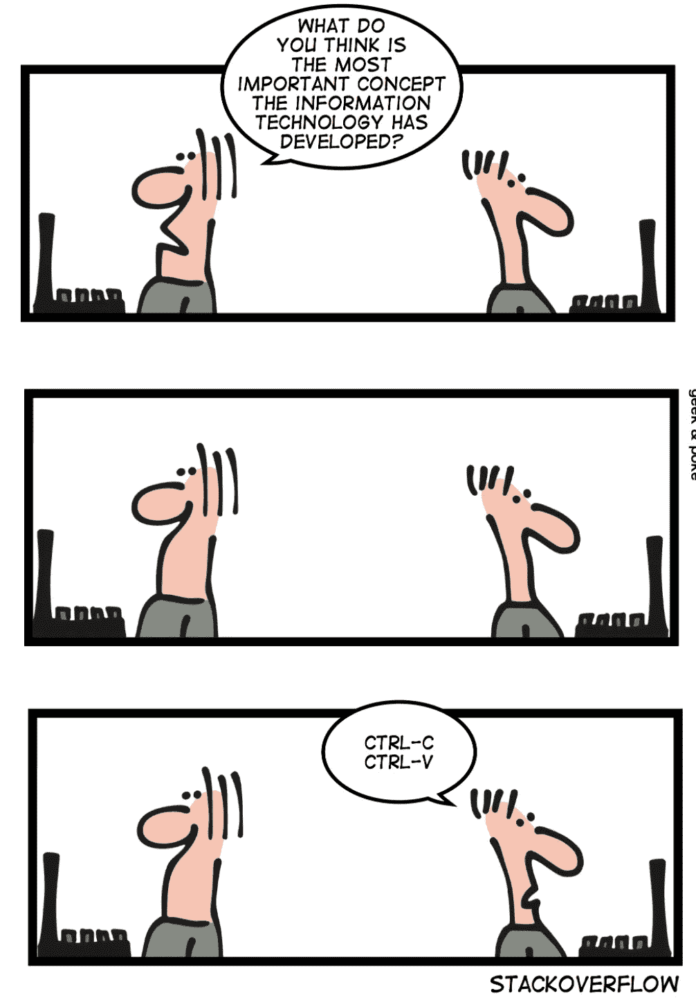
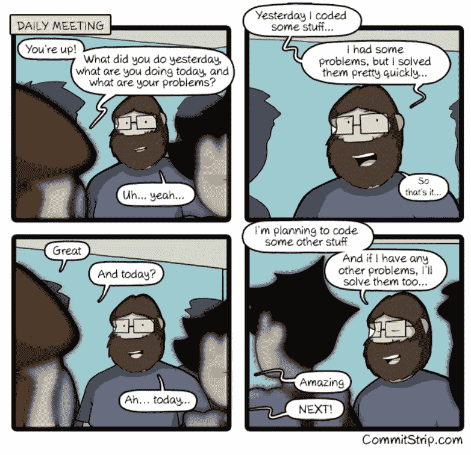
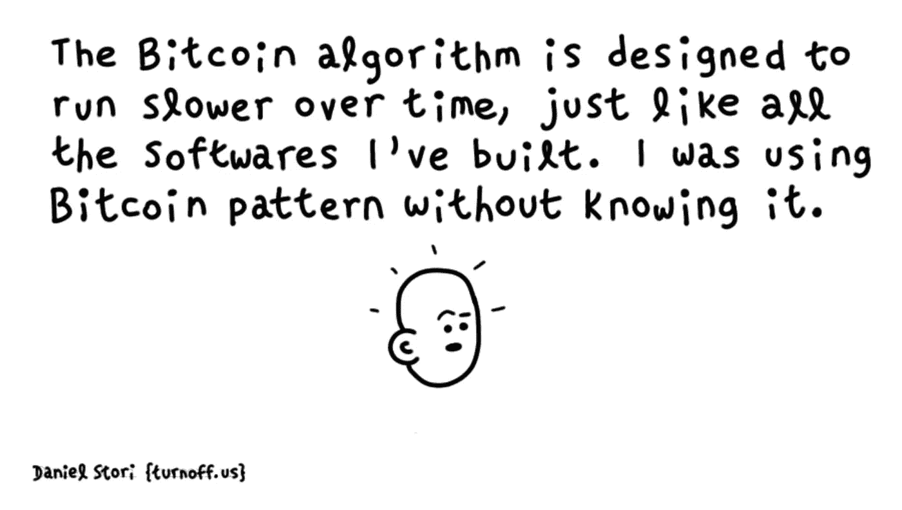
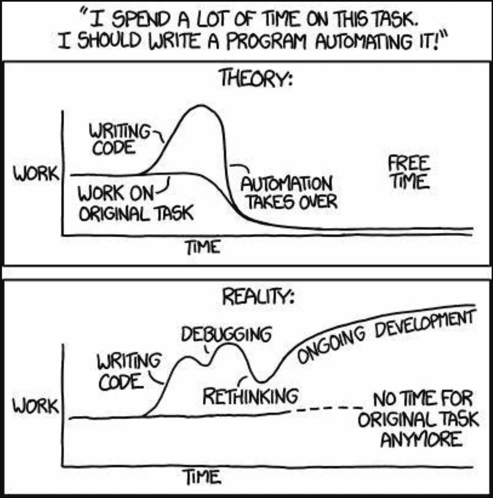
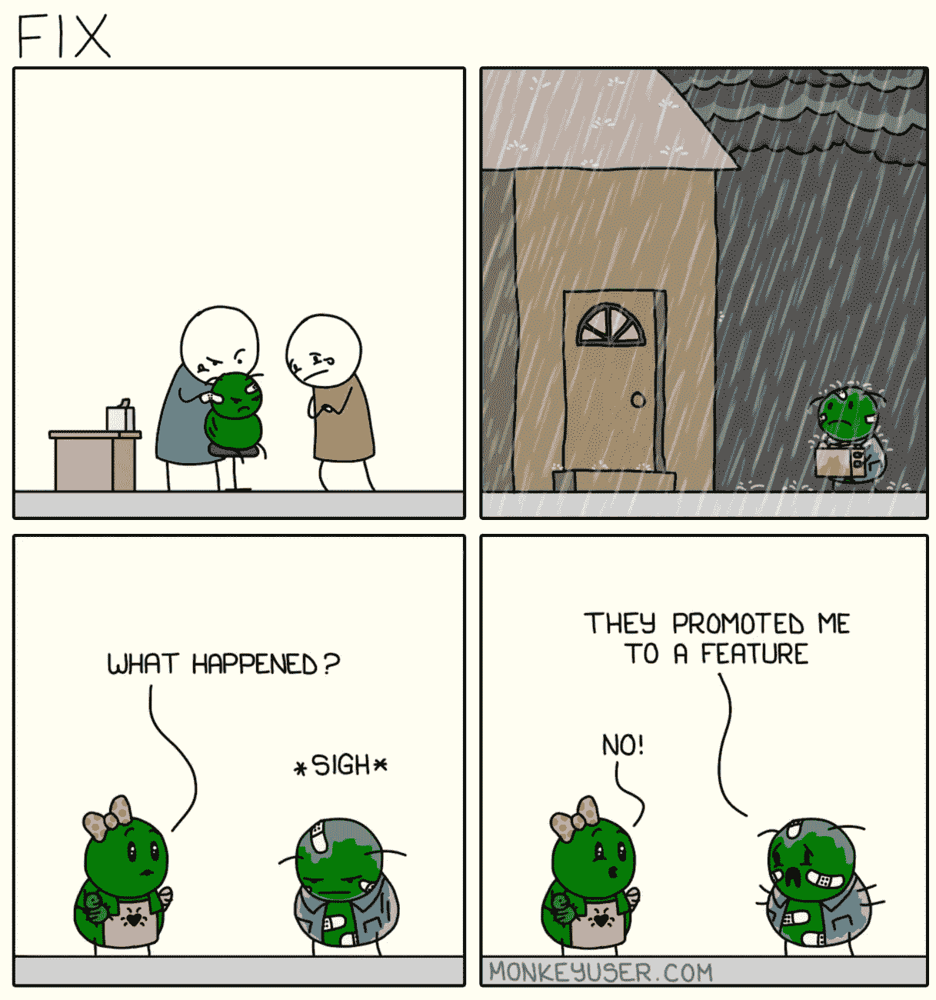
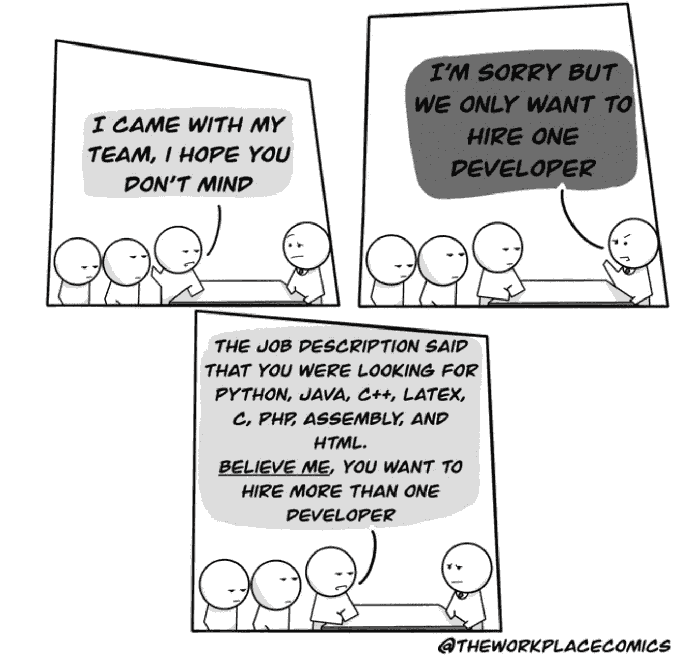

# 让你疯狂的 10 个搞笑编程笑话

> 原文：<https://levelup.gitconnected.com/10-hilarious-programming-jokes-to-make-you-go-rofl-2e1ab8182b1d>

## 幽默

## 程序员日常生活中的笑话逗你笑骨

来自 [Pexels](https://www.pexels.com/photo/photo-of-a-woman-laughing-wearing-black-top-2219118/?utm_content=attributionCopyText&utm_medium=referral&utm_source=pexels) 的 [Rodolfo Quirós](https://www.pexels.com/@rquiros?utm_content=attributionCopyText&utm_medium=referral&utm_source=pexels) 摄影

与普遍的看法相反，程序员的生活充满了令人兴奋的行为。从外表上看，它可能显得单调乏味。但是如果你看一眼软件程序员的内心世界，你会惊讶于它的快节奏。

这里有十个来自这类程序员生活中的搞笑笑话，让你乐不可支。

# 0.天生勇敢的高级开发人员

遗留代码无处不在。你今天写的东西几年后就会变得陈旧和有缺陷。需求不断变化，补丁不断增加，忙碌的程序员忘记遵循编码标准，等等。使得新来的人很难理解遗留代码。

毫无疑问，大多数新程序员都想远离遗留代码。但是高级开发人员是一个不同的群体。他们知道如何自信地处理旧应用程序中的任何问题。他们优雅地浏览数千行代码，解决任何问题都像小菜一碟。

信用:[猴子用户](https://www.monkeyuser.com/2021/observer/)

# 1.安全不能是事后的想法

如今，每个组织都非常重视其应用和网络安全。他们每个人都实施了最佳的 IT 安全策略来保护他们的数据安全。其中一项政策规定每隔几周更换一次密码。

确保在每个需要新密码的文件中更新它们是一件痛苦的事情。如果你忘记更新甚至一个地方，你的帐户将被锁定。嗯，我知道你可以使用软件来集中密码存储和自动更新。但是你如何记住你自己需要使用的密码呢！

信用:[工作时间](https://workchronicles.com/)

# 2.缺陷兔子洞

大多数软件专家建议从一开始就编写高质量的代码是有原因的。一旦你有一些缺陷，你将不断地与时间赛跑去修正它们。

由于时间紧迫，您将被迫发布补丁来修复问题，并从补丁中创建新的补丁。现在你有更短的时间来修复新的缺陷。更多补丁。更多问题。如此循环往复。

信用: [xkcd](https://xkcd.com/1739/)

# 3.如果它没坏就不要修理它

编程的黄金法则——不要修改没有损坏的代码，尤其是当你不明白这段代码在做什么的时候。你永远不知道那几行看似无用的代码会驯服哪种可怕的 bug。

信用:[猴子用户](https://www.monkeyuser.com/2019/cleanup/)

# 4.信息技术最重要的概念

问任何一个开发者，他们都会证实——复制和粘贴是计算机提供的最好的帮助之一。

从事遗留代码工作，不知道如何获取一些数据？搜索已经获取相同数据的文件，然后使用复制-粘贴魔法。在 StackOverflow 上找到一个解决方案，复制粘贴到你的代码里，你就是天才。当你这么做的时候，不要忘记理解被复制的代码是做什么的，否则你很快就会有麻烦。

鸣谢: [Geekandpoke](https://geekandpoke.typepad.com/.a/6a00d8341d3df553ef017d404b38d2970c-pi)

# 5.保持简单

软件开发人员喜欢通用的和可重用的东西。为什么不把知识扩展到日常单口相声，每天重复同样的对话！保持它的简单和通用，这样你就可以毫不费力地反复使用它。

信用: [CommitStrip](https://www.commitstrip.com/en/2020/10/01/daily-meeting/)

# 6.你可能是一个隐藏的天才

现在全世界都在谈论比特币。一些人在谈论它使用的技术，另一些人在谈论通过它发的财。如果你不知道，比特币被编程为定期调整其难度级别，以确保以稳定的速度挖掘新块。

嗯，有什么新鲜的！随着时间的推移，几乎所有的软件都变得难以使用，尽管这是无意的，原因也与中本聪的比特币计划不同。

信用:[关闭.美国](https://turnoff.us/geek/the-bitcoin-design-pattern/)

# 7.开发商之间的长期争论

几十年来，程序员们为了确定哪种语言是最好的而相互争斗。许多算命师已经多次预言了一种或另一种编程语言的死亡。

我不明白关于哪种语言更好的争论。这可能是因为我还没有获得 100%的知识。或者可能我见过很多这样的预言一次又一次的延长期限。

信用:[关闭.美国](https://turnoff.us/geek/programming-languages-battle/)

# 8.自动化还是不自动化

自动化一个平凡的任务是每个软件开发人员引以为豪的成就。编写一些代码，编写流程脚本，让它自动完成工作。你现在会有很多空闲时间去做其他创新的任务。

通常这个善意的计划的结果是相反的。

信用: [xkcd](https://xkcd.com/1319/)

# 9.如果它在生产中，它就是一个特性

当您在部署前几分钟发现一个缺陷，并且不知道如何修复它时，您会怎么做？只是将行为作为应用程序的一个特性来推广。将其部署到生产环境中。

如果用户发现，最坏的情况，他们会说他们不想要这个特性。但是没有人会抱怨你将一个已知的缺陷发布到产品中。很聪明，不是吗！

信用:[猴子用户](https://www.monkeyuser.com/2020/fix/)

# 奖金:我知道我们都喜欢一点点奖金

请把 AI/ML，大数据，Azure，GCP，AWS，区块链加到列表里。

鸣谢:[工作场所漫画](https://www.reddit.com/user/TheWorkPlaceComics/)

**感谢阅读时的欢笑。您可能还想阅读:**

 [## 3 分钟内 101 个令人捧腹的编程笑话

### 你了解二进制吗？别担心，这些笑话仍然会逗得你捧腹大笑。

levelup.gitconnected.com](/101-hilarious-programming-jokes-in-3-minutes-6a2ebcd81f56)  [## 缺乏经验的程序员的 7 大标志

### 了解这些迹象，这样你就不会在你的软件开发生涯中犯同样的错误

levelup.gitconnected.com](/top-7-signs-of-an-inexperienced-programmer-5fc3f04658f3) 

# 分级编码

感谢您成为我们社区的一员！[订阅我们的 YouTube 频道](https://www.youtube.com/channel/UC3v9kBR_ab4UHXXdknz8Fbg?sub_confirmation=1)或者加入 [**Skilled.dev 编码面试课程**](https://skilled.dev/) 。

 [## 编写面试问题+获得开发工作

### 掌握编码面试的过程

技术开发](https://skilled.dev)