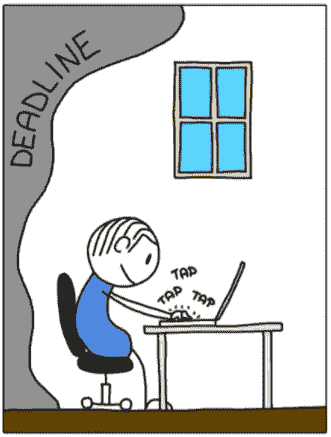

# 让你开怀大笑的 10 个令人捧腹的编程笑话

> 原文：<https://levelup.gitconnected.com/10-hilarious-programming-jokes-to-make-you-laugh-hard-9959cbdccb47>

## 幽默

## 即使你不是程序员，这些笑话也会让你的一天变得更好

使用 kapwing.com 创建的图像

程序员热爱他们的工作。而且，为什么不呢！他们试图让世界变得更美好，一次一个软件。

软件开发是一个要求很高但令人兴奋的职业。每个开发人员都知道如何努力工作，同时也知道如何在日常工作中获得乐趣。这就是程序员的生活如此令人兴奋的原因。

在这里，我以笑话和连环画的形式向您展示了这些杰出开发人员生活中的十件趣事。请坐下来享受。我确信这些笑话中的一些会让你笑得前仰后合。

> **注意:**如果您正在喝热饮料，请在进一步阅读前安全放下。

# 0.截止日期 PUB-G 风格

信用: [MokeyUser](https://www.monkeyuser.com/2017/deadline/)

没有截止日期的软件项目毫无乐趣可言。截止日期让程序员保持警觉。越接近，程序员越努力完成他们的任务。

哦，等等，笑话还没完呢。一直读到最后的奖金笑话，看看程序员接下来会发生什么。

# 1.你只是被你的想象力所限制

信用:[猴子用户](https://www.monkeyuser.com/2021/fill-in-the-gaps/)

按照规则，程序员需要根据给定的规范开发应用程序。这意味着必须有人在规范中明确地详述需求，这很少发生。

模糊的需求规格给了开发人员做出自己假设的自由。好吧，与其说是假设，不如说是创造力。上图显示了当开发人员试图发挥创造力时会发生什么。

# 2.52%的开发人员有时会在梦中编码

学分:[百科](http://thecoderpedia.com)

是的，确实如此。该统计数据基于 2019 年的一项真实调查。

无论如何，当你的大脑过度工作时，它很难集中注意力。但是它喜欢在你正要小睡的时候捉弄你。我确信每个开发人员至少有一次在睡梦中(或试图入睡时)找到了解决方案。

# 3.如何学习新东西

信用:[工作时间](https://workchronicles.com/learn-new-things/)

为了软件的持续增长，每个程序员都需要跟上市场趋势。他们需要经常学习新技术或编程语言。

随着工作年限的增长，程序员对他们的应用程序、首选工具和编程语言变得驾轻就熟。一旦你进入舒适区，学习新的东西就变得更加困难。

# 4.开发者的冒险；用户的噩梦

信用:[猴子用户](https://www.monkeyuser.com/2021/adventure/)

软件开发人员天生喜欢冒险。他们热爱挑战，并以参与复杂项目为荣。

这一切都很好，直到他们把界限推得足够远，创造出不必要的复杂性。开发者冒险主义的一个常见因果是用户体验。

# 5.代码冻结的神话

鸣谢:[极客&戳](https://geek-and-poke.com/geekandpoke/2015/3/25/code-freeze)

代码冻结帮助团队在稳定的版本上测试和部署代码。它减少了部署日之前最后一分钟出现意外的机会。

不幸的是，代码冻结日期很少是一成不变的。它会一直移动，直到日间团队将其部署到生产中。

# 6.样本可能具有欺骗性

信用:[猴子用户](https://www.monkeyuser.com/2021/new-library/)

一个新图书馆看起来总是很有希望。开发人员在概念验证中试用它，并稍加调整就能使它工作。该团队很高兴有一个方便的现成解决方案，而不是从头开始编写整个东西。

在您将该库用于真实世界的用例之前，一切看起来都很好。一旦你开始使用，除了不择手段地让它适合你之外，你没有更容易的方法退出。

# 7.如何选择一个 Javascript 框架

信用: [CommitStrip](https://www.commitstrip.com/en/2015/09/16/how-to-choose-the-right-javascript-framework/)

[Javascript 是 2021 年最流行的语言](/top-3-most-popular-programming-languages-in-2021-d514d57096)。它在开发人员社区中越来越受欢迎。

开发人员可以根据自己的喜好从众多可用的框架中进行选择。同时，框架计数也是一个缺点，因为很难决定选择哪一个。

# 8.猜测

信用:[猴子用户](https://www.monkeyuser.com/2020/estimates/)

无论你尝试多少次，你都不可能得到一个完美的估计。在确定需求规模时，涉及到太多的变量，很难将它们都考虑进去。这就是为什么这些估计几乎总是“大概的”。

# 9.你永远不知道你在登录什么

贷方: [CommitStrip](https://www.commitstrip.com/en/2015/12/16/when-youve-been-keeping-a-project-running-by-the-skin-of-your-teeth/)

跟踪谁在他们的项目中做什么几乎是不可能的。每个开发人员都有自己的设计和执行风格。除非你是工作的一部分，否则接手管理他们项目的责任是不明智的，即使只有几天。

# 奖金:我知道我们都喜欢一点点奖金

好了，是时候结束我们开始的笑话了。

如果团队不能在给定的时间内完成工作，就不得不推迟最后期限。但是一旦他们有了额外的时间，拖延症就开始了。

信用: [MokeyUser](https://www.monkeyuser.com/2017/deadline/)

如果您还不是 Medium， [**的付费会员，您可以通过访问此链接**](https://lokajit-tikayatray.medium.com/membership) 进行注册。你可以无限制地阅读媒体上的所有报道。我会收你一部分会员费作为介绍费。

**感谢阅读时的欢笑。您可能还想阅读:**

 [## 缺乏经验的程序员的 7 大标志

### 了解这些迹象，这样你就不会在你的软件开发生涯中犯同样的错误

levelup.gitconnected.com](/top-7-signs-of-an-inexperienced-programmer-5fc3f04658f3)  [## 2021 年最受欢迎的 3 种编程语言

### 他们每个人的最新趋势报告和年薪估计

levelup.gitconnected.com](/top-3-most-popular-programming-languages-in-2021-d514d57096)  [## 让你疯狂的 10 个搞笑编程笑话

### 程序员日常生活中的笑话逗你笑骨

levelup.gitconnected.com](/10-hilarious-programming-jokes-to-make-you-go-rofl-2e1ab8182b1d)