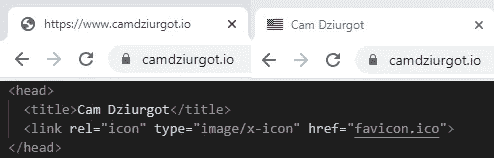
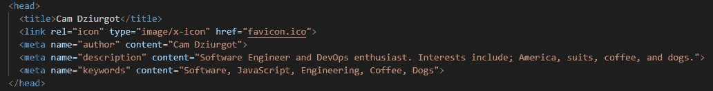
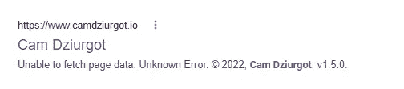
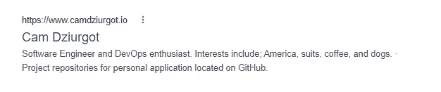
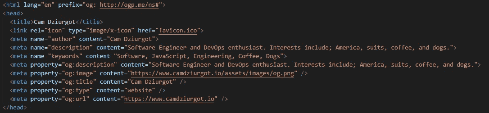
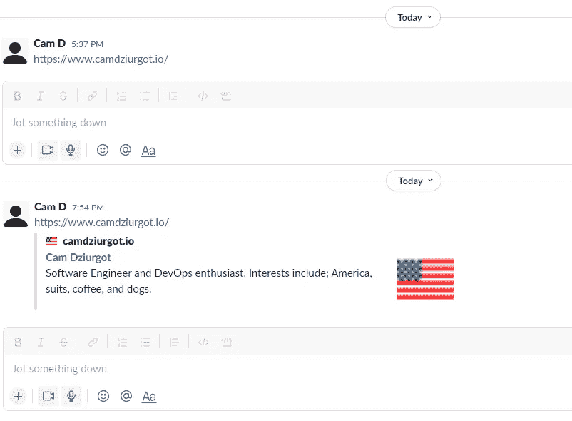

# 添加到应用程序的 10 个 HTML 元标签

> 原文：<https://levelup.gitconnected.com/10-html-meta-tags-to-add-to-apps-9a94d9036bae>

这里列出了几个你想在应用程序中使用的 HTML 标题 meta 标签。这些标签将帮助你的应用程序在网络上变得更相关，看起来更专业。

照片由[安德烈亚斯·克鲁克](https://unsplash.com/@don_andy?utm_source=medium&utm_medium=referral)在 [Unsplash](https://unsplash.com?utm_source=medium&utm_medium=referral) 上拍摄

# 先决条件

这篇文章引用了一个 HTML 页面。应该不知道页面是如何创建的:是硬编码的 HTML，还是 React 或 Angular 等 JavaScript 框架使用的 HTML。

假设如果您想添加一些使用图像的标签，您对服务器有一定的控制权。

# 1，2 -标题和图标链接

这两个`meta`标签是所有让你的网页看起来合法和专业的元标签中最容易获得的。下面，左边是一个没有标题或图标的应用程序，右边是它们的实现。代码段是添加的标签。

浏览器中标题和图标的结果。

您需要向服务器添加一个`favicon.ico`(这是许多 JS 框架默认支持的东西),并设置它与其余资产一起被拉入应用程序。如果你以前从未使用过`.ico`文件，你可以使用[https://favicon.io/](https://favicon.io/)来生成它们。

# 3，4，5:作者，描述，关键词

还有一些元标签可以影响搜索引擎的结果。这些标签是`author`、`description`和`keywords`。在这些 meta 标签中，名称放在`name`属性下，您想要显示的值放在`content`属性下。

基本元搜索引擎标签

使用的`description`标签将显示在搜索引擎结果页面(SERP)中。标签用于搜索引擎排名。你添加你的页面通常是关于的词。下面你可以看到没有`description`标签的页面是如何显示的。

没有“描述”标签的搜索结果页面。

SERP 试图显示的“描述”是页面内容，在这里您可以看到当 Google crawler 抓取页面时出现了一个 API 错误。

有了`description` meta 标签，当页面加载时，如果 API 关闭也没关系，`head`中的“描述”被加载到 SERP 中。

带有“描述”标签的搜索结果页面。

应该注意的是，`author`标签不被任何搜索引擎或爬虫使用。这更多是为了通知其他可能正在检查你的应用的开发者。

# 6，7，8，9，10 (10.5):打开图形

开放图形标签[https://ogp.me/](https://ogp.me/)，当它们被放入各种社交媒体时，用来给你网站链接更多信息。

对于开放图元标签，名称属于`property`属性，与其他元标签略有不同，后者的名称属于`name`属性。出现的值属于`content`属性，就像其他 meta 标签一样。

meta 标签本身都以`og:`为前缀，页面的`html`标签不需要包含`prefix`属性`og: [http://ogp.me/ns#](http://ogp.me/ns#.)`。meta 标签本身有:`description`、`image`、`title`、`type`和`url`。

这里是如何将标签添加到我们的 HTML 页面的其余部分(最后 5 元标签在标题。

添加开放图形元标签后的标题。

`og:image`属性指向我的服务器上的一个图像文件。但是，你可以指向任何一个 URI。

这里的`og:type`标签是一个简单的网页，对于大多数辅助应用来说应该是不错的。有一个详细的类型列表，可以根据网站内容给出更好的上下文，这里是 https://ogp.me/#types。

下面是添加开放图形标签如何改变在 Slack 中发布链接的方式。下午 5:37 的链接没有打开的图形标签。下午 7:54 的链接是在上面的代码片段被添加到 HTML 之后。

与松弛状态下过账的区别

打开的图形图像应该是一个`.png`、`.jpeg`或`.gif`扩展名。对于我打开的图形图像，我使用了相同的 favicon.ico 图像，并使用这个图像转换器[https://convertio.co/ico-converter/](https://convertio.co/ico-converter/)将其转换为`.png`。

# 结论

这些标签很容易添加到你的应用程序中，并且会给你的项目带来更专业的感觉。希望你在这篇文章中学到了一些新东西。祝你好运，并快乐编码。