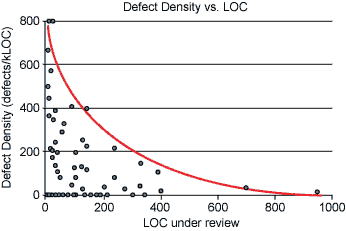

# 改进代码审查的 10 件重要事情

> 原文：<https://levelup.gitconnected.com/10-important-things-that-improve-code-review-4b6198e40066>

这是你可以在参考资料部分找到的几篇文章的总结。

# 0.构建和测试—在代码评审之前

在开始评审流程之前，使用 CI 工具检查测试是否通过以及应用程序是否可以构建。

# 1.使用代码审查工具

使用这些工具可以节省很多时间。这些工具可以突出显示变更，您也可以使用这些工具与开发人员或审核人员进行交互。

1.  [审查委员会](https://kinsta.com/blog/code-review-tools/#1-review-board)
2.  [坩埚](https://kinsta.com/blog/code-review-tools/#2-crucible)
3.  [GitHub](https://kinsta.com/blog/code-review-tools/#3-github)
4.  [造粒机](https://kinsta.com/blog/code-review-tools/#4-phabricator)
5.  [合作者](https://kinsta.com/blog/code-review-tools/#5-collaborator)
6.  [代码场景](https://kinsta.com/blog/code-review-tools/#6-codescene)
7.  [视觉专家](https://kinsta.com/blog/code-review-tools/#7-visual-expert)
8.  [格里特](https://kinsta.com/blog/code-review-tools/#8-gerrit)
9.  [Rhodecode](https://kinsta.com/blog/code-review-tools/#9-rhodecode)
10.  [Veracode](https://kinsta.com/blog/code-review-tools/#10-veracode)
11.  [可复审](https://kinsta.com/blog/code-review-tools/#11-reviewable)
12.  [Trac 同行评审](https://kinsta.com/blog/code-review-tools/#12-peer-review-for-trac)

# 2.设定早期预期

开发人员应该在评审过程之前注释他们的源代码。通过让作者仔细通读并注释他们自己的代码，在将代码交给他们的团队评审之前，发现了更少的缺陷。

# 3.知道在代码评审中要寻找什么

你心里应该有一些问题，你应该寻找答案。你可能会问自己一些问题，比如下面列出的这些问题:

*   **我明白代码的作用吗**？
*   代码是否如我预期的那样运行？
*   **本规范是否满足监管要求**？
*   考虑库或现有的产品代码。当有人重新实现现有功能时，通常只是因为他们不知道它已经存在。有时，代码或功能是故意复制的，例如，为了避免依赖性。在这种情况下，代码注释可以阐明意图
*   **变化遵循标准模式吗？**已建立的代码库通常围绕命名约定、程序逻辑分解、数据类型定义等展示模式。
*   **想想你会如何解决这个问题。**如果不一样，那是为什么？你的代码处理更多的(边缘)情况吗？它是否更短/更容易/更干净/更快/更安全但功能相当？你是否发现了一些当前代码没有捕捉到的潜在模式？
*   代码是否符合编码指南和代码风格？
*   **这个代码有 TODOs 吗？TODOs 只是堆积在代码中，随着时间的推移变得陈旧。**
*   **这段代码需要集成测试吗？**有时候，代码不能仅仅通过单元测试得到充分的测试，特别是当代码与外部系统或配置交互时。
*   **外部文件更新了吗？**如果您的项目维护了自述文件、变更日志或其他文档，是否对其进行了更新以反映变更？
*   **这个改动是否打破了向后兼容性？**如果是这样，是否可以在此时合并变更，或者是否应该将其推送到以后的版本中？

# 4.每天做一定量的代码审查

即使不是每一句台词。在宣布代码完整之前，开发人员会对他们自己的代码更加认真，众所周知，一个开发团队将每天审查代码。

# 5.审查代码的时间不要超过 60 分钟

在许多资料中提到，你每次复习的时间不应该超过 60 分钟。从那以后，表现和对细节的关注就会下降。

# 6.一次检查不超过 400 行

如果你试图一次检查太多行代码，你就不太可能发现缺陷。

缺陷密度与 LOC

# 7.传达目标和期望

您应该在代码审查过程中有目标和期望，一个简单的方法是创建一个代码审查检查表，所有开发人员在审查彼此的代码时都应该遵循该检查表。您可以在此找到这些检查表的示例:

 [## 代码评审清单——执行有效的代码评审

### 这个博客通过探索代码审查清单，为代码审查人员提供了一个很好的起点。帮助代码…

www.evoketechnologies.com](https://www.evoketechnologies.com/blog/code-review-checklist-perform-effective-code-reviews/)  [## 你的代码审查清单:包括 14 件事

### 代码审查在开发团队中越来越普遍。这是一个工作流程，开发人员在其中提交他们的…

www.codementor.io](https://www.codementor.io/blog/code-review-checklist-76q7ovkaqj) 

# 8.让每个人都参与代码评审过程

通常，当人们知道有人会看他们的代码时，他们会写得更好。不管开发人员有多高级，他/她的代码都应该被审查。它最少的好处是，初级开发人员可以通过在评审过程中提问向高级开发人员学习，并理解代码。

# 9.提供有助于培养积极文化的反馈

## 9.1 反馈

问问题而不是做陈述是个好主意。通过给予表扬，你是在告诉你的学校，你意识到了他/她的努力，这样那个人就不会对你的反馈感到难过。

## 9.2 令开发者不安

评审员有时认为，如果评审员坚持改进，开发人员会不高兴。有时候开发人员确实会变得沮丧，但是这通常是短暂的，他们后来会非常感激你帮助他们提高了代码的质量。通常，如果你在评论中[礼貌](https://google.github.io/eng-practices/review/reviewer/comments.html#courtesy)，开发者实际上一点也不会变得不高兴，担心的只是评论者的想法。令人不快的通常更多的是关于[写评论的方式](https://google.github.io/eng-practices/review/reviewer/comments.html#courtesy)，而不是评论者对代码质量的坚持。

## 9.3 培养积极的

围绕评论培养积极的文化是很重要的。重要的是 bug 在进入产品之前就被发现了。这是值得庆祝的。经理有责任培养发现缺陷的积极态度。代码评审为所有团队成员提供了纠正坏习惯、学习新技巧和扩展能力的机会。

## 9.4 指导

代码评审有一个重要的功能，那就是向开发人员传授一些关于语言、框架或通用软件设计原则的新知识。留下有助于开发者学习新东西的评论总是好的。随着时间的推移，共享知识是改善系统代码健康的一部分。请记住，如果您的评论纯粹是教育性的，但对满足本文档中描述的标准并不重要，请在前面加上“Nit:”前缀，或者以其他方式表明作者不一定要在本文档中解决它。

# 10.建立修复发现缺陷的流程

创建一个过程来确保缺陷被修复。在一些代码评审工具中，比如 Github，你可以请求修改，并且只有在缺陷被修复的情况下，你才能批准这些修改。

参考

 [## 9 代码审查最佳实践| Perforce 软件

### 寻找代码审查的最佳实践？获取我们的九个代码审查最佳实践。您将学习如何编写您的代码…

www.perforce.com](https://www.perforce.com/blog/qac/9-best-practices-for-code-review)  [## 有效代码评审流程的 12 个步骤[信息图]

### 不管这是你第一次还是第 500 次做代码审查，可能会有一些你需要的问题…

smartbear.com](https://smartbear.com/learn/code-review/guide-to-code-review-process/)  [## 代码审查的标准

### 代码审查的主要目的是确保谷歌代码库的整体代码健康状况正在改善…

google.github.io](https://google.github.io/eng-practices/review/reviewer/standard.html)  [## 代码审查的最佳实践

### 正如您不应该过快地审查代码一样，您也不应该一次审查太长时间。当人们…

smartbear.com](https://smartbear.com/learn/code-review/best-practices-for-peer-code-review/)  [## 代码审查的标准

### 代码审查的主要目的是确保谷歌代码库的整体代码健康状况正在改善…

google.github.io](https://google.github.io/eng-practices/review/reviewer/standard.html)  [## 代码评审最佳实践

### 互联网提供了大量关于代码评审的材料:关于代码评审对公司文化的影响，关于正式的…

medium.com](https://medium.com/palantir/code-review-best-practices-19e02780015f)  [## 开发人员的 12 个最佳代码审查工具(2021 版)

### 代码审查是软件开发过程的一部分，它包括测试源代码以在软件开发过程中识别错误。

kinsta.com](https://kinsta.com/blog/code-review-tools/)