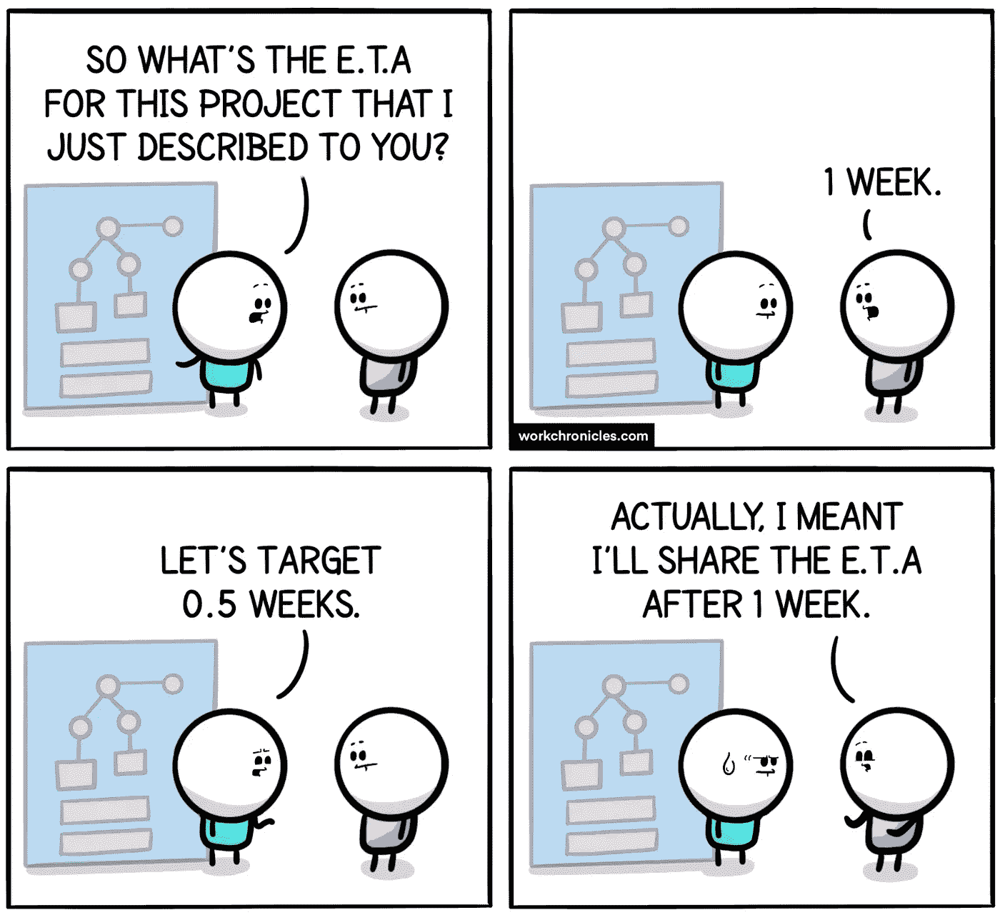
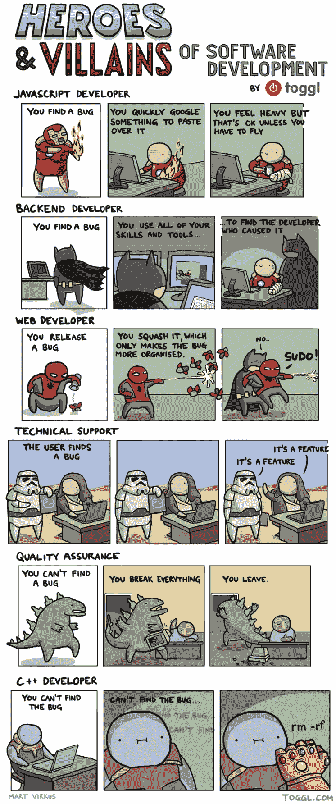
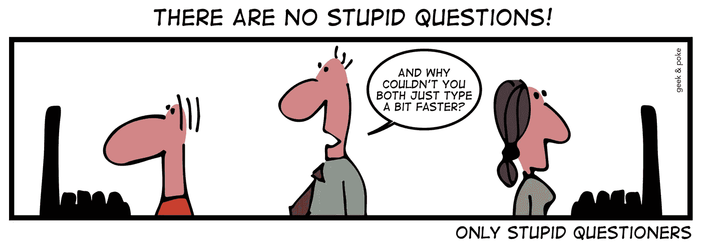
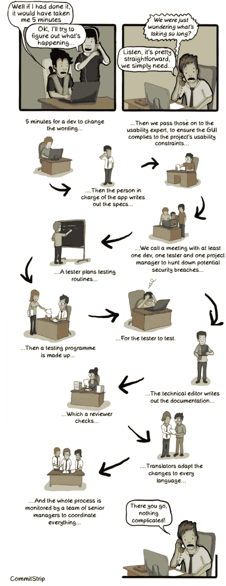
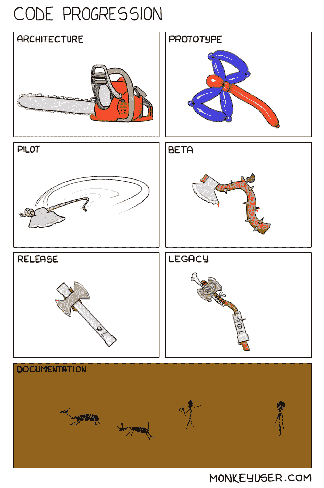
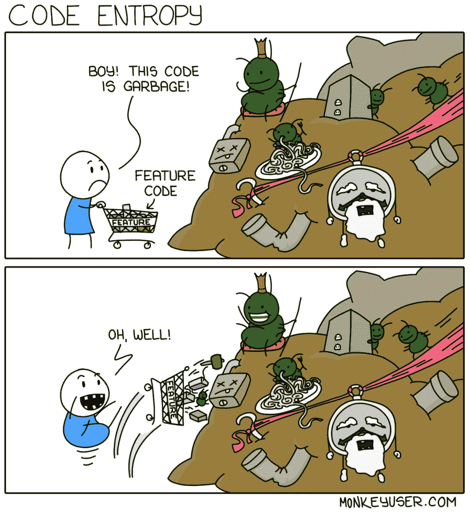
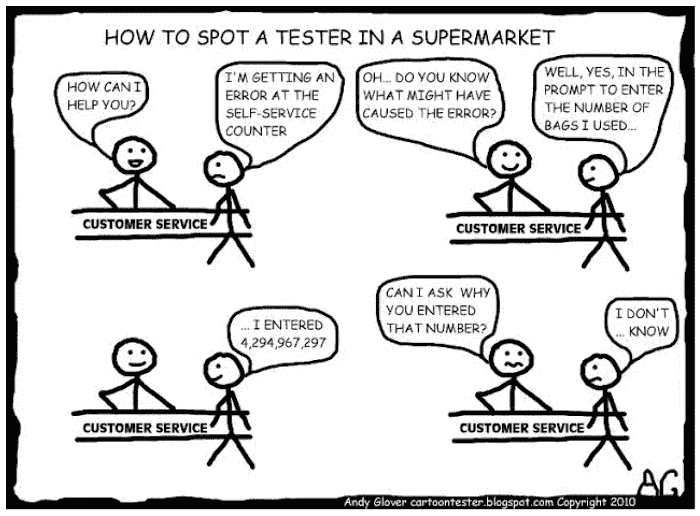
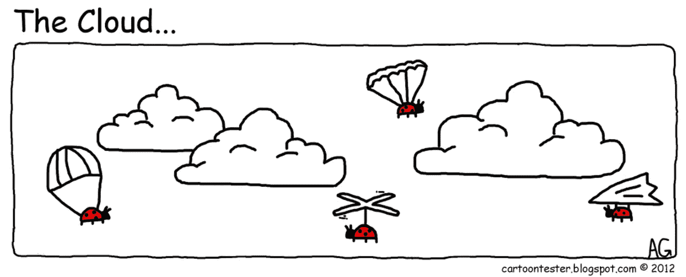
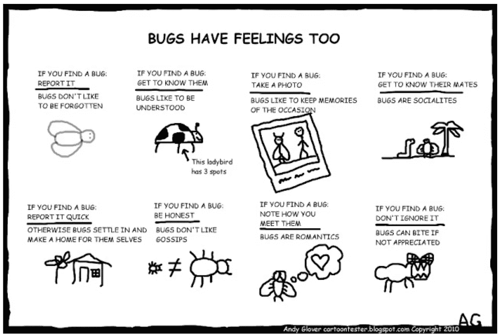

# 让你开怀大笑的 10 个令人难以置信的笑话

> 原文：<https://levelup.gitconnected.com/10-incredibly-hilarious-jokes-to-make-you-go-lol-640501c6c2b5>

## 幽默

## 程序员生活中的笑话来逗你开心

来自 [Pexels](https://www.pexels.com/photo/a-joyous-woman-3781538/?utm_content=attributionCopyText&utm_medium=referral&utm_source=pexels) 的 Andrea Piacquadio 的照片

软件工程师在他们的职业生涯中努力工作来生产优秀的工具。他们毕生致力于编程，以构建对人类有巨大帮助的软件。

当软件开发人员用他们的软件拯救世界的时候，他们不会忘记在这个过程中享受乐趣。编程社区中有许多令人难以置信的内部笑话，可以让你捧腹大笑。

这里有几个精选的笑话来逗你发笑。

# 0.软件开发就是程序员表演魔术

信用: [Commitstrip](https://www.commitstrip.com/en/2017/02/08/where-are-the-tests/)

# 1.你没听说过‘ETA for giving ETA’吗！

信用:[工作时间](https://workchronicles.com/eta-of-the-eta/)

# 2.即使是蜘蛛侠也需要“SUDO”的力量😆

信用:[玛特·维尔库斯](https://toggl.com/)

# 3.如此真实

信用:[极客&戳](https://geek-and-poke.com/geekandpoke/2019/10/3/there-are-no-stupid-questions)

# 4.有没有想过为什么软件开发这么难？

贷方: [Commitstrip](https://www.commitstrip.com/en/2012/08/17/faudrait-juste-changer-un-mot-ou-deux/?)

# 5.这是大多数软件产品生命周期的视图

信用:[猴子用户](https://www.monkeyuser.com/2017/code-progression/)

# 6.任何变成垃圾代码的代码最终都会变成垃圾

信用:[猴子用户](https://www.monkeyuser.com/2019/code-entropy/)

# 7.嗯，只是因为系统允许

信用:[安迪·格洛弗](http://cartoontester.blogspot.com/2010/01/how-to-spot-tester-in.html)

# 8.即使你把你的代码转移到云端，虫子也会飞到那里

安迪·格洛弗

# 9.会议是程序员生活中的祸根

信用:[猴子用户](https://www.monkeyuser.com/2019/nine-to-five/)

# 奖金:我知道我们都喜欢一点点奖金

让我们了解更多关于开发者的克星 Bugs

信用: [AndyGlover](http://cartoontester.blogspot.com/2010/03/bug-advocacy.html)

**感谢你阅读时的欢笑。如果你想换个更有趣的话题，你可能会喜欢读:**

 [## 这就是优秀的软件开发人员努力奋斗的原因

### 知道成为一名优秀开发人员的不利之处，以及如何制定解决方案来克服这些困难

levelup.gitconnected.com](/this-is-why-good-software-developers-struggle-2267b5daf33)  [## 高级开发人员值得他们在团队中的位置吗

### 为什么团队需要高薪却很少编码的有经验的开发人员？

levelup.gitconnected.com](/are-senior-developers-worth-their-place-in-the-team-7e3259df4eeb)