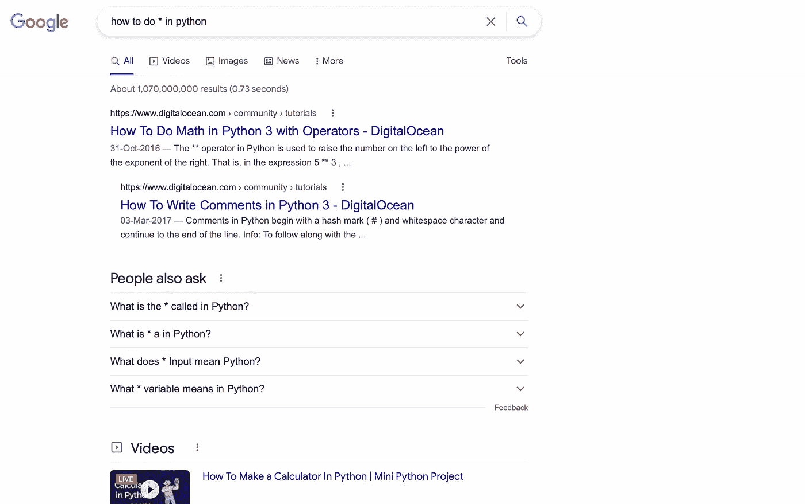

# 开发者不知道的 10 个谷歌即时技巧

> 原文：<https://levelup.gitconnected.com/10-instant-google-tricks-you-dont-know-about-for-developers-ee2e4240bcab>

## 从开发人员到研究人员，再到偶然的搜索查询，每个人的基本谷歌搜索技巧

[Firmbee.com](https://unsplash.com/@firmbee?utm_source=medium&utm_medium=referral)在 [Unsplash](https://unsplash.com?utm_source=medium&utm_medium=referral) 上拍照

谷歌是一个强大的工具，但是如果你只是简单地在里面输入单词，你就会错过很多这样的功能。今天，我们将移除训练轮，释放出你从未见过的谷歌的真正潜力。

我们都在谷歌上输入短语，然后它会显示结果，我们可以搜索它们。这是不正确的方式——或者说是对强大的谷歌的低效使用。

但是为什么仅仅在谷歌上输入单词没有那么好呢？

平均每分钟有超过 380 万次搜索。谷歌面临着迎合来自世界各地、不同年龄、不同需求的所有这些人的艰巨任务。谷歌必须设法让他们都满意。所以它平均了结果，或者说，显示了大范围的结果。

谷歌搜索背后的算法会导致很多不相关的结果。但这是我们今天要揭示的:如何使用适当的操作符来获得我们真正需要的结果，并剔除其余的。

# 1.类似网站

我们都在寻找类似的网站，这是一个最神奇的功能，可以介绍给新的网站，类似于你已经在浏览的网站。

很快，这将成为你谷歌习惯中最常用的功能之一。

要使用此功能，请键入**相关:** *您的网站*

# 2.之前或之后日期的搜索结果

如果您想搜索在特定时间段之前或之后的结果，那么您可以使用 before 和 after 运算符。

要使用它，你必须给出正确格式的年份或完整日期(yyyy-mm-dd 格式)

在 *日期*之前或之后输入

****

# **3.从特定网站搜索**

**这是我经常使用并且非常喜欢的东西。**

**假设你喜欢一个网站，并且只想要那个网站的结果。或者你信任一个网站，它有权威，你知道你会从那个特定的网站获得关于你的查询的最佳信息。**

**然后就可以使用 site: operator 了。**

**每当我对任何计算机科学概念有任何疑问时，我通常会参考 medium.com，以在几秒钟内获得准确和一流的内容:**

****

# **4.精确短语**

**这是一种强大的技术，可以缩小结果范围，从而获得最佳结果。**

**要搜索精确的短语，请用双引号将您的单词括起来(例如“Python”)。这样，谷歌将精确地只搜索那个词。**

**直接输入和使用操作符之间的主要区别在于，当您直接输入时，您会得到各种各样的结果。结果可能无关紧要。**

**当你确信你知道你在找什么的时候，用双引号把你的短语括起来，看看区别。**

****

# **5.百搭牌***

**通常，我们不能完全记住信息——无论是名字还是歌词。**

**通过使用*操作符，我们可以让 Google 知道在这两者之间缺少信息。谷歌然后采取适当的行动。**

****

# **6.or 运算符**

**该运算符用于搜索多个短语。这给了谷歌更多的搜索关键词。**

**例如，如果你想让谷歌在搜索查询中包含某个短语，你可以使用 or 运算符。**

****

# **7.and 运算符**

**使用 and 运算符，google 会确保您搜索的两个关键词都包含在搜索结果中。**

**要使用它，只需在关键字之间包含和**

****

# **8.强制词**

**这是一个方便而强大的操作符，我经常使用。在进行谷歌搜索时，你可以告诉谷歌对特定的词给予高度重视，并把它们作为一项要求包括在内。**

****

**屏幕上显示程序运行的图片**

# **9.仅搜索特定的文件类型**

**如果您只寻找 pdf 或 jpeg 文件类型，并希望缩小结果范围，只为您提供 pdf 或 ppt。**

**要使用它，请键入**文件类型:** *您的文件类型***

****

# **10.排除带——的单词**

**如果您不希望特定的单词出现在搜索结果中，请使用该运算符，以破折号开头。**

**在这篇文章中，我们看到了一些最惊人的技巧，你可以将它们融入你的谷歌习惯中，更好地利用这个强大且最常用的搜索引擎**

**我希望你喜欢它，并让我知道一些你知道并经常使用的其他技巧。**

**谢谢你坚持到最后**

# **分级编码**

**感谢您成为我们社区的一员！更多内容请参见[升级编码出版物](https://levelup.gitconnected.com/)。
跟随:[推特](https://twitter.com/gitconnected)，[领英](https://www.linkedin.com/company/gitconnected)，[通迅](https://newsletter.levelup.dev/)
**升一级正在转型的理工大招聘➡️** [**加入我们的人才集体**](https://jobs.levelup.dev/talent/welcome?referral=true)**