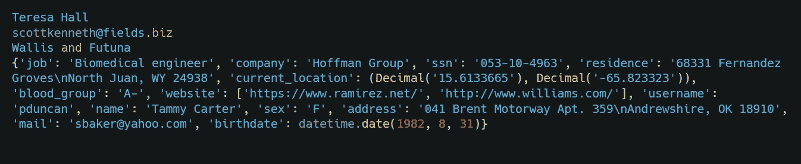
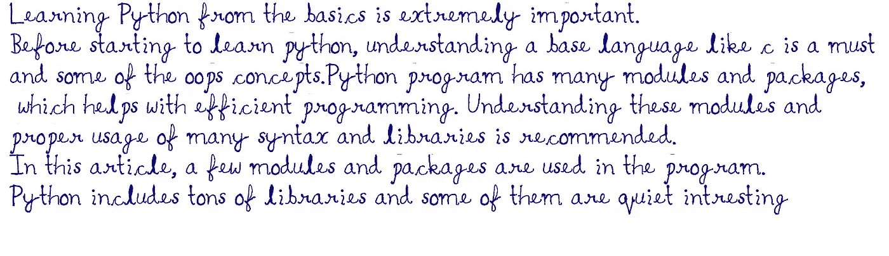
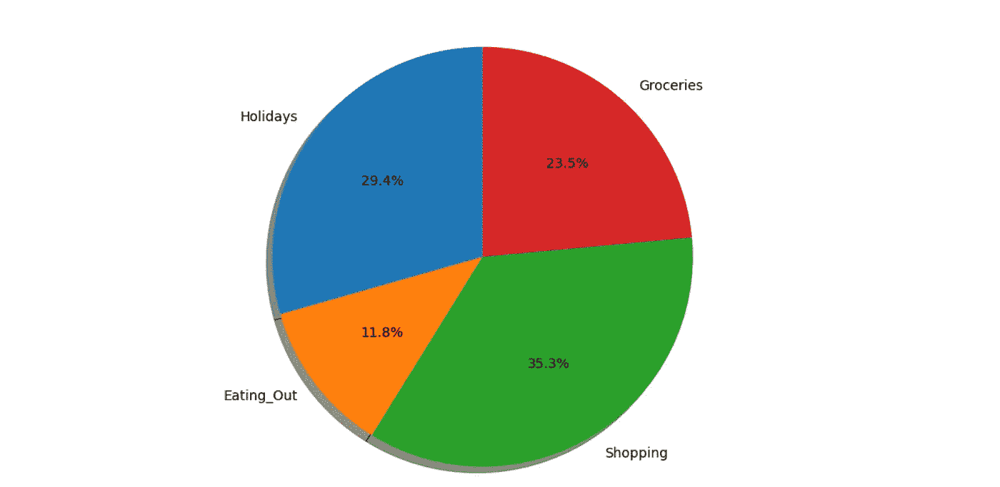
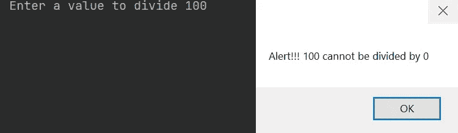

# 10 个有趣的 Python 程序及其代码

> 原文：<https://levelup.gitconnected.com/10-interesting-python-programs-with-code-b676181a2d1a>

## Python 程序详解

詹姆斯·哈里森在 [Unsplash](https://unsplash.com/s/photos/programming?utm_source=unsplash&utm_medium=referral&utm_content=creditCopyText) 上的照片

Python 程序有许多模块和包，这有助于高效编程。理解这些模块并正确使用非常重要。在本文中，一些有趣的模块和包被用于编程。

# 1.Python 虚假信息生成器

> 创建一个程序来生成虚假数据，如姓名、电子邮件或关于一个人的所有信息的详细虚假个人资料。

Faker 是一个 python 包，在终端使用`pip install Faker` 就可以安装。每次运行这个程序 faker 生成器，都会产生不同的随机数据。

## 输出:

**注意** : 尝试使用`dir(Faker())`语法检查 Faker 中的所有方法。有许多有趣的方法，如假文本、假信用卡号等等。

# 2.手写文本图像

> **将给定文本转换成手写笔记的程序。**

为此，需要`pywhatkit`软件包，可以使用`pip install pywhatkit`安装。这个包有各种各样的功能，像发送 WhatsApp 消息和在谷歌或 Youtube 上搜索。

## 输出:

**注意:**输出在 python 文件的源文件中保存为图像文件。

# 3.关闭你的电脑

> **一个关闭电脑的 python 程序。**

对于这个程序的 OS 库，可以使用`pip install os`来安装。您可以关闭，重新启动，甚至设置一个定时器关闭或重新启动这个软件包。

**注意:**确保在执行该程序前保存并关闭所有文件。运行此程序后，将导致计算机关机，未保存的数据可能会丢失。

# 4.打印日历

> **打印指定年月日历的程序**

Python 有一个内置模块 calendar，它有助于访问日历的记录。在这个模块中有许多方法，在这个程序中，我们试图打印给定年份中指定月份的日历。

**输出**:

**注意:**尝试用`calendar.calendar(year)`打印全年日历，用`calendar.isleap(year)`检查闰年。

# 5.画一张饼图

> 一个**程序，以百分比饼状图的形式显示每月的支出。**

在这个程序中，我们使用 matplotlib 来表示饼状图。这个库可以使用`pip install matplotlib`来安装。有了这个模块，许多动画静态和交互式视觉可以用 python 编程。

**输出:**

**注意:** `matplotlib`库是巨大的，有许多方法来绘制条形图、图表、静态图、饼图、样式表、轴网格和许多更多的交互式视觉效果。

# 6。用 Python 制作的警告框

> **一个显示警告信息的程序。**

这个程序，`pyautogui`用于显示警告框。可以使用`pip install pyautogui`进行安装。这个模块有许多方法，它也常用于用 python 程序控制鼠标和键盘。

**输出:**

**注意:**仅当您试图将一个数除以 0 时，才会显示警告信息。

# 7.文本到音频

> 在这个程序中，我们试图将文本转换成音频

要将文本转换为音频，请安装一个带`pip install pyttsx3`的模块。这个库有许多模块，你可以尝试改变声音，音量和音频的速率。

**注:**输出为女声，表示给定的发动机输入。

# 8.截图

> **一个用 python 截取屏幕截图的程序**

这个程序`pyautogui`用于显示警告框。可以使用`pip install pyautogui`进行安装。这个模块有很多用途，我们也用它来显示一个警告消息框。

**注意:**输出文件截图保存在 python 源文件。使用`time.sleep()`语法尝试延迟截图。

# 9.互联网速度检查

> **一个用 python 检查互联网上传和下载速度的程序**

在这个程序中，我们使用`speedtest`模块来检查互联网速度。要安装这个包，请使用`pip install speedtest-cli`语法。

## 输出:

# 10.Python 图形

> **用 turtle python 制作螺旋图形的程序**

在这个程序中，我们使用 Python Turtle 绘制了一个螺旋图。要安装 turtle 库，使用`pip install PythonTurtle`。Python Turtle 用于可视图形绘制任何形状和带有颜色的设计。

## 输出:

## **这里有一个订阅用 Medium 阅读数千篇文章的链接。请考虑订阅并支持众多作家:**

 [## 阅读 Swathi Arun 的每一个故事(以及媒体上成千上万的其他作家)

### 作为一个媒体会员，你的会员费的一部分会给你阅读的作家，你可以完全接触到每一个故事…

swathiarun63.medium.com](https://swathiarun63.medium.com/membership) 

# 分级编码

感谢您成为我们社区的一员！升级正在改变技术招聘。 [**在最好的公司**找到你的完美工作](https://jobs.levelup.dev/talent) **。**

 [## 提升——改变招聘流程

### 🔥让软件工程师找到他们热爱的完美角色🧠寻找人才是最痛苦的部分…

作业. levelup.dev](https://jobs.levelup.dev/talent)