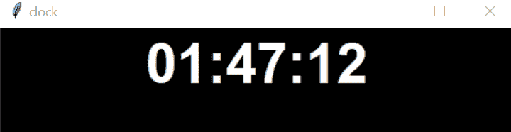
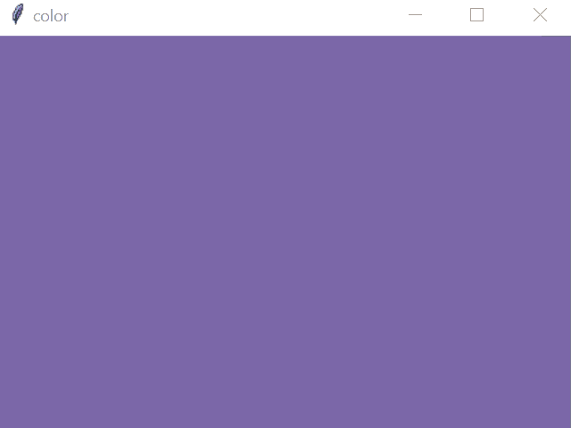
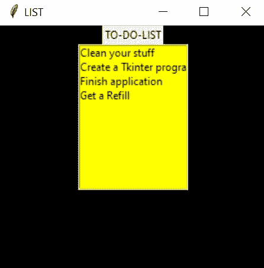
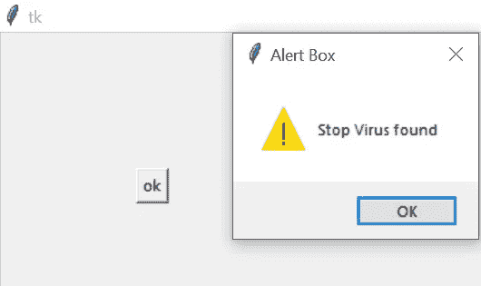
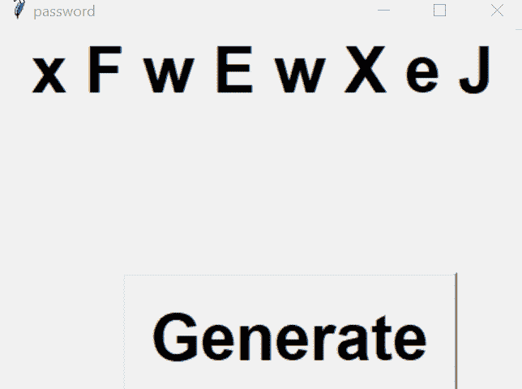
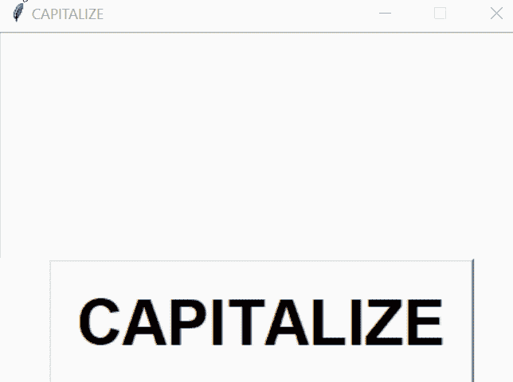
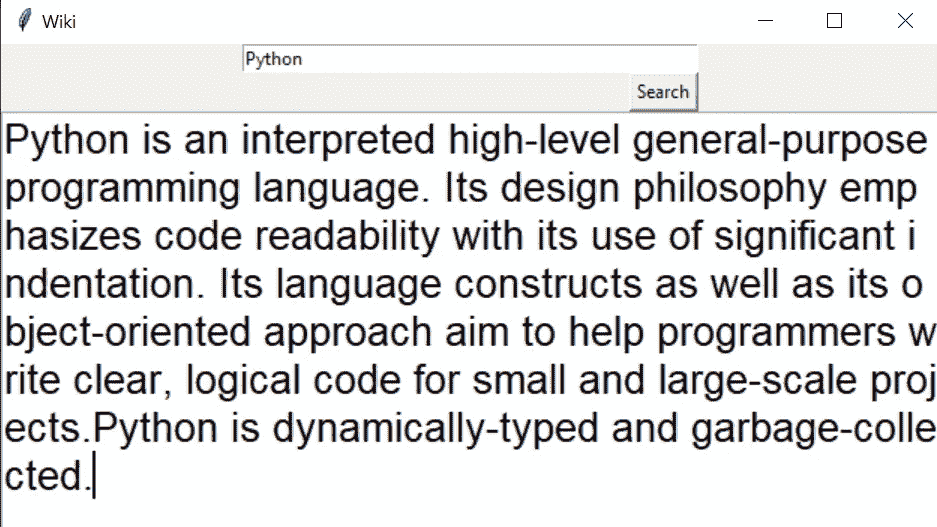
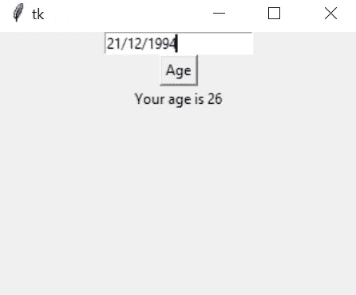

# 10 个有趣的 Python Tkinter 程序及代码

> 原文：<https://levelup.gitconnected.com/10-interesting-python-tkinter-programs-with-code-df52174993e1>

## 所有的程序都用代码详细解释

Christopher Gower 在 [Unsplash](https://unsplash.com/s/photos/computer?utm_source=unsplash&utm_medium=referral&utm_content=creditCopyText) 上的照片

Tkinter 是 Python 编程语言中最好使用的模块之一。它专门用于创建图形用户界面。有了这个模块，我们可以创建一些奇妙的程序。在本文中，我们试图创建一个简单而有趣的程序。为了更好地理解 Tkinter，我们将特别关注简单的 GUI。

# 1.带 Tkinter 的数字钟:

> **用 Tkinter 创建一个数字钟来显示时间的程序。**

在这个程序中，我们使用了两个包:time 和 Tkinter。通过使用时间包，我们在`strftime`功能的帮助下显示当地时间。

## 输出:

**注:**

`after()` —与 1000 毫秒的属性一起使用，1 秒后时钟将刷新，这使它看起来像一个正在运行的时钟。

`config` —在微件初始化后更改其属性。例如，在代码中，我们向窗口添加时间文本。函数(%I，%M，%S)中的属性分别表示本地时间的小时、分钟和秒。

# 2.用 Tkinter 更改颜色背景:

> **创建一个背景颜色不断变化的程序**

这个程序有两个软件包来随机改变屏幕的背景颜色。要导入随机方法，我们可以使用`import random`或者直接导入程序中的 randint 函数。

**输出:**

## 注意:

`geometry`-在 Tkinter 几何方法中用于设置窗口的尺寸。在程序中，我们提到了高度和宽度为 400 乘 400。

`title` —使用 title 方法命名根窗口。默认情况下，我们使用这种方法来覆盖 tk。注意，我已经用这个方法将窗口命名为 color。

# 3.带 Tkinter 的待办事项列表:

> **创建一个程序，创建一个用图形用户界面(GUI)和 Tkinter 模块呈现的待办事项列表。**

这个程序创建了一个简单的 GUI。这个简单的程序将包含您提供的列表作为待办事项列表。这需要一个可以使用`from tkinter import *`语法导入的 Tkinter 模块。这个语法只是意味着你导入所有的方法，Tkinter 模块中的变量应该被导入。

## 输出:

## 注意:

`pack()` —是 Tkinter 的三个几何管理器之一，用于组织窗口中出现的微件。

`Listbox()` —这是一个用于显示项目列表的小部件。注意到这个`Listbox(parent,options)`有两个属性。父属性只是一个显示列表的窗口，选项属性可用于增强，如背景颜色、高度、字体和许多其他可用的选项。

# 4.显示警告消息:

> 按钮被按下时显示警告信息的程序。

我们试图编写一个程序来显示一个事件发生时的警报。我们首先从 Tkinter 导入消息框模块来显示这条消息。在我们的程序中，如果按钮被点击，我们只显示一个警告。

**输出:**

**注:**

`place()` —类似于 pack 功能，place 也用于组织任何小部件。一个区别是，使用 place，您可以根据需要设置小部件的坐标。

`messagebox` —该模块有不同的对象。在程序中，我用过`messagebox.showwarning()`。尝试不同的对象，如 askyesno()，show error()。

# 5.关闭 PC 的 Tkinter 脚本:

> **写一个带关机按钮的 Python 程序，关闭你的电脑。**

在这个程序中，我们使用了一个操作系统包，用来关闭计算机。使用该软件包可以执行重启、关机等操作。要安装这个包，请使用`import os` 语法。

## 注意:

*   在执行这个程序之前，记得关闭并保存所有文件，以避免数据丢失。
*   `command` —用于在某些事件上调用函数，如鼠标点击或按键。它绑定这些事件和函数的调用。在程序中，当单击按钮 shut down 时，它调用函数 shut()。

# 6.生成简单密码:

> 创建一个程序，用大小写字母生成一个随机密码。

在这个程序中，我们使用了像 random 和 string 这样的包来生成密码。我们已经编写了一个程序来生成由大小写字母组成的八个字母的密码。

**输出:**

**注:**

`button, label`—这些是程序中使用的小部件。在这个程序中，按钮名为 generate，标签显示密码。

# 7.带 Tkinter 的大写字母:

> **一个简单的程序，接受输入和改变字母大写。**

我们已经创建了一个简单的 GUI 来接受输入的字母，并在这个程序中将其转换成大写字母。

## 输出:

**注:**

`text` —文本小部件用于在 Tkinter 应用程序中显示不同种类的文本。

# 8.一个简单的维基百科搜索应用:

> 一个创建应用程序的程序，通过它你可以从维基百科获得信息

通过这个程序，我们尝试实现一个搜索应用程序。在这个应用程序中，我们使用维基百科搜索数据，为了导入数据，我们使用了`import wikipedia`语法。

**输出:**

**注:**

`frame` —这是一个小部件，可以用来组织应用程序中的其他小部件。使用可用的框架微件选项自定义所有微件。

# 9.将图像添加到应用程序:

> **创建一个程序，您可以使用该程序向 Tkinter 应用程序添加图像。**

通过这个程序，我们试图创建一个程序来将图像添加到 GUI 中。我们用 Python 图像库(PIL) Python 包上传图像。我们使用了两个包 Image()来打开图像，ImageTk()来加载图像。

## 输出:

## 注意:

`PhotoImage` —该对象用于将图像加载到 Tkinter 应用程序。在程序中，我们用 Image 对象打开照片，然后用 PhotoImage 对象上传。

`mainloop` —这种事件驱动的方法在所有 Tkinter 程序中使用。这个窗口等待任何事件的发生，直到窗口像点击按钮一样被关闭。

# 10.一个年龄计算器应用程序:

> 创建一个程序来输入你的出生日期并输出你的年龄。

一个简单的应用程序，使用给定的输入来计算你的年龄。在此应用中，提供的出生日期从包`datetime`中减去。将获得的天数转换为年数，并显示输出

输出:

## 作者最好的一篇文章:

 [## 10 个有趣的 Python 程序及其代码

### Python 程序详解

levelup.gitconnected.com](/10-interesting-python-programs-with-code-b676181a2d1a) 

***请考虑通过我的链接订阅 Medium。这将有助于、支持和鼓励。谢谢***

 [## 阅读 Swathi Arun 的每一个故事(以及媒体上成千上万的其他作家)

### 作为一个媒体会员，你的会员费的一部分会给你阅读的作家，你可以完全接触到每一个故事…

swathiarun63.medium.com](https://swathiarun63.medium.com/membership)