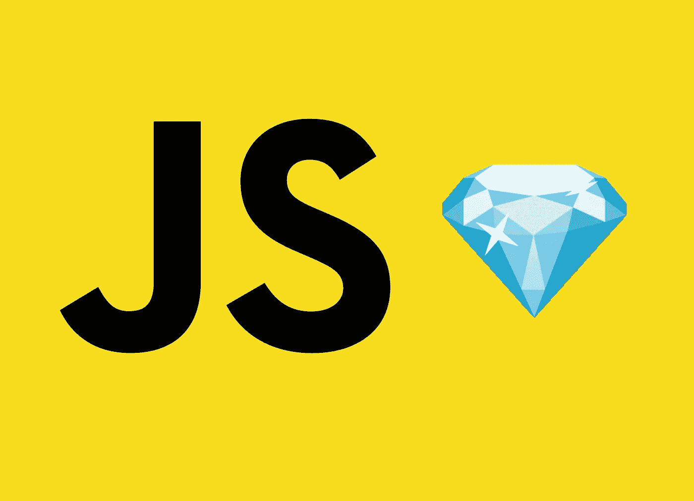

# 10 个 JavaScript 单行程序瑰宝💎

> 原文：<https://levelup.gitconnected.com/10-javascript-one-liner-gems-69e734bf4ddb>



## 这么多事情可以用一行代码实现

JavaScript 有很多单行代码的例子，可以做很多强大的事情。我们将讨论我个人一直使用的 10 个 JavaScript 一行程序。

希望这个列表中有一些你不知道的俏皮话。

# 1.对对象数组进行排序

在以特定顺序呈现数据时，了解如何根据特定属性对对象数组进行排序会很有用。假设您希望根据字母顺序在页面上呈现结果。

这在 JavaScript 中可以很容易地完成，尽管有几种方法可以编写代码来对数组进行排序。

在所有的例子中，我们都使用 JavaScript 的*排序*方法。第一个例子使用了一个箭头函数。

如果你愿意，你也可以重构它。您可能需要在多个地方使用比较功能。在这种情况下，我推荐下面的实现，这样您就可以重用 *compareNames* 函数。

当然，正如标题所揭示的，您甚至可以用一行代码来完成。虽然如果你有一个包含很多逻辑的比较函数，这很快就会变得混乱。如果 compare 函数相当简单，我只会选择这个实现。

# 2.获取数组的交集

获取数组的交集可能是您遇到的编程问题之一，这可能会让您头疼。但是没有必要这样做，因为所有这些都可以用这个一行程序来完成——这是一个真正令人头疼的问题。

请注意，这个函数能够一次获取两个以上数组的交集。

# 3.获取一个月中的天数

在没有任何外部库帮助的情况下用 JavaScript 处理日期有时真的很痛苦。但是你知道吗，有一个简单明了的程序可以帮助你计算一个月的天数。

# 4.以一种好的方式交换价值

交换两个变量的值，你可能已经做过很多次了。传统的方法是使用第三个临时变量，如下所示:

但是您知道在 JavaScript 中交换两个变量的值有一个更简单的解决方案吗？看看下面几行代码，其中实际的交换只发生在一行代码中。

这种溶液看起来干净多了，不是吗？

# 5.展平数组

有了这个简洁的一行程序，让数组扁平化成为真正挑战的日子一去不复返了。

但是有一个更短的方法来完成这个。你可以在一个数组上调用 *flat* 方法，得到同样的结果。不过这个功能**还没有** [完全支持](https://caniuse.com/?search=flat)(还没有)。尤其是几个浏览器的老版本，对该功能的支持比较欠缺。

# 6.用一个空格替换多个空格

处理空白可能很烦人。空白区最常见的问题之一是必须处理多个空白区。幸运的是，您可以用一个空格来替换它们。

有时候你可能还想替换其他空白字符，比如制表符和换行符。您也可以在一行中用一个 whitspace 替换它们。

# 7.以随机顺序对数组元素进行排序

有时候你想打乱一个数组的元素。例如，当洗牌时。没有标准的 JavaScript 函数可以帮你做到这一点。但是它可以用一行非常短但功能强大的代码来完成。

请注意，数组中的元素不必是同一类型。

# 8.检查两个对象是否相等

比较对象并检查它们是否相等是您在编码时可能不止一次遇到的事情之一。大多数情况下，比较对象比仅仅做`objectA === objectB`要复杂一点。然而，只用一行代码就可以完成。

这个函数的美妙之处在于它还可以检查两个以上的对象。

# 9.从数组中随机获取一个项目

从数组中获取随机项是另一个强大的一行程序，有时会派上用场。不管你是否试图从一个充满数字的数组中获取一个随机值，对象都是两者的组合。

# 10.给绳子加上弹簧

如果你想生成人类可读的 URL，你可能需要修改你的 URL。段是典型字符串的规范化版本。大多数时候，一个标题被用于鼻涕虫。

```
https://mywebsite.com/my-first-blog-post
```

这是蛞蝓的样子。`my-first-blog-post`来源于博客标题“我的第一篇博文”。

你可能会一直看到这些 URL，因为这是创建人类可读的 URL 的最常见的方式。但是您知道吗，在 JavaScript 中只需要一行代码就可以构造一个字符串。

比想象中容易多了，对吧？！这个函数的作用是将字符串转换成小写。然后它用连字符替换空白。最后但同样重要的是，它删除了所有非字母数字字符。

# 就是这样！

我们到了 JavaScript 一行程序精华列表的末尾。希望你学会了一两个新的俏皮话。你在这个列表中错过了你最喜欢的俏皮话吗？或者你只是想分享另一行强大的代码？请在评论中让我知道。👇

感谢阅读！