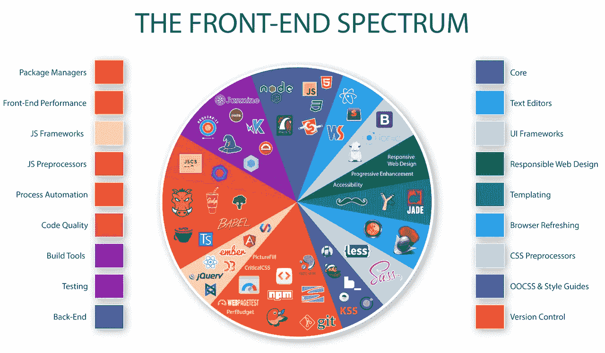
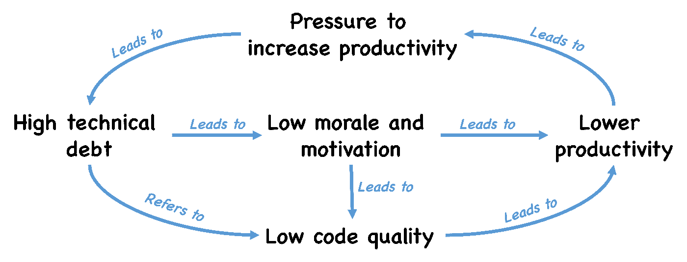

# 作为一个自学成才的新手，我犯的 10 个错误

> 原文：<https://levelup.gitconnected.com/10-mistakes-i-made-as-a-newbie-self-taught-developer-2b3f14d01052>

## 完成理学硕士学位后，对过去的自己进行了批判性的反思。作为一名受人尊敬的网络开发专家，我的职业生涯一飞冲天

照片由来自 [Pexels](https://www.pexels.com/cs-cz/foto/blok-ctvereckovy-papir-domaci-prace-matematika-167682/?utm_content=attributionCopyText&utm_medium=referral&utm_source=pexels) 的 [Lum3n](https://www.pexels.com/cs-cz/@lum3n-44775?utm_content=attributionCopyText&utm_medium=referral&utm_source=pexels) 拍摄

八年前，我作为一名自学成才的业余爱好者开始了我的编程之路，后来我成了一名自由程序员，偶尔为预算较低的初创公司工作。经过几年这样的小工作，我申请了一家大公司，几年后，我的职业生涯一飞冲天，我对自己的软件开发技能建立了信心。除此之外，我还在攻读理学硕士。在软件工程领域，我的导师帮助我获得了各种软件开发学科的专业知识和解决复杂逻辑问题的能力。

现在我 25 岁了，我有了我的第一份研究生工作，我被认为是能够解决许多利基软件开发问题的专家，也受到了我的同行的广泛尊重。然而，它并不总是这样，在我的职业生涯中有一段时间我认为是笨拙的——在早期阶段，我是一个自学成才的开发者，没有任何方向，我只专注于发布软件，并以该死的速度发布。

在本文中，我将分享我的一些关于软件开发职业反模式的经验，在我找到第一份真正的全职工作之前，作为一名自学成才的开发新手，我无耻地执行了这些经验。

# 我的态度是“努力工作”

我不关注产品的技术质量。对我来说，唯一真正重要的事情是为我的客户和他们的最终用户提供功能。我有自己的代码风格，我*不知何故觉得*是高效的。我认为除了我之外，没有人会阅读或编辑我的代码。我大错特错了。

有一天，我的一个项目从一个简单的订单发展成了一个迷你网店。我们想雇佣合作者。每个人都读了代码，把手从代码上拿开。突然，我意识到这不是我客户的问题——这是我的问题——我的代码阻碍了我客户的业务发展，因为我没有坚持代码质量和完善的编码标准。就代码工艺而言，我更注重数量。

如今，我把代码的可读性放在我的优先级列表的首位。每当我觉得自己在代码中执行了不可解释的魔法或优秀技术设计的例外时，我会尝试编写尽可能简单的代码，并附上支持性注释。

# 我看了大量的教程，但从未研究过更深层次的概念

> *“阶级？那是什么？”—我，在采访中，2014 年*

观看实践教程，在那里有人正在构建一个类似于我的 web 应用程序，帮助我获得了关于实践编程的非常肤浅的知识。有一次，我试图解决一个更难的问题，我错误地相信那些教程足以给我足够的指导来解决它。从今天的角度来看，在看完所有这些教程后，我理解了我的编程语言的最基本的结构。然后，我使用这些基本构造来解决复杂的问题，这些问题反过来损害了代码质量，以至于没有人愿意再编辑代码。

在完成了我大学的第一门面向编程的课程后，*，我终于明白了如何学习一门编程语言。不仅通过动手编程，而且通过结合对基本编程语言概念*的透彻理解，如类、接口、继承和闭包。所以，去牢牢掌握编程最基本的部分吧——你最喜欢的语言，它的核心 API 和你的编程范式。这也有助于你思考解决方案的设计。

# 我没有生态系统意识

在过去，我使用一个简单的库(jQuery)和我的发明(重复触发一个更新 HTML 片段的函数)来构建相当大的解决方案，而今天我将使用 MVC 框架。*我认为学习和使用一些基本的库可以帮助我解决我在 web 开发中的所有问题*。我对可能更好、更有成效的替代解决方案不感兴趣。我只是想发布我的软件，然后继续另一个项目。后来我意识到，我通过应用一个不必要的复杂解决方案解决了一个非常简单的问题，因为我使用了一个旨在解决不同类型问题的库。

生态系统的例子。亚历克斯·伊万诺夫斯

从我的经验来看，*没有一个框架/语言/库是高效解决所有问题的灵丹妙药。今天，每当我偶然发现一个新问题时，我都试图寻找*稳定的、设计良好的解决方案*，尽可能用最少的努力解决那个问题。对我来说，最基本的是*考虑这些解决方案的利与弊*并*将它们与类似的解决方案*进行比较，然后再深入研究。*

# 我没有使用静态代码分析器

直到有一段时间，我没有专注于编写遵循最佳实践的代码。我写了大量我不喜欢的代码——*我不相信这是一个适合工作面试者进行代码审查的代码。因此，我总是拒绝把我的代码发给面试者。这反过来*关闭了我本可以拥有的一些非常有趣的机会*。辞去第一份全职工作后，我认为这两种工具对我的软件开发工作流至关重要:*

*   lint/代码风格评论工具——尽管它们看起来有点迂腐，*它们的规则是基于最佳实践的*,这反过来有助于克服代码和设计的味道。
*   项目范围的静态分析工具(声纳等。)—这些工具有助于识别分散在较大代码库中的安全问题和无意的重复。

# 我从来没有读过我的框架的文档

*我称自己为π形开发者。我深入研究的主要领域是构建大型企业 web 应用程序的两个框架——一个用于构建前端，一个用于构建后端。我拥有的任何其他专业知识都是一些零碎的信息，我已经准备好了，以备不时之需。如果我必须描述我自学成才的开发新手时的技能，我会说我是一个*下划线形状的开发人员*——只是拥有那些零碎的东西，将它们应用到实践中，并通过大量的堆栈溢出答案成功地构建了一个软件产品。*

有一天，在没有太多经验的情况下，我带着无耻的自负，试图申请一个高级开发人员的面试。邓宁-克鲁格曲线(如下图所示)称这样的情况为*愚蠢山的顶峰*。这些高级职位的面试官倾向于仔细检查候选人的框架知识，包括询问候选人关于他们选择的框架的低级细节和其他黑暗领域。

邓宁-克鲁格专长曲线

虽然我能够非常有效地找到大多数问题的解决方案，但在听到第一个我认为非常难的问题后，我非常紧张，事实上，我没有通过面试。邓宁-克鲁格曲线称这种情况为绝望谷。在经历过这些之后，我意识到阅读我的语言/框架/库的文档是在高级开发人员面试中取得成功并接近**启蒙斜坡*的关键之一。*

*花时间阅读我的两个框架的文档，让我在这么多年后，在面试中获得了自信，并把我从实践中很难获得的知识粘在一起。所有这些都帮助我争取到了更高的工资，并反过来赢得了同事们的尊重。*

# *我不赞成单元测试*

*我相信我的代码。我通过编写代码调用、记录它们、手工检查它们，然后无耻地扔掉所有有价值的测试代码，来测试我的代码。然后在相同的代码中出现了一个错误，我再次编写了相同的测试代码。真是浪费时间！*

*在获得了多年的编程和测试技能后，为什么使用单元测试框架编写单元测试的主要优势是:*

*   *让我对它测试的代码充满信心，因为它在每次更改后都是可重复的。*
*   *帮助我*克服糟糕的 API 设计。**
*   *难以测试代码几乎总是糟糕的面向对象设计的标志。*
*   *它是*一种总是与代码同步的文档。**

*今天，只要有可能，*我会在我的项目中引入测试驱动开发*。这样，在我的产品引入新功能后，我就知道了每一个功能的缺陷。免费的。*

# *我复制了大量代码*

*我仍然维护着一些项目，由于我过去的错误，这些项目实际上是一场噩梦，除了缺乏有效的开发堆栈之外，主要涉及复制——不仅仅是复制粘贴的代码，还有缺乏抽象的代码——公共功能没有提取到函数/超类，神奇的值没有提取到常数等等。也许这源于这样一个事实:我的第一个*编程语言*是 HTML 和 CSS，在它们最初的形式中，重复是很常见的。*

*每当我的客户想把我的一个项目的维护工作委托给别人时，那些人就把手拿开，认为我是一个糟糕的程序员，我的成果在技术上很糟糕。*

*自从我的一个同事启发我构建可重用的、抽象的和数据驱动的解决方案，我总是在设计自己的解决方案时先想一步，并且*尝试思考我的代码以后如何可能被使用/重用*。*

# *我不知道我的想法*

*我用一个普通的记事本开始了我的软件开发之旅。我的大学导师强烈反对我使用 IDE。在我最终采用了 IDE 之后，我用和记事本一样的方式使用它——在它里面写代码，同时用我的 shell 执行编译器、服务器、客户端和测试。一步一步地，我慢慢地将这些任务的执行委托给我的 IDE。在我看来，*手动任务执行和 IDE 特性的缓慢采用是我的另一个生产力杀手*。*

*我强烈建议您通过浏览 IDE 的功能和*学习自动化日常工作流程中最常用的手动操作的任务*，来学习如何高效地使用 IDE，例如:*

*   *快速重构工具——当今 IDEs 提供的最好的生产力助推器。*
*   *任务运行——运行编译器、调试器、单元测试、lints、查看数据库内容等。*
*   *文本编辑超能力——删除行、多光标等。*
*   *您最常执行的操作的快捷键。*

# *我没有重用外国代码*

*在过去，我写的很多代码最终都不是我得到报酬的业务代码——它们大多是技术管道——原始数据库代码、基本角度组件、自定义日期时间对象实现等等。不知何故，我不喜欢阅读外国图书馆的文档，避免搜索解决我的问题的图书馆，而是更喜欢编写自己的管道代码，我现在认为这些代码毫无价值。*

*是的，从头开始写基础代码肯定会让你牢牢掌握基础。但是培养重用外来稳定代码的技能和有效浏览技术文档的能力是无价的生产力助推器。*

# *为了降低开发成本，我忽略了重构*

*在我开发生涯的初期，我曾无数次创建简单的解决方案，这些解决方案在发布到生产环境后发展非常迅速——我的客户最经常想要的是重新设计、新功能或实现 GDPR 合规性。为了通过降低开发成本让他们高兴，我总是开发他们需要的东西，同时从不关心我的产品以前版本的旧代码。我甚至有一个我今天还在维护的项目，你猜怎么着——我讨厌维护它，因为它充满了技术债务，基本上超越了技术破产，而我是唯一了解这个项目的人。*

**

**技术债务:恶性循环。由* [*图沙尔夏尔马*](http://www.designsmells.com/articles/four-strategies-for-managing-technical-debt/)*

*如今，我将持续重构作为我软件开发工作流程中的标准实践。每次需要的时候，我都会将重构成本添加到一个特性的总开发成本中。在向我的客户解释了这些额外的成本后，我几乎总能得到他们的认可。*

# *结论*

*在这篇文章中，我分享了我在自学开发新手时无耻地犯下的 10 个错误。如果你想成为一名自学成才的开发人员，记住这些并避免它们。如果你碰巧是一个有经验的开发者，读到这里，不要犹豫，通过评论这个故事来分享你职业生涯早期的错误。谢谢大家！*

# *👓值得一看的文章*

* [## 学习这 5 种编程语言会让你成为更好的程序员

### 通过学习这 5 种编程语言中包含的概念，加快您的编程速度。

levelup.gitconnected.com](/learning-these-5-programming-languages-will-make-you-a-better-programmer-f9ffc6283ef9)  [## 像这样写你的 CSS 将会使你的代码非常干净

### 让你的样式表保持整洁的 6 个技巧——让它们易于阅读、维护和重用。

levelup.gitconnected.com](/writing-your-css-like-this-will-make-your-code-super-clean-f82d4bfeb468)*