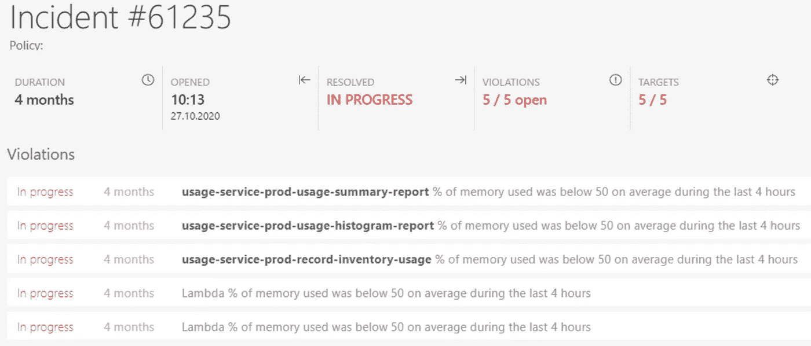
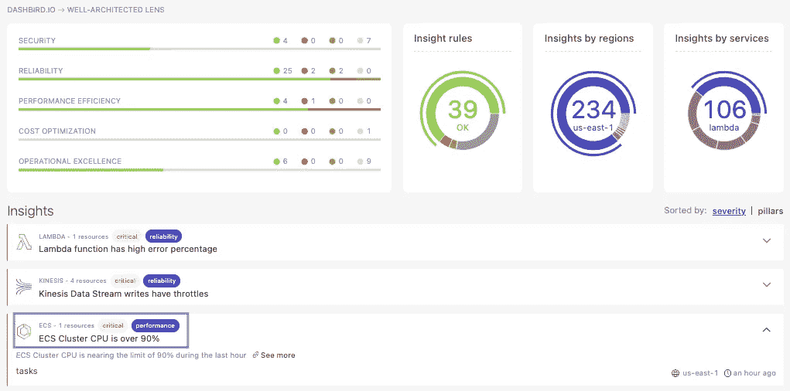
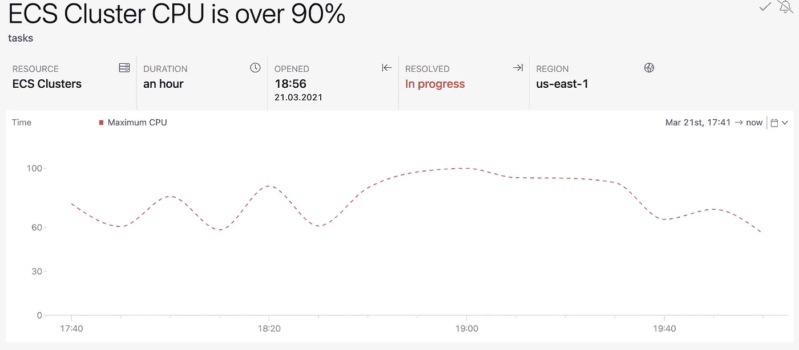
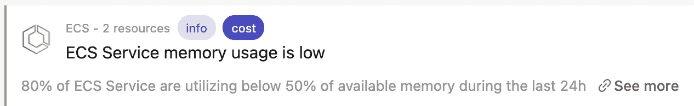

# 确定云资源规模时的 10 个错误

> 原文：<https://levelup.gitconnected.com/10-mistakes-when-sizing-cloud-resources-707a4dbc92ea>

## 避免那些为了优化成本和性能

照片由 [Siora 摄影](https://unsplash.com/@siora18?utm_source=medium&utm_medium=referral)在 [Unsplash](https://unsplash.com?utm_source=medium&utm_medium=referral) | [品牌内容披露](https://www.annageller.com/disclosure)

迁移到云最常见的问题之一是成本。鉴于云允许您将 IT 成本从资本支出(*长期投资，例如。在将硬件设备和软件许可*)引入 OPEX ( *日常运营费用*)时，选择正确的服务并恰当地确定其规模至关重要。在本文中，我们将看看常见的陷阱，并讨论如何避免它们，以真正受益于云的弹性。

# #1 遵循提升和移位方法

提升和转移方法意味着将您的工作负载的**精确副本**移动到云中，并且**尽可能少的更改**。尽管如果您想快速迁移到云，这种模式可能是有用的，但它可能会导致资源的次优使用。AWS 承认这是一个难题，通过创建服务使这种迁移变得更容易([*cloud 忍让迁移*](https://aws.amazon.com/cloudendure-migration/) *和* [*AWS 服务器迁移服务*](https://aws.amazon.com/server-migration-service/) )。尽管如此，为了尽可能提高资源利用率，最好考虑为云重新构建您的解决方案。

有了 lift 和 shift，从长远来看，你可能会在桌面上留下很多钱。您还会错过您的云提供商可以提供的许多好处。例如，当选择完全管理的 AWS Aurora 而不是传统的 Postgres 实例时，您可以获得(*和其他*)3 倍的吞吐量、存储自动扩展和低延迟读取副本。这可能是为什么 Aurora 目前是 AWS 上最受欢迎和增长最快的服务之一。

# #2 不标记您的资源

如果你没有足够的数据来做出明智的决定，那么改进是很有挑战性的。如果您无法跟踪您的云资源的表现以及它们产生的成本，就很难优化它们的利用率。

根据项目或**组织单位**来标记您的资源被认为是一种最佳实践，以便将成本正确地分配给相应的服务。

# #3 未能监控资源使用情况

管理云架构不是一次性的过程。这是一个持续的监控和评估你用什么，你怎么用，为什么用的实践。也许您最初对特定应用程序增长的假设并不完全正确，做出改变可以显著降低成本。

例如，考虑一个**过度配置的 Kubernetes 集群**,它的节点比需要的多得多。也许在这种情况下，转移到无服务器版本(*法盖特*上的 EKS)更有意义。关于无服务器 Kubernetes 集群的更多信息，请参见[我以前的文章](https://betterprogramming.pub/serverless-kubernetes-cluster-on-aws-with-eks-on-fargate-a7545cf179be)。

让**“僵尸”资源**不受监控地运行并不像你想象的那样罕见。一些项目可能会被放弃，而相应的资源由于未完成的移交过程而保持活跃。

# #4 总是从头开始做每件事

作为软件工程师，我们有时可能会被诱惑为每件事构建我们自己的定制解决方案和服务。一个潜在的更好的方法是首先对现有的资料进行适当的研究。示例:

*   也许您不需要 EC2 上的这个**自托管数据库，**您可以使用完全托管的 RDS 来帮助您更轻松地扩展和操作实例？
*   或者也许你不需要这个**自管理 RabbitMQ** 实例，你可以采用久经考验的无服务器消息队列 SQS？

一般来说，如果有一个无服务器或完全托管的解决方案，至少在投入太多时间和精力到您自己的解决方案之前考虑它是有意义的，因为您必须完全由自己来维护。

# #5 仅使用您熟悉的工具

在阅读一些 Reddit 或博客帖子时，我看到许多工程师不愿意使用无服务器或容器编排平台，只是因为他们更了解 EC2 和手动管理的服务器。他们认为这只是一种会“来来去去”的*新技术*，因此，没有必要改变你的方式。这意味着迁移到容器编排平台、无服务器和其他云服务没有好处。这似乎是一种小心眼的做法。

最好挑战我们的假设，用清晰的事实、成本和性能基准来判断新技术，而不是对新事物持怀疑态度。

# #6 不利用无服务器和容器编排平台

如果您为您管理的每个服务和工具创建一个 EC2 实例，您可能会陷入维护的噩梦。但是，如果您将您的每个服务部署到一个部署到 Kubernetes (EKS)或 Fargate (ECS)集群的容器中，由于动态端口映射和更紧凑的容器资源利用，您可以**将更多的资源分配到单个服务器实例**。共享层。

容器编排平台将帮助您确保在实例之间平衡负载，并且您的工作负载将保持健康。在某种程度上，他们排除了对容量的猜测。您可以指定有多少容器实例应该一直运行，控制平面将确保它按照您定义的那样运行。

> 如果您可以轻松地在许多容器或无服务器资源之间平衡您的工作负载，那么您不必再猜测哪个 EC2 或 RDS 实例大小适合您的用例。

# #7 不考虑总体拥有成本

如果您只考虑硬件或服务成本，您可能最终会认为许多资源在本地更具成本效益。但如果你把额外的维护、升级和管理这些服务器的员工的成本加起来，那就完全是另一回事了。

# #8 短期思考

如果你纯粹基于你当前的情况来衡量你的资源，你可能没有考虑到你的需求在未来会如何变化。如果您的业务和数据增长得更快，该怎么办？如果结果是相反的呢？您的应用程序是否仍然易于更改和适应未知的未来场景？最后，你能找到并留住足够的员工来长期运营吗？

# #9 过度配置一切“以防万一”

在另一个极端，如果您想要谨慎，您可能会试图过度配置一切以确保您为使用高峰做好准备。这是一个很好的策略，前提是你能根据过去的使用模式证明峰值的合理性。但如果你是出于直觉，这可能是一个糟糕的策略。

云提供了灵活性，您可以向集群添加节点，跨更多容器对工作负载进行负载平衡，或者在需要时增加 vCPUs 的数量或内存大小。如果配置和监控得当，就不需要过度配置任何东西。我并不是说调整规模很容易(*远非如此*，但是有了**良好的流程**和**自动化**，这是可行的。它可以显著节约成本，尤其是在大规模运营众多资源时。

过度配置的生产资源—图片由 [Dashbird](https://dashbird.io/) 提供

# #10 选择错误的数据存储

有时，瓶颈不是计算资源，而是选择不当的数据存储。最好考虑一下:

*   无论您是需要丰富的查询语言(SQL)还是您的应用程序使用简单的键值存储(例如 DynamoDB)，
*   首先你是否需要一个数据库；也许简单的 S3 数据转储就足够了。

它自然依赖于用例，但是数据库经常构成任何可伸缩架构的主要瓶颈。

# 如何缓解规模合适的问题？

优化云资源利用率的一个可能的解决方案是利用自动化。例如，使用 [Dashbird](https://dashbird.io/) ，您可以跟踪供应不足和过度供应的资源，并获得相关通知。例如，当使用**架构良好的 lens dashboard** 时，我们可以发现我们的 ECS 集群使用 EC2 实例类型(*非无服务器数据平面*)在过去一个小时内的 CPU 利用率超过了 90%。

精心设计的镜头仪表盘——图片由[仪表板](https://dashbird.io/)提供

然后，我们可以深入到特定的时间间隔，并进一步检查为什么会出现这个峰值。

资源调配不足的 ECS 群集达到 CPU 容量限制—图片由 [Dashbird](https://dashbird.io/) 提供

与此同时，另一种容器化的服务可能会被过度供应，从而可能会把钱留在桌面上。有了这些信息，您就可以根据实际的使用模式优化您的资源配置。

过度调配的 ECS 服务—图片由 [Dashbird](https://dashbird.io/) 提供

# 结论

本文研究了调整云资源时的常见陷阱，并讨论了如何避免这些陷阱，以真正受益于云的弹性。通过利用容器编排平台、无服务器和完全托管的解决方案，并通过持续监控您的使用模式，您可以针对性能和成本优化您的架构。

**感谢您的阅读！如果这篇文章对你有用，请** [**关注我的**](https://medium.com/@anna.anisienia) **来看看我的下一篇文章。**

**参考资料&其他资源:**

[1]资本支出与 OPEX: [投资支出](https://www.investopedia.com/ask/answers/112814/whats-difference-between-capital-expenditures-capex-and-operational-expenditures-opex.asp)

[AWS 极光](https://aws.amazon.com/rds/aurora/postgresql-features/)