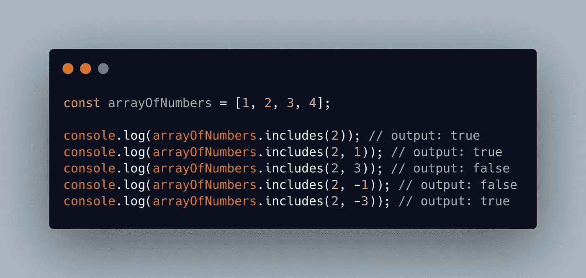
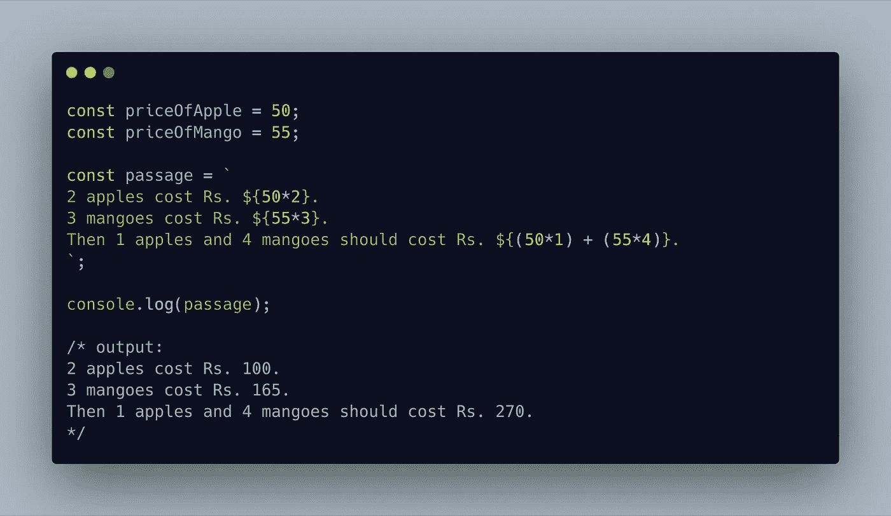

# 10 种现代 JavaScript 语法帮助您更快地编码

> 原文：<https://levelup.gitconnected.com/10-modern-javascript-syntax-to-help-you-code-faster-82cc0a5a3960>

## 技术

甚至在 10 年前，JavaScript 还只是一个让网站具有交互性的前端工具，只有一小部分开发人员在积极使用。然而，从那时起，情况发生了很大变化。

**NodeJS** 的引入，以及随之而来的服务器端解决方案，以及像 **Webpack** 或 **Grunt** 这样的构建工具的采用，使得学习 JavaScript 的前景变得非常受欢迎，以至于它很快成为世界上最受欢迎的语言之一。


来自[未绘制的插图](https://undraw.co)

然而，JavaScript 的迅速流行需要改进的语法和可维护的、易于理解的代码。不久之后——ES6 出现了，一种新的 JavaScript，其编写方式优雅而简洁。

从那以后，又发布了一些 JavaScript 版本，最新的版本是 ES2020，为这种语言添加了许多开发人员友好的特性。本文将重点介绍 10 种这样的现代 JavaScript 语法，它们非常有用，易于适应，并且不需要深入了解所介绍的概念。

# 1.字符串填充

## String.prototype.padEnd()

这个方法会将当前字符串附加到另一个给定的字符串，如果需要的话会多次附加，直到它达到特定的长度。如下例所示，`hmm`字符串将被多次追加`.`，直到最后一个字符串的长度为 6。


示例— String.prototype.padEnd()

## String.prototype.padStart()

这与`String.prototype.padEnd()`非常相似，除了现在字符串将从前面追加，而不是从末尾追加。

一个很受欢迎的场景是屏蔽电话号码或电子邮件地址。在支付网关或安全门户中，隐藏联系信息并显示最后 3-4 个字符是非常常见的，这足以让用户识别它是否是针对他们的。


示例— String.prototype.padStart()

# 2.Array.prototype.includes()

如果元素存在于给定的数组中，`includes`方法将返回`true`。如果该方法提供了第二个参数`fromIndex`，那么将从给定的索引开始搜索数组



示例— Array.prototype.includes()

# 3.Rest 参数和扩展语法

## 休息参数

当我们试图创建一个不确定参数个数的函数时，Rest 参数特别有用。在函数定义过程中，在参数名称前添加一个`...`将创建一个数组，该数组将收集所有其他参数。也许，下面的例子会让事情变得更清楚——


示例-静止参数

我们也可以选择定义前几个参数，让数组中的参数的其余部分被收集。但是，这只能从正面进行，而不能从反面进行。换句话说，只有最后一个参数可以是 rest 参数—


示例-静止参数

## 扩展语法

从表面上看，休息和传播似乎是一回事，但实际上是完全相反的。语法(即`...`)可能看起来很相似，但它们的使用方式是它们的区别所在。

**在一个函数调用中—** 如果我们用 spread 语法传递一个数组，它实际上会将其扩展成一个参数列表。让我们考虑上面的`getSum()`例子，它接受不确定数量的参数。如果我们有一个数字数组，我们想重复使用这个方法，我们会这样做——


示例—在函数调用中传播语法

**到浅层拷贝—** 我们可以使用 spread 语法，对克隆的那个做任何进一步的操作都不会影响原来的数组。这个特性在对象的情况下也非常有用，但是稍后会详细介绍。


示例-在浅层副本中传播语法

**数组操作—** Spread 语法提供了一种简单的替代方法来处理基本的数组操作，如连接、在不同位置添加元素等。这个可以用一个例子来更好的解释——


示例-数组运算中的扩展语法

**继续讨论对象—**es 2018 中引入了扩散/静止属性。它的工作方式与之前讨论过的非常相似，只是在某些地方稍有改动。这里有几个如何利用它的例子—


示例-对象的静止/伸展

# 4.对象迭代器

## 键、值和条目—

`Object.keys()`返回一个对象所有键的数组，同样`Object.values()`返回一个所有值的数组。另一方面，`Object.entries()`返回一个由`[key, value]`对组成的数组。一如既往，实例胜于雄辩—


示例-对象关键字、值、条目

# 5.可选链接

当您处理不可靠、不可预测的数据时，这个特性就派上了用场。例如，我个人曾面临过多种场景，在这些场景中，我需要一些深度嵌套的属性，而整个应用程序会出现这样的消息

> 未捕获的类型错误:无法读取未定义/空的属性 **someProperty**

这就是可选链接要解决的问题。只有当链条不是*无效*(即不是`null`或`undefined`)时，操作器`?.`才会进入下一级深度。


示例-可选链接

# 6.零融合算子

如果你用过逻辑 OR `||`，你会觉得很熟悉。如果你没有，让我们先讨论一下。如果您的变量是 *falsy* (即`null`、`undefined`、`0`和`false`中的一个)，逻辑 OR 将提供默认值。

非常类似地，如果变量是 *nullish* (即`null`或`undefined`)，Nullish 合并`??`将提供默认值。让我们看一个例子——


示例—零化合并运算符

# 7.逻辑赋值运算符

逻辑 AND 赋值(即`&&=`)运算符仅在 *truthy* 中的变量时赋值，而逻辑 or 赋值(即`||=`)运算符会在变量为 *falsy —* 时赋值


示例-逻辑赋值运算符

在我们不确定一个属性是否存在于一个对象中，但是我们需要以某种方式操作它的场景中，逻辑 OR 赋值提供了一个更干净的选择来代替`undefined`检查。

比方说，我们需要找出一个元素在数组中重复出现的次数。我更喜欢这样做，通过迭代数组并存储对象中每个元素的计数—


示例-逻辑或赋值运算符

# 8.数字分隔符

JavaScript 已经学会在读取数字时排除下划线。当我们处理大数字时，这提高了代码的可读性


示例-数字分隔符

# 9.模板文字

模板文字使得处理字符串更加容易。我们可以去掉转义字符，通过用反勾号(即```)将输出打包，得到与代码中完全一样的输出


示例—模板文字

模板文字的另一个有用的特性是他们所谓的——表达式插值。大多数时候，我们希望在字符串之间添加某种表达式，代码可读性受到字符串连接所需的所有`+`符号的严重影响。一个更好的方法是将`${expression}`中的表达式包装在一个模板文字中—



示例-使用模板文字的表达式插值

# 10.默认参数

此功能使我们能够在函数定义中用默认值初始化参数，只有在没有提供所述参数的情况下(即`undefined`)才会考虑该参数。当我们需要创建一个可以带或不带任何参数调用的函数时，这是很有用的


示例-默认参数

这就是名单！
感谢并祝贺到达文章结尾。希望你觉得有用。

当你在这里的时候，你也可以看看我的其他几篇文章

*   [Flexbox 终极指南](/how-to-flex-a-beginners-guide-904c3edc2fdc)
*   [我希望自己在初学时就知道的 10 件 CSS 事情](/10-css-things-i-wish-i-knew-when-i-was-a-beginner-68ba4b5b3da8)

干杯！