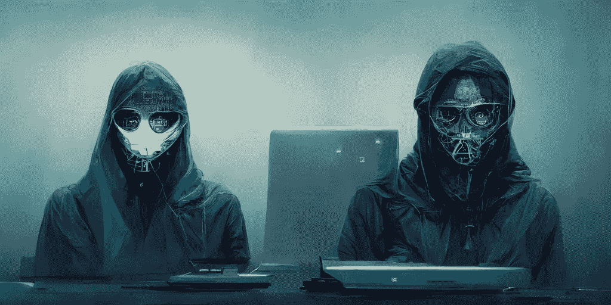

# 有史以来最危险的 10 名黑客

> 原文：<https://levelup.gitconnected.com/10-most-dangerous-hackers-of-all-time-e6933c57b7b>

## 你无法想象他们破坏了什么超临界系统。

作者制作

当我们听到“黑客”这个词时，我们会想到那些臭名昭著的家伙，他们非法进入计算机系统并实施犯罪。

然而，并不是所有的黑客都是恶意的。使用黑客技术来提高计算机安全性的好黑客是“白帽黑客”。那些被称为“灰帽黑客”的人，有时会违反道德标准，并以此为乐。

还有被称为“黑帽黑客”的坏人。他们非法利用任何有针对性的计算机安全。历史表明，黑帽黑客会造成很多危害。

在这篇文章中，我将向你介绍有史以来十个最危险的黑客，他们的行为，以及他们是如何赢得声誉的。

# 凯文·米特尼克

凯文·米特尼克将会是名单的顶端，因为他是世界上最著名的计算机黑客。他被美国司法部选为“美国历史上最受通缉的计算机罪犯”。

Mitnick 在很小的时候就开始了他的黑客生涯。1981 年，他黑了北美防御司令部(NORAD)，第一次进入公众的视线。后来，电影《战争游戏》的制作受到了这些事件的启发。

1989 年，米特尼克入侵了数字设备公司(DEC)的网络系统。为此，他被捕入狱。释放后，他入侵了太平洋贝尔的语音邮件系统，以证明他可以。

# 艾伯特·冈萨雷斯

一个早期的计算机迷领袖是古巴难民的儿子。12 岁时，冈萨雷斯用自己的钱买了第一台电脑。仅仅两年，他就黑进了美国宇航局。

政府逮捕了 22 岁的冈萨雷斯，指控他与窃取借记卡信息的活动有关的借记卡欺诈。他从不同公司窃取了超过 1.8 亿个支付卡账户。

冈萨雷斯和他的团队仅从 TJX 就窃取了近 2.56 亿美元。冈萨雷斯连续两次被判 20 年监禁，将于 2025 年获释。

# 乔纳森·詹姆斯

笔名为“C0mrade”的乔纳森·詹姆斯被认为是历史上最优秀的黑客之一。他过去常以访问私人网络系统为乐。

当詹姆斯 15 岁时，他在计算机犯罪领域创造了历史。他入侵了美国国家航空航天局、国防部和贝尔南方公司，窃取了软件。这一事件导致美国宇航局关闭该系统 21 天，耗资约 41，000 美元。

2007 年，各种知名公司网络被恶意攻击攻破。詹姆斯受到了怀疑和调查，尽管他否认有任何参与。詹姆斯在 2008 年自杀，因为他认为自己会被判莫须有的罪名。

# 匿名的

“匿名者”是世界上最臭名昭著的黑客组织之一，没有有效的成员或等级制度。以匿名的名义，任何人都可以做任何事。

近二十年来，这群黑客一直在展示一个专注于社会正义理念的组织。今年 2 月，当俄罗斯攻击乌克兰时，一个拥有 790 万粉丝的名为“匿名者”的 Twitter 账户宣布对俄罗斯总统弗拉基米尔·普京发动网络战。在那之后，该组织声称他们瘫痪了俄罗斯政府网站并泄露了数据。

“匿名者”以“黑客行动主义”的名义为社会和政治事业与几十个世界政府合作。

# 阿斯特拉

阿斯特拉是梵语中“武器”的意思。化名为“阿斯特拉”的希腊黑客花了五年多时间从法国飞机公司达索集团的服务器上窃取武器技术信息。

阿斯特拉的真实身份尚未确定。2008 年，当局拘留他时，他被认出是一名 58 岁的希腊数学家。他的黑客行为给达索集团造成了 3.6 亿美元的损失，他被判处 6 年监禁。

# 阿德里安·拉莫

阿德里安·拉莫的游牧生活方式为他赢得了“无家可归的黑客”的绰号尽管如此，他还是在 2002 年成功闯入了《纽约时报》的内部电脑。

通过这次攻击，莫拉进入了机密数据库，其中包括为该报论坛版撰稿的 3000 多人的个人数据。他被判两年缓刑，并被罚款约 65，000 美元。

最近，莫拉再次制造新闻，报道切尔西·曼宁泄露美国军队的秘密数据。

# 迈克尔·卡尔斯

迈克尔·卡尔斯，又名“马菲男孩”，在他 15 岁时就接管了大学计算机网络。利用合并后的资源，他拿下了当时领先的搜索引擎雅虎。

一周之内，他对戴尔、易贝、CNN 和亚马逊发起了著名的 DDoS 攻击。惊讶地看到数十亿美元的公司迅速关闭，美国公司在这次攻击后收到了令人惊讶的通知。

作为一名白帽黑客，迈克尔倡导网络安全测试和意识培训，以保护企业免受互联网威胁。

# 凯文·鲍尔森

十几岁时，凯文开始侵入五角大楼的计算机网络 ARPANET。十年后的 1988 年，鲍尔森实施的另一次黑客攻击让他陷入了法律纠纷。他转入地下，不断窃取官方机密，以免被抓。

1990 年，他因入侵一家广播电台赢得一辆全新保时捷、一次旅行和 2 万美元现金的竞赛而成为头条新闻。此后，他被拘留，并被判处三年禁止使用电脑。

鲍尔森目前是一名作家和白帽黑客，为包括《连线》和《每日野兽》在内的知名杂志撰稿。

# 加里·麦金农

2001 年至 2002 年间，一位名叫加里·麦金农的苏格兰黑客成功闯入了 97 个美国军事网络。据称，他在军方网站上发布了一份声明，称“你们的安保是垃圾。”

他声称他正在寻找关于 UFO 掩盖和自由能量压制的数据。尽管如此，美国官员声称他删除了一些关键数据，剩余的 300 台机器无法使用，并造成了超过 70 万美元的损失。

尽管美国试图引渡他，但他仍住在英国的避难所。

# 朱利安·阿桑奇

16 岁时，朱利安·阿桑奇开始用笔名“门达克斯”从事黑客活动。在四年多的时间里，他访问了属于五角大楼、花旗银行、洛克希德·马丁公司、美国国家航空航天局和斯坦福大学的网络。

阿桑奇在 2006 年创建了维基解密，作为一个从隐藏的来源发布机密文件和新闻泄漏的论坛。为了根据 1917 年间谍法对阿桑奇提出指控，美国于 2010 年对他展开调查。

尽管英国法院拒绝了美国的引渡请求，他现在仍被关押在英国。

这些职业黑客中的一些人寻求改善世界，而另一些人则想反驳 UFO 的观点。一些人希望成名，而另一些人渴望金钱。这些人都对互联网和网络安全的发展做出了重大贡献。

*感谢阅读！当然，请与我们分享您的观点。如果你想支持我，* [***加入我吧！***](https://thefemaleprogrammer.medium.com/membership)