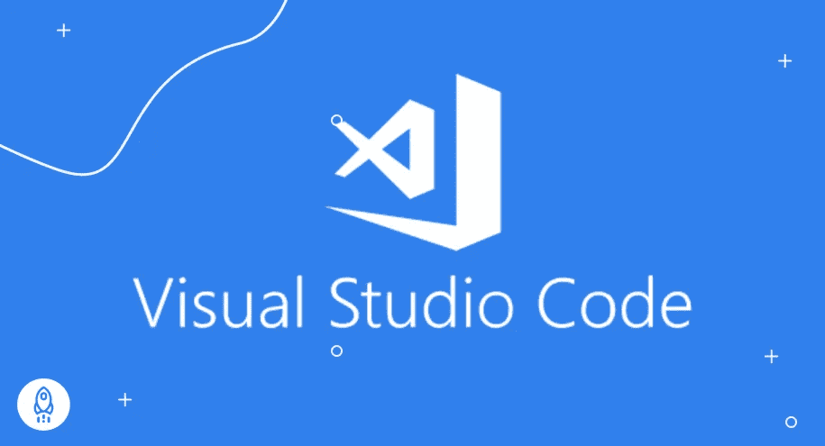
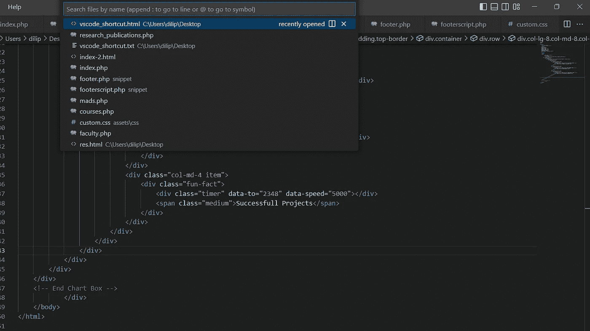
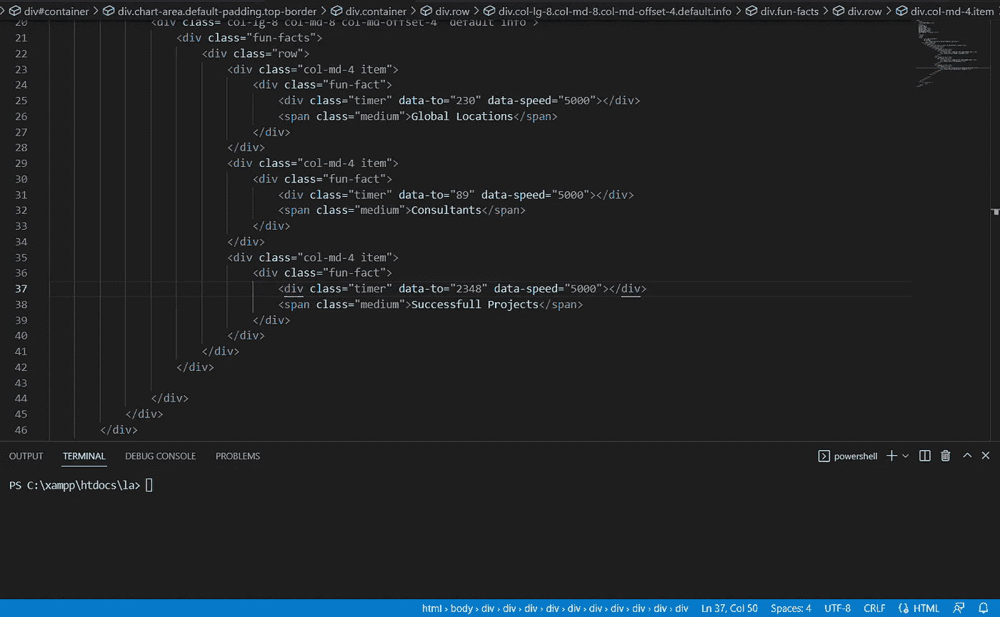
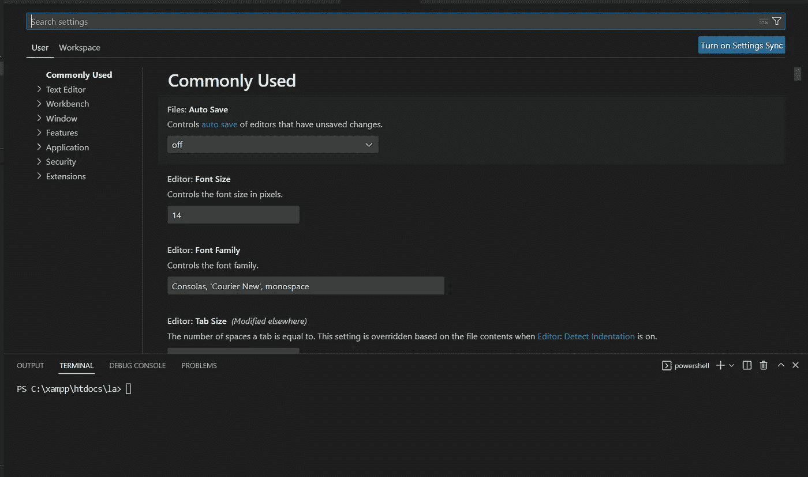
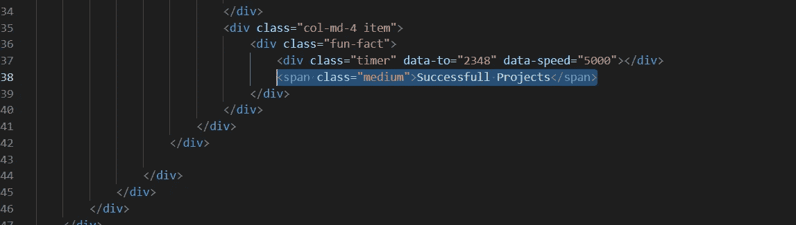
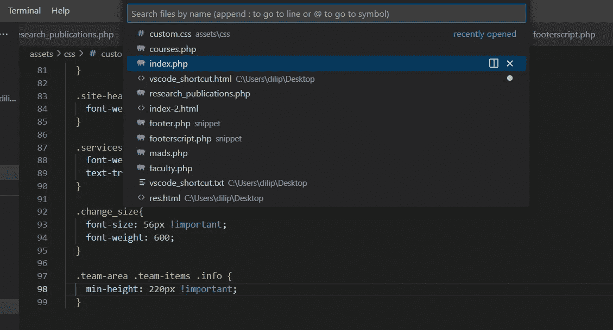
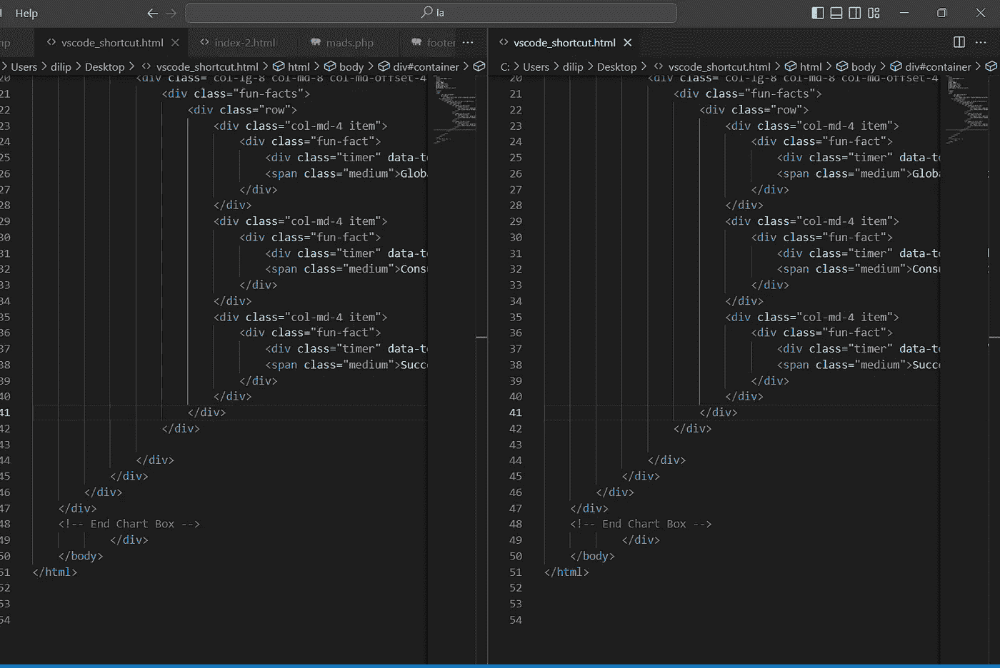
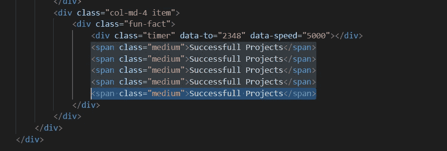
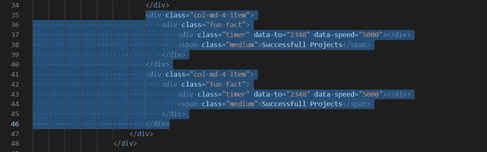
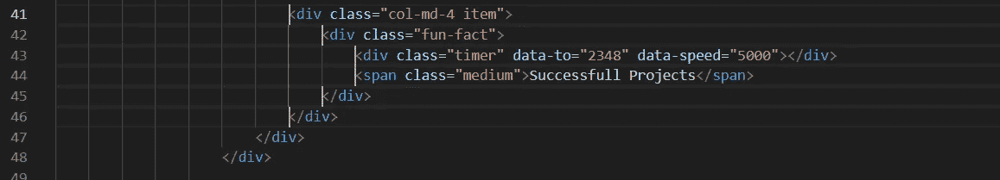

# 每个程序员都必须知道的 10 个最常用的 VS 代码快捷方式

> 原文：<https://levelup.gitconnected.com/10-most-used-vs-code-shortcuts-that-every-programmer-must-know-8601bef95433>

图片来源:Dataquest

我们都知道 Visual Studio 代码(VS Code)对于程序员来说是一个非常强大的工具。通过这篇文章，我们将学习一些最常用的 VS 代码快捷方式，这将有助于我们在编程或编写代码时更有效率。

VS 代码快捷方式会在编码时给你速度，让你在这个工具中看起来像个专家。让我们分别来看看每一个。

# 打开命令调板

如果您不熟悉 VS 代码编辑器，这个快捷键可能是您将要学习的最重要的组合键之一。

命令面板提供了对 VS 代码中所有函数、快捷方式、命令和配置选项的访问。

您可以使用以下组合键调用命令调板:

*   **Windows — Ctrl + P**
*   **Mac — Command + P**

# 切换注释行

传统上，在键入 **/ / *(双斜线)*** 将代码转换成注释之前，光标必须位于一行代码的开头。

VS 代码为注释掉一行代码提供了一个更简单的选择。无论光标位于注释行的哪个位置，都可以使用此快捷方式切换注释行。

下面是在 Windows 和 Mac 上切换代码行的快捷方式。

**Windows—Ctrl+/
Mac—Command+/**

# 切换终端

VS Code 有一个内置的终端，你可以在那里运行你所有的命令，比如启动服务器(后端)，运行应用程序(前端)，改变目录(cd)，安装包等等。

当构建复杂的 web 应用程序时，我总是让终端开着，因为我经常安装包并检查终端以查看我正在运行的进程是否崩溃。

如果你还需要更多的工作空间，你可以关闭终端。

以下是在 Windows 和 Mac 上切换到“终端”的快捷键:

**Windows—Ctrl+`
Mac—Command+`**

# 打开用户设置

通常，当您想要更改设置中的某些配置时，您可以点击右下角的齿轮或导航至文件**菜单->首选项->设置**。

一个更简单的替代方法是使用快捷方式，而不是使用鼠标进行必要的点击，以在进行所需的更改之前到达设置。

您可以使用下面的快捷方式调出设置，然后进行必要的配置。

使用 VS 代码，您可以更改可视化编辑器设置或设置的 JSON 文件中的设置。

假设您想要增加字体大小以使字符更加清晰可见，您可以使用下面的组合键打开设置，然后搜索字体大小并将其更改为您想要的数字，这些更改将立即生效。

*   **视窗— Ctrl +，**
*   **Mac —命令+，**

# 上下移动代码行

通常当你想上下移动一行代码时，你可以剪切粘贴或者复制粘贴。

当您复制并粘贴一行代码时，必须删除原始行。

我知道您通常会剪切和粘贴一行代码，因为这是更好的方法，但是有一种更好更快的方法可以上下移动一行代码。

您可以使用以下命令向下或向上移动一行代码，而不是在删除原始代码之前复制并粘贴它。

*   **Windows: Alt +上箭头/下箭头**
*   **Mac: OPTION +向上箭头/向下箭头**

# 通过选项卡打开文件

当您想在不使用鼠标的情况下从一个选项卡快速移动到另一个选项卡时，此快捷方式非常有用。
在创建应用程序的大部分时间里，你会打开多个文件来使用，当你想要编辑它的时候，用你的鼠标点击一个特定的文件。
VS Code 提供了一种无需使用鼠标就能在标签间移动的简单方法。
以下是无需触摸鼠标即可轻松在标签间移动的命令。

*   **窗口— Ctrl + Tab**
*   **Mac —命令+ Tab**

# 将文件移动到拆分窗口

VS 代码可以让你在编辑文件时轻松的拆分视图。
通常情况下，当你想要一个拆分视图时，用鼠标将文件向右拖动以使用拆分编辑器。

分割编辑器可以定制成网格，当你同时比较和编辑多个文件时，这个特性非常有用。
以下是在 Windows 和 Mac 上使用拆分编辑器的命令:

*   **Windows — Ctrl + \**
*   **Mac —命令+ \**

# 上下复制一行

当我们想要复制一行代码时，我们都犯了复制和粘贴它的错误。
当您想要复制一行代码时，使用下面的组合键来复制它。你只需要确保光标在一行代码上，然后使用下面的命令上下复制它。

*   **窗口— Shift + Alt +向上/向下箭头**
*   **Mac — Shift + OPTION +上下箭头键**

# 上下复制选定的代码块

假设您想要上下复制选定的代码块，您想到的第一个选项是复制并粘贴该代码块。
虽然可以用，但是有更好更快的方法使用键盘。要上下复制选定的代码块，请在 Windows 和 Mac 上使用下面的命令。

*   **窗口— ALT + SHIFT +向上/向下箭头**
*   **Mac — OPTION + SHIFT +向上/向下箭头**

# 多个光标和编辑代码

VS 代码的另一个有用的特性是将光标放在多个位置的能力。

假设您想在一些文本变量或值周围添加列表标签。你可以选择所有的变量列表或文本并使用

**Alt + Shift + I**

然后按 home 按钮(在删除按钮附近)将光标移动到变量列表的开头。

这是当多个光标开始工作时，您只需按住 **Alt + Shift + I** 即可一次性编辑长列表。

*   **Windows — Alt + Shift + I 然后按 Home 键**
*   **Mac — Option + Shift + I 然后按 Home 键**

我希望这篇文章对你有所帮助。更多此类文章请 ***upvote，关注并与朋友分享*** 此文。

如果你有兴趣学习 Google Apps 脚本和自动化你的 Google Workspace？必须试试这本**电子书**上的“ [**谷歌应用套件脚本:初学者指南**](https://www.amazon.com/dp/B0BTJC9X5R) ”

快乐学习…😁✌️

关于本文的任何疑问或任何其他技术建议，您可以发送电子邮件至—**dilipkashyap.sd@gmail.com**