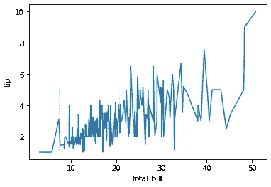
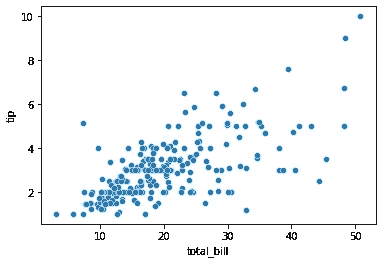
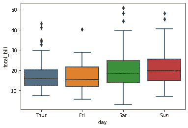
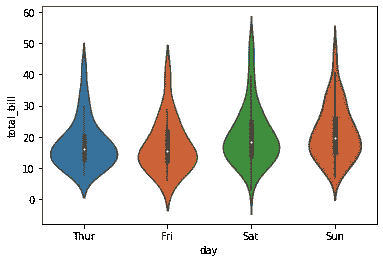
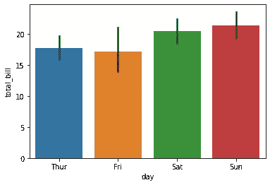
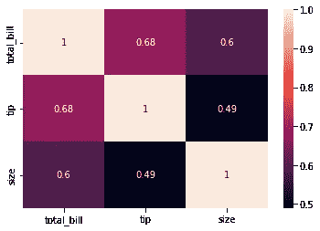
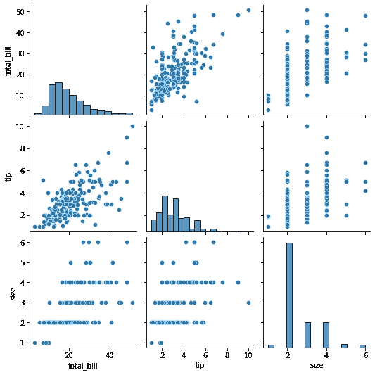
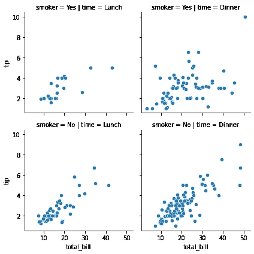
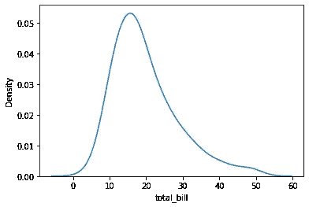
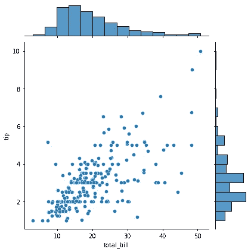

# 10 个必须知道的 Seaborn 可视化

> 原文：<https://levelup.gitconnected.com/10-must-know-seaborn-visualizations-5d3283d5bb2a>


[来源](https://pixabay.com/photos/transformation-digital-woman-face-3750134/)

# 介绍

如果你像我一样是一个数据爱好者，你可能听说过**Seaborn**——Python 中一个流行的**数据可视化库。Seaborn 构建在 Matplotlib 之上，旨在用相对较少的代码更容易地创建视觉上吸引人和信息丰富的绘图和图表。它还具有许多有用的功能，例如定制绘图外观、使用不同的调色板以及使统计模型适合数据的能力。**

在本文中，我们将探索一些您可以使用 Seaborn 创建的**最佳可视化。**我们将使用一个样本数据集来演示不同的图，并为每个可视化提供代码示例。我们还将讨论每种可视化的优缺点，以帮助您决定哪种最适合您的数据和分析。

# 1.线形图

线形图是显示两个变量之间关系的图形。它通常用于可视化数据随时间的变化。

为了在 Seaborn 中创建一个线图，我们可以使用`lineplot`函数。以下代码演示了如何使用 Seaborn 附带的`tips`数据集创建一个线图:

```
import seaborn as sns

# Load the tips dataset
tips = sns.load_dataset("tips")

# Create a line plot
sns.lineplot(x="total_bill", y="tip", data=tips)
```



作者图片

***Pro:易于解读，可用于可视化一段时间内的趋势。***

***缺点:可能不适合显示分类数据或多组数据。***

# 2.散点图

散点图是通过在网格上绘制点来显示两个变量之间关系的图形。它通常用于可视化数据的分布，并检测模式或相关性。

为了在 Seaborn 创建一个散点图，我们可以使用`scatterplot`函数。以下代码演示了如何使用`tips`数据集创建散点图:

```
import seaborn as sns

# Load the tips dataset
tips = sns.load_dataset("tips")

# Create a scatter plot
sns.scatterplot(x="total_bill", y="tip", data=tips)
```



作者图片

***Pro:用于可视化两个变量之间的关系，识别趋势或模式。***

***坏处:大量的数据点会让它变得杂乱无章，很难看出模式或趋势。***

# 3.箱形图

箱线图是通过绘制最小值、第一个四分位数、中值、第三个四分位数和最大值来显示数据集分布的图表。它通常用于比较不同组之间的数据分布或识别异常值。

为了在 Seaborn 中创建一个方框图，我们可以使用`boxplot`函数。以下代码演示了如何使用`tips`数据集创建盒状图:

```
import seaborn as sns

# Load the tips dataset
tips = sns.load_dataset("tips")

# Create a box plot
sns.boxplot(x="day", y="total_bill", data=tips)
```



作者图片

***Pro:用于比较不同组之间的数据分布，识别异常值。***

***缺点:可能不适合显示有大量唯一值的数据，或者不适合可视化两个变量之间的关系。***

# 4.小提琴情节

violin 图是箱线图的修改版，显示分类变量所有级别的数据分布。它类似于箱线图，但也包括数据的核密度图。

为了在 Seaborn 中创建一个小提琴情节，我们可以使用`violinplot`函数。以下代码演示了如何使用`tips`数据集创建 violin 绘图:

```
import seaborn as sns

# Load the tips dataset
tips = sns.load_dataset("tips")

# Create a violin plot
sns.violinplot(x="day", y="total_bill", data=tips)
```



作者图片

***Pro:用于比较不同组之间的数据分布，并可视化数据的底层分布。***

***弊:对一些观众来说，它可能不像盒子情节那样容易理解。***

# 5.条形图

条形图是显示分类变量和数值变量之间关系的图表。它通常用于比较不同类别的变量值。

为了在 Seaborn 中创建一个柱状图，我们可以使用`barplot`函数。以下代码演示了如何使用`tips`数据集创建条形图:

```
import seaborn as sns

# Load the tips dataset
tips = sns.load_dataset("tips")

# Create a bar plot
sns.barplot(x="day", y="total_bill", data=tips)
```



作者图片

***Pro:易于解释，可用于跨不同类别比较一个变量的值。***

***缺点:可能不适合显示有大量唯一值的数据，或者不适合可视化两个变量之间的关系。***

# 6.热图

热图是数据的图形表示，其中的值用颜色表示。它通常用于可视化两个变量之间的关系，或者识别数据集中的模式或相关性。

为了在 Seaborn 中创建热图，我们可以使用`heatmap`函数。以下代码演示了如何使用`tips`数据集创建热图:

```
import seaborn as sns

# Load the tips dataset
tips = sns.load_dataset("tips")

# Create a heatmap
sns.heatmap(tips.corr(), annot=True)
```



作者图片

***Pro:用于可视化两个变量之间的关系，以及识别数据集中的模式或相关性。***

***缺点:它可能不适合显示具有大量唯一值的数据，也不适合显示随时间变化的趋势。***

# 7.配对图

pairplot 是显示数据集中所有变量对之间关系的图形。它通常用于可视化多个变量之间的关系，并识别模式或相关性。

为了在 Seaborn 中创建一个 pairplot，我们可以使用`pairplot`函数。以下代码演示了如何使用`tips`数据集创建 pairplot:

```
import seaborn as sns

# Load the tips dataset
tips = sns.load_dataset("tips")

# Create a pairplot
sns.pairplot(tips)
```



作者图片

***Pro:用于可视化多个变量之间的关系，识别模式或相关性。***

***缺点:它可能不适合包含大量变量的数据集，因为它们可能会变得混乱且难以解释。***

# 8.小平面网格

分面网格是一种图形，通过将数据分成更小的子图，可以使多个变量之间的关系可视化。它通常用于比较不同组之间的数据分布，或在一个图中显示多个图。

为了在 Seaborn 中创建一个面网格，我们可以使用`FacetGrid`类。以下代码演示了如何使用`tips`数据集创建面网格:

```
import seaborn as sns

# Load the tips dataset
tips = sns.load_dataset("tips")

# Create a facet grid
g = sns.FacetGrid(tips, col="time", row="smoker")
g = g.map(sns.scatterplot, "total_bill", "tip")
```



作者图片

***Pro:用于比较不同组之间的数据分布，并在单个图形中显示多个图。***

***缺点:大量的支线剧情会让它变得杂乱无章，很难看出模式或趋势。***

# 9.密度图

密度图是显示连续变量的概率密度函数的图表。它通常用于可视化数据集的底层分布。

为了在 Seaborn 创建一个密度图，我们可以使用`kdeplot`函数。以下代码演示了如何使用`tips`数据集创建密度图:

```
import seaborn as sns

# Load the tips dataset
tips = sns.load_dataset("tips")

# Create a density plot
sns.kdeplot(tips["total_bill"])
```



作者图片

***Pro:用于可视化数据集的底层分布。***

***缺点:它可能不适合显示具有大量唯一值的数据，也不适合显示随时间变化的趋势。***

# 10.联合地块

联合图是将散点图和密度图结合在一起的图形。它通常用于可视化两个变量之间的关系以及数据的基本分布。

为了在 Seaborn 中创建一个联合图，我们可以使用`jointplot`函数。以下代码演示了如何使用`tips`数据集创建一个联合图:

```
import seaborn as sns

# Load the tips dataset
tips = sns.load_dataset("tips")

# Create a joint plot
sns.jointplot(x="total_bill", y="tip", data=tips)
```



作者图片

***Pro:用于可视化两个变量之间的关系以及数据的底层分布。***

***缺点:可能不适合显示有大量唯一值的数据，也不适合显示随时间变化的趋势。***

# 结论

**Seaborn 是一个非常棒的数据可视化库，可以帮助你用最少的代码创建漂亮的、信息丰富的图表。**在本文中，我们探索了一些可以使用 Seaborn 创建的最佳可视化工具，并为每个工具提供了代码示例。我们还讨论了每种可视化的优缺点，以帮助您决定哪种最适合您的数据和分析。无论你是初学者还是有经验的数据分析师， **Seaborn 都能为每个人提供一些东西。所以去试一试吧——你不会失望的！**