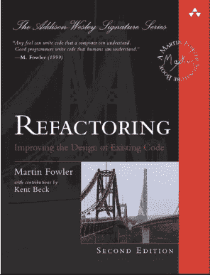
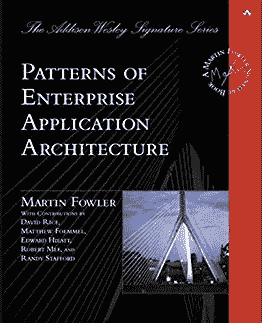

# 2023 年软件工程师必读的 10 本书

> 原文：<https://levelup.gitconnected.com/10-must-read-books-for-software-engineers-3c961299d25>

## 成为一名更好的工程师，阅读代码和编写代码一样重要

Ria Puskas 在 [Unsplash](https://unsplash.com/s/photos/library?utm_source=unsplash&utm_medium=referral&utm_content=creditCopyText) 上拍摄的照片

> 如果你想了解更多关于技术的知识，请订阅我全新的 YouTube 频道，在那里我会用一种简洁明了的方式解释复杂的话题，帮助你提高技能！→【https://www.youtube.com/@litwire 

除了现代世界提供的所有好东西——播客、视频、博客等等。—读一本好书仍然是很多人不想错过的事情。我已经阅读了许多与技术相关的书籍，比如软件工程，并且还在阅读以学习新的模式和最佳实践。

寻找优秀的软件工程书籍并不容易，因为生态系统变化很快，很快就会使许多东西过时。对于依赖于特定编程语言版本的书籍来说尤其如此。

然而，有常青树，处理元主题、设计模式或一般心态的书籍。

以下收藏包括一些最受欢迎的书籍。高级开发人员经常向初级开发人员推荐今天仍然相关的书籍。我知道时间是宝贵的，尤其是对软件工程师来说，但是如果你设法阅读其中的一些，它将对你和你的职业生涯有所帮助。请注意，这个列表没有特定的顺序，因为所有这些书都同样值得推荐。

*注意:下面的链接都不是附属链接。*

# 破解编码面试

“[破解代码面试:189 个编程问题&解决方案](https://www.amazon.com/Cracking-Coding-Interview-Programming-Questions/dp/0984782850)”对于任何想要或需要参加编码面试的人来说都是非常值得推荐的。作家 Gayle Laakmann McDowell 是一位经验丰富的软件工程师，他既是面试官也是应聘者。她可以帮助你寻找问题中隐藏的细节，将问题分解成小块，更好地学习概念。

此外，Gayle 提供了 189 个真实的面试问题和解决方案，以便您可以为下一次编码面试做好准备！

# 代码完成

史蒂夫·麦康奈尔所著的《代码完整:软件构造实用手册，第二版》是每个程序员一生中可能都应该浏览过的书籍之一。

这是对软件结构的全面分析，写得很好，在业界得到了高度认可。它涉及设计、编码、调试和测试主题。

总的来说，对于有一到三年专业编程经验的开发人员来说，这本书可能会有最高的投资回报率。但是我也向初学者推荐它，因为它有助于在构建软件时给你更多的信心。

主要外卖？*开发者必须管理复杂性。编写易于维护、便于您和他人阅读的代码。*

# 干净的代码

罗伯特·c·马丁(鲍勃叔叔)的《干净的代码:敏捷软件工匠手册》是最受欢迎的编程书籍之一。它是为了教导软件工程师编写干净的编程代码的原则而编写的。它附带了许多示例，向您展示了如何重构代码以提高可读性和可维护性，但是请注意，它是非常以 Java 为中心的。虽然有些模式和技术可以移植到一般编程或其他语言中，但这本书的主要读者是 Java 开发人员。

另外需要注意的是，这本书是 2009 年的。由于可用的工具和 ide，一些内容，如代码格式化，现在已经不太相关了。但它毕竟是一本好书。

# 重构

马丁·福勒的《重构:改进现有代码的设计》一书解释了什么是重构，就像 20 年前的原著一样。你可能会问自己的问题以及本书中回答的问题是:

*   我为什么要重构我的代码？
*   如何识别需要重构的代码？
*   如何成功重构我的代码？

读完这本书后，你应该理解重构的过程和一般原则，你可以快速地应用到你的代码库中。你还应该能够发现你的队友的代码中需要重构的“坏味道”。

# 头先设计模式

Eric Freeman、Bert Bates、Kathy Sierra 和 Elisabeth Robson 撰写的《[Head First Design Patterns:A Brain-Friendly Guide](https://www.amazon.com/Head-First-Design-Patterns-Brain-Friendly/dp/0596007124/ref=sr_1_1?crid=2KBE6WUPQMB5B&keywords=head+first+design+patterns+a+brain-friendly+guide&qid=1582557840&s=books&sprefix=head+first+design+%2Cstripbooks-intl-ship%2C159&sr=1-1)》向您介绍了其他开发人员用来创建实用、可重用、优雅且灵活的软件的设计模式和最佳实践。它也充满了伟大的视觉化，将帮助你更快地学习新概念。

如果你想了解工厂、单例、依赖注入等等，这本书是一个很好的选择。这些例子是用 Java 编写的，所以了解这种语言或另一种面向对象的语言不会有什么坏处。

# 企业应用架构模式

“[企业应用架构模式](https://www.amazon.com/Patterns-Enterprise-Application-Architecture-Martin/dp/0321127420/ref=sr_1_1?crid=UEOW22J47EO1&keywords=patterns+of+enterprise+application+architecture+2nd+edition&qid=1582557939&s=books&sprefix=Patterns+of+Enterprise+Application+Architecture%2Cstripbooks-intl-ship%2C174&sr=1-1)”是 Martin Fowler 的另一本优秀的书，论述了企业应用开发的实践。在一个关于开发企业应用程序的简短教程之后，Martin 给出了 40 多个模式，作为设计企业应用程序时常见问题的解决方案。它还附带了许多用 Java 或 C#编写的 UML 可视化和代码示例。

阅读完本书后，您应该能够将企业应用程序划分为不同的层，了解组织业务逻辑的实用方法，使用 MVC 模式组织 web 应用程序，并通过多个事务处理并发数据。

然而，这本书老化得很差，像 REST、cloud 或 JSON 这样的现代概念没有被提及。这仍然是一本好书，但是在读的时候要有批判性！

# 有效地使用遗留代码

在 Michael Feathers 的“[有效地使用遗留代码](https://www.amazon.com/Working-Effectively-Legacy-Michael-Feathers/dp/0131177052/ref=sr_1_1?crid=2V9GN3L8TZTI5&keywords=working+effectively+with+legacy+code+-+michael+c.+feathers&qid=1582558039&s=books&sprefix=Working+Effectively+with+Legacy%C2%A0Code%2Cstripbooks-intl-ship%2C207&sr=1-1)”中，作者提供了处理大型的、未经测试的遗留代码库的策略。虽然你可能认为我们现在是在 2023 年，遗留代码应该不再是问题，因为我们一直只有干净、可维护的代码和微服务，但我向你保证这是一种误解。遗留代码仍然是许多公司面临的最具挑战性的问题之一。

读完这本书后，你应该能够理解软件变更的一般机制，比如添加功能、修复错误、优化性能和改进设计。此外，您将学习如何让遗留代码准备好进行测试，以及如何识别代码需要更改的地方。

这本书提供了用 Java、C++、C 和 C#编写的例子，但也包括处理非面向对象的遗留代码的技巧。

# 干净的编码器

Bob 叔叔的另一本书教授真正的软件工艺的技术、规程、工具和实践。“[《干净的程序员:专业程序员的行为准则》](https://www.amazon.com/Clean-Coder-Conduct-Professional-Programmers/dp/0137081073/ref=sr_1_1?keywords=clean+coder+robert+martin&qid=1582558154&s=books&sr=1-1)”包含了关于评估、编码、重构和测试的实用建议。

看完这本书，你应该能处理冲突、紧张的日程、不讲道理的管理者；应对持续的压力，避免过度劳累；管理你的时间；进入编码流程，培养开发人员和团队能够茁壮成长的环境。

这本书在业内被广泛接受，但我认为并不是所有的东西都是纯金的。它包含了许多轶事和假设的对话，这些对话通常认为开发人员最终要对他们的行为负责。在一份声明中，对代码产生 bug 的开发人员的建议是在经济上补偿公司的金钱损失。

所以我的建议是，如果你要读这本书的话，请仔细地、批判性地阅读它！

# 算法简介

由 Thomas H. Cormen，Charles E. Leiserson，罗纳德·L·李维斯特和 Clifford Stein 所著的《算法导论，第三版》( Introduction to Algorithms，Third Edition,)不亚于一本各种算法的基本指南。它是全面的，所有读者，初学者和专业人士都可以访问。它措辞严谨，涵盖了许多主题。但是它也很复杂，不容易理解。

它涵盖了数据结构，快速算法，看似棘手问题的多项式时间算法，图论，计算几何，等等。虽然它包含了一些伪代码的例子，但在我看来，它仍然是一本非常理论化的书。

# 务实的程序员

[《实用程序员](https://www.amazon.com/Pragmatic-Programmer-journey-mastery-Anniversary/dp/0135957052/ref=sr_1_1?keywords=Pragmatic+Programmer+hunt&qid=1582558437&s=books&sr=1-1)》是我读过的最重要的书之一。它充满了技术和专业的实用建议，帮助我在许多项目中成为一名更好的开发人员。

即使在 2023 年，这本书也是高度相关的，尤其是新的 20 周年纪念版。它通过探索从个人责任和职业发展到架构技术的主题，考察了作为一名现代开发人员意味着什么。

看完书，你应该知道持续学习是什么意思，有多重要；如何编写灵活、适应性强、动态的代码；如何解决并发代码的问题；如何防范安全漏洞；如何无情有效的测试；还有更多。

如果有一本书要我推荐给你，那就是这本书！

总而言之，这是一些最受开发人员欢迎的书籍。如果要我选一本书推荐给你，我会选安德鲁·亨特的《实用程序员》。Robert C. Martin 的书在业界被接受，并受到许多开发人员的喜爱，但我在阅读它们时会持批评态度，因为我与 Bob 叔叔没有太多的共同观点。